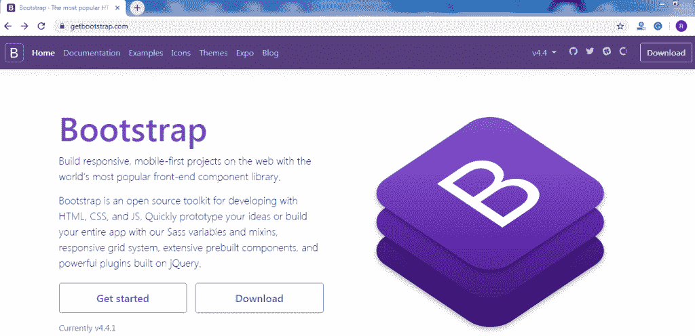
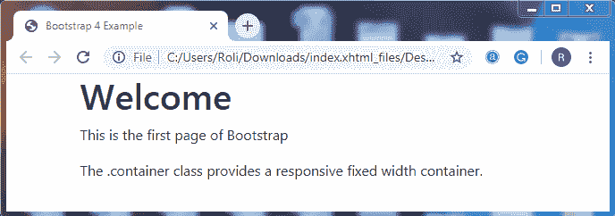

# 引导程序 4 教程

> 原文：<https://www.tutorialandexample.com/bootstrap-tutorial/>

### 什么是自举？

Bootstrap 是一个 CSS(层叠样式表)框架，用于开发一个响应式网站。它是一个开源的、移动优先的前端框架。它有基于 HTML 的设计模板，用于排版、按钮、表单、导航等。

Bootstrap 是一个 web 框架，旨在更容易、更快速地开发网页。它还包含许多 Javascript 组件，这些组件以 jQuery 插件的形式出现。这些插件提供了许多其他用户界面元素，如工具提示、对话框和转盘。

### 自举的历史

Bootstrap，以前被称为 Twitter Blueprint，是由 Mark Otto 和 Jacob Thornton 开发的，作为 Twitter 上的一个框架，使其与其他内部工具兼容。Bootstrap 于 2011 年 8 月 19 日作为开源项目发布。

### 为什么使用 Bootstrap？

**节省时间-** Bootstrap 由预定义的设计模板和类组成，可用于节省时间和精力。

**响应-** Bootstrap 帮助开发可根据设备大小自动调整的响应网站。

**浏览器兼容性-** Bootstrap 几乎兼容谷歌 Chrome、Mozilla Firefox、Internet Explorer 等所有浏览器。

**开源–**它是一个开源框架，这意味着每个人都可以免费使用。

**自举 4****T3】**

Bootstrap 4 是 Bootstrap 的最新版本，包括新组件、新样式表和更高的响应能力。Bootstrap 4 的首个 alpha 版本于 2015 年 8 月 19 日发布，首个 beta 版本于 2017 年 8 月 10 日发布。

### 从哪里获得 Bootstrap？

Bootstrap 4 有两种使用方式；你可以从 CDN(内容交付网络)下载 Bootstrap 4，也可以从官方网站[](https://getbootstrap.com/)**下载 Bootstrap 4。**

 **

**引导程序 4 CDN 的环境设置**

**CSS(层叠样式表)**

你必须把 CSS **<链接>** 放到 **<头>** 标签中。链接如下:-

**编译并缩小的 CSS**

```
<link rel="stylesheet" href="https://stackpath.bootstrapcdn.com/bootstrap/4.4.1/css/bootstrap.min.css">
```

**JS (JavaScript)**

一些组件需要 JavaScript 来执行任务。他们尤其需要 jQuery、Popper.js 和 JavaScript 插件。

你必须把 **<脚本>** 放在 **< /body >** 标签之前。链接如下:-

**jQuery 库**

```
<script src="https://code.jquery.com/jquery-3.4.1.slim.min.js"></script>
```

**波普 JS**

```
<script src="https://cdn.jsdelivr.net/npm/[email protected]/dist/umd/popper.min.js"></script>
```

**最新编译的 Java 脚本**

```
<script src="https://stackpath.bootstrapcdn.com/bootstrap/4.4.1/js/bootstrap.min.js"></script>
```

**使用引导程序 4 创建网页**

*   **添加 HTML5 文档类型**

Bootstrap 4 需要 HTML 5 DOCTYPE，因为它使用 HTML 元素和 CSS 属性。

```
<!DOCTYPE html>
<html lang="en">
<head>
<meta charset="utf-8">
</head>
</html> 
```

*   **引导程序 4 首先移动**

Bootstrap 旨在使网站在移动设备上响应迅速。

```
<meta name =”viewport” content=”width=device-width, initial-scale=1”>
```

**例子**

```
<!DOCTYPE html>
<html lang="en">
<head>
  <title>Bootstrap 4 Example</title>
  <meta charset="utf-8">
  <meta name="viewport" content="width=device-width, initial-scale=1">
  <link rel="stylesheet" href="https://maxcdn.bootstrapcdn.com/bootstrap/4.4.1/css/bootstrap.min.css">
  </head>
<body>
  <div class="container">
  <h1>Welcome</h1>
  <p>This  is the first page of Bootstrap</p>
  <p>The .container class provides a responsive fixed width container.</p>          
  </div>
  <script src="https://ajax.googleapis.com/ajax/libs/jquery/3.4.1/jquery.min.js"></script>
  <script src="https://cdnjs.cloudflare.com/ajax/libs/popper.js/1.16.0/umd/popper.min.js"></script>
  <script src="https://maxcdn.bootstrapcdn.com/bootstrap/4.4.1/js/bootstrap.min.js"></script>
</body>
</html> 
```

**输出**



## 自举指数

*   [Bootsrtap 简介](/bootstrap-tutorial/)
*   [Bootsrtap 布局](/bootstrap-layout/)
*   [Bootsrtap 网格系统](/bootstrap-grid-system/)
*   [Bootsrtap 内容](/bootstrap-content/)
*   [Bootsrtap Colors](/bootstrap-colors/)
*   [引导 4 个表](/bootstrap-tables/)
*   [引导 4 个图像](/bootstrap-images/)
*   [自举 4 个大屏幕](/bootstrap-jumbotron/)
*   [引导程序 4 警报](/bootstrap-alerts/)
*   [自举 4 个按钮](/bootstrap-buttons/)
*   [自举 4 按钮组](/bootstrap-buttons-groups/)
*   [引导 4 个徽章](/bootstrap-badges-labels/)
*   [Bootstrap 4 分页](/bootstrap-pagination/)
*   [引导程序 4 进度条](/bootstrap-progress-bar/)
*   [自举 4 个旋转器](/bootstrap-spinners/)
*   [引导程序 4 下拉菜单](/bootstrap-dropdowns/)
*   自举 4 张卡
*   [引导 4 列表组](/bootstrap-4-list-groups/)
*   [自举 4 折叠](/bootstrap-collapse/)
*   自举 4 Navs
*   [引导 4 个导航条](/bootstrap-navigation-bar/)
*   [Bootstrap 4 表单](/bootstrap-form/)
*   [自举 4 输入](/bootstrap-inputs/)
*   [引导 4 个输入组](/bootstrap-input-groups/)
*   引导程序 4 自定义表单
*   [引导 4 转盘](/bootstrap-4-carousel/)
*   [自举 4 模式](/bootstrap-modal/)
*   [Bootstrap 4 Tooltip](/bootstrap-4-tooltip/)
*   [Bootstrap 4 Popover](/bootstrap-popover/)
*   [自举 4 祝酒词](/bootstrap-4-toast/)
*   [引导带 4 个滚动箭头](/bootstrap-4-scrollspy/)
*   [引导 4 实用程序](/bootstrap-utilities/)
*   [Bootstrap 4 Flex](/bootstrap-flex/)
*   [引导 4 个图标](/bootstrap-icons/)
*   [引导 4 个媒体对象](/bootstrap-media-objects/)
*   [自举 4 个过滤器](/bootstrap-filters/)
*   [自举 4 卡](/bootstrap-4-card)
*   [引导 4 导航条](/bootstrap-4-navbar)
*   [引导 4 个保证金等级](/bootstrap-4-margin-classes)

## 引导 4 网格

*   [自举 4 网格系统](/bootstrap-grid-system/)
*   [Bootstrap 4 网格系统示例](/bootstrap-grid-system-example/)

## 混杂的

*   [引导协议(BOOTP)](/bootstrap-protocol-bootp)
*   【Bootstrap 和 WordPress 的区别
*   【bootstrap.css 和 bootstrap-theme.css 的区别**