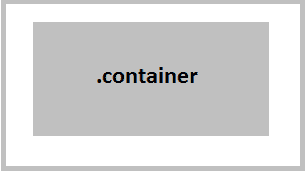
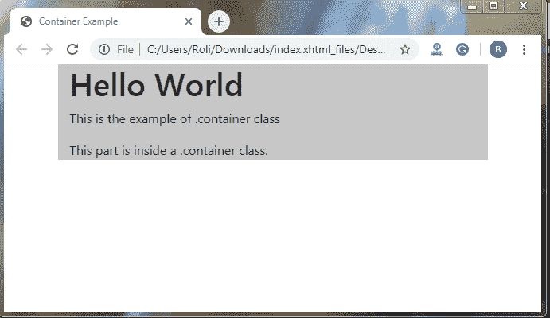
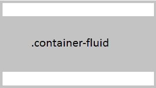
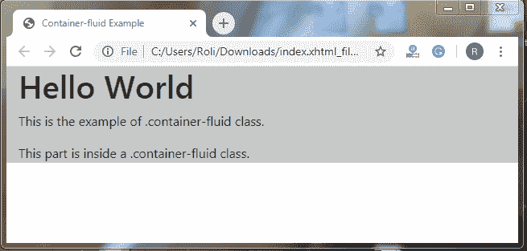

# 自举 4 布局

> 原文：<https://www.tutorialandexample.com/bootstrap-layout/>

**集装箱**

容器是引导布局的基本元素。当我们使用引导网格系统时，这是必需的。容器也可以嵌套，但是大多数布局不需要嵌套容器。

Bootstrap 有两类容器

*   .容器
*   .容器流体

**。容器类–**这个类用于创建一个响应性的固定宽度的容器。这个类的左边和右边有一个固定的边距，它没有完全覆盖它的父类、屏幕或视口。



**例子**

```
<!DOCTYPE html>
 <html lang="en">
 <head>
   <title>Container Example</title>
   <meta charset="utf-8">
   <meta name="viewport" content="width=device-width, initial-scale=1">
   <link rel="stylesheet" href="https://maxcdn.bootstrapcdn.com/bootstrap/4.4.1/css/bootstrap.min.css"> 
 </head>
 <body>
   <div class="container" style="background-color: #c7c7c7">
   <h1>Hello World</h1>
   <p>This is the example of .container class</p>
   <p>This part is inside a .container class.</p>  
 </div>
  <script src="https://ajax.googleapis.com/ajax/libs/jquery/3.4.1/jquery.min.js"></script>
  <script src="https://cdnjs.cloudflare.com/ajax/libs/popper.js/1.16.0/umd/popper.min.js"></script>
  <script src="https://maxcdn.bootstrapcdn.com/bootstrap/4.4.1/js/bootstrap.min.js"></script>
 </body>
 </html> 
```

**输出**



**。容器流体类–**容器流体类覆盖屏幕的整个宽度。



**例子**

```
<!DOCTYPE html>
 <html lang="en">
 <head>
   <title>Container-fluid Example</title>
   <meta charset="utf-8">
   <meta name="viewport" content="width=device-width, initial-scale=1">
   <link rel="stylesheet" href="https://maxcdn.bootstrapcdn.com/bootstrap/4.4.1/css/bootstrap.min.css">
 </head> 
 <body>
 <div class="container-fluid" style="background-color: #c7c7c7">
   <h1>Hello World</h1>
   <p>This is the example of .container-fluid class.</p>
   <p>This part is inside a .container-fluid class.</p> 
 </div> 
  <script src="https://ajax.googleapis.com/ajax/libs/jquery/3.4.1/jquery.min.js"></script>
  <script src="https://cdnjs.cloudflare.com/ajax/libs/popper.js/1.16.0/umd/popper.min.js"></script>
  <script src="https://maxcdn.bootstrapcdn.com/bootstrap/4.4.1/js/bootstrap.min.js"></script>
 </body>
 </html> 
```

**输出**



**响应容器**

响应容器根据它们的父元素自动调整自身(在高度和宽度方面)。集装箱的最大宽度根据不同的尺寸而变化。


|   | **超小型**T2 576 px | **小** > =576px | **中型** > =768px | **大** > =992px | **特大号**>= 1200 像素 |
| **。集装箱** | 100% | 540 像素 | 720 像素 | 960 像素 | 1140 像素 |
| **。集装箱-sm** | 100% | 540 像素 | 720 像素 | 960 像素 | 1140 像素 |
| **。集装箱-md** | 100% | 100% | 720 像素 | 960 像素 | 1140 像素 |
| **。集装箱-lg** | 100% | 100% | 100% | 960 像素 | 1140 像素 |
| **。集装箱-xl** | 100% | 100% | 100% | 100% | 1140 像素 |
| **。容器流体** | 100% | 100% | 100% | 100% | 100% |

