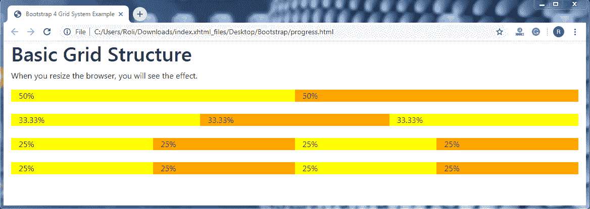

# Bootstrap 4 网格系统

> 原文：<https://www.tutorialandexample.com/bootstrap-grid-system/>

**自举 4 网格系统**

bootstrap 4 网格系统用于创建响应性网站布局。bootstrap 4 提供了一个移动优先的 flexbox 网格系统，允许您将视窗或屏幕分成 12 列。它还提供了预定义的[引导网格类](https://www.tutorialandexample.com/bootstrap-grid-classes/)，帮助为手机、平板电脑、笔记本电脑等设备快速创建网格。

**bootstrap 4 网格系统**还会根据屏幕大小自动排列列以及列内的内容。

**网格类**

*   **。这个类用于在屏幕宽度小于 576 像素的超小型设备上创建网格布局(列)。**
*   **。col-sm-* =** 这个类用于在屏幕宽度等于或大于 576 px 的小型设备上创建网格布局(列)。
*   **。col-md-* =** 该类用于在屏幕宽度等于或大于 768 px 的中型设备上创建网格布局(列)。
*   **。col-lg-* =** 这个类用于在屏幕宽度等于或大于 992 px 的大型设备上创建网格布局(列)。
*   **。col-xl-* =** 该类用于在屏幕宽度等于或大于 1200 px 的超大设备上创建网格布局(列)。

**电网系统规则**

 ***   这些行应该放在**内。固定宽度或**的容器**等级。container-fluid** 类用于全宽，以便为内容提供适当的对齐或填充。
*   使用**。row** 类来制作一组列。
*   所有的内容必须只放在列中。列是行的直接子级。
*   **。排**班和**。col-sm/md/lg-*** 类用于创建快速网格布局。其中，* = 1 到 12。
*   这些列通过填充在列内容之间创建一个间隙。通过为行提供负边距，该填充充当第一列和最后一列的行偏移量。
*   要创建网格列，需要指定要创建的列数。
*   列宽始终以百分比指定。
*   bootstrap 3 和 bootstrap 4 之间的主要区别在于，Bootstrap 4 使用 flexbox，而不是 bootstrap 3 中使用的 floats。

**Bootstrap 4 网格系统的基本结构**T2

```
<!DOCTYPE html>
<html lang="en">
<head>
  <title>Bootstrap 4 Grid System Example</title>
  <meta charset="utf-8">
  <meta name="viewport" content="width=device-width, initial-scale=1">
  <link rel="stylesheet" href="https://maxcdn.bootstrapcdn.com/bootstrap/4.4.1/css/bootstrap.min.css">
  <link rel="stylesheet" href="https://use.fontawesome.com/releases/v5.6.3/css/all.css" integrity="sha384-UHRtZLI+pbxtHCWp1t77Bi1L4ZtiqrqD80Kn4Z8NTSRyMA2Fd33n5dQ8lWUE00s/" crossorigin="anonymous">
  <script src="https://ajax.googleapis.com/ajax/libs/jquery/3.5.1/jquery.min.js"></script>
  <script src="https://cdnjs.cloudflare.com/ajax/libs/popper.js/1.16.0/umd/popper.min.js"></script>
  <script src="https://maxcdn.bootstrapcdn.com/bootstrap/4.4.1/js/bootstrap.min.js"></script>
  </head>
<body><div class="container-fluid">
  <h1>Basic Grid Structure</h1>
  <p>When you resize the browser, you will see the effect.</p>
  <div class="container-fluid">
    <!-- Control the column width, and how they should appear on different devices -->
    <div class="row">
      <div class="col-sm-6" style="background-color:yellow;">50%</div>
      <div class="col-sm-6" style="background-color:orange;">50%</div>
    </div>
    <br>
    <div class="row">
      <div class="col-sm-4" style="background-color:yellow;">33.33%</div>
      <div class="col-sm-4" style="background-color:orange;">33.33%</div>
      <div class="col-sm-4" style="background-color:yellow;">33.33%</div>
    </div>
    <br>
    <!-- Or let Bootstrap automatically handle the layout -->
    <div class="row">
      <div class="col-sm" style="background-color:yellow;">25%</div>
      <div class="col-sm" style="background-color:orange;">25%</div>
      <div class="col-sm" style="background-color:yellow;">25%</div>
      <div class="col-sm" style="background-color:orange;">25%</div>
    </div>
    <br>
    <div class="row">
      <div class="col" style="background-color:yellow;">25%</div>
      <div class="col" style="background-color:orange;">25%</div>
      <div class="col" style="background-color:yellow;">25%</div>
      <div class="col" style="background-color:orange;">25%</div>
    </div>
  </div>
</div>
</body>
</html>
```

**输出**:



**网格选项**

 **

|   | **特大号** **( < 576px)** | **小(> =576px)** | **中等** **( > =768px)** | **大型** **( > =992px)** | **特大号** **( > =1200px)** |
| **类前缀** | .列- | .col-sm | .col-md | .科尔-lg- | .列 xl- |
| **电网行为** | 总是水平的 | 折叠到起点，断点上方水平 | 折叠到起点，断点上方水平 | 折叠到起点，断点上方水平 | 折叠到起点，断点上方水平 |
| **集装箱宽度** | 无(自动) | 540 像素 | 720 像素 | 960 像素 | 1140 像素 |
| **适用于** | 肖像手机 | 风景手机 | 药片 | 笔记本电脑 | 笔记本电脑和台式机 |
| **列数** | Twelve | Twelve | Twelve | Twelve | Twelve |
| **带**的檐槽 | 30px(列两侧各 15px) | 30px(列两侧各 15px) | 30px(列两侧各 15px) | 30px(列两侧各 15px) | 30px(列两侧各 15px) |
| **可嵌套** | 是 | 是 | 是 | 是 | 是 |
| **偏移** | 是 | 是 | 是 | 是 | 是 |
| **列排序** | 是 | 是 | 是 | 是 | 是 |

****