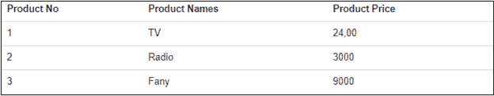
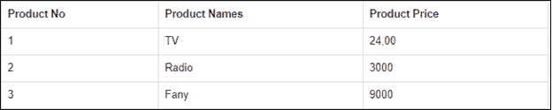
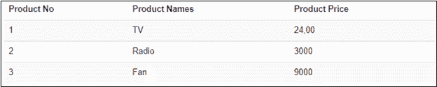
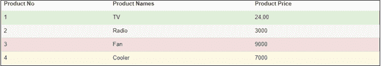

# 引导表

> 原文：<https://www.tutorialandexample.com/bootstrap-tables/>

我们可以创建不同类型的响应和真棒自举表一样:条纹，边界等。

## 引导基本表

我们可以通过使用它的类**来创建一个基本的引导表。工作台**。它有轻填料和水平分隔线。



### 例子

```
<div class="container">  
  <h2>Striped Rows</h2>  
  <p>The .table-striped class adds zebra-stripes to a table:</p>              
  <table class="table table-striped">  
    <thead>  
      <tr>  
        <th>Product No</th>  
        <th>Product Names</th>  
        <th>Product Price</th>  
      </tr>  
    </thead>  
    <tbody>  
      <tr>  
        <td>1</td>  
        <td>TV</td>  
        <td>24,00</td>  
      </tr>  
      <tr>  
        <td>2</td>  
        <td>Radio</td>  
        <td>3000</td>  
      </tr>  
      <tr>  
        <td>3</td>  
        <td>Fan</td>  
        <td>9000</td>  
      </tr>  
    </tbody>  
  </table>  
</div>
```

**[试现](https://editor.tutorialandexample.com/web/test.jsp?filename=bootstraptables1)**

## 引导边界表

我们可以通过使用它的类**来创建引导边界表。桌边的。**

```
Example: <table class="table table-bordered">
```



## 引导分条行表

我们可以通过使用它的类**来创建引导条带行表。斑马纹**。

```
Example: <table class="table table-bordered">
```



## 引导悬停行表

我们可以通过使用它的类**来创建引导悬浮表。表格-悬停**。当我们使用它时，该行将被自动选中。

```
Example: <table class="table table-hover">
```


## 引导压缩表

我们可以通过将单元格填充减半来创建一个紧凑的表格，我们必须使用它的类**。表-浓缩。**

```
Example: <table class="table table-condensed">
```


## 引导上下文类:

在 Bootstrap 中，上下文类用于给表格行或表格单元格着色。

下表中给出了各种上下文类。

| 班级 | 描述 |
| .活跃的 | 它用于将悬停颜色应用于表格行或表格单元格。 |
| .成功 | 它用来表示成功或积极的行动。 |
| .信息 | 它用来表示中性的信息变化或动作。 |
| .警告 | 它用于指定可能需要注意的警告。 |
| .危险 | 它用来表示危险或潜在的负面行为。 |

### 示例:

```
<div class="container">  
  <h2>Striped Rows</h2>  
  <p>The Contextual classes can be used with: .active, .success, .info, .warning, and .danger.</p>  
  <table class="table">  
    <thead>  
<tr><th>Product No</th><th>Product Names</th><th>Product Price</th></tr>  
    </thead>  
    <tbody>  
<tr class="success"><td>1</td><td>TV</td><td>24,00</td></tr>  
<tr class="active"><td>2</td><td>Radio</td><td>3000</td></tr>  
<tr class="danger"><td>3</td><td>Fan</td><td>9000</td></tr>  
<tr class="warning"><td>4</td> <td>Cooler</td><td>7000</td></tr>  
    </tbody>  
  </table>  
</div>
```



**[试现](https://editor.tutorialandexample.com/web/test.jsp?filename=bootstraptables2)**

## 引导响应表

在 Bootstrap 中，我们可以通过使用它的类**来创建响应表。表格响应**。我们可以通过水平调整响应表的大小来检查它。

### 示例:

```
<div class="table-responsive">  
  <table class="table">  
    ...  
  </table>  
</div>
```