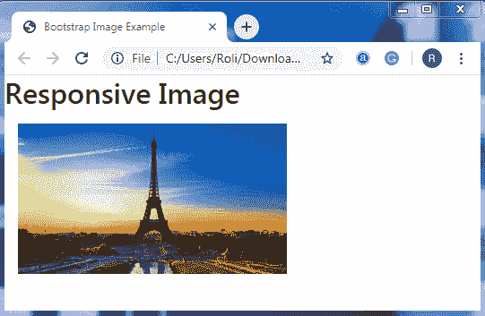

# 引导映像

> 原文：<https://www.tutorialandexample.com/bootstrap-images/>

**引导 4 个图像**

Bootstrap 为图像提供了几个类，使它们具有响应性，同时也有助于赋予图像某种风格。

**图像形状**

**圆角**

自举 4 提供**。rounded** 类，使图像的角变圆。

**例子**

```
<!DOCTYPE html>
 <html lang="en">
 <head>
   <title>Bootstrap Image Example</title>
   <meta charset="utf-8">
   <meta name="viewport" content="width=device-width, initial-scale=1">
   <link rel="stylesheet" href="https://maxcdn.bootstrapcdn.com/bootstrap/4.4.1/css/bootstrap.min.css">
  </head> 
 <body>
 <div class="container">
 <h2>Rounded Corners</h2>
  
 </div>
 <script src="https://ajax.googleapis.com/ajax/libs/jquery/3.4.1/jquery.min.js"></script>
   <script src="https://cdnjs.cloudflare.com/ajax/libs/popper.js/1.16.0/umd/popper.min.js"></script>
   <script src="https://maxcdn.bootstrapcdn.com/bootstrap/4.4.1/js/bootstrap.min.js"></script> 
 </body>
 </html> 
```

**输出**


**圆圈**

**。rounded-circle** 类用来制作图像形状的**圆。**

 ****例子**

```
<!DOCTYPE html>
 <html lang="en">
 <head>
   <title>Bootstrap Image Example</title>
   <meta charset="utf-8">
   <meta name="viewport" content="width=device-width, initial-scale=1">
   <link rel="stylesheet" href="https://maxcdn.bootstrapcdn.com/bootstrap/4.4.1/css/bootstrap.min.css">
 </head>
 <body> 
 <div class="container">
 <h2>Circle Image</h2>
   
 </div>
   <script src="https://ajax.googleapis.com/ajax/libs/jquery/3.4.1/jquery.min.js"></script>
   <script src="https://cdnjs.cloudflare.com/ajax/libs/popper.js/1.16.0/umd/popper.min.js"></script>
   <script src="https://maxcdn.bootstrapcdn.com/bootstrap/4.4.1/js/bootstrap.min.js"></script>
 </body> 
 </html> 
```

**输出**


**缩略图**

Bootstrap 4 提供了一个. img-thumbnail 类，帮助在图像周围创建 1px 圆角边框。

**例子**

```
<!DOCTYPE html>
 <html lang="en">
 <head>
   <title>Bootstrap Image Example</title>
   <meta charset="utf-8">
   <meta name="viewport" content="width=device-width, initial-scale=1">
   <link rel="stylesheet" href="https://maxcdn.bootstrapcdn.com/bootstrap/4.4.1/css/bootstrap.min.css"> 
 </head>
 <body>
 <div class="container">
   <h2>Thumbnail Image</h2>
    
 </div>
   <script src="https://ajax.googleapis.com/ajax/libs/jquery/3.4.1/jquery.min.js"></script>
   <script src="https://cdnjs.cloudflare.com/ajax/libs/popper.js/1.16.0/umd/popper.min.js"></script>
   <script src="https://maxcdn.bootstrapcdn.com/bootstrap/4.4.1/js/bootstrap.min.js"></script> 
 </body>
 </html> 
```

**输出**


**对准图像**

Bootstrap 4 提供了“浮动”功能，有助于左右移动图像。**。float-right** 类将图像向右浮动，**。float-left** 类将图像向左浮动。

**例子**

```
<!DOCTYPE html> <html lang="en">
 <head>
   <title>Bootstrap Image Example</title>
   <meta charset="utf-8">
   <meta name="viewport" content="width=device-width, initial-scale=1">
   <link rel="stylesheet" href="https://maxcdn.bootstrapcdn.com/bootstrap/4.4.1/css/bootstrap.min.css">
 </head> 
 <body>
 <div class="container">
   <h2>Aligning Images</h2>
   
    
 </div>
   <script src="https://ajax.googleapis.com/ajax/libs/jquery/3.4.1/jquery.min.js"></script>
   <script src="https://cdnjs.cloudflare.com/ajax/libs/popper.js/1.16.0/umd/popper.min.js"></script> 
   <script src="https://maxcdn.bootstrapcdn.com/bootstrap/4.4.1/js/bootstrap.min.js"></script>
 </body>
 </html> 
```

**输出**


**居中图像**

您可以在**的帮助下将图像居中对齐。mx-auto** (margin: auto)级和**。d 挡**(显示:挡)类。要创建居中对齐的图像，请添加**。mx-auto** 级连同**级。d-block** 类到 **< img >** 元素。

**例子**

```
<!DOCTYPE html>
 <html lang="en"> 
 <head>
   <title>Bootstrap Image Example</title>
   <meta charset="utf-8">
   <meta name="viewport" content="width=device-width, initial-scale=1">
   <link rel="stylesheet" href="https://maxcdn.bootstrapcdn.com/bootstrap/4.4.1/css/bootstrap.min.css"> 
 </head>
 <body>
 <h2 class="text-center">Centered Image</h2>
 <div class="container">
   
 </div>
   <script src="https://ajax.googleapis.com/ajax/libs/jquery/3.4.1/jquery.min.js"></script>
   <script src="https://cdnjs.cloudflare.com/ajax/libs/popper.js/1.16.0/umd/popper.min.js"></script> 
   <script src="https://maxcdn.bootstrapcdn.com/bootstrap/4.4.1/js/bootstrap.min.js"></script>
 </body>
 </html> 
```

**输出**


**响应图像**

当您调整浏览器大小时，响应式图像不允许自身变得比其父元素更大。响应图像会根据其父元素自动调整自身。为了给图像提供响应行为，添加**。img-流体**类到 **< img >** 元素。

**例子**

```
<!DOCTYPE html>
 <html lang="en">
 <head>
   <title>Bootstrap Image Example</title>
   <meta charset="utf-8">
   <meta name="viewport" content="width=device-width, initial-scale=1"> 
   <link rel="stylesheet" href="https://maxcdn.bootstrapcdn.com/bootstrap/4.4.1/css/bootstrap.min.css">
   </head>
 <body>
 <h2>Responsive Image</h2>
 <div class="container">
   
   <script src="https://ajax.googleapis.com/ajax/libs/jquery/3.4.1/jquery.min.js"></script>
   <script src="https://cdnjs.cloudflare.com/ajax/libs/popper.js/1.16.0/umd/popper.min.js"></script>
   <script src="https://maxcdn.bootstrapcdn.com/bootstrap/4.4.1/js/bootstrap.min.js"></script>
 </body>
 </html> 
 </div> 
```

**输出**

**