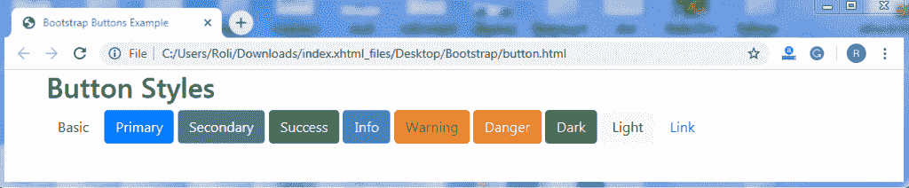
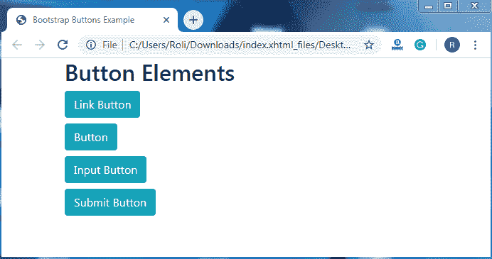
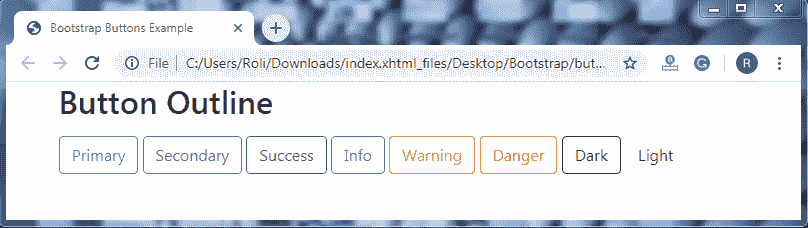
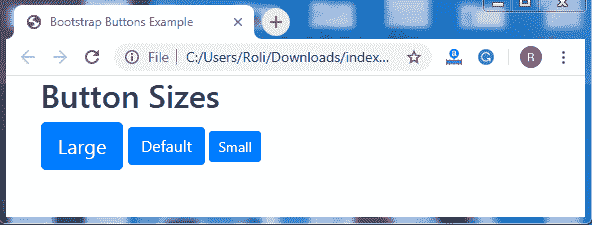
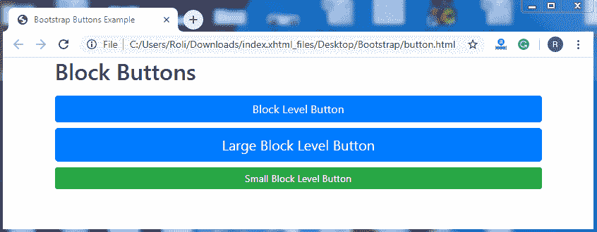
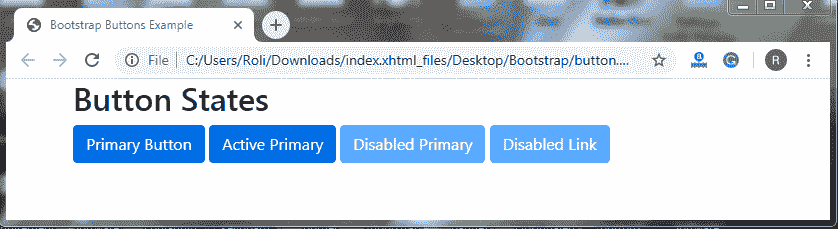

# 自举 4 个按钮

> 原文：<https://www.tutorialandexample.com/bootstrap-buttons/>

**自举按钮**

Bootstrap 提供了许多自定义按钮样式。这些按钮在表单和对话框中用于操作。Bootstrap 提供了各种预定义的类来为按钮提供样式。

有许多类用来为按钮提供样式，如下所示

*   .BTN-默认
*   .BTN-初级
*   .BTN-成功
*   .btn 信息
*   .BTN-警告
*   .BTN-危险
*   .btn-link

**语法**

```
<!DOCTYPE html>
 <html lang="en">
 <head>
   <title>Bootstrap Buttons Example</title>
   <meta charset="utf-8">
   <meta name="viewport" content="width=device-width, initial-scale=1">
   <link rel="stylesheet" href="https://maxcdn.bootstrapcdn.com/bootstrap/4.4.1/css/bootstrap.min.css"> 
 </head>
 <body>
 <div class="container">
   <h2>Button Styles</h2>
   <button type="button" class="btn">Basic</button>
   <button type="button" class="btn btn-primary">Primary</button>
   <button type="button" class="btn btn-secondary">Secondary</button>
   <button type="button" class="btn btn-success">Success</button> 
   <button type="button" class="btn btn-info">Info</button>
   <button type="button" class="btn btn-warning">Warning</button>
   <button type="button" class="btn btn-danger">Danger</button>
   <button type="button" class="btn btn-dark">Dark</button>
   <button type="button" class="btn btn-light">Light</button>
   <button type="button" class="btn btn-link">Link</button>      
 </div>
   <script src="https://ajax.googleapis.com/ajax/libs/jquery/3.4.1/jquery.min.js"></script> 
   <script src="https://cdnjs.cloudflare.com/ajax/libs/popper.js/1.16.0/umd/popper.min.js"></script>
   <script src="https://maxcdn.bootstrapcdn.com/bootstrap/4.4.1/js/bootstrap.min.js"></script>
 </body>
 </html> 
```

**输出**



**按钮元素**

我们也可以在多个 HTML 元素上使用按钮类，比如 anchor ( 

**语法**

```
<!DOCTYPE html>
 <html lang="en">
 <head>
   <title>Bootstrap Buttons Example</title>
   <meta charset="utf-8">
   <meta name="viewport" content="width=device-width, initial-scale=1">
   <link rel="stylesheet" href="https://maxcdn.bootstrapcdn.com/bootstrap/4.4.1/css/bootstrap.min.css">
 </head>
 <body> 
 <div class="container">
   <h2>Button Elements</h2>
   <h4><a href="#" class="btn btn-info" role="button">Link Button</a></h4>
   <h4><button type="button" class="btn btn-info">Button</button></h4>
   <h4><input type="button" class="btn btn-info" value="Input Button"></h4>
   <h4><input type="submit" class="btn btn-info" value="Submit Button"></h4>
 </div> 
 <script src="https://ajax.googleapis.com/ajax/libs/jquery/3.4.1/jquery.min.js"></script>
   <script src="https://cdnjs.cloudflare.com/ajax/libs/popper.js/1.16.0/umd/popper.min.js"></script>
   <script src="https://maxcdn.bootstrapcdn.com/bootstrap/4.4.1/js/bootstrap.min.js"></script>
 </body>
 </html> 
```

**输出**



**按钮轮廓**

这种类型的按钮有一个没有任何背景颜色和背景图像的彩色轮廓。**。btn-outline-*** 类用于创建按钮轮廓。

**语法**

```
<!DOCTYPE html>
 <html lang="en">
 <head>
   <title>Bootstrap Buttons Example</title>
   <meta charset="utf-8">
   <meta name="viewport" content="width=device-width, initial-scale=1"> 
   <link rel="stylesheet" href="https://maxcdn.bootstrapcdn.com/bootstrap/4.4.1/css/bootstrap.min.css">
 </head>
 <body>
 <div class="container">
   <h2>Button Outline</h2>
   <button type="button" class="btn btn-outline-primary">Primary</button>
   <button type="button" class="btn btn-outline-secondary">Secondary</button>
   <button type="button" class="btn btn-outline-success">Success</button>
   <button type="button" class="btn btn-outline-info">Info</button>
   <button type="button" class="btn btn-outline-warning">Warning</button>
   <button type="button" class="btn btn-outline-danger">Danger</button>
   <button type="button" class="btn btn-outline-dark">Dark</button>
   <button type="button" class="btn btn-outline-light text-dark">Light</button>  
 </div>
   <script src="https://ajax.googleapis.com/ajax/libs/jquery/3.4.1/jquery.min.js"></script>
   <script src="https://cdnjs.cloudflare.com/ajax/libs/popper.js/1.16.0/umd/popper.min.js"></script>
   <script src="https://maxcdn.bootstrapcdn.com/bootstrap/4.4.1/js/bootstrap.min.js"></script>
 </body>
 </html> 
```

**输出**



**按钮尺寸**

**。btn-lg** 类用于创建比默认尺寸更大的按钮。**。btn-sm** 类用于创建比默认尺寸更小的。

**语法**

 **```
<!DOCTYPE html>
 <html lang="en">
 <head>
   <title>Bootstrap Buttons Example</title>
   <meta charset="utf-8">
   <meta name="viewport" content="width=device-width, initial-scale=1">
   <link rel="stylesheet" href="https://maxcdn.bootstrapcdn.com/bootstrap/4.4.1/css/bootstrap.min.css">
 </head> 
 <body>
 <div class="container">
   <h2>Button Sizes</h2>
   <button type="button" class="btn btn-primary btn-lg">Large</button>
   <button type="button" class="btn btn-primary btn-md">Default</button>    
   <button type="button" class="btn btn-primary btn-sm">Small</button>
 </div> 
 <script src="https://ajax.googleapis.com/ajax/libs/jquery/3.4.1/jquery.min.js"></script>
   <script src="https://cdnjs.cloudflare.com/ajax/libs/popper.js/1.16.0/umd/popper.min.js"></script>
   <script src="https://maxcdn.bootstrapcdn.com/bootstrap/4.4.1/js/bootstrap.min.js"></script>
 </body>
 </html> 
```

**输出**



**块级按钮**

块级按钮覆盖屏幕或父元素的整个宽度。**。btn-block** 类用于创建块级按钮。

**语法**

```
<!DOCTYPE html>
 <html lang="en">
 <head>
   <title>Bootstrap Buttons Example</title>
   <meta charset="utf-8">
   <meta name="viewport" content="width=device-width, initial-scale=1">
   <link rel="stylesheet" href="https://maxcdn.bootstrapcdn.com/bootstrap/4.4.1/css/bootstrap.min.css"> 
 </head>
 <body>
 <div class="container">
   <h2>Block Buttons</h2>
   <button type="button" class="btn btn-primary btn-block">Block Level Button</button>
   <button type="button" class="btn btn-primary btn-lg btn-block">Large Block Level Button</button>
   <button type="button" class="btn btn-success btn-sm btn-block">Small Block Level Button</button> 
 </div>
   <script src="https://ajax.googleapis.com/ajax/libs/jquery/3.4.1/jquery.min.js"></script>
   <script src="https://cdnjs.cloudflare.com/ajax/libs/popper.js/1.16.0/umd/popper.min.js"></script>
   <script src="https://maxcdn.bootstrapcdn.com/bootstrap/4.4.1/js/bootstrap.min.js"></script>
 </body>
 </html> 
```

**输出**



**激活/禁用按钮**

Bootstrap 4 提供了允许我们创建活动或按下按钮和禁用按钮的类。**。active** 类用于创建活动按钮，通过添加一个 **disabled** 属性，活动按钮将被禁用。

**语法**

```
<!DOCTYPE html>
 <html lang="en">
 <head>
   <title>Bootstrap Buttons Example</title>
   <meta charset="utf-8">
   <meta name="viewport" content="width=device-width, initial-scale=1">
   <link rel="stylesheet" href="https://maxcdn.bootstrapcdn.com/bootstrap/4.4.1/css/bootstrap.min.css"> 
 </head>
 <body>
 <div class="container">
   <h2>Button States</h2>
   <button type="button" class="btn btn-primary">Primary Button</button>
   <button type="button" class="btn btn-primary active">Active Primary</button>
   <button type="button" class="btn btn-primary" disabled>Disabled Primary</button>
   <a href="#" class="btn btn-primary disabled">Disabled Link</a> 
 </div>
   <script src="https://ajax.googleapis.com/ajax/libs/jquery/3.4.1/jquery.min.js"></script>
   <script src="https://cdnjs.cloudflare.com/ajax/libs/popper.js/1.16.0/umd/popper.min.js"></script>
   <script src="https://maxcdn.bootstrapcdn.com/bootstrap/4.4.1/js/bootstrap.min.js"></script>
 </body> 
 </html> 
```

**输出**

**