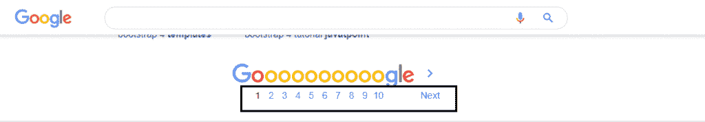
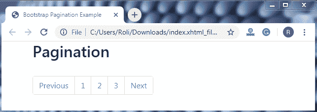
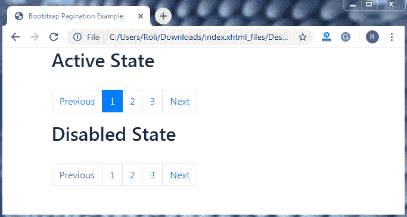
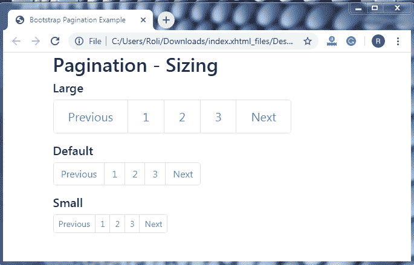
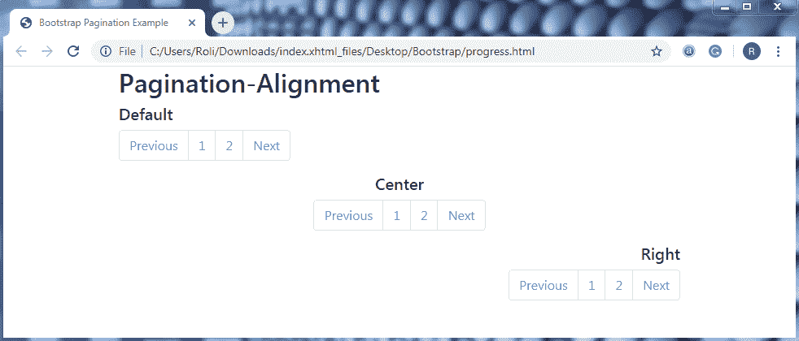

# 引导 4 分页

> 原文：<https://www.tutorialandexample.com/bootstrap-pagination/>

**Bootstrap 4 分页**

Bootstrap 分页用于显示网站的一系列网页的存在。它允许在网站的多个页面上导航。

在分页中，有一个易于伸缩的连接链接块。分页是在 HTML 元素 **List** 的帮助下创建的，这样用户就可以看到可用链接的数量。

**例子**

几乎每个搜索引擎都使用分页来显示网页上搜索结果的数量。



**创建基本分页的步骤**

*   使用包装元素 **<导航>** 指定导航段**。**
*   用**添加无序列表 **< ul >** 元素。分页**类。
*   用**添加列表项**、>、**元素。page-item** 类。
*   添加**。page-link** 类中的 **<一个>** 元素提供链接
*   添加 **<一个带有**的>** 元素。page-link** 类中的 **< li >** 元素。

**语法**

```
<nav>
     <ul class="pagination">
              <li class="page-item"><a class="page-link" href="#">Previous</a></li>
       </ul>
   </nav> 
```

**例子**

```
<!DOCTYPE html>
 <html lang="en">
 <head>
   <title>Bootstrap Pagination Example</title>
   <meta charset="utf-8">
   <meta name="viewport" content="width=device-width, initial-scale=1">
   <link rel="stylesheet" href="https://maxcdn.bootstrapcdn.com/bootstrap/4.4.1/css/bootstrap.min.css">
 </head>
 <div class="container">
   <h2>Pagination</h2>
   <nav>                  
    <ul class="pagination"> 
     <li class="page-item"><a class="page-link" href="#">Previous</a></li>
     <li class="page-item"><a class="page-link" href="#">1</a></li>
     <li class="page-item"><a class="page-link" href="#">2</a></li>
     <li class="page-item"><a class="page-link" href="#">3</a></li>
     <li class="page-item"><a class="page-link" href="#">Next</a></li>
    </ul>
   </nav>
 </div>
   <script src="https://ajax.googleapis.com/ajax/libs/jquery/3.4.1/jquery.min.js"></script>
   <script src="https://cdnjs.cloudflare.com/ajax/libs/popper.js/1.16.0/umd/popper.min.js"></script>
   <script src="https://maxcdn.bootstrapcdn.com/bootstrap/4.4.1/js/bootstrap.min.js"></script>
 </body>
 </html> 
```

**输出**



**活动和禁用状态-** 我们可以根据需要定制分页链接。分页提供了两个定制链接的类，这两个类是**。现役**级和**级。禁用**类。

**。当我们想让我们的链接不可点击时，使用 disable** 类。这个类使用 CSS 属性**“指针事件:无”**禁用 **<一>** 元素的链接功能。虽然，这个属性只禁止鼠标点击。用户仍然可以在键盘按键的帮助下点击被禁用的链接。为了完全禁用链接，我们必须使用属性 **tabindex = " -1"** 和一些定制的 javascript **。**

**。活动的**类用于显示或高亮当前页面。

**例子**

```
<!DOCTYPE html>
 <html lang="en">
 <head>
   <title>Bootstrap Pagination Example</title>
   <meta charset="utf-8">
   <meta name="viewport" content="width=device-width, initial-scale=1">
   <link rel="stylesheet" href="https://maxcdn.bootstrapcdn.com/bootstrap/4.4.1/css/bootstrap.min.css">
 </head>
 <div class="container">
   <h2>Active State</h2><br>
   <ul class="pagination">
     <li class="page-item"><a class="page-link" href="#">Previous</a></li>
     <li class="page-item active"><a class="page-link" href="#">1</a></li> 
     <li class="page-item"><a class="page-link" href="#">2</a></li>
     <li class="page-item"><a class="page-link" href="#">3</a></li>
     <li class="page-item"><a class="page-link" href="#">Next</a></li>
   </ul>
   <h2>Disabled State</h2><br>
   <ul class="pagination">
     <li class="page-item disabled"><a class="page-link" href="#">Previous</a></li> 
     <li class="page-item"><a class="page-link" href="#">1</a></li>
     <li class="page-item"><a class="page-link" href="#">2</a></li>
     <li class="page-item"><a class="page-link" href="#">3</a></li>
     <li class="page-item"><a class="page-link" href="#">Next</a></li>
   </ul>
 </div>
   <script src="https://ajax.googleapis.com/ajax/libs/jquery/3.4.1/jquery.min.js"></script>
   <script src="https://cdnjs.cloudflare.com/ajax/libs/popper.js/1.16.0/umd/popper.min.js"></script>
   <script src="https://maxcdn.bootstrapcdn.com/bootstrap/4.4.1/js/bootstrap.min.js"></script>
 </body>
 </html> 
```

**输出**



**分页大小–**像 bootstrap 4 的其他组件一样，我们也可以定制分页大小。下面给出了两个调整分页大小的类。

1.  **。pagination-lg** 类用于使分页大小大于默认大小。
2.  **。pagination-sm** 类用于使分页大小小于默认大小。

**例子**

```
<!DOCTYPE html>
 <html lang="en">
 <head>
   <title>Bootstrap Pagination Example</title>
   <meta charset="utf-8">
   <meta name="viewport" content="width=device-width, initial-scale=1">
   <link rel="stylesheet" href="https://maxcdn.bootstrapcdn.com/bootstrap/4.4.1/css/bootstrap.min.css"> 
 </head>
 <div class="container">
   <h2>Pagination - Sizing</h2>
   <h5>Large</h5>
   <ul class="pagination pagination-lg">
     <li class="page-item"><a class="page-link" href="#">Previous</a></li>
     <li class="page-item"><a class="page-link" href="#">1</a></li> 
     <li class="page-item"><a class="page-link" href="#">2</a></li>
     <li class="page-item"><a class="page-link" href="#">3</a></li>
     <li class="page-item"><a class="page-link" href="#">Next</a></li>
   </ul>
   <h5>Default</h5>
   <ul class="pagination"> 
     <li class="page-item"><a class="page-link" href="#">Previous</a></li>
     <li class="page-item"><a class="page-link" href="#">1</a></li>
     <li class="page-item"><a class="page-link" href="#">2</a></li>
     <li class="page-item"><a class="page-link" href="#">3</a></li>
     <li class="page-item"><a class="page-link" href="#">Next</a></li>
   </ul>
   <h5>Small</h5> 
   <ul class="pagination pagination-sm">
     <li class="page-item"><a class="page-link" href="#">Previous</a></li>
     <li class="page-item"><a class="page-link" href="#">1</a></li>
     <li class="page-item"><a class="page-link" href="#">2</a></li>
     <li class="page-item"><a class="page-link" href="#">3</a></li>
     <li class="page-item"><a class="page-link" href="#">Next</a></li> 
   </ul>
 </div>
   <script src="https://ajax.googleapis.com/ajax/libs/jquery/3.4.1/jquery.min.js"></script>
   <script src="https://cdnjs.cloudflare.com/ajax/libs/popper.js/1.16.0/umd/popper.min.js"></script>
   <script src="https://maxcdn.bootstrapcdn.com/bootstrap/4.4.1/js/bootstrap.min.js"></script>
 </body>
 </html> 
```

**输出**



**分页对齐—**分页组件的默认对齐方式是左对齐。通过使用一些 flexbox 实用程序，我们还可以将分页的对齐方式改为**右**或**中**。

*   添加**。使用 **< ul >** 元素的 justify-content-center** 类将分页设置为居中对齐。
*   添加**。使用 **< ul >** 元素的 justify-content-end** 类将分页设置为向右对齐。

 ****例子**

```
<!DOCTYPE html>
 <html lang="en">
 <head>
   <title>Bootstrap Pagination Example</title>
   <meta charset="utf-8">
   <meta name="viewport" content="width=device-width, initial-scale=1">
   <link rel="stylesheet" href="https://maxcdn.bootstrapcdn.com/bootstrap/4.4.1/css/bootstrap.min.css">
 </head>
 <div class="container"> 
   <h2>Pagination-Alignment</h2>
   <h5>Default</h5>                 
   <ul class="pagination">
     <li class="page-item"><a class="page-link" href="javascript:void(0);">Previous</a></li>
     <li class="page-item"><a class="page-link" href="javascript:void(0);">1</a></li>
     <li class="page-item"><a class="page-link" href="javascript:void(0);">2</a></li>
     <li class="page-item"><a class="page-link" href="javascript:void(0);">Next</a></li> 
   </ul>
   <h5 style="text-align: center;">Center</h5>
   <ul class="pagination justify-content-center">
     <li class="page-item"><a class="page-link" href="javascript:void(0);">Previous</a></li>
     <li class="page-item"><a class="page-link" href="javascript:void(0);">1</a></li>
     <li class="page-item"><a class="page-link" href="javascript:void(0);">2</a></li>
     <li class="page-item"><a class="page-link" href="javascript:void(0);">Next</a></li>
   </ul> 
   <h5 style="text-align: right;">Right</h5>
   <ul class="pagination justify-content-end">
     <li class="page-item"><a class="page-link" href="javascript:void(0);">Previous</a></li>
     <li class="page-item"><a class="page-link" href="javascript:void(0);">1</a></li>
     <li class="page-item"><a class="page-link" href="javascript:void(0);">2</a></li>
     <li class="page-item"><a class="page-link" href="javascript:void(0);">Next</a></li>
   </ul> 
 </div>
   <script src="https://ajax.googleapis.com/ajax/libs/jquery/3.4.1/jquery.min.js"></script>
   <script src="https://cdnjs.cloudflare.com/ajax/libs/popper.js/1.16.0/umd/popper.min.js"></script>
   <script src="https://maxcdn.bootstrapcdn.com/bootstrap/4.4.1/js/bootstrap.min.js"></script>
 </body>
 </html> 
```

**输出**

**