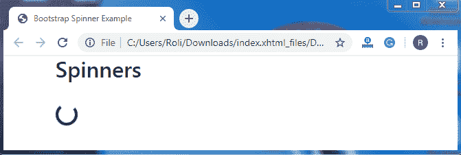
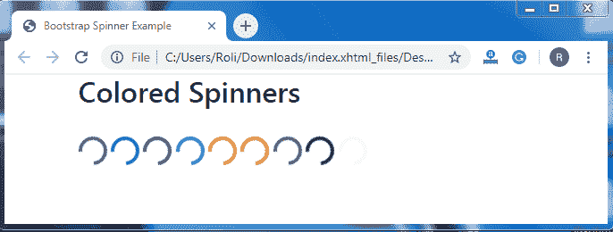
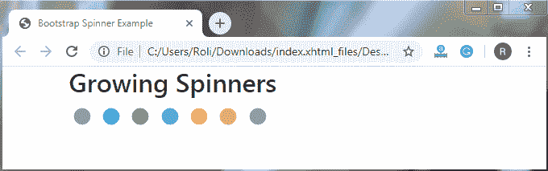
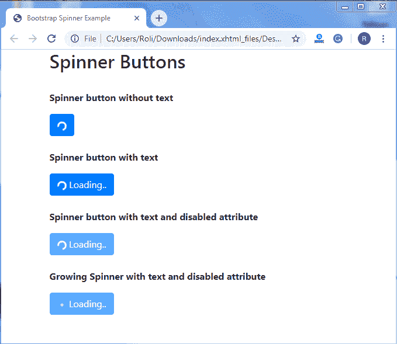

# Bootstrap 4 旋转器

> 原文：<https://www.tutorialandexample.com/bootstrap-spinners/>

[Bootstrap](https://www.tutorialandexample.com/bootstrap-tutorial)4 offers**spinner**是一个加载指示器，用来显示任何组件或网页的加载状态。旋转器也称为装载机或预装载机。

spinner/loader 是一个动画工具，可以让用户在加载任何网页的过程中保持娱乐。它们仅使用 [**HTML** (超文本标记语言)](https://www.tutorialandexample.com/html-tutorial)和 [**CSS** (级联样式表)](https://www.tutorialandexample.com/css-tutorial)创建，并且不需要 [JavaScript](https://www.tutorialandexample.com/javascript-tutorial) 代码。然而，仍然需要一些定制的 JavaScript 来切换它们的可见性。我们可以轻松地改变微调器的大小、外观和对齐方式，而无需使用任何实用程序类。

### 默认/边框微调器

要创建微调器，请添加**。spinner-border** 类以及父 [< div >](https://www.tutorialandexample.com/div-tag-in-html) 元素中的 **role ="status"** 属性值对。的。sr 类用在嵌套的< span >元素中，使内容在屏幕阅读器上可见。

**语法**

```
<div class="spinner-border" role="status">
  Loading...
</div> 
```

**例子**

```
<!DOCTYPE html>
<html lang="en">
<head>
  <title>Bootstrap Spinner Example</title>
  <meta charset="utf-8">
  <meta name="viewport" content="width=device-width, initial-scale=1">
  <link rel="stylesheet" href="https://maxcdn.bootstrapcdn.com/bootstrap/4.4.1/css/bootstrap.min.css">
</head>
<div class="container">
  <h2>Spinners</h2> <br>
  <div class="spinner-border" role="status">
   Loading...
  </div>
</div>
  <script src="https://ajax.googleapis.com/ajax/libs/jquery/3.4.1/jquery.min.js"></script>
  <script src="https://cdnjs.cloudflare.com/ajax/libs/popper.js/1.16.0/umd/popper.min.js"></script>
  <script src="https://maxcdn.bootstrapcdn.com/bootstrap/4.4.1/js/bootstrap.min.js"></script>
</body>
</html> 
```

**输出**



### 彩色旋转器

默认/边框微调器使用当前颜色作为边框颜色，这意味着您可以借助**文本颜色实用程序**根据自己的需要设置微调器的颜色。为了创建彩色旋转器，你必须添加**文本颜色类**和**。旋转边框**类。

**语法**

```
<div class="spinner-border text-*" role="status">
Loading
  </div> 
```

**例子**

```
<!DOCTYPE html>
<html lang="en">
<head>
  <title>Bootstrap Spinner Example</title>
  <meta charset="utf-8">
  <meta name="viewport" content="width=device-width, initial-scale=1">
  <link rel="stylesheet" href="https://maxcdn.bootstrapcdn.com/bootstrap/4.4.1/css/bootstrap.min.css">
</head>
<div class="container">
  <h2>Colored Spinners</h2>
  <div class="spinner-border text-muted">
    Loading
  </div>
  <div class="spinner-border text-primary">
    Loading
  </div>
  <div class="spinner-border text-success">
    Loading
 </div>
  <div class="spinner-border text-info">
    Loading
  </div>
  <div class="spinner-border text-warning">
    Loading
  </div>
  <div class="spinner-border text-danger">
    Loading
  </div>
  <div class="spinner-border text-secondary">
    Loading
  </div>
  <div class="spinner-border text-dark">
    Loading
  </div>
  <div class="spinner-border text-light">
    Loading
  </div>
</div
  <script src="https://ajax.googleapis.com/ajax/libs/jquery/3.4.1/jquery.min.js"></script>
  <script src="https://cdnjs.cloudflare.com/ajax/libs/popper.js/1.16.0/umd/popper.min.js"></script>
  <script src="https://maxcdn.bootstrapcdn.com/bootstrap/4.4.1/js/bootstrap.min.js"></script>
</body>
</html> 
```

**输出**



### 成长纺纱工

不断增长的旋转器重复淡入(增长)，然后淡出，而不是旋转。像边框微调器一样，你也可以在**文本颜色工具**的帮助下，根据你的需要改变或设置增长微调器的颜色。

**。spinner grow** 类用于创建不断增长的微调器。

**语法**

```
<div class="spinner-grow">
    Loading
  </div> 
```

**例子**

```
<!DOCTYPE html>
<html lang="en">
<head>
  <title>Bootstrap Spinner Example</title>
  <meta charset="utf-8">
  <meta name="viewport" content="width=device-width, initial-scale=1">
  <link rel="stylesheet" href="https://maxcdn.bootstrapcdn.com/bootstrap/4.4.1/css/bootstrap.min.css">
</head>
<div class="container">
  <h2>Growing Spinners</h2>
  <div class="spinner-grow text-muted">
    Loading
  </div>
  <div class="spinner-grow text-primary">
    Loading
  </div>
  <div class="spinner-grow text-success">
    Loading
  </div>
  <div class="spinner-grow text-info">
    Loading
  </div>
  <div class="spinner-grow text-warning">
    Loading
  </div>
  <div class="spinner-grow text-danger">
    Loading
  </div>
  <div class="spinner-grow text-secondary">
    Loading
  </div>
 </div>
<script src="https://ajax.googleapis.com/ajax/libs/jquery/3.4.1/jquery.min.js"></script>
  <script src="https://cdnjs.cloudflare.com/ajax/libs/popper.js/1.16.0/umd/popper.min.js"></script>
  <script src="https://maxcdn.bootstrapcdn.com/bootstrap/4.4.1/js/bootstrap.min.js"></script>
</body>
</html> 
```

**输出**



### 微调按钮

我们使用带按钮的微调器，这样我们可以显示动作是仍在处理中还是已经完成。我们可以根据需要从按钮中删除文本，也可以通过使用<按钮>元素中的**禁用**属性来禁用按钮。

**语法**

```
<button class="btn btn-primary">
    
    Loading..
  </button> 
```

**例子**

```
<!DOCTYPE html>
<html lang="en">
<head>
  <title>Bootstrap Spinner Example</title>
  <meta charset="utf-8">
  <meta name="viewport" content="width=device-width, initial-scale=1">
  <link rel="stylesheet" href="https://maxcdn.bootstrapcdn.com/bootstrap/4.4.1/css/bootstrap.min.css">
</head>
  <div class="container">
  <h2>Spinner Buttons</h2><br>
  <p><strong>Spinner button without text</strong></p>
  <button class="btn btn-primary">
    
  </button>
<br><br>
  <p><strong>Spinner button with text</strong></p>
  <button class="btn btn-primary">
    
    Loading..
  </button>
  <br><br>
  <p><strong>Spinner button with text and disabled attribute</strong></p>
  <button class="btn btn-primary" disabled>
    
    Loading..
  </button>
  <br><br>
  <p><strong>Growing Spinner with text and disabled attribute</strong></p>
  <button class="btn btn-primary" disabled>
    
    Loading..
  </button>
</div>
  <script src="https://ajax.googleapis.com/ajax/libs/jquery/3.4.1/jquery.min.js"></script>
  <script src="https://cdnjs.cloudflare.com/ajax/libs/popper.js/1.16.0/umd/popper.min.js"></script>
  <script src="https://maxcdn.bootstrapcdn.com/bootstrap/4.4.1/js/bootstrap.min.js"></script>
</body>
</html> 
```

**输出**

