# 引导 4 下拉菜单

> 原文：<https://www.tutorialandexample.com/bootstrap-dropdowns/>

**引导下拉菜单**

Bootstrap 4 提供了一个下拉组件，这是一个切换和上下文布局，用于显示预定义的链接列表。它允许用户从下拉列表项中选择一个值。你必须点击下拉菜单来切换；它不会通过将光标悬停在下拉菜单上来切换。

dropdown 是在 **Popper.js** 上开发的，这是一个提供动态状态和视口检测的第三方库。需要在 bootstrap javascript CDN 链接之前添加 **popper.min.js** CDN 链接，也可以使用有 Popper.js 库的**bootstrap . bundle . min . js/bootstrap . bundle . js**。

引导下拉菜单的设计方式可以应用于多种情况和标记结构。在复杂的导航系统中，下拉菜单提供了在导航栏中放置几乎所有重要链接的工具。我们还可以制作具有附加输入(搜索字段)和表单控件(登录表单)的下拉菜单。)

**基本下拉菜单**

您可以通过在其中进行一些标记更改，将任何按钮转换为下拉菜单。

**创建下拉按钮的步骤**

*   添加**。下拉** **类**到**T6】div>元素**来制作下拉菜单。
*   添加**。btn** **类**连同**上下文类**、**。下拉-切换** **类**， **data-toggle="dropdown"** 属性到 **<按钮>** **元素**(div 的直接子元素)打开下拉菜单。
*   添加**。下拉菜单** **类**到 **< div >元素**用于创建列表或菜单。
*   添加**。下拉列表项**类以 **<项>** **元素**为列表项。

例子

```
<!DOCTYPE html>
 <html lang="en">
 <head>
   <title>Bootstrap Dropdown Example</title>
   <meta charset="utf-8">
   <meta name="viewport" content="width=device-width, initial-scale=1">
   <link rel="stylesheet" href="https://maxcdn.bootstrapcdn.com/bootstrap/4.4.1/css/bootstrap.min.css">
 </head> 
 <div class="container">
   <h2>Dropdowns</h2>
   <div class="dropdown">
     <button type="button" class="btn btn-primary dropdown-toggle" data-toggle="dropdown">
       Dropdown 
     </button>
     <div class="dropdown-menu">
       <a class="dropdown-item" href="#">Item 1</a> 
       <a class="dropdown-item" href="#">Item 2</a>
       <a class="dropdown-item" href="#">Item 3</a>
     </div>
   </div>
 </div>
   <script src="https://ajax.googleapis.com/ajax/libs/jquery/3.4.1/jquery.min.js"></script> 
   <script src="https://cdnjs.cloudflare.com/ajax/libs/popper.js/1.16.0/umd/popper.min.js"></script>
   <script src="https://maxcdn.bootstrapcdn.com/bootstrap/4.4.1/js/bootstrap.min.js"></script>
 </body>
 </html> 
```

**输出**

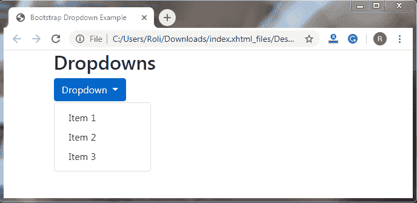

**拆分按钮下拉菜单**

分割按钮下拉列表由适当的间距和一条用于分隔链接的水平细线组成。**。dropdown-toggle-split 类**用于制作 split 按钮下拉菜单。

**例子**

```
<!DOCTYPE html>
 <html lang="en">
 <head>
   <title>Bootstrap Dropdown Example</title>
   <meta charset="utf-8">
   <meta name="viewport" content="width=device-width, initial-scale=1">
   <link rel="stylesheet" href="https://maxcdn.bootstrapcdn.com/bootstrap/4.4.1/css/bootstrap.min.css">
 </head><br> 
 <div class="container">
 <div class="btn-group">
   <button type="button" class="btn btn-primary">Action</button>
   <button type="button" class="btn btn-primary dropdown-toggle dropdown-toggle-split" data-toggle="dropdown" aria-haspopup="true" aria-expanded="false">
     Toggle Dropdown
   </button>
   <div class="dropdown-menu"> 
     <a class="dropdown-item" href="#">Link 1</a>
     <a class="dropdown-item" href="#">Link 2</a>
     <a class="dropdown-item" href="#">Link 3</a>
     <div class="dropdown-divider"></div>
     <a class="dropdown-item" href="#">Another Link</a>
   </div>
 </div>
 </div> 
   <script src="https://ajax.googleapis.com/ajax/libs/jquery/3.4.1/jquery.min.js"></script>
   <script src="https://cdnjs.cloudflare.com/ajax/libs/popper.js/1.16.0/umd/popper.min.js"></script>
   <script src="https://maxcdn.bootstrapcdn.com/bootstrap/4.4.1/js/bootstrap.min.js"></script>
 </body>
 </html> 
```

**输出**

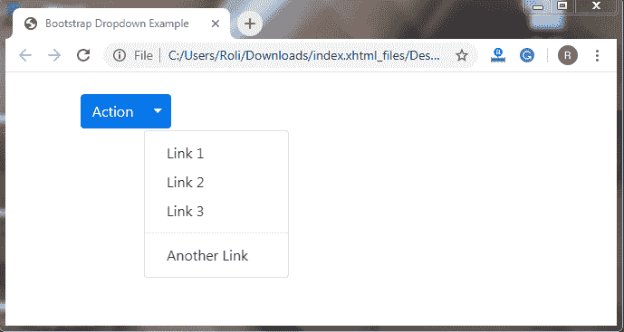

**禁用和活动项目**

我们还可以通过使用两个预定义的类来定制下拉列表的链接或列表项，这两个类是**。现役**级和**级。禁用**类。

**。活动的**类用于高亮显示列表项。这个类为我们想要激活或突出显示的列表项添加蓝色背景色(主要的上下文颜色)。

**。disabled** 类禁用列表项，并将列表项的文本颜色改为浅灰色。

**例子**

```
<!DOCTYPE html>
 <html lang="en">
 <head>
   <title>Bootstrap Dropdown Example</title>
   <meta charset="utf-8">
   <meta name="viewport" content="width=device-width, initial-scale=1">
   <link rel="stylesheet" href="https://maxcdn.bootstrapcdn.com/bootstrap/4.4.1/css/bootstrap.min.css">
 </head> 
 <div class="container">
   <h2>Dropdowns</h2>
   <div class="dropdown">
     <button type="button" class="btn btn-primary dropdown-toggle" data-toggle="dropdown">
       Dropdown button
     </button> 
     <div class="dropdown-menu">
       <a class="dropdown-item" href="#">Normal</a>
       <a class="dropdown-item active" href="#">Active</a>
       <a class="dropdown-item disabled" href="#">Disabled</a>
     </div>
   </div> 
 </div>
 <script src="https://ajax.googleapis.com/ajax/libs/jquery/3.4.1/jquery.min.js"></script>
   <script src="https://cdnjs.cloudflare.com/ajax/libs/popper.js/1.16.0/umd/popper.min.js"></script>
   <script src="https://maxcdn.bootstrapcdn.com/bootstrap/4.4.1/js/bootstrap.min.js"></script>
 </body>
 </html> 
```

**输出**

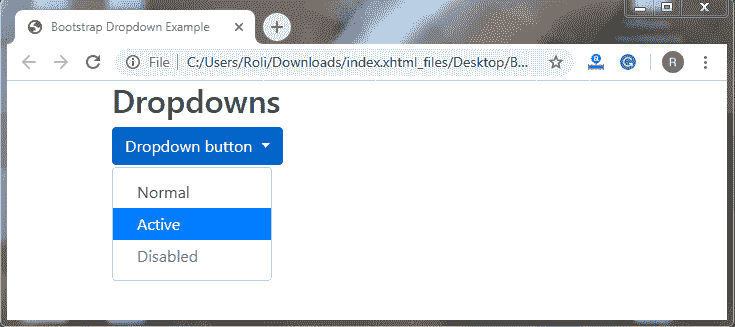

**下拉标题–**Bootstrap 4 提供了一个类，通过在下拉菜单中添加标题或标签来帮助对列表项进行分类。您可以通过添加**来创建下拉标题。下拉标题**类到 **< div >** 元素。

**例子**

```
<!DOCTYPE html>
 <html lang="en">
 <head>
   <title>Bootstrap Dropdown Example</title>
   <meta charset="utf-8">
   <meta name="viewport" content="width=device-width, initial-scale=1">
   <link rel="stylesheet" href="https://maxcdn.bootstrapcdn.com/bootstrap/4.4.1/css/bootstrap.min.css">
 </head>
 <div class="container">
   <h2>Dropdowns</h2>
   <div class="dropdown">
     <button type="button" class="btn btn-primary dropdown-toggle" data-toggle="dropdown"> 
       Dropdown button
     </button>
     <div class="dropdown-menu">
       <h5 class="dropdown-header">Header 1</h5>
       <a class="dropdown-item" href="#">Link 1</a>
       <a class="dropdown-item" href="#">Link 2</a>
       <a class="dropdown-item" href="#">Link 3</a> 
       <h5 class="dropdown-header">Header 2</h5>
       <a class="dropdown-item" href="#">Another link</a>
     </div>
   </div>
 </div>
 <script src="https://ajax.googleapis.com/ajax/libs/jquery/3.4.1/jquery.min.js"></script>
   <script src="https://cdnjs.cloudflare.com/ajax/libs/popper.js/1.16.0/umd/popper.min.js"></script>
   <script src="https://maxcdn.bootstrapcdn.com/bootstrap/4.4.1/js/bootstrap.min.js"></script> 
 </body>
 </html> 
```

**输出**

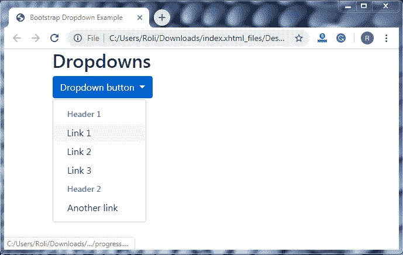

**下拉位置-**我们还可以根据需要将箭头/插入符号的位置设置在左侧或右侧。箭头/插入符号的位置将根据课程自动改变，但是下拉菜单将始终保持在右边。如果我们创建 dropleft 菜单，那么箭头/插入符号将位于下拉按钮的左侧(文本之前)，如果我们创建 dropright 菜单，那么箭头/插入符号将位于下拉按钮的右侧(文本之后)。

*   添加**。随着**向右**。dropdown** 类添加到< div >元素，那么下拉箭头/插入符号将出现在右边。
*   添加**。随着**一起离开**级。dropdown** 类添加到< div >元素，那么下拉箭头/插入符号将出现在左边。

**例子**

**这个例子显示了右下箭头/插入符号的位置:**

```
<!DOCTYPE html>
 <html lang="en">
 <head>
   <title>Bootstrap Dropdown Example</title>
   <meta charset="utf-8">
   <meta name="viewport" content="width=device-width, initial-scale=1">
   <link rel="stylesheet" href="https://maxcdn.bootstrapcdn.com/bootstrap/4.4.1/css/bootstrap.min.css">
 </head>
 <div class="container"> 
   <h2>Dropdowns</h2>
   <div class="dropdown dropright">
     <button type="button" class="btn btn-primary dropdown-toggle" data-toggle="dropdown">
       Dropright button
     </button>
     <div class="dropdown-menu">
       <a class="dropdown-item" href="#">Link 1</a> 
       <a class="dropdown-item" href="#">Link 2</a>
       <a class="dropdown-item" href="#">Link 3</a>
     </div>
   </div>
 </div>
   <script src="https://ajax.googleapis.com/ajax/libs/jquery/3.4.1/jquery.min.js"></script>
   <script src="https://cdnjs.cloudflare.com/ajax/libs/popper.js/1.16.0/umd/popper.min.js"></script> 
   <script src="https://maxcdn.bootstrapcdn.com/bootstrap/4.4.1/js/bootstrap.min.js"></script>
 </body>
 </html> 
```

**输出**

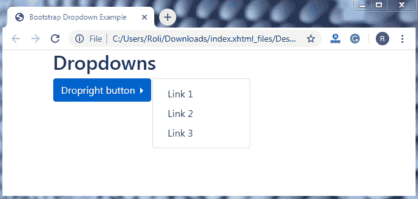

**此示例显示左箭头/插入符号位置:**

```
<!DOCTYPE html>
 <html lang="en">
 <head>
   <title>Bootstrap Dropdown Example</title>
   <meta charset="utf-8">
   <meta name="viewport" content="width=device-width, initial-scale=1">
   <link rel="stylesheet" href="https://maxcdn.bootstrapcdn.com/bootstrap/4.4.1/css/bootstrap.min.css">
 </head> 
 <div class="container">
   <h2>Dropdowns</h2>
   <div class="dropdown dropleft">
     <button type="button" class="btn btn-primary dropdown-toggle" data-toggle="dropdown">
       Dropleft button
     </button>
     <div class="dropdown-menu"> 
       <a class="dropdown-item" href="#">Link 1</a>
       <a class="dropdown-item" href="#">Link 2</a>
       <a class="dropdown-item" href="#">Link 3</a>
     </div>
   </div>
 </div> 
   <script src="https://ajax.googleapis.com/ajax/libs/jquery/3.4.1/jquery.min.js"></script>
   <script src="https://cdnjs.cloudflare.com/ajax/libs/popper.js/1.16.0/umd/popper.min.js"></script>
   <script src="https://maxcdn.bootstrapcdn.com/bootstrap/4.4.1/js/bootstrap.min.js"></script>
 </body>
 </html> 
```

**输出**

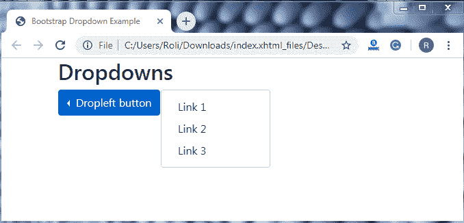

**下拉菜单右/左对齐-** 下拉菜单左/右对齐与下拉位置类似，但不同的是**箭头/插入符号**将始终位于**下拉按钮的**右**侧。**我们只改变下拉菜单的左对齐或右对齐。

*   添加**。drop-menu-right**类将下拉菜单在右边对齐。

**例子**

```
<!DOCTYPE html>
 <html lang="en">
 <head>
   <title>Bootstrap Dropdown Example</title>
   <meta charset="utf-8">
   <meta name="viewport" content="width=device-width, initial-scale=1">
   <link rel="stylesheet" href="https://maxcdn.bootstrapcdn.com/bootstrap/4.4.1/css/bootstrap.min.css">
 </head> 
 <div class="container">
   <h2>Dropdowns</h2>
   <div class="dropdown">
     <button type="button" class="btn btn-primary dropdown-toggle" data-toggle="dropdown">
       Dropdown button (for right alignment of dropdown menu)
     </button>
     <div class="dropdown-menu dropdown-menu-right">
       <a class="dropdown-item" href="#">Link 1</a> 
       <a class="dropdown-item" href="#">Link 2</a>
       <a class="dropdown-item" href="#">Link 3</a>
     </div>
   </div>
 </div> 
 <script src="https://ajax.googleapis.com/ajax/libs/jquery/3.4.1/jquery.min.js"></script>
   <script src="https://cdnjs.cloudflare.com/ajax/libs/popper.js/1.16.0/umd/popper.min.js"></script>
   <script src="https://maxcdn.bootstrapcdn.com/bootstrap/4.4.1/js/bootstrap.min.js"></script>
 </body>
 </html> 
```

**输出**

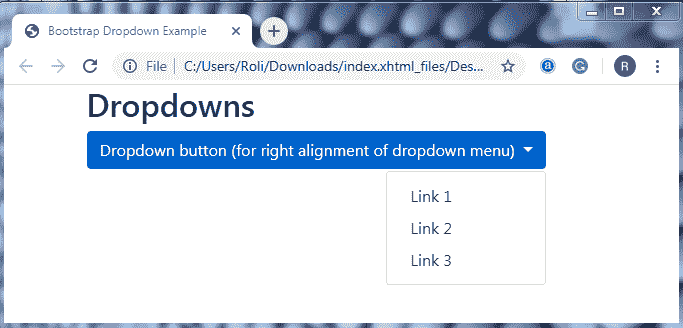

*   添加**。用于在左侧对齐下拉菜单的类。**

**例子**

```
<!DOCTYPE html>
 <html lang="en">
 <head>
   <title>Bootstrap Dropdown Example</title>
   <meta charset="utf-8">
   <meta name="viewport" content="width=device-width, initial-scale=1">
   <link rel="stylesheet" href="https://maxcdn.bootstrapcdn.com/bootstrap/4.4.1/css/bootstrap.min.css"> 
 </head>
 <div class="container">
   <h2>Dropdowns</h2>
   <div class="dropdown">
     <button type="button" class="btn btn-primary dropdown-toggle" data-toggle="dropdown">
       Dropdown button (for left alignment of dropdown menu)
     </button>
     <div class="dropdown-menu dropdown-menu-left"> 
       <a class="dropdown-item" href="#">Link 1</a>
       <a class="dropdown-item" href="#">Link 2</a>
       <a class="dropdown-item" href="#">Link 3</a>
     </div>
   </div>
 </div>
   <script src="https://ajax.googleapis.com/ajax/libs/jquery/3.4.1/jquery.min.js"></script> 
   <script src="https://cdnjs.cloudflare.com/ajax/libs/popper.js/1.16.0/umd/popper.min.js"></script>
   <script src="https://maxcdn.bootstrapcdn.com/bootstrap/4.4.1/js/bootstrap.min.js"></script>
 </body>
 </html> 
```

**输出**

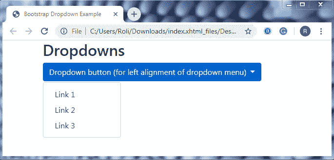

**Dropup–**当我们想让下拉菜单向上而不是向下打开时，可以使用 drop up。要创建下拉菜单，我们必须使用**。放弃**级而不是**。下拉**类到 **< div >** 元素。

**例子**

```
<!DOCTYPE html>
 <html lang="en">
 <head>
   <title>Bootstrap Dropdown Example</title>
   <meta charset="utf-8">
   <meta name="viewport" content="width=device-width, initial-scale=1">
   <link rel="stylesheet" href="https://maxcdn.bootstrapcdn.com/bootstrap/4.4.1/css/bootstrap.min.css"> 
 </head>
 <div class="container">
   <h2>Dropdowns</h2><br><br><br><br>
   <div class="dropup">
     <button type="button" class="btn btn-primary dropdown-toggle" data-toggle="dropdown">
       Dropup button
     </button>
     <div class="dropdown-menu">
       <a class="dropdown-item" href="#">Link 1</a>
       <a class="dropdown-item" href="#">Link 2</a>
     </div>
   </div> 
 </div>
   <script src="https://ajax.googleapis.com/ajax/libs/jquery/3.4.1/jquery.min.js"></script>
   <script src="https://cdnjs.cloudflare.com/ajax/libs/popper.js/1.16.0/umd/popper.min.js"></script>
   <script src="https://maxcdn.bootstrapcdn.com/bootstrap/4.4.1/js/bootstrap.min.js"></script>
 </body>
 </html> 
```

**输出**

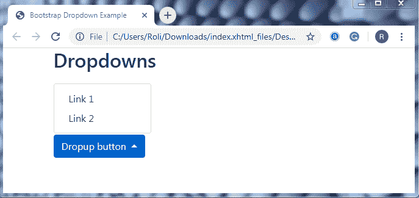

**下拉文本—**在下拉文本中，我们可以向下拉菜单添加简单的文本。我们还可以提供基本样式的文本链接。用于向下拉菜单添加纯文本的类是**。下拉项目文本**。

**例子**

```
<!DOCTYPE html>
 <html lang="en">
 <head>
   <title>Bootstrap Dropdown Example</title>
   <meta charset="utf-8">
   <meta name="viewport" content="width=device-width, initial-scale=1">
   <link rel="stylesheet" href="https://maxcdn.bootstrapcdn.com/bootstrap/4.4.1/css/bootstrap.min.css">
 </head>
 <div class="container">
   <h2>Dropdowns</h2>
   <div class="dropdown">
     <button type="button" class="btn btn-primary dropdown-toggle" data-toggle="dropdown">
       Dropdown button
     </button> 
   <script src="https://cdnjs.cloudflare.com/ajax/libs/popper.js/1.16.0/umd/popper.min.js"></script>
   <script src="https://maxcdn.bootstrapcdn.com/bootstrap/4.4.1/js/bootstrap.min.js"></script>
 </body>
 </html> 
```

**输出**

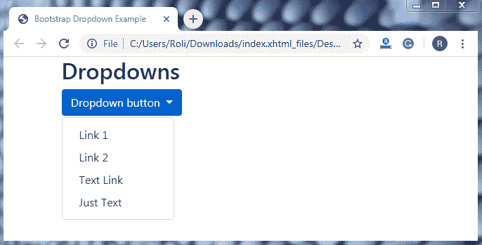

**带下拉菜单的分组按钮—**我们可以通过添加一系列按钮和下拉菜单来创建水平/垂直分组按钮。**。btn-group** 类用于创建分组按钮和**。下拉菜单**类用于创建下拉菜单。

**示例—**用于带有下拉菜单的水平分组按钮。

```
<!DOCTYPE html>
 <html lang="en">
 <head>
   <title>Bootstrap Dropdown Example</title>
   <meta charset="utf-8">
   <meta name="viewport" content="width=device-width, initial-scale=1">
   <link rel="stylesheet" href="https://maxcdn.bootstrapcdn.com/bootstrap/4.4.1/css/bootstrap.min.css"> 
 </head>
 <div class="container">
   <h2>Button Groups</h2>
   <div class="btn-group">
     <button type="button" class="btn btn-primary">button 1</button>
     <button type="button" class="btn btn-primary">Button 2</button>
     <div class="btn-group"> 
       <button type="button" class="btn btn-primary dropdown-toggle" data-toggle="dropdown">
       Dropdown button
       </button>
       <div class="dropdown-menu">
         <a class="dropdown-item" href="#">Tablet</a>
         <a class="dropdown-item" href="#">Smartphone</a>
       </div>
     </div> 
   </div>
 </div>
   <script src="https://ajax.googleapis.com/ajax/libs/jquery/3.4.1/jquery.min.js"></script>
   <script src="https://cdnjs.cloudflare.com/ajax/libs/popper.js/1.16.0/umd/popper.min.js"></script>
   <script src="https://maxcdn.bootstrapcdn.com/bootstrap/4.4.1/js/bootstrap.min.js"></script>
 </body>
 </html> 
```

**输出**

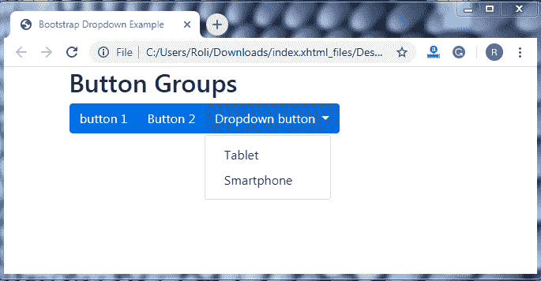

**示例—**用于带有下拉菜单的垂直分组按钮。

```
<!DOCTYPE html>
 <html lang="en">
 <head>
   <title>Bootstrap Dropdown Example</title>
   <meta charset="utf-8">
   <meta name="viewport" content="width=device-width, initial-scale=1">
   <link rel="stylesheet" href="https://maxcdn.bootstrapcdn.com/bootstrap/4.4.1/css/bootstrap.min.css"> 
 </head>
 <div class="container">
   <h2>Vertical Button Group with Dropdown</h2>
   <div class="btn-group-vertical">
     <button type="button" class="btn btn-primary">Button 1</button>
     <button type="button" class="btn btn-primary">Button 2</button> 
     <div class="btn-group">
       <button type="button" class="btn btn-primary dropdown-toggle" data-toggle="dropdown">
         Dropdown Button
       </button>
       <div class="dropdown-menu">
         <a class="dropdown-item" href="#">Tablet</a>
         <a class="dropdown-item" href="#">Smartphone</a> 
       </div>
     </div>
   </div>
 </div>
   <script src="https://ajax.googleapis.com/ajax/libs/jquery/3.4.1/jquery.min.js"></script>
   <script src="https://cdnjs.cloudflare.com/ajax/libs/popper.js/1.16.0/umd/popper.min.js"></script>
   <script src="https://maxcdn.bootstrapcdn.com/bootstrap/4.4.1/js/bootstrap.min.js"></script> 
 </body>
 </html> 
```

**输出**

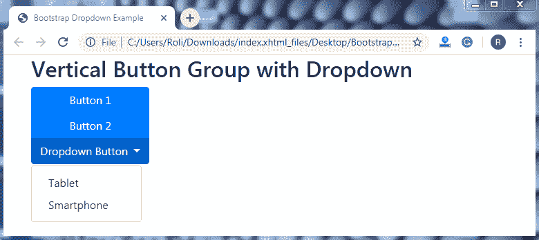