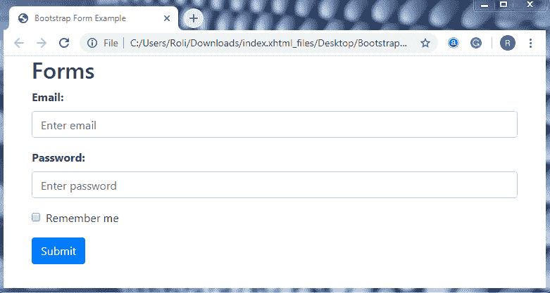
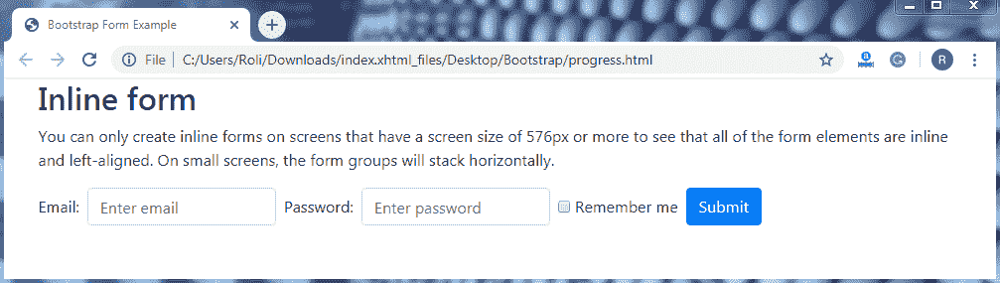
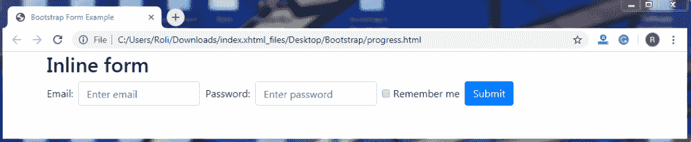
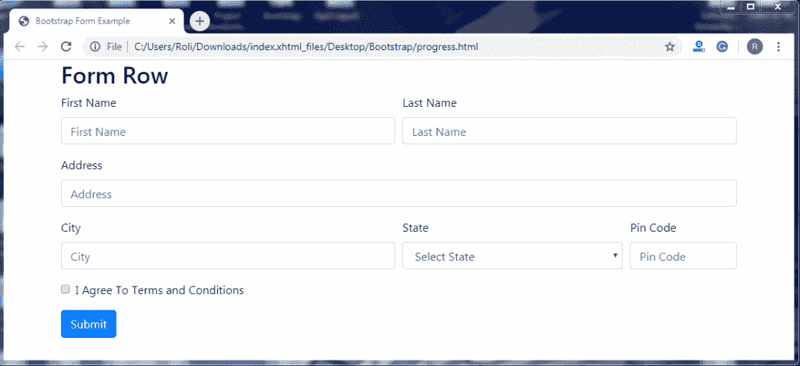
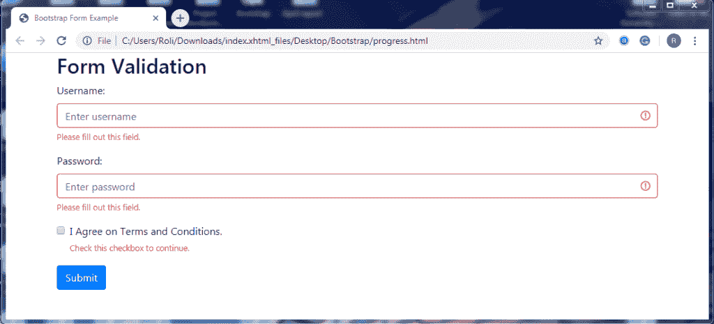

# 引导程序 4 表单

> 原文：<https://www.tutorialandexample.com/bootstrap-form/>

**Bootstrap 4 表单**

Bootstrap 4 提供了表单，表单是网页和 web 应用程序的基本组件之一。它是一个基于输入的组件，用于在输入字段、复选框等的帮助下收集用户数据。

Bootstrap 4 提供了一些类，在它们的帮助下，我们可以轻松地定制表单。我们还可以改变表单控件(如标签、输入、选择框、文本区域等)的样式和对齐方式。)在引导实用程序的帮助下。

### 如何创建表单

*   要创建一个表单，你必须将所有的元素放在表单的**<>**元素中。
*   添加类别**。form-group** 类为每个 **< div >** 元素提供结构。**。form-group** 类有助于保持元素的顺序，并为组提供边距。
*   添加**。表单控件**类向 **<输入>** 元素。该类覆盖了其父类的整个宽度。

**例子**

这个例子展示了如何创建基本的引导表单。

```
<!DOCTYPE html>
 <html lang="en">
 <head>
   <title>Bootstrap Form Example</title>
   <meta charset="utf-8">
   <meta name="viewport" content="width=device-width, initial-scale=1">
   <link rel="stylesheet" href="https://maxcdn.bootstrapcdn.com/bootstrap/4.4.1/css/bootstrap.min.css">
 </head>
 <div class="container"> 
   <h2>Forms</h2>
   <form action="/action_page.php">
     <div class="form-group">
       <label for="email"><strong>Email:</strong></label>
       <input type="email" class="form-control" id="email" placeholder="Enter email" name="email">
     </div>
     <div class="form-group">
       <label for="pwd"><strong>Password:</strong></label>
       <input type="password" class="form-control" id="pwd" placeholder="Enter password" name="pswd">
     </div>
     <div class="form-group form-check"> 
       <label class="form-check-label">
         <input class="form-check-input" type="checkbox" name="remember"> Remember me
       </label>
     </div>
     <button type="submit" class="btn btn-primary">Submit</button>
   </form>
 </div>
   <script src="https://ajax.googleapis.com/ajax/libs/jquery/3.4.1/jquery.min.js"></script>
   <script src="https://cdnjs.cloudflare.com/ajax/libs/popper.js/1.16.0/umd/popper.min.js"></script>
   <script src="https://maxcdn.bootstrapcdn.com/bootstrap/4.4.1/js/bootstrap.min.js"></script> 
 </body>
 </html> 
```

**输出**



内联表单 **-** Bootstrap 4 提供了一些预定义的类，帮助你在一行中创建表单。在内嵌表单中，所有标签和输入字段都在一行中，并且左对齐。要创建一个内嵌表单，你必须添加**。form-inline** 类到 **< form >** 元素。

 ****注意:您只能在屏幕尺寸为 576 像素或更大的屏幕上创建嵌入式表单。否则，这将看起来像一个基本的形式。**

**例子**

这个例子展示了如何创建内嵌表单。

```
<!DOCTYPE html>
 <html lang="en">
 <head>
   <title>Bootstrap Form Example</title>
   <meta charset="utf-8">
   <meta name="viewport" content="width=device-width, initial-scale=1">
   <link rel="stylesheet" href="https://maxcdn.bootstrapcdn.com/bootstrap/4.4.1/css/bootstrap.min.css">
 </head>
 <div class="container">
   <h2>Inline form</h2>
   <p>You can only create inline forms on screens that have a screen size of 576px or more to see that all of the form elements are inline and left-aligned. On small screens, the form groups will stack horizontally.</p>
   <form class="form-inline" action="/action_page.php">
     <label for="email2" class="mb-2 mr-sm-2">Email:</label>
     <input type="text" class="form-control mb-2 mr-sm-2" id="email2" placeholder="Enter email" name="email">
     <label for="pwd2" class="mb-2 mr-sm-2">Password:</label> 
     <input type="text" class="form-control mb-2 mr-sm-2" id="pwd2" placeholder="Enter password" name="pswd">
     <div class="form-check mb-2 mr-sm-2">
       <label class="form-check-label">
         <input type="checkbox" class="form-check-input" name="remember"> Remember me
       </label>
     </div>    
     <button type="submit" class="btn btn-primary mb-2">Submit</button>
   </form>
 </div>
   <script src="https://ajax.googleapis.com/ajax/libs/jquery/3.4.1/jquery.min.js"></script>
   <script src="https://cdnjs.cloudflare.com/ajax/libs/popper.js/1.16.0/umd/popper.min.js"></script>
   <script src="https://maxcdn.bootstrapcdn.com/bootstrap/4.4.1/js/bootstrap.min.js"></script>
 </body>
 </html> 
```

**输出**



**带实用程序的内嵌表单—**在内嵌表单中，没有默认间距。因此，bootstrap 4 提供了一些用于在表单中分隔元素的实用程序。

*   添加**。mr-sm-2** 类为每个输入和每个屏幕尺寸提供**右边距**。
*   添加 **.mb2** 类，为每个输入字段提供**边距底部**。

**例子**

```
<!DOCTYPE html>
 <html lang="en">
 <head>
   <title>Bootstrap Form Example</title>
   <meta charset="utf-8">
   <meta name="viewport" content="width=device-width, initial-scale=1">
   <link rel="stylesheet" href="https://maxcdn.bootstrapcdn.com/bootstrap/4.4.1/css/bootstrap.min.css">
 </head>
 <div class="container">
   <h2>Inline form</h2>
   <form class="form-inline" action="/action_page.php">
     <label for="email2" class="mb-2 mr-sm-2">Email:</label>
     <input type="text" class="form-control mb-2 mr-sm-2" id="email2" placeholder="Enter email" name="email"> 
     <label for="pwd2" class="mb-2 mr-sm-2">Password:</label>
     <input type="text" class="form-control mb-2 mr-sm-2" id="pwd2" placeholder="Enter password" name="pswd">
     <div class="form-check mb-2 mr-sm-2">
       <label class="form-check-label">
         <input type="checkbox" class="form-check-input" name="remember"> Remember me
       </label>
     </div>    
     <button type="submit" class="btn btn-primary mb-2">Submit</button>
   </form>
 </div>
  <script src="https://ajax.googleapis.com/ajax/libs/jquery/3.4.1/jquery.min.js"></script>
   <script src="https://cdnjs.cloudflare.com/ajax/libs/popper.js/1.16.0/umd/popper.min.js"></script>
   <script src="https://maxcdn.bootstrapcdn.com/bootstrap/4.4.1/js/bootstrap.min.js"></script>
 </body>
 </html> 
```

**输出**



**带行的表格网格–**Bootstrap 4 提供了一些预定义的类，用于设计表格网格或复杂表格。复杂表单的布局由几列组成，每列都有不同的宽度和不同的对齐方式。

要创建表单组，

*   你得加上**。将**类排到< div >元素中。
*   添加**。col** 类到**内的 **< div >** 元素。排**班。

**。col** 类用于控制表单宽度和表单输入的对齐，而不使用间距工具。

**例子**

```
<!DOCTYPE html>
 <html lang="en">
 <head>
   <title>Bootstrap Form Example</title>
   <meta charset="utf-8">
   <meta name="viewport" content="width=device-width, initial-scale=1">
   <link rel="stylesheet" href="https://maxcdn.bootstrapcdn.com/bootstrap/4.4.1/css/bootstrap.min.css">
 </head>
 <body>
       <div class = "container">
          <form>
             <h2>Form Row</h2>
             <div class = "form-row">
                <div class = "form-group col-md-6">
                   <label for = "inputEmail4">First Name</label>
                   <input type = "text" class =" form-control" 
                      id = "inputEmail4" placeholder = "First Name">
                </div>
                <div class = "form-group col-md-6">
                   <label for = "inputPassword4">Last Name</label>
                   <input type = "text" class = "form-control" 
                      id = "inputPassword4" placeholder = "Last Name">
                </div>
             </div>
             <div class = "form-group">
                <label for = "inputAddress">Address</label> 
                <input type = "text" class = "form-control" id = "inputAddress" 
                   placeholder = "Address">
             </div>
             <div class = "form-row">
                <div class = "form-group col-md-6">
                   <label for = "inputCity">City</label>
                   <input type = "text" class = "form-control" placeholder = "City" 
                      id = "inputCity">
                </div>
                <div class = "form-group col-md-4">
                   <label for = "inputState">State</label>
                   <select id = "inputState" class = "form-control">
                      <option selected disabled>Select State</option>
                      <option>Uttar Pradesh</option>
                      <option>Uttrakhand</option>
                   </select>
                </div> 
                <div class = "form-group col-md-2">
                   <label for = "inputZip">Pin Code</label>
                   <input type = "text" class = "form-control" id = "inputZip" 
                      placeholder = "Pin Code">
                </div>
             </div>
             <div class = "form-group">
                <div class = "form-check">
                   <input class = "form-check-input" type = "checkbox" id = "gridCheck" >
                   <label class = "form-check-label" for = "gridCheck">
                      I Agree To Terms and Conditions
                   </label>
                </div>
             </div>
             <button type = "submit" class = "btn btn-primary">Submit</button>
          </form>
       </div>
   <script src="https://ajax.googleapis.com/ajax/libs/jquery/3.4.1/jquery.min.js"></script>
   <script src="https://cdnjs.cloudflare.com/ajax/libs/popper.js/1.16.0/umd/popper.min.js"></script>
   <script src="https://maxcdn.bootstrapcdn.com/bootstrap/4.4.1/js/bootstrap.min.js"></script>
 </body>
 </html> 
```

**输出**



**表单验证—**您可以在客户端轻松验证表单。表单验证用于向用户提供有价值的反馈或实现自定义消息。

**使用 bootstrap 实现表单验证的步骤如下:**

添加**。如果您想在表单提交之前提供反馈通知，请将经过验证的**类添加到 **<表单>** 元素。

或者

添加**。如果您想在表单提交后提供反馈通知，需要将验证类**传递给 **<表单>** 元素。

如果有一些字段需要用户在提交表单前填写。在这种情况下，您可以使用**。有效反馈**类或**。无效反馈**类。这些类向用户提供了关于必须填写的字段的消息。有效字段显示为**绿色，**或者无效或空白字段显示为**红色。**

**例子**

这个例子展示了使用**的表单验证。被验证的**类。

```
<!DOCTYPE html>
 <html lang="en">
 <head>
   <title>Bootstrap Form Example</title>
   <meta charset="utf-8">
   <meta name="viewport" content="width=device-width, initial-scale=1">
   <link rel="stylesheet" href="https://maxcdn.bootstrapcdn.com/bootstrap/4.4.1/css/bootstrap.min.css">
 </head>
 <body>
      <div class="container">
   <h2>Form Validation</h2>
   <form action="/action_page.php" class="was-validated">
     <div class="form-group">
       <label for="uname">Username:</label>
       <input type="text" class="form-control" id="uname" placeholder="Enter username" name="uname" required>
       <div class="valid-feedback">Valid.</div> 
       <div class="invalid-feedback">Please fill out this field.</div>
     </div>
     <div class="form-group">
       <label for="pwd">Password:</label>
       <input type="password" class="form-control" id="pwd" placeholder="Enter password" name="pswd" required>
       <div class="valid-feedback">Valid.</div> 
       <div class="invalid-feedback">Please fill out this field.</div>
     </div>
     <div class="form-group form-check">
       <label class="form-check-label">
         <input class="form-check-input" type="checkbox" name="remember" required> I Agree on Terms and Conditions.
         <div class="valid-feedback">Valid.</div>
         <div class="invalid-feedback">Check this checkbox to continue.</div>
       </label>
     </div>
     <button type="submit" class="btn btn-primary">Submit</button>
   </form>
 </div>
   <script src="https://ajax.googleapis.com/ajax/libs/jquery/3.4.1/jquery.min.js"></script> 
   <script src="https://cdnjs.cloudflare.com/ajax/libs/popper.js/1.16.0/umd/popper.min.js"></script>
   <script src="https://maxcdn.bootstrapcdn.com/bootstrap/4.4.1/js/bootstrap.min.js"></script>
 </body>
 </html> 
```

**输出**

**