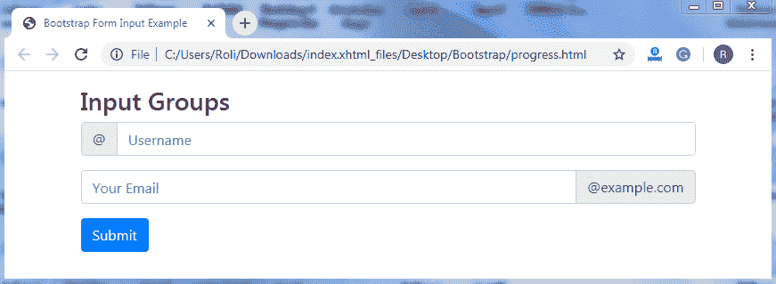
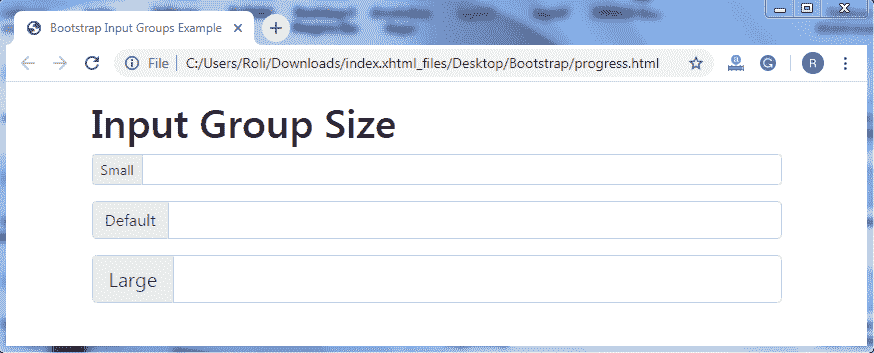
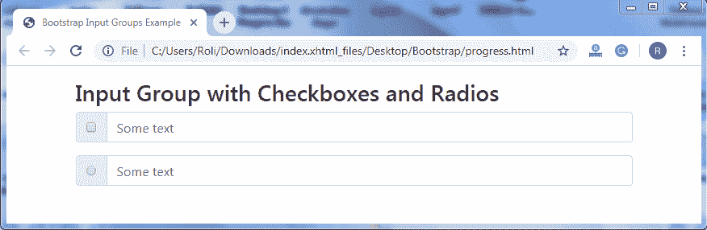
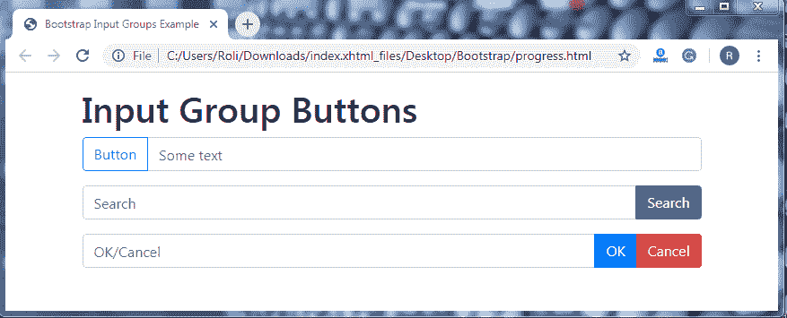
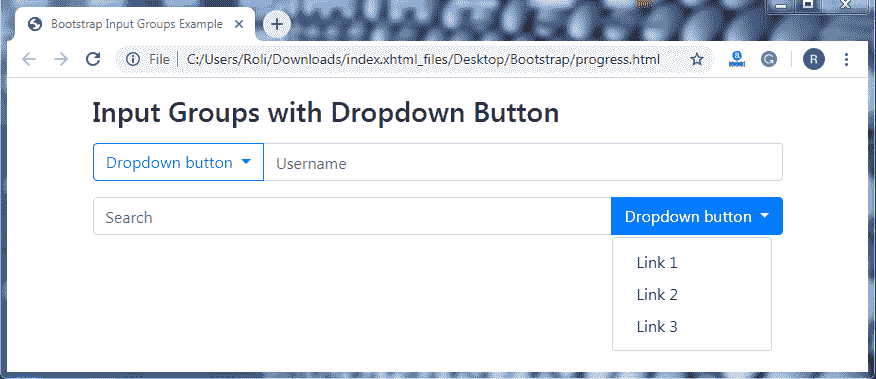
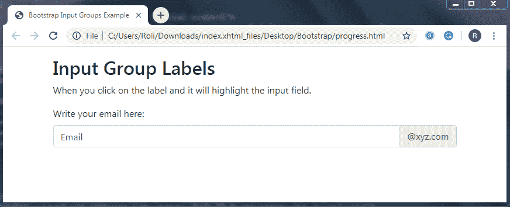
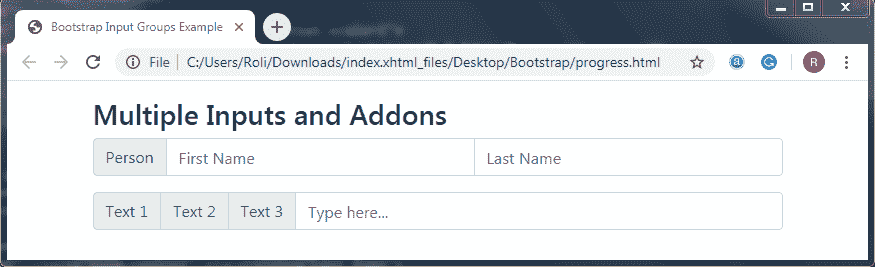

# 引导输入组

> 原文：<https://www.tutorialandexample.com/bootstrap-input-groups/>

**引导 4 个输入组**

输入组是 Bootstrap 4 的一个组件，用于创建交互式的、时尚的表单控件。在输入组的帮助下，您可以轻松地定制输入字段。它通过在输入字段的两端添加图标、文本、按钮和按钮组来为表单控件提供样式。

Bootstrap 提供了两个预定义的类，用于在输入字段的两侧添加样式组件；这些类别是:

*   **。input-group-prepend**T2 类
*   **。输入-分组-追加** **类**

**创建前置和附加输入的步骤**

*   添加**。将 group** 类输入到 **< div >** 元素中。这个类充当一个容器，通过添加图标、文本、按钮等来增强输入字段。
*   添加**。input-group-prepend 将**类添加到 **< div >** 元素中，以将附加组件放在输入字段的开头。

**或**

*   添加**。input-group-append** 类到 **< div >** 元素，将附加组件放在输入字段的末尾。
*   添加**。input-group-text** 类向 **< span >** 元素提供样式。

**注意:**如果你想给输入组提供一个合适的底部边距，那么使用 **mb-3** 实用程序。

**例子**

```
<!DOCTYPE html>
 <html lang="en">
 <head>
   <title>Bootstrap Input Groups Example</title>
   <meta charset="utf-8">
   <meta name="viewport" content="width=device-width, initial-scale=1">
   <link rel="stylesheet" href="https://maxcdn.bootstrapcdn.com/bootstrap/4.4.1/css/bootstrap.min.css">
 </head>
 <body> 
 <div class="container mt-3">
   <h3>Input Groups</h3>
   <form action="/action_page.php">
     <div class="input-group mb-3">
       <div class="input-group-prepend">
         @ 
       </div>
       <input type="text" class="form-control" placeholder="Username" id="usr" name="username">
     </div>
     <div class="input-group mb-3">
       <input type="text" class="form-control" placeholder="Your Email" id="mail" name="email">
       <div class="input-group-append"> 
         @example.com
       </div>
     </div>
     <button type="submit" class="btn btn-primary">Submit</button>
   </form>
 </div> 
   <script src="https://ajax.googleapis.com/ajax/libs/jquery/3.4.1/jquery.min.js"></script>
   <script src="https://cdnjs.cloudflare.com/ajax/libs/popper.js/1.16.0/umd/popper.min.js"></script>
   <script src="https://maxcdn.bootstrapcdn.com/bootstrap/4.4.1/js/bootstrap.min.js"></script>
 </body>
 </html> 
```

**输出**



**输入组大小-** 您也可以根据需要定制输入组的大小。Bootstrap 4 提供了两个用于调整输入组大小的类。这些阶层是**。输入-组-sm** 类和**。input-group-lg** 类。

要调整输入组的大小，

*   添加**。input-group-sm** 类以及。input-group 类向 **< div >** 元素创建小的输入组。
*   添加**。input-group-lg** 类连同**。将 input-group** 类添加到 **< div >** 元素中，以创建大型输入组。

**例子**

```
<!DOCTYPE html>
 <html lang="en">
 <head>
   <title>Bootstrap Input Groups Example</title>
   <meta charset="utf-8">
   <meta name="viewport" content="width=device-width, initial-scale=1">
   <link rel="stylesheet" href="https://maxcdn.bootstrapcdn.com/bootstrap/4.4.1/css/bootstrap.min.css"> 
 </head>
 <body>
 <div class="container mt-3">
   <h1>Input Group Size</h1>
   <form>
     <div class="input-group mb-3 input-group-sm">
       <div class="input-group-prepend">
         Small 
       </div>
       <input type="text" class="form-control">
     </div>
   </form>
   <form>
     <div class="input-group mb-3">
       <div class="input-group-prepend"> 
         Default
       </div>
       <input type="text" class="form-control">
     </div>
   </form>
   <form>
     <div class="input-group mb-3 input-group-lg"> 
       <div class="input-group-prepend">
         Large
       </div>
       <input type="text" class="form-control">
     </div>
   </form>
 </div> 
   <script src="https://ajax.googleapis.com/ajax/libs/jquery/3.4.1/jquery.min.js"></script>
   <script src="https://cdnjs.cloudflare.com/ajax/libs/popper.js/1.16.0/umd/popper.min.js"></script>
   <script src="https://maxcdn.bootstrapcdn.com/bootstrap/4.4.1/js/bootstrap.min.js"></script>
 </body>
 </html> 
```

**输出**



**带复选框和单选按钮的输入组—**您也可以将复选框和单选按钮而不是图标和文本放在输入组的开头和结尾。

**例子**

```
<!DOCTYPE html>
 <html lang="en">
 <head>
   <title>Bootstrap Input Groups Example</title>
   <meta charset="utf-8">
   <meta name="viewport" content="width=device-width, initial-scale=1">
   <link rel="stylesheet" href="https://maxcdn.bootstrapcdn.com/bootstrap/4.4.1/css/bootstrap.min.css">
 </head> 
 <body>
 <div class="container mt-3">
   <h3>Input Group with Checkboxes and Radios</h3>
   <form>
     <div class="input-group mb-3">
       <div class="input-group-prepend">
         <div class="input-group-text"> 
           <input type="checkbox"> 
         </div>
       </div>
       <input type="text" class="form-control" placeholder="Some text">
     </div>
   </form>
   <form>
     <div class="input-group mb-3">
       <div class="input-group-prepend"> 
         <div class="input-group-text">
           <input type="radio"> 
         </div>
       </div>
       <input type="text" class="form-control" placeholder="Some text">
     </div>
   </form>
 </div> 
   <script src="https://ajax.googleapis.com/ajax/libs/jquery/3.4.1/jquery.min.js"></script>
   <script src="https://cdnjs.cloudflare.com/ajax/libs/popper.js/1.16.0/umd/popper.min.js"></script>
   <script src="https://maxcdn.bootstrapcdn.com/bootstrap/4.4.1/js/bootstrap.min.js"></script>
 </body>
 </html> 
```

**输出**



**输入组按钮—**您也可以根据需要在输入组的开头和结尾添加按钮，而不是文本和图标。

要在输入字段的开头创建输入组按钮，您需要添加**。将**类添加到 **< div >** 元素中。加上**。btn** 类连同**上下文** **按钮**类到 **<按钮>** 元素。

要在输入字段的末尾创建输入组按钮，您需要添加**。input-group-append** 类到 **< div >** 元素。加上**。btn** 类连同**上下文** **按钮**类到 **<按钮>** 元素。

**注意:**您可以通过添加<按钮>元素及其类来一次创建多个按钮。

**例子**

```
<!DOCTYPE html>
 <html lang="en">
 <head>
   <title>Bootstrap Input Groups Example</title>
   <meta charset="utf-8">
   <meta name="viewport" content="width=device-width, initial-scale=1">
   <link rel="stylesheet" href="https://maxcdn.bootstrapcdn.com/bootstrap/4.4.1/css/bootstrap.min.css"> 
 </head>
 <body>
 <div class="container mt-3">
   <h1>Input Group Buttons</h1>
   <div class="input-group mb-3">
     <div class="input-group-prepend">
       <button class="btn btn-outline-primary" type="button">Button</button>  
     </div> 
   <div class="input-group mb-3">
     <input type="text" class="form-control" placeholder="OK/Cancel">
     <div class="input-group-append">
       <button class="btn btn-primary" type="button">OK</button>  
       <button class="btn btn-danger" type="button">Cancel</button>  
      </div>
   </div>
 </div>
   <script src="https://ajax.googleapis.com/ajax/libs/jquery/3.4.1/jquery.min.js"></script> 
   <script src="https://cdnjs.cloudflare.com/ajax/libs/popper.js/1.16.0/umd/popper.min.js"></script>
   <script src="https://maxcdn.bootstrapcdn.com/bootstrap/4.4.1/js/bootstrap.min.js"></script>
 </body>
 </html> 
```

**输出**



**带下拉按钮的输入组—**下拉按钮也可以添加到输入栏的任何一侧。如果您想为用户提供选项/选择，或者您想使用按钮执行多项任务，可以在输入字段中使用下拉菜单。

要创建带有下拉按钮的输入组，首先通过添加 **<按钮>** 元素和**来创建一个按钮。btn** 类和**上下文按钮**类。然后加上**。下拉菜单**类到 **< div >** 元素。并且加上了**。dropdown-item** 类到 **< a >** 元素，用于创建下拉链接。

**注意:**不需要添加。作为包装类的下拉类。

**例子**

```
<!DOCTYPE html>
 <html lang="en">
 <head>
   <title>Bootstrap Input Groups Example</title>
   <meta charset="utf-8">
   <meta name="viewport" content="width=device-width, initial-scale=1">
   <link rel="stylesheet" href="https://maxcdn.bootstrapcdn.com/bootstrap/4.4.1/css/bootstrap.min.css">
 </head> 
 <body>
 <div class="container mt-3">
   <h3>Input Groups with Dropdown Button</h3>
   <form>
     <div class="input-group mt-3 mb-3">
       <div class="input-group-prepend">
         <button type="button" class="btn btn-outline-primary dropdown-toggle" data-toggle="dropdown"> 
           Dropdown button
         </button>
         <div class="dropdown-menu">
           <a class="dropdown-item" href="#">Link 1</a>
           <a class="dropdown-item" href="#">Link 2</a>
           <a class="dropdown-item" href="#">Link 3</a>
         </div> 
       </div>
       <input type="text" class="form-control" placeholder="Username">
     </div>
     <div class="input-group mb-3">
       <input type="text" class="form-control" placeholder="Search">
         <div class="input-group-append">
           <button type="button" class="btn btn-outline-primary dropdown-toggle" data-toggle="dropdown"> 
           Dropdown button
           </button>
           <div class="dropdown-menu">
             <a class="dropdown-item" href="#">Link 1</a>
             <a class="dropdown-item" href="#">Link 2</a>
             <a class="dropdown-item" href="#">Link 3</a>
           </div>  
         </div> 
     </div>
   </form>
   <script src="https://ajax.googleapis.com/ajax/libs/jquery/3.4.1/jquery.min.js"></script>
   <script src="https://cdnjs.cloudflare.com/ajax/libs/popper.js/1.16.0/umd/popper.min.js"></script>
   <script src="https://maxcdn.bootstrapcdn.com/bootstrap/4.4.1/js/bootstrap.min.js"></script>
 </body>
 </html> 
```

**输出**



**输入组标签–**Bootstrap 提供了一个类，帮助您在输入组之外添加标签。这些标签指定了用户希望在输入字段中输入的内容。

要在输入字段之外创建标签，您必须添加带有属性的**的 **<标签>** 元素。**

**注意:**标签>元素内属性的**值和 **<输入>** 元素内 **id** 属性的值必须相同。**

**例子**

```
<!DOCTYPE html>
 <html lang="en">
 <head>
   <title>Bootstrap Input Groups Example</title>
   <meta charset="utf-8">
   <meta name="viewport" content="width=device-width, initial-scale=1">
   <link rel="stylesheet" href="https://maxcdn.bootstrapcdn.com/bootstrap/4.4.1/css/bootstrap.min.css">
 </head>
 <body> 
         @xyz.com
       </div>
     </div>
   </form>
 </div>
   <script src="https://ajax.googleapis.com/ajax/libs/jquery/3.4.1/jquery.min.js"></script>
   <script src="https://cdnjs.cloudflare.com/ajax/libs/popper.js/1.16.0/umd/popper.min.js"></script>
   <script src="https://maxcdn.bootstrapcdn.com/bootstrap/4.4.1/js/bootstrap.min.js"></script>
 </body>
 </html> 
```



**输出**

 ****多个输入–**您还可以在一行中添加多个输入(并排),以及文本、图标、按钮等附件。

**例子**

```
<!DOCTYPE html>
 <html lang="en">
 <head>
   <title>Bootstrap Input Groups Example</title>
   <meta charset="utf-8">
   <meta name="viewport" content="width=device-width, initial-scale=1">
   <link rel="stylesheet" href="https://maxcdn.bootstrapcdn.com/bootstrap/4.4.1/css/bootstrap.min.css">
 </head>
 <body> 
 <div class="container mt-3">
   <h3>Multiple Inputs and Addons</h3>
   <form>
     <div class="input-group mb-3">
       <div class="input-group-prepend">
         Person
       </div>
       <input type="text" class="form-control" placeholder="First Name"> 
       <input type="text" class="form-control" placeholder="Last Name">
     </div>  
   </form>
   <form>
     <div class="input-group mb-3">
       <div class="input-group-prepend">
         Text 1
         Text 2 
         Text 3
       </div>
       <input type="text" class="form-control" placeholder="Type here...">
     </div>
   </form>
 </div>
   <script src="https://ajax.googleapis.com/ajax/libs/jquery/3.4.1/jquery.min.js"></script>
   <script src="https://cdnjs.cloudflare.com/ajax/libs/popper.js/1.16.0/umd/popper.min.js"></script> 
   <script src="https://maxcdn.bootstrapcdn.com/bootstrap/4.4.1/js/bootstrap.min.js"></script>
 </body>
 </html> 
```

**输出**

**