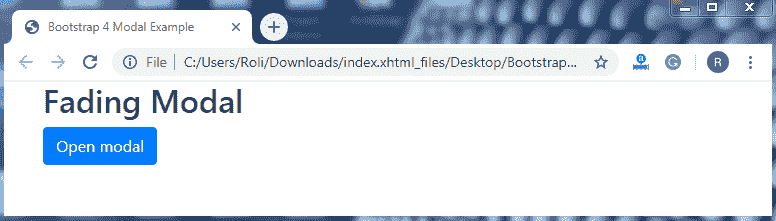
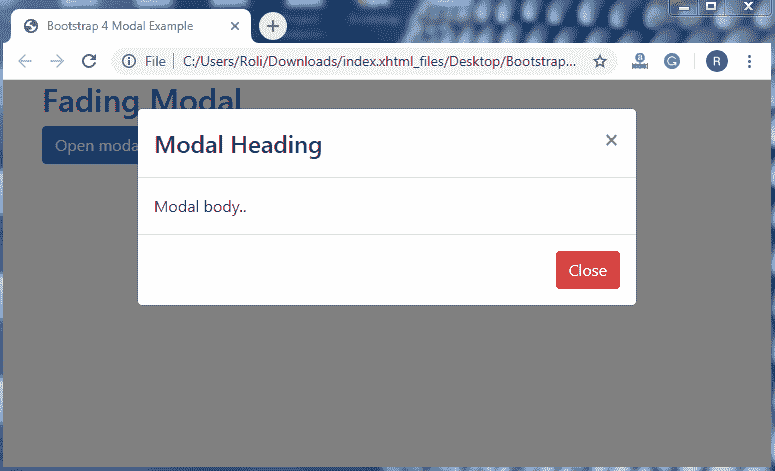

# 自举 4 模式

> 原文：<https://www.tutorialandexample.com/bootstrap-modal/>

**自举 4 模式**

**模态**是 Bootstrap 4 的一个组件，Bootstrap 4 是一个对话框或者弹出窗口。模态用于向用户提供信息或警告，例如给出关于会话超时的信息，或者在进行下一步之前要求确认关键操作。

bootstrap 4 模式出现在网页的顶部。使用引导模式插件创建模式。

**基本模态—**基本模态由**一个表头**、**消息体、**和带有一些动作按钮的页脚组成。**页眉**用于描述对话框的标题，**消息体**用于描述，而**页脚**由用于执行任务的动作按钮(如关闭按钮)组成。

**例子**

```
<!DOCTYPE html>
 <html lang="en">
 <head>
   <title>Bootstrap 4 Modal Example</title>
   <meta charset="utf-8">
   <meta name="viewport" content="width=device-width, initial-scale=1">
   <link rel="stylesheet" href="https://maxcdn.bootstrapcdn.com/bootstrap/4.4.1/css/bootstrap.min.css"> 
 </head>
 <body>
 <div class="container">
   <h2>Basic Modal</h2>
   <!—Modal Button -->
   <button type="button" class="btn btn-primary" data-toggle="modal" data-target="#myModal">
     Open modal 
   </button>
   <!-- The Modal -->
   <div class="modal" id="myModal">
     <div class="modal-dialog">
       <div class="modal-content">
         <!-- Modal Header -->
         <div class="modal-header"> 
           <h4 class="modal-title">Modal Heading</h4>
           <button type="button" class="close" data-dismiss="modal">×</button>
         </div>
         <!-- Modal body -->
         <div class="modal-body">
           Modal body..
         </div> 
         <!-- Modal footer -->
         <div class="modal-footer">
           <button type="button" class="btn btn-danger" data-dismiss="modal">Close</button>
         </div>
       </div>
     </div>
   </div>
 </div> 
   <script src="https://ajax.googleapis.com/ajax/libs/jquery/3.4.1/jquery.min.js"></script>
   <script src="https://cdnjs.cloudflare.com/ajax/libs/popper.js/1.16.0/umd/popper.min.js"></script>
   <script src="https://maxcdn.bootstrapcdn.com/bootstrap/4.4.1/js/bootstrap.min.js"></script>
 </body>
 </html> 
```

**输出**


**添加动画–**您也可以借助 Bootstrap 4 将动画添加到模式中。Bootstrap 允许你添加**淡入**和**淡出**效果到你的模态中，让它更加时尚优雅。要给你的模态添加动画，添加**。随着**淡入淡出**类。模态**类到 **< div >** 元素。

**例子**

```
<!DOCTYPE html>
 <html lang="en">
 <head>
   <title>Bootstrap 4 Modal Example</title>
   <meta charset="utf-8">
   <meta name="viewport" content="width=device-width, initial-scale=1">
   <link rel="stylesheet" href="https://maxcdn.bootstrapcdn.com/bootstrap/4.4.1/css/bootstrap.min.css"> 
 </head>
 <body>
   <div class="container">
   <h2>Fading Modal</h2>
   <button type="button" class="btn btn-primary" data-toggle="modal" data-target="#myModal">
     Open modal
   </button>
   <!-- The Modal --> 
   <div class="modal fade" id="myModal">
     <div class="modal-dialog">
       <div class="modal-content">
         <!-- Modal Header -->
         <div class="modal-header">
           <h4 class="modal-title">Modal Heading</h4>
           <button type="button" class="close" data-dismiss="modal">×</button> 
         </div>
         <!-- Modal body -->
         <div class="modal-body">
           Modal body..
         </div>
         <!-- Modal footer -->
         <div class="modal-footer"> 
           <button type="button" class="btn btn-danger" data-dismiss="modal">Close</button>
         </div>
       </div>
     </div>
   </div>
 </div>
   <script src="https://ajax.googleapis.com/ajax/libs/jquery/3.4.1/jquery.min.js"></script> 
   <script src="https://cdnjs.cloudflare.com/ajax/libs/popper.js/1.16.0/umd/popper.min.js"></script>
   <script src="https://maxcdn.bootstrapcdn.com/bootstrap/4.4.1/js/bootstrap.min.js"></script>
 </body>
 </html> 
```

**输出**

 **点击**打开模态按钮**查看效果**。**





**模型大小–**Bootstrap 4 允许您根据自己的选择更改模型的大小。您可以创建不同尺寸的莫代尔，例如小尺寸、大尺寸和超大尺寸。

*   要创建比默认尺寸小的模态**，添加**。modal-sm** 级连同**。modal-dialog** 类到 **< div >** 元素。**

**例子**

```
<!DOCTYPE html>
 <html lang="en">
 <head>
   <title>Bootstrap 4 Modal Example</title>
   <meta charset="utf-8">
   <meta name="viewport" content="width=device-width, initial-scale=1">
   <link rel="stylesheet" href="https://maxcdn.bootstrapcdn.com/bootstrap/4.4.1/css/bootstrap.min.css">
 </head> 
 <body>
 <div class="container">
   <h2>Small Modal</h2>
   <button type="button" class="btn btn-primary" data-toggle="modal" data-target="#myModal">
     Open modal
   </button>
   <!-- The Modal -->
   <div class="modal fade" id="myModal">
     <div class="modal-dialog modal-sm"> 
       <div class="modal-content">
         <!-- Modal Header -->
         <div class="modal-header">
           <h4 class="modal-title">Modal Heading</h4>
           <button type="button" class="close" data-dismiss="modal">×</button>
         </div> 
         <!-- Modal body -->
         <div class="modal-body">
           Modal body..
         </div>
         <!-- Modal footer -->
         <div class="modal-footer">
           <button type="button" class="btn btn-secondary" data-dismiss="modal">Close</button> 
         </div>
       </div>
     </div>
   </div>
 </div>
 <script src="https://ajax.googleapis.com/ajax/libs/jquery/3.4.1/jquery.min.js"></script>
   <script src="https://cdnjs.cloudflare.com/ajax/libs/popper.js/1.16.0/umd/popper.min.js"></script> 
   <script src="https://maxcdn.bootstrapcdn.com/bootstrap/4.4.1/js/bootstrap.min.js"></script>
 </body>
 </html> 
```

**输出**


*   要创建比默认尺寸大的模态**，添加**。莫代尔-lg** 级连同**。modal-dialog** 类到 **< div >** 元素。**

**例子**

```
<!DOCTYPE html>
 <html lang="en">
 <head>
   <title>Bootstrap 4 Modal Example</title>
   <meta charset="utf-8">
   <meta name="viewport" content="width=device-width, initial-scale=1">
   <link rel="stylesheet" href="https://maxcdn.bootstrapcdn.com/bootstrap/4.4.1/css/bootstrap.min.css"> 
 </head>
 <body>
 <div class="container">
   <h2>Large Modal</h2>
   <button type="button" class="btn btn-primary" data-toggle="modal" data-target="#myModal">
     Open modal
   </button>
   <!-- The Modal --> 
   <div class="modal fade" id="myModal">
     <div class="modal-dialog modal-lg">
       <div class="modal-content">
         <!-- Modal Header -->
         <div class="modal-header">
           <h4 class="modal-title">Modal Heading</h4>
           <button type="button" class="close" data-dismiss="modal">×</button> 
         </div>
         <!-- Modal body -->
         <div class="modal-body">
           Modal body..
         </div>
         <!-- Modal footer -->
         <div class="modal-footer"> 
           <button type="button" class="btn btn-secondary" data-dismiss="modal">Close</button>
         </div>
       </div>
     </div>
   </div>
 </div>
 <script src="https://ajax.googleapis.com/ajax/libs/jquery/3.4.1/jquery.min.js"></script> 
   <script src="https://cdnjs.cloudflare.com/ajax/libs/popper.js/1.16.0/umd/popper.min.js"></script>
   <script src="https://maxcdn.bootstrapcdn.com/bootstrap/4.4.1/js/bootstrap.min.js"></script>
 </body>
 </html> 
```

**输出**


*   要创建一个**特大**模态，添加**。莫代尔-xl** 级连同**。modal-dialog** 类到 **< div >** 元素。

**例子**

```
<!DOCTYPE html>
 <html lang="en">
 <head>
   <title>Bootstrap 4 Modal Example</title>
   <meta charset="utf-8">
   <meta name="viewport" content="width=device-width, initial-scale=1">
   <link rel="stylesheet" href="https://maxcdn.bootstrapcdn.com/bootstrap/4.4.1/css/bootstrap.min.css"> 
 </head>
 <body>
 <div class="container">
   <h2>Extra Large Modal</h2>
   <!-- Button to Open the Modal -->
   <button type="button" class="btn btn-primary" data-toggle="modal" data-target="#myModal">
     Open modal
   </button> 
   <!-- The Modal -->
   <div class="modal fade" id="myModal">
     <div class="modal-dialog modal-xl">
       <div class="modal-content">
         <!-- Modal Header -->
         <div class="modal-header">
           <h4 class="modal-title">Modal Heading</h4>
           <button type="button" class="close" data-dismiss="modal">×</button>
         </div> 
         <!-- Modal body -->
         <div class="modal-body">
           Modal body..
         </div>
         <!-- Modal footer -->
         <div class="modal-footer">
           <button type="button" class="btn btn-secondary" data-dismiss="modal">Close</button> 
         </div>
       </div>
     </div>
   </div>
 </div>
 <script src="https://ajax.googleapis.com/ajax/libs/jquery/3.4.1/jquery.min.js"></script>
   <script src="https://cdnjs.cloudflare.com/ajax/libs/popper.js/1.16.0/umd/popper.min.js"></script> 
   <script src="https://maxcdn.bootstrapcdn.com/bootstrap/4.4.1/js/bootstrap.min.js"></script>
 </body>
 </html> 
```

**输出**


**居中模态–**Bootstrap 4 提供了一些帮助定制模态位置的类。您可以在网页中央水平或垂直设置模式的位置。要创建一个垂直居中的模态，添加**。以对话框为中心的**类和**。modal-dialog** 类到 **< div >** 元素。

**例子**

```
<!DOCTYPE html>
 <html lang="en">
 <head>
   <title>Bootstrap 4 Modal Example</title>
   <meta charset="utf-8">
   <meta name="viewport" content="width=device-width, initial-scale=1">
   <link rel="stylesheet" href="https://maxcdn.bootstrapcdn.com/bootstrap/4.4.1/css/bootstrap.min.css"> 
 </head>
 <body>
 <div class="container">
   <h2>Centered Modal</h2>
   <!-- Button to Open the Modal -->
   <button type="button" class="btn btn-primary" data-toggle="modal" data-target="#myModal">
     Open modal
   </button> 
   <!-- The Modal -->
   <div class="modal fade" id="myModal">
     <div class="modal-dialog modal-dialog-centered">
       <div class="modal-content">
         <!-- Modal Header -->
         <div class="modal-header">
           <h4 class="modal-title">Modal Heading</h4>
           <button type="button" class="close" data-dismiss="modal">×</button> 
         </div>
         <!-- Modal body -->
         <div class="modal-body">
           Modal body..
         </div>
         <!-- Modal footer -->
         <div class="modal-footer"> 
           <button type="button" class="btn btn-secondary" data-dismiss="modal">Close</button>
         </div>
       </div>
     </div>
   </div>
 </div>
 <script src="https://ajax.googleapis.com/ajax/libs/jquery/3.4.1/jquery.min.js"></script>
   <script src="https://cdnjs.cloudflare.com/ajax/libs/popper.js/1.16.0/umd/popper.min.js"></script>
   <script src="https://maxcdn.bootstrapcdn.com/bootstrap/4.4.1/js/bootstrap.min.js"></script> 
 </body>
 </html> 
```

**输出**


**滚动模式–**滚动模式用于当您想要在消息正文中添加大量信息时，例如段落，然后您需要在模式中添加滚动条。在这种情况下，您需要滚动网页来查看模式的剩余内容。

**例子**

```
<!DOCTYPE html>
 <html lang="en">
 <head>
   <title>Bootstrap 4 Modal Example</title>
   <meta charset="utf-8">
   <meta name="viewport" content="width=device-width, initial-scale=1"> 
   <link rel="stylesheet" href="https://maxcdn.bootstrapcdn.com/bootstrap/4.4.1/css/bootstrap.min.css">
 </head>
 <body>
 <div class="container">
   <h2>Modal Scroll</h2>
   <!-- Button to Open the Modal -->
   <button type="button" class="btn btn-primary" data-toggle="modal" data-target="#myModal">
     Open modal
   </button> 
   <!-- The Modal -->
   <div class="modal" id="myModal">
     <div class="modal-dialog">
       <div class="modal-content">
         <!-- Modal Header -->
         <div class="modal-header">
           <h1 class="modal-title">Modal Heading</h1> 
           <button type="button" class="close" data-dismiss="modal">×</button>
         </div>
         <!-- Modal body -->
         <div class="modal-body">
           <h3>Scroll for remaining text</h3>
           <p>The scrolling modal is used when you want to add large information to the message body such as paragraph, then you need to add the scroll bar to your modal. In this, you need to scroll the web page to see the remaining content of the modal. You can also add a large amount of text without extending the size of the dialog box. In this, a scroll is applicable inside the modal, only not on the web page. To create a scrolling modal, add .modal-dialog-scrollable class along with the .modal-dialog class to the <strong> div </strong> element.</p> 
           <p>The scrolling modal is used when you want to add large information to the message body such as paragraph, then you need to add the scroll bar to your modal. In this, you need to scroll the web page to see the remaining content of the modal. You can also add a large amount of text without extending the size of the dialog box. In this, a scroll is applicable inside the modal, only not on the web page. To create a scrolling modal, add .modal-dialog-scrollable class along with the .modal-dialog class to the <strong>div </strong> element.</p>
           <p>The scrolling modal is used when you want to add large information to the message body such as paragraph, then you need to add the scroll bar to your modal. In this, you need to scroll the web page to see the remaining content of the modal. You can also add aa large amount of text without extending the size of the dialog box. In this, a  a scroll is applicable inside the modal,, only not on the web page. To create a scrolling modal, add .modal-dialog-scrollable class along with the .modal-dialog class to the <strong> div </strong> element.</p>
         </div>
         <!-- Modal footer -->
         <div class="modal-footer"> 
           <button type="button" class="btn btn-danger" data-dismiss="modal">Close</button>
         </div>
       </div>
     </div>
   </div>
 </div>
 <script src="https://ajax.googleapis.com/ajax/libs/jquery/3.4.1/jquery.min.js"></script>
   <script src="https://cdnjs.cloudflare.com/ajax/libs/popper.js/1.16.0/umd/popper.min.js"></script> 
   <script src="https://maxcdn.bootstrapcdn.com/bootstrap/4.4.1/js/bootstrap.min.js"></script>
 </body>
 </html> 
```

**输出**


您还可以添加大量文本，而不扩大对话框的大小。在这种情况下，滚动只适用于模态内部，不适用于网页。要创建滚动模态，添加**。模态对话框可滚动的**类以及**。modal-dialog** 类的 **< div >** 元素。

**例子**

```
<!DOCTYPE html>
 <html lang="en">
 <head>
   <title>Bootstrap 4 Modal Example</title>
   <meta charset="utf-8">
   <meta name="viewport" content="width=device-width, initial-scale=1">
   <link rel="stylesheet" href="https://maxcdn.bootstrapcdn.com/bootstrap/4.4.1/css/bootstrap.min.css"> 
 </head>
 <body>
 <div class="container">
   <h2>Modal Scroll</h2>
   <!-- Button to Open the Modal -->
   <button type="button" class="btn btn-primary" data-toggle="modal" data-target="#myModal">
     Open modal
   </button> 
   <!-- The Modal -->
   <div class="modal" id="myModal">
     <div class="modal-dialog modal-dialog-scrollable">
       <div class="modal-content">
         <!-- Modal Header -->
         <div class="modal-header">
           <h1 class="modal-title">Modal Heading</h1>
           <button type="button" class="close" data-dismiss="modal">×</button> 
         </div>
         <!-- Modal body -->
         <div class="modal-body">
           <h3>Scroll for remaining text</h3>
           <p>The scrolling modal is used when you want to add large information to the message body such as paragraph,, then you need to add the scroll bar to your modal. In this, you need to scroll the web page to see the remaining content of the modal. You can also add a large amount of text without extending the size of the dialog box. In this, a scroll is applicable inside the modal only, not on the web page. To create a scrolling modal, add .modal-dialog-scrollable class along with the .modal-dialog class to the <strong> div </strong> element.</p> 
           <p>The scrolling modal is used when you want to add large information to the message body such as paragraph, then you need to add the scroll bar to your modal. In this, you need to scroll the web page to see the remaining content of the modal. You can also add a large amount of text without extending the size of the dialog box. In this, a scroll is applicable inside the modal only, not on the web page. To create a scrolling modal, add .modal-dialog-scrollable class along with the .modal-dialog class to the <strong>div </strong> element.</p>
           <p>The scrolling modal is used when you want to add large information to the message body such as paragraph, then you need to add the scroll bar to your modal. In this, you need to scroll the web page to see the remaining content of the modal. You can also add a large amount of text without extending the size of the dialog box. In this, a scroll is applicable inside the modal only, not on the web page. To create a scrolling modal, add .modal-dialog-scrollable class along with the .modal-dialog class to the <strong> div </strong> element.</p>
         </div>
         <!-- Modal footer -->
         <div class="modal-footer"> 
           <button type="button" class="btn btn-danger" data-dismiss="modal">Close</button>
         </div>
       </div>
     </div>
   </div>
 </div>
 <script src="https://ajax.googleapis.com/ajax/libs/jquery/3.4.1/jquery.min.js"></script>
   <script src="https://cdnjs.cloudflare.com/ajax/libs/popper.js/1.16.0/umd/popper.min.js"></script> 
   <script src="https://maxcdn.bootstrapcdn.com/bootstrap/4.4.1/js/bootstrap.min.js"></script>
 </body>
 </html> 
```

**输出**

**