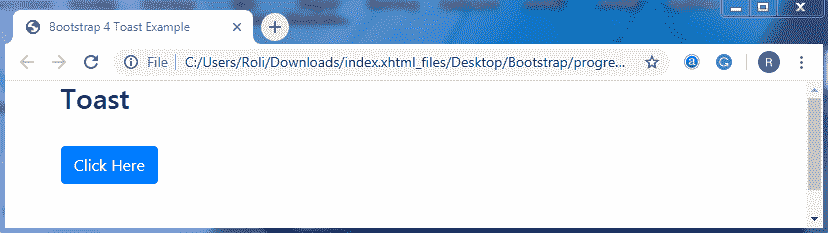
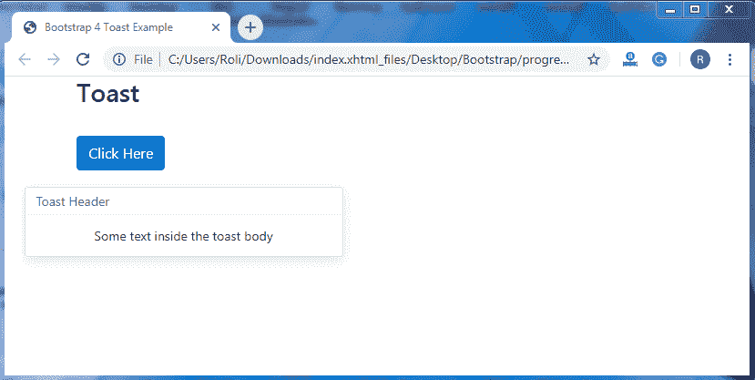
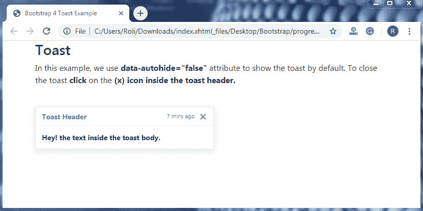
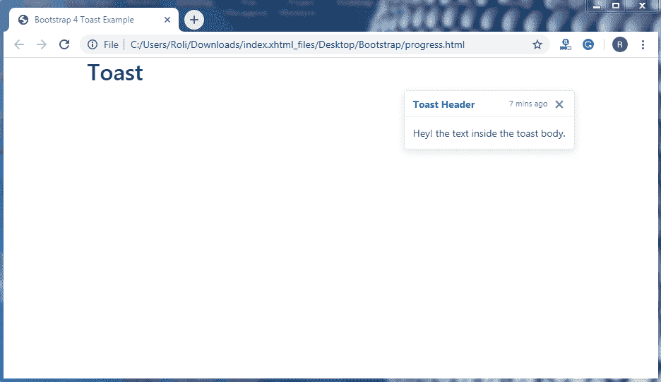

# 自举 4 吐司

> 原文：<https://www.tutorialandexample.com/bootstrap-4-toast/>

**自举 4 祝酒词**

Bootstrap 4 提供了一个 Toast 组件，它非常类似于警告框并推送通知。当任何动作发生时，比如当用户提交表单时，toast 会在屏幕上显示几秒钟。它是一个轻量级的、易于定制的组件。烤面包是在 flexbox 的帮助下创建的，flexbox 允许您根据选择对齐和设置烤面包的位置。

**制作祝酒词的步骤**

*   添加**。敬酒**类向 **< div >** 元素创建敬酒。
*   添加**。toast-header** 类添加到 **< div >** 元素来创建一个 toast 标题。
*   添加**。toast-body** 类向 **< div >** 元素创建一个 toast 体。

**注意:**需要用 **jQuery 初始化 toast，**为此需要选择具体的元素并调用 **toast()** 方法。

**例子**

```
<!DOCTYPE html>
 <html lang="en">
 <head>
   <title>Bootstrap 4 Toast Example</title>
   <meta charset="utf-8">
   <meta name="viewport" content="width=device-width, initial-scale=1">
   <link rel="stylesheet" href="https://maxcdn.bootstrapcdn.com/bootstrap/4.4.1/css/bootstrap.min.css"> 
 </head>
 <body>
 <div class="container">
   <h3>Toast</h3><br>
   <button type="button" class="btn btn-primary" id="myBtn">Click Here</button>
   <div class="toast">
     <div class="toast-header"> 
       Toast Header
     </div>
     <div class="toast-body">
       Hello! This is the toast body.
     </div>
   </div>
 </div>
 <script> 
 $(document).ready(function(){
   $("#myBtn").click(function(){
     $('.toast').toast('show');
   });
 });
 </script>
 <script src="https://ajax.googleapis.com/ajax/libs/jquery/3.5.1/jquery.min.js"></script> 
   <script src="https://cdnjs.cloudflare.com/ajax/libs/popper.js/1.16.0/umd/popper.min.js"></script>
   <script src="https://maxcdn.bootstrapcdn.com/bootstrap/4.4.1/js/bootstrap.min.js"></script>
 </body>
 </html> 
```

**输出**



点击**点击此处**按钮时，输出如下:



**显示和隐藏吐司-**默认情况下，吐司是隐藏的。你必须先点击按钮才能看到吐司。您还可以创建一个默认可见的 toast，当您单击该按钮时它就会消失。为此，添加 **data-autohide="false"** 属性以及。敬酒类为 **< div >** 元素。

要关闭默认可见的 toast，请将**data-dismisse = " toast "**属性添加到 **<按钮>** 元素中

**例子**

```
<!DOCTYPE html>
 <html lang="en">
 <head>
   <title>Bootstrap 4 Toast Example</title>
   <meta charset="utf-8">
   <meta name="viewport" content="width=device-width, initial-scale=1">
   <link rel="stylesheet" href="https://maxcdn.bootstrapcdn.com/bootstrap/4.4.1/css/bootstrap.min.css"> 
   <script src="https://ajax.googleapis.com/ajax/libs/jquery/3.5.1/jquery.min.js"></script>
   <script src="https://cdnjs.cloudflare.com/ajax/libs/popper.js/1.16.0/umd/popper.min.js"></script>
   <script src="https://maxcdn.bootstrapcdn.com/bootstrap/4.4.1/js/bootstrap.min.js"></script>
 </head>
 <body>
 <div class="container">
   <h3>Toast</h3> 
   <p>In this example, we use <strong>data-autohide="false"</strong> attribute to show the toast by default. To close the toast <strong>click</strong> on the <strong>(x)</srong> icon inside the toast header.</p>
     <br>
   <div class="toast" data-autohide="false">
     <div class="toast-header">
       <strong class="mr-auto text-primary">Toast Header</strong>
       <small class="text-muted">7 mins ago</small> 
       <button type="button" class="ml-2 mb-1 close" data-dismiss="toast">×</button>
     </div>
     <div class="toast-body">
       Hey! the text inside the toast body.
     </div>
   </div>
 </div>
 <script> 
 $(document).ready(function(){
   $('.toast').toast('show');
 });
 </script>
 </body>
 </html> 
```

**输出**



**位置–**Bootstrap 4 允许您在自定义 CSS 和 flexbox 属性的帮助下自行设置吐司的位置。

**例子**

```
<!DOCTYPE html>
 <html lang="en">
 <head>
   <title>Bootstrap 4 Toast Example</title>
   <meta charset="utf-8">
   <meta name="viewport" content="width=device-width, initial-scale=1">
   <link rel="stylesheet" href="https://maxcdn.bootstrapcdn.com/bootstrap/4.4.1/css/bootstrap.min.css"> 
   <script src="https://ajax.googleapis.com/ajax/libs/jquery/3.5.1/jquery.min.js"></script>
   <script src="https://cdnjs.cloudflare.com/ajax/libs/popper.js/1.16.0/umd/popper.min.js"></script>
   <script src="https://maxcdn.bootstrapcdn.com/bootstrap/4.4.1/js/bootstrap.min.js"></script>
 </head>
 <body>
 <div class="container">
   <h2>Toast</h2>
   <div aria-live="polite" aria-atomic="true" style="position: relative; min-height: 300px;"> 
   <div class="toast" data-autohide="false" style="position: absolute; top: 0; right: 0;">
     <div class="toast-header">
       <strong class="mr-auto text-primary">Toast Header</strong>
       <small class="text-muted">7 mins ago</small>
       <button type="button" class="ml-2 mb-1 close" data-dismiss="toast">×</button>
     </div>
     <div class="toast-body">
       Hey! the text inside the toast body. 
     </div>
   </div>
 </div>
 <script>
 $(document).ready(function(){
   $('.toast').toast('show');
 });
 </script> 
 </body>
 </html> 
```

**输出**

