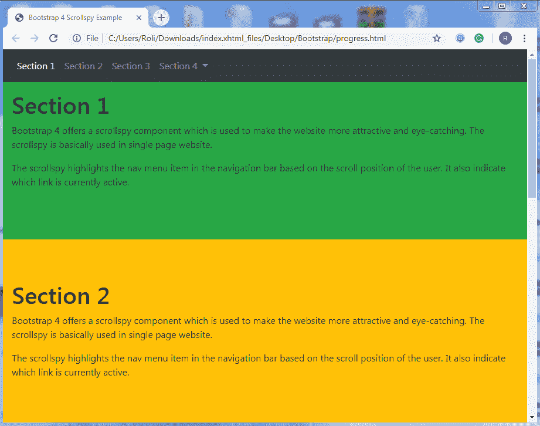
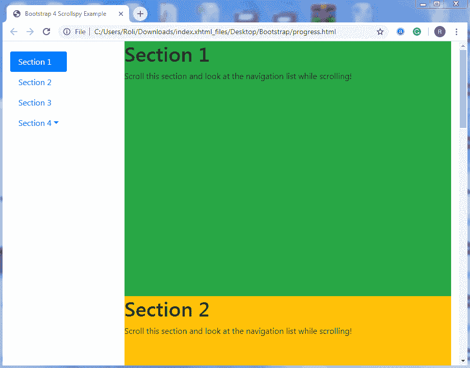

# Bootstrap 4 Scrollspy

> 原文：<https://www.tutorialandexample.com/bootstrap-4-scrollspy/>

**引导带 4 个滚动箭头**

Bootstrap 4 提供了一个 scrollspy 组件，用于使网站更加吸引人和引人注目。基本上，scrollspy 是用在单页网站上的。

scrollspy 根据用户的滚动位置突出显示导航栏中的 nav 菜单项。它还指示哪个链接当前是活动的。

**基本 scroll spy–**scroll spy 的默认位置是水平的。当你滚动页面时，它会自动更新链接。

**创建 Scrollspy 的步骤**

*   要创建 scrollspy，请将 **data-spy="scroll"** 属性添加到用作可滚动区域的 **< body >** 元素中。另外，将**数据目标**属性添加到 **<主体>** 元素中。**数据目标**属性的**值**应该是 **id** 或**类**导航栏**的名称**如**。导航条**确保可滚动区域连接到导航条。
*   将 **id** 添加到 **< div >** 元素中，以创建可滚动部分。**可滚动元素**的 **id** 的值和**导航菜单项**的 **href** 的值必须相同。

注意:scrollspy 需要 CSS 位置属性“position:relative；”让 scrollspy 正常工作。

**例题**

 **```
<!DOCTYPE html>
 <html lang="en">
 <head>
   <title>Bootstrap 4 Scrollspy Example</title>
   <meta charset="utf-8">
   <meta name="viewport" content="width=device-width, initial-scale=1"> 
   <link rel="stylesheet" href="https://maxcdn.bootstrapcdn.com/bootstrap/4.4.1/css/bootstrap.min.css">
   <script src="https://ajax.googleapis.com/ajax/libs/jquery/3.5.1/jquery.min.js"></script>
   <script src="https://cdnjs.cloudflare.com/ajax/libs/popper.js/1.16.0/umd/popper.min.js"></script>
   <script src="https://maxcdn.bootstrapcdn.com/bootstrap/4.4.1/js/bootstrap.min.js"></script>
   <style>
   body {
       position: relative;  
   }
   </style>
 </head>
 <body data-spy="scroll" data-target=".navbar" data-offset="50">
 <nav class="navbar navbar-expand-sm bg-dark navbar-dark fixed-top">  
   <ul class="navbar-nav">
     <li class="nav-item"> 
       <a class="nav-link" href="#section1">Section 1</a>
     </li>
     <li class="nav-item">
       <a class="nav-link" href="#section2">Section 2</a>
     </li>
     <li class="nav-item">
       <a class="nav-link" href="#section3">Section 3</a> 
     </li>
     <li class="nav-item dropdown">
       <a class="nav-link dropdown-toggle" href="#" id="navbardrop" data-toggle="dropdown">
         Section 4
       </a>
       <div class="dropdown-menu">
         <a class="dropdown-item" href="#section41">Section 4.1</a>
         <a class="dropdown-item" href="#section42">Section 4.2</a>
       </div> 
     </li>
   </ul>
 </nav>
 <div id="section1" class="container-fluid bg-success" style="padding-top:70px;padding-bottom:70px">
   <h1>Section 1</h1>
   <p>Bootstrap 4 offers a scrollspy component which is used to make the website more attractive and eye-catching. The scrollspy is basically used in single page website.</p>
   <p>The scrollspy highlights the nav menu item in the navigation bar based on the scroll position of the user. It also indicate which link is currently active. </p>
 </div> 
 <div id="section2" class="container-fluid bg-warning" style="padding-top:70px;padding-bottom:70px">
   <h1>Section 2</h1>
   <p>Bootstrap 4 offers a scrollspy component which is used to make the website more attractive and eye-catching. The scrollspy is basically used in single page website.</p>
   <p>The scrollspy highlights the nav menu item in the navigation bar based on the scroll position of the user. It also indicate which link is currently active. </p>
 </div> 
 <div id="section3" class="container-fluid bg-secondary" style="padding-top:70px;padding-bottom:70px">
   <h1>Section 3</h1>
   <p>Bootstrap 4 offers a scrollspy component which is used to make the website more attractive and eye-catching. The scrollspy is basically used in single page website.</p>
   <p>The scrollspy highlights the nav menu item in the navigation bar based on the scroll position of the user. It also indicate which link is currently active. </p>
 </div> 
 <div id="section41" class="container-fluid bg-danger" style="padding-top:70px;padding-bottom:70px">
   <h1>Section 4 Submenu 1</h1>
   <p>Bootstrap 4 offers a scrollspy component which is used to make the website more attractive and eye-catching. The scrollspy is basically used in single page website.</p>
   <p>The scrollspy highlights the nav menu item in the navigation bar based on the scroll position of the user. It also indicate which link is currently active. </p>
 </div>
 <div id="section42" class="container-fluid bg-info" style="padding-top:70px;padding-bottom:70px">
   <h1>Section 4 Submenu 2</h1> 
   <p>Bootstrap 4 offers a scrollspy component which is used to make the website more attractive and eye-catching. The scrollspy is basically used in single page website.</p>
   <p>The scrollspy highlights the nav menu item in the navigation bar based on the scroll position of the user. It also indicate which link is currently active. </p>
 </div>
 </body>
 </html> 
```

**输出**



**Scrollspy 垂直菜单–**Bootstrap 4 允许您创建垂直而非水平的滚动 spy 菜单。

**例子**

```
<!DOCTYPE html>
 <html lang="en">
 <head>
   <title>Bootstrap 4 Scrollspy Example</title>
   <meta charset="utf-8">
   <meta name="viewport" content="width=device-width, initial-scale=1">
   <link rel="stylesheet" href="https://maxcdn.bootstrapcdn.com/bootstrap/4.4.1/css/bootstrap.min.css">
   <script src="https://ajax.googleapis.com/ajax/libs/jquery/3.5.1/jquery.min.js"></script> 
   <script src="https://cdnjs.cloudflare.com/ajax/libs/popper.js/1.16.0/umd/popper.min.js"></script>
   <script src="https://maxcdn.bootstrapcdn.com/bootstrap/4.4.1/js/bootstrap.min.js"></script>
   <style>
   body {
     position: relative;
   }
   ul.nav-pills { 
     top: 20px;
     position: fixed;
   }
   div.col-8 div {
     height: 500px;
   }
   </style>
 </head> 
 <body data-spy="scroll" data-target="#myScrollspy" data-offset="1">
 <div class="container-fluid">
   <div class="row">
     <nav class="col-sm-3 col-4" id="myScrollspy">
       <ul class="nav nav-pills flex-column">
         <li class="nav-item">
           <a class="nav-link active" href="#section1">Section 1</a>
         </li>
         <li class="nav-item"> 
           <a class="nav-link" href="#section2">Section 2</a>
         </li>
         <li class="nav-item">
           <a class="nav-link" href="#section3">Section 3</a>
         </li>
         <li class="nav-item dropdown">
           <a class="nav-link dropdown-toggle" data-toggle="dropdown" href="#">Section 4</a>
           <div class="dropdown-menu"> 
             <a class="dropdown-item" href="#section41">Section 4.1</a>
             <a class="dropdown-item" href="#section42">Section 4.2</a>
           </div>
         </li>
       </ul>
     </nav>
     <div class="col-sm-9 col-8">
       <div id="section1" class="bg-success">     
         <h1>Section 1</h1>
         <p>Scroll this section and look at the navigation list while scrolling!</p>
       </div>
       <div id="section2" class="bg-warning"> 
         <h1>Section 2</h1>
         <p>Scroll this section and look at the navigation list while scrolling!</p>
       </div>        
       <div id="section3" class="bg-secondary">          
         <h1>Section 3</h1>
         <p>Scroll this section and look at the navigation list while scrolling!</p>
       </div>
       <div id="section41" class="bg-danger">         
         <h1>Section 4.1</h1>
         <p>Scroll this section and look at the navigation list while scrolling!</p>
       </div>      
       <div id="section42" class="bg-info">          
         <h1>Section 4.2</h1>
         <p>Scroll this section and look at the navigation list while scrolling!</p>
       </div>
     </div>
   </div>
 </div>
 </body>
 </html> 
```

**输出**

**