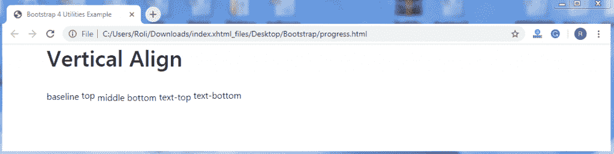

# 引导 4 实用程序

> 原文：<https://www.tutorialandexample.com/bootstrap-utilities/>

**引导 4 实用程序**

Bootstrap 4 实用程序也称为助手类，用于为组件添加更多样式。实用程序用于使网站或网页更加时尚或优雅。这也使得响应元件。

**Borders–**Borders 类用于设置元素的边框样式，如添加或删除边框、调整边框半径等。

**例题**

```
<!DOCTYPE html>
 <html lang="en">
 <head>
   <title>Bootstrap 4 Utilities Example</title>
   <meta charset="utf-8">
   <meta name="viewport" content="width=device-width, initial-scale=1"> 
   <link rel="stylesheet" href="https://maxcdn.bootstrapcdn.com/bootstrap/4.4.1/css/bootstrap.min.css">
   <script src="https://ajax.googleapis.com/ajax/libs/jquery/3.5.1/jquery.min.js"></script>
   <script src="https://cdnjs.cloudflare.com/ajax/libs/popper.js/1.16.0/umd/popper.min.js"></script>
   <script src="https://maxcdn.bootstrapcdn.com/bootstrap/4.4.1/js/bootstrap.min.js"></script>
   <style>
   .border { 
     display: inline-block;
     width: 70px;
     height: 70px;
     margin: 6px;
   }
   </style>
 </head>
 <body> 
 <div class="container">
   <h2>Borders</h2>
   
   
   
    
   
   
 </div>
 </body>
 </html> 
```

**输出**


**Float 和 clear fix–**Float 类用于设置元素的位置向左或向右。**。float-right** 类用于将元素向右浮动并**。float-left** 类用于将元素向左浮动。Clearfix 用于防止父元素和子元素之间的折叠。**。clearfix** 类用于移除浮动。

**例子**

```
<!DOCTYPE html>
 <html lang="en">
 <head>
   <title>Bootstrap 4 Utilities Example</title>
   <meta charset="utf-8">
   <meta name="viewport" content="width=device-width, initial-scale=1">
   <link rel="stylesheet" href="https://maxcdn.bootstrapcdn.com/bootstrap/4.4.1/css/bootstrap.min.css"> 
   <script src="https://ajax.googleapis.com/ajax/libs/jquery/3.5.1/jquery.min.js"></script>
   <script src="https://cdnjs.cloudflare.com/ajax/libs/popper.js/1.16.0/umd/popper.min.js"></script>
   <script src="https://maxcdn.bootstrapcdn.com/bootstrap/4.4.1/js/bootstrap.min.js"></script>
 </head>
 <body>
 <div class="container"> 
   <h2>Float</h2>
   <div class="clearfix">
     Float left
     Float right
   </div>
 </div>
 </body>
 </html> 
```

**输出**


**Responsive Float-**Bootstrap 4 提供助手类，根据屏幕大小以响应行为将元素向左或向右浮动。**。float-*-right** 类用于将元素向右浮动。你不需要添加**。float-*-left** 类，因为元素的默认位置在视口或屏幕的左侧。

**其中，** *** =** sm，md，lg，xl。

**例子**

```
<!DOCTYPE html>
 <html lang="en">
 <head>
   <title>Bootstrap 4 Utilities Example</title>
   <meta charset="utf-8">
   <meta name="viewport" content="width=device-width, initial-scale=1"> 
   <link rel="stylesheet" href="https://maxcdn.bootstrapcdn.com/bootstrap/4.4.1/css/bootstrap.min.css">
   <script src="https://ajax.googleapis.com/ajax/libs/jquery/3.5.1/jquery.min.js"></script>
   <script src="https://cdnjs.cloudflare.com/ajax/libs/popper.js/1.16.0/umd/popper.min.js"></script>
   <script src="https://maxcdn.bootstrapcdn.com/bootstrap/4.4.1/js/bootstrap.min.js"></script>
 </head>
 <body> 
 <div class="container">
   <h2>Responsive Floats</h2>
   <p>Resize the browser window to see the effect.</p> 
   <div class="clearfix">
     <div class="float-sm-right">Float right on small screens or wider</div><br>
     <div class="float-md-right">Float right on medium screens or wider</div><br> 
     <div class="float-lg-right">Float right on large screens or wider</div><br>
     <div class="float-xl-right">Float right on extra large screens or wider</div><br>
     <div class="float-none">Float none</div>
   </div>
 </div>
 </body>
 </html> 
```

**输出**


**居中对齐–**您还可以将内容或元素水平放置在视窗或屏幕的中央。加上**。mx-auto** 类使资源中心对齐。

**例子**

```
<!DOCTYPE html>
 <html lang="en">
 <head>
   <title>Bootstrap 4 Utilities Example</title>
   <meta charset="utf-8"> 
   <meta name="viewport" content="width=device-width, initial-scale=1">
   <link rel="stylesheet" href="https://maxcdn.bootstrapcdn.com/bootstrap/4.4.1/css/bootstrap.min.css">
   <script src="https://ajax.googleapis.com/ajax/libs/jquery/3.5.1/jquery.min.js"></script>
   <script src="https://cdnjs.cloudflare.com/ajax/libs/popper.js/1.16.0/umd/popper.min.js"></script>
   <script src="https://maxcdn.bootstrapcdn.com/bootstrap/4.4.1/js/bootstrap.min.js"></script>
 </head> 
 <body>
 <div class="container">
   <h1>Horizontal Centering</h1>
   <p>Center an element with the .mx-auto class:</p>
   <div class="mx-auto bg-primary" style="width:150px">Centered</div>
 </div>
 </body> 
 </html> 
```

**输出**


**Width–**Bootstrap 允许您根据需要设置元素的宽度。要设置元素的宽度，添加**。w-*** 类为 **< div >** 元素。

**其中，* =** 25，50，75，100。

**例子**

```
<!DOCTYPE html>
 <html lang="en">
 <head>
   <title>Bootstrap 4 Utilities Example</title>
   <meta charset="utf-8"> 
   <meta name="viewport" content="width=device-width, initial-scale=1">
   <link rel="stylesheet" href="https://maxcdn.bootstrapcdn.com/bootstrap/4.4.1/css/bootstrap.min.css">
   <script src="https://ajax.googleapis.com/ajax/libs/jquery/3.5.1/jquery.min.js"></script>
   <script src="https://cdnjs.cloudflare.com/ajax/libs/popper.js/1.16.0/umd/popper.min.js"></script>
   <script src="https://maxcdn.bootstrapcdn.com/bootstrap/4.4.1/js/bootstrap.min.js"></script>
 </head> 
 <body>
 <div class="container">
   <h1>Width Utilities</h1>
   <div class="w-25 bg-secondary">Width 25%</div>
   <div class="w-50 bg-secondary">Width 50%</div>
   <div class="w-75 bg-secondary">Width 75%</div>
   <div class="w-100 bg-secondary">Width 100%</div>
   <div class="mw-100 bg-secondary">Max Width 100%</div> 
 </div>
 </body>
 </html> 
```

**输出**


**Height–**Bootstrap 4 允许您设置元素的高度。要设置元素的高度，添加**。h-*** 级，最大高度增加**。mh-100** 级。

**其中，* =** 25，50，75，100。

**例子**

```
<!DOCTYPE html>
 <html lang="en">
 <head>
   <title>Bootstrap 4 Utilities Example</title>
   <meta charset="utf-8">
   <meta name="viewport" content="width=device-width, initial-scale=1"> 
   <link rel="stylesheet" href="https://maxcdn.bootstrapcdn.com/bootstrap/4.4.1/css/bootstrap.min.css">
   <script src="https://ajax.googleapis.com/ajax/libs/jquery/3.5.1/jquery.min.js"></script>
   <script src="https://cdnjs.cloudflare.com/ajax/libs/popper.js/1.16.0/umd/popper.min.js"></script>
   <script src="https://maxcdn.bootstrapcdn.com/bootstrap/4.4.1/js/bootstrap.min.js"></script>
 </head> 
 <body>
 <div class="container">
   <h1>Height Utilities</h1>
   <div style="height:200px;background-color:#ddd">
     <div class="h-25 d-inline-block p-2 bg-primary">Height 25%</div>
     <div class="h-50 d-inline-block p-2 bg-primary">Height 50%</div>
     <div class="h-75 d-inline-block p-2 bg-primary">Height 75%</div>
     <div class="h-100 d-inline-block p-2 bg-primary">Height 100%</div> 
     <div class="mh-100 d-inline-block p-2 bg-primary" style="height:500px">Max Height 100%</div>
   </div>
 </div>
 </body>
 </html> 
```

**输出**


**阴影–**Bootstrap 4 允许你给元素添加阴影效果。要创建阴影效果，添加**。阴影**类到 **< div >** 元素。

**例子**

```
<!DOCTYPE html>
 <html lang="en">
 <head>
   <title>Bootstrap 4 Utilities Example</title>
   <meta charset="utf-8">
   <meta name="viewport" content="width=device-width, initial-scale=1">
   <link rel="stylesheet" href="https://maxcdn.bootstrapcdn.com/bootstrap/4.4.1/css/bootstrap.min.css"> 
   <script src="https://ajax.googleapis.com/ajax/libs/jquery/3.5.1/jquery.min.js"></script>
   <script src="https://cdnjs.cloudflare.com/ajax/libs/popper.js/1.16.0/umd/popper.min.js"></script>
   <script src="https://maxcdn.bootstrapcdn.com/bootstrap/4.4.1/js/bootstrap.min.js"></script>
 </head>
 <body>
 <div class="container"> 
   <h1>Shadows</h1>
   <div class="shadow-none p-4 mb-4 bg-light">No shadow</div>
   <div class="shadow-sm p-4 mb-4 bg-white">Small shadow</div>
   <div class="shadow p-4 mb-4 bg-white">Default shadow</div>
   <div class="shadow-lg p-4 mb-4 bg-white">Large shadow</div>
 </div> 
 </body>
 </html> 
```

**输出**


**垂直对齐–**您可以垂直或内嵌对齐您的内容或元素。若要垂直对齐内容，请添加 class。将-*与元素对齐。

**其中，** ***** **=** 基线，顶部，中间，底部，文本顶部，文本底部等。

**例子**

```
<!DOCTYPE html>
 <html lang="en">
 <head>
   <title>Bootstrap 4 Utilities Example</title>
   <meta charset="utf-8">
   <meta name="viewport" content="width=device-width, initial-scale=1">
   <link rel="stylesheet" href="https://maxcdn.bootstrapcdn.com/bootstrap/4.4.1/css/bootstrap.min.css"> 
   <script src="https://ajax.googleapis.com/ajax/libs/jquery/3.5.1/jquery.min.js"></script>
   <script src="https://cdnjs.cloudflare.com/ajax/libs/popper.js/1.16.0/umd/popper.min.js"></script>
   <script src="https://maxcdn.bootstrapcdn.com/bootstrap/4.4.1/js/bootstrap.min.js"></script>
 </head> 
 <body>
 <div class="container">
   <h1>Vertical Align</h1><br>
   baseline
   top
   middle
   bottom
   text-top 
   text-bottom
 </div>
 </body>
 </html> 
```

**输出**



**响应式嵌入–**您可以为视频或图像添加响应式。如果您调整视频或图像的大小，它将不会与其父级重叠。视频或图像会根据父对象的宽度自动调整其宽度。

*   要创建响应嵌入，添加**。嵌入式响应**类和**。embed-responsive-*** (* = ratio)到父元素。

**其中，** ***** **=** 21by9，16by9，4by3，1by1。

*   添加**。embed-responsive-item** 类到 **< iframe >** 或 **< video >** 元素。

**例子**

```
<!DOCTYPE html>
 <html lang="en">
 <head>
   <title>Bootstrap 4 Utilities Example</title>
   <meta charset="utf-8">
   <meta name="viewport" content="width=device-width, initial-scale=1">
   <link rel="stylesheet" href="https://maxcdn.bootstrapcdn.com/bootstrap/4.4.1/css/bootstrap.min.css"> 
   <script src="https://ajax.googleapis.com/ajax/libs/jquery/3.5.1/jquery.min.js"></script>
   <script src="https://cdnjs.cloudflare.com/ajax/libs/popper.js/1.16.0/umd/popper.min.js"></script>
   <script src="https://maxcdn.bootstrapcdn.com/bootstrap/4.4.1/js/bootstrap.min.js"></script>
 </head>
 <body>
 <div class="container mt-3"> 
   <h2>Responsive Embed</h2><br>
   <div class="row">
     <div class="col-md-3">
       <h6>Aspect ratio 1:1</h6>
       <div class="embed-responsive embed-responsive-1by1">
       <iframe class="embed-responsive-item" src="https://www.youtube.com/embed/wTPmrcL47cE"></iframe> 
       </div>
     </div>
     <div class="col-md-3">
       <h6>Aspect ratio 4:3</h6> 
         <div class="embed-responsive embed-responsive-4by3">
           <iframe class="embed-responsive-item" src="https://www.youtube.com/embed/wTPmrcL47cE"></iframe>
         </div> 
     </div>
     <div class="col-md-3">
       <h6>Aspect ratio 16:9</h6>
         <div class="embed-responsive embed-responsive-16by9"> 
           <iframe class="embed-responsive-item" src="https://www.youtube.com/embed/wTPmrcL47cE"></iframe>
         </div>
     </div>
     <div class="col-md-3">
       <h6>Aspect ratio 21:9</h6>
         <div class="embed-responsive embed-responsive-21by9">
           <iframe class="embed-responsive-item" src="https://www.youtube.com/embed/wTPmrcL47cE"></iframe> 
         </div>
     </div>
   </div>
   </div>
 </body>
 </html> 
```

**输出**


**Visibility -** Bootstrap 4 提供了一些类来帮助你使元素可见或不可见。若要使元素可见，请添加。对< div >元素可见的类。若要使元素不可见，请添加。对< div >元素不可见的类。

 ****例子**

```
<!DOCTYPE html>
 <html lang="en">
 <head>
   <title>Bootstrap 4 Utilities Example</title>
   <meta charset="utf-8">
   <meta name="viewport" content="width=device-width, initial-scale=1">
   <link rel="stylesheet" href="https://maxcdn.bootstrapcdn.com/bootstrap/4.4.1/css/bootstrap.min.css"> 
   <script src="https://ajax.googleapis.com/ajax/libs/jquery/3.5.1/jquery.min.js"></script>
   <script src="https://cdnjs.cloudflare.com/ajax/libs/popper.js/1.16.0/umd/popper.min.js"></script>
   <script src="https://maxcdn.bootstrapcdn.com/bootstrap/4.4.1/js/bootstrap.min.js"></script>
 </head>
 <body>
 <div class="container">
   <h1>Visibility</h1><br>
   <div class="visible bg-primary">I am visible</div> 
   <div class="invisible bg-primary">I am invisible</div>
 </div>
 </body>
 </html> 
```

**输出**


**关闭图标-** 关闭图标基本上用在模态或提醒中。收盘(' x ')的默认位置是右。 **&次；**符号用于创建实际的图标。要创建关闭图标，请添加**。关闭**类以及 **<按钮>** 元素的 **type="button"** 属性。

**例子**

```
<!DOCTYPE html>
 <html lang="en">
 <head>
   <title>Bootstrap 4 Utilities Example</title>
   <meta charset="utf-8">
   <meta name="viewport" content="width=device-width, initial-scale=1"> 
   <link rel="stylesheet" href="https://maxcdn.bootstrapcdn.com/bootstrap/4.4.1/css/bootstrap.min.css">
   <script src="https://ajax.googleapis.com/ajax/libs/jquery/3.5.1/jquery.min.js"></script>
   <script src="https://cdnjs.cloudflare.com/ajax/libs/popper.js/1.16.0/umd/popper.min.js"></script>
   <script src="https://maxcdn.bootstrapcdn.com/bootstrap/4.4.1/js/bootstrap.min.js"></script>
 </head>
 <body> 
 <div class="container">
   <h1>Close Icon</h1>
   <div class="clearfix">
     <button type="button" class="close">×</button>
   </div>
 </div>
 </body>
 </html> 
```

**输出**


**块元素—**您也可以将一个元素转换成块元素。加上**。d-*-block** 类来控制元素的动作(当它充当 block 或者不充当 block 的时候)。要创建一个块元素，添加**。d-block** 类到元素。

**例子**

```
<!DOCTYPE html>
 <html lang="en">
 <head>
   <title>Bootstrap 4 Utilities Example</title>
   <meta charset="utf-8">
   <meta name="viewport" content="width=device-width, initial-scale=1"> 
   <link rel="stylesheet" href="https://maxcdn.bootstrapcdn.com/bootstrap/4.4.1/css/bootstrap.min.css">
   <script src="https://ajax.googleapis.com/ajax/libs/jquery/3.5.1/jquery.min.js"></script>
   <script src="https://cdnjs.cloudflare.com/ajax/libs/popper.js/1.16.0/umd/popper.min.js"></script>
   <script src="https://maxcdn.bootstrapcdn.com/bootstrap/4.4.1/js/bootstrap.min.js"></script>
 </head>
 <body> 
 <div class="container mt-3">
   <h2>Display Utilities</h2>
   d-block
   d-sm-block
   d-md-block
   d-lg-block 
   d-xl-block
 </div>
 </body>
 </html> 
```

**输出**

**