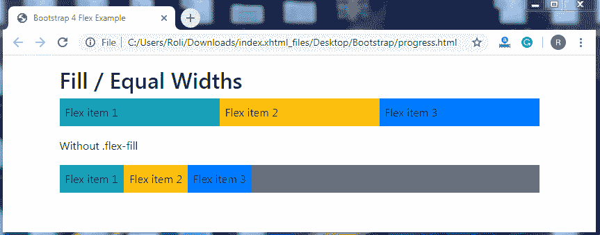

# 引导 4 Flex

> 原文：<https://www.tutorialandexample.com/bootstrap-flex/>

**Bootstrap 4 Flex**

Flex 是一个 Bootstrap 4 组件，用于管理布局、导航栏、网格列、大小调整、对齐和其他组件。flexbox 或 flex 实用程序取代了 Bootstrap 3 中常用的 float 和 positions。flex 实用程序允许您水平或垂直对齐和调整元素的大小。

**Flexbox–**Flexbox 用于轻松创建响应式布局，无需使用浮动或定位。要创建 flexbox，添加类**。d-flex** 到父元素。该类将直接子级转换为 flex 项。

**例子**

```
<!DOCTYPE html>
<html lang="en">
<head>
  <title>Bootstrap 4 Flex Example</title>
  <meta charset="utf-8">
  <meta name="viewport" content="width=device-width, initial-scale=1">
  <link rel="stylesheet" href="https://maxcdn.bootstrapcdn.com/bootstrap/4.4.1/css/bootstrap.min.css">
  <script src="https://ajax.googleapis.com/ajax/libs/jquery/3.5.1/jquery.min.js"></script>
  <script src="https://cdnjs.cloudflare.com/ajax/libs/popper.js/1.16.0/umd/popper.min.js"></script>
  <script src="https://maxcdn.bootstrapcdn.com/bootstrap/4.4.1/js/bootstrap.min.js"></script>
</head>
<body>
<div class="container mt-3">
  <h2>Flex</h2>
  <div class="d-flex p-3 bg-secondary text-white"> 
    <div class="p-2 bg-info">Flex item 1</div>
    <div class="p-2 bg-warning">Flex item 2</div>
    <div class="p-2 bg-primary">Flex item 3</div>
  </div>
</div>
</body>
</html>
```

**输出**


您还可以借助 flex 实用工具将内嵌元素转换到 flex 容器中。要在 flex 容器中创建内联元素，添加**。d-inline-flex** 类到父元素。

**例子**

```
<!DOCTYPE html>
<html lang="en">
<head>
  <title>Bootstrap 4 Flex Example</title>
  <meta charset="utf-8">
  <meta name="viewport" content="width=device-width, initial-scale=1">
  <link rel="stylesheet" href="https://maxcdn.bootstrapcdn.com/bootstrap/4.4.1/css/bootstrap.min.css">
  <script src="https://ajax.googleapis.com/ajax/libs/jquery/3.5.1/jquery.min.js"></script>
  <script src="https://cdnjs.cloudflare.com/ajax/libs/popper.js/1.16.0/umd/popper.min.js"></script>
  <script src="https://maxcdn.bootstrapcdn.com/bootstrap/4.4.1/js/bootstrap.min.js"></script>
</head>
<body>
<div class="container mt-3">
  <h2>Inline Flex</h2>
  <div class="d-inline-flex p-3 bg-secondary text-white"> 
    <div class="p-2 bg-info">Flex item 1</div>
    <div class="p-2 bg-warning">Flex item 2</div>
    <div class="p-2 bg-primary">Flex item 3</div>
  </div>
</div>
</body>
</html>
```

**输出**


**水平方向–**Bootstrap 4 允许您使用方向实用程序设置 flex 项目进入 flex 容器的方向。水平方向是默认方向。要水平或并排显示 flex 项目，请添加**。柔性排**级连同**。d-flex** 类到**包装器**元素。

**例子**

```
<!DOCTYPE html>
<html lang="en">
<head>
  <title>Bootstrap 4 Flex Example</title>
  <meta charset="utf-8">
  <meta name="viewport" content="width=device-width, initial-scale=1">
  <link rel="stylesheet" href="https://maxcdn.bootstrapcdn.com/bootstrap/4.4.1/css/bootstrap.min.css">
  <script src="https://ajax.googleapis.com/ajax/libs/jquery/3.5.1/jquery.min.js"></script>
  <script src="https://cdnjs.cloudflare.com/ajax/libs/popper.js/1.16.0/umd/popper.min.js"></script>
  <script src="https://maxcdn.bootstrapcdn.com/bootstrap/4.4.1/js/bootstrap.min.js"></script>
</head>
<body>
<div class="container mt-3">
  <h2>Horizontal Direction</h2>
  <div class="d-flex flex-row bg-secondary mb-3">
    <div class="p-2 bg-info">Flex item 1</div>
    <div class="p-2 bg-warning">Flex item 2</div>
    <div class="p-2 bg-primary">Flex item 3</div>
  </div><br>
  <h2>Horizontal Reverse Direction</h2>
  <div class="d-flex flex-row-reverse bg-secondary">
    <div class="p-2 bg-info">Flex item 1</div>
    <div class="p-2 bg-warning">Flex item 2</div>
    <div class="p-2 bg-primary">Flex item 3</div>
  </div>
</div>
</body>
</html>
```

**输出**


**垂直方向–**您也可以垂直显示您的内容。要垂直显示内容，请添加**。flex-column** 类到 **< div >** 元素。Flex 工具还允许你在**的帮助下颠倒垂直对齐内容的顺序。flex-column-reverse** 类到 **< div >** 元素。

**例子**

```
<!DOCTYPE html>
<html lang="en">
<head>
  <title>Bootstrap 4 Flex Example</title>
  <meta charset="utf-8">
  <meta name="viewport" content="width=device-width, initial-scale=1">
  <link rel="stylesheet" href="https://maxcdn.bootstrapcdn.com/bootstrap/4.4.1/css/bootstrap.min.css">
  <script src="https://ajax.googleapis.com/ajax/libs/jquery/3.5.1/jquery.min.js"></script>
  <script src="https://cdnjs.cloudflare.com/ajax/libs/popper.js/1.16.0/umd/popper.min.js"></script>
  <script src="https://maxcdn.bootstrapcdn.com/bootstrap/4.4.1/js/bootstrap.min.js"></script>
</head>
<body>
<div class="container mt-3">
  <h2>Vertical Direction</h2>
  <div class="d-flex flex-column mb-3">
    <div class="p-2 bg-info">Flex item 1</div>
    <div class="p-2 bg-warning">Flex item 2</div>
    <div class="p-2 bg-primary">Flex item 3</div>
  </div>
  <h2>Vertical Reverse Direction</h2>
  <div class="d-flex flex-column-reverse">
    <div class="p-2 bg-info">Flex item 1</div>
    <div class="p-2 bg-warning">Flex item 2</div>
    <div class="p-2 bg-primary">Flex item 3</div>
  </div>
</div>
</body>
</html>
```

**输出**


**对齐内容–**对齐内容用于设置 flex 容器中 flex 项目的对齐方式。要更改对齐方式，请添加**。justify-content-*** 类到 **< div >** 元素。

**其中，** ***** **=** 开始，结束，中心，中间，周围。

**例子**

```
<!DOCTYPE html>
<html lang="en">
<head>
  <title>Bootstrap 4 Flex Example</title>
  <meta charset="utf-8">
  <meta name="viewport" content="width=device-width, initial-scale=1">
  <link rel="stylesheet" href="https://maxcdn.bootstrapcdn.com/bootstrap/4.4.1/css/bootstrap.min.css">
  <script src="https://ajax.googleapis.com/ajax/libs/jquery/3.5.1/jquery.min.js"></script>
  <script src="https://cdnjs.cloudflare.com/ajax/libs/popper.js/1.16.0/umd/popper.min.js"></script>
  <script src="https://maxcdn.bootstrapcdn.com/bootstrap/4.4.1/js/bootstrap.min.js"></script>
</head>
<body>
<div class="container mt-3">
  <h2>Justify content</h2>
  <div class="d-flex justify-content-start bg-secondary mb-3">
    <div class="p-2 bg-info">Flex item 1</div>
    <div class="p-2 bg-warning">Flex item 2</div>
    <div class="p-2 bg-primary">Flex item 3</div>
  </div>
  <h4>Justify content end</h4>
  <div class="d-flex justify-content-end bg-secondary mb-3">
    <div class="p-2 bg-info">Flex item 1</div>
    <div class="p-2 bg-warning">Flex item 2</div>
    <div class="p-2 bg-primary">Flex item 3</div>
  </div>
  <h4>Justify content center</h4>
  <div class="d-flex justify-content-center bg-secondary mb-3">
    <div class="p-2 bg-info">Flex item 1</div>
    <div class="p-2 bg-warning">Flex item 2</div>
    <div class="p-2 bg-primary">Flex item 3</div>
  </div>
  <h4>Justify content between</h4>
  <div class="d-flex justify-content-between bg-secondary mb-3">
    <div class="p-2 bg-info">Flex item 1</div>
    <div class="p-2 bg-warning">Flex item 2</div>
    <div class="p-2 bg-primary">Flex item 3</div>
  </div>
  <h4>Justify content around</h4>
  <div class="d-flex justify-content-around bg-secondary mb-3">
    <div class="p-2 bg-info">Flex item 1</div>
    <div class="p-2 bg-warning">Flex item 2</div>
    <div class="p-2 bg-primary">Flex item 3</div>
  </div>
</div>
</body>
</html>
```

**输出**


**填充/等宽–**填充或等宽允许伸缩项获得等宽。加上**。flex-fill** 类添加到子元素，以创建等宽的 flex 项。

**例子**

```
<!DOCTYPE html>
<html lang="en">
<head>
  <title>Bootstrap 4 Flex Example</title>
  <meta charset="utf-8">
  <meta name="viewport" content="width=device-width, initial-scale=1">
  <link rel="stylesheet" href="https://maxcdn.bootstrapcdn.com/bootstrap/4.4.1/css/bootstrap.min.css">
  <script src="https://ajax.googleapis.com/ajax/libs/jquery/3.5.1/jquery.min.js"></script>
  <script src="https://cdnjs.cloudflare.com/ajax/libs/popper.js/1.16.0/umd/popper.min.js"></script>
  <script src="https://maxcdn.bootstrapcdn.com/bootstrap/4.4.1/js/bootstrap.min.js"></script>
</head>
<body>
<div class="container mt-3">
  <h2>Fill / Equal Widths</h2>
  <div class="d-flex mb-3">
    <div class="p-2 flex-fill bg-info">Flex item 1</div>
    <div class="p-2 flex-fill bg-warning">Flex item 2</div>
    <div class="p-2 flex-fill bg-primary">Flex item 3</div>
  </div>
  <p>Without .flex-fill</p>
  <div class="d-flex mb-3 bg-secondary">
    <div class="p-2 bg-info">Flex item 1</div>
    <div class="p-2 bg-warning">Flex item 2</div>
    <div class="p-2 bg-primary">Flex item 3</div>
  </div>
</div>
</body>
</html>
```

**输出**



**增长和收缩–**增长实用程序允许 flex 项目获取所有可用空间。要制作这种 flex 项目，请添加。flex-grow-*类添加到要增长的元素。

添加**。flex-shrink-*** 类来收缩伸缩项。

**例子**

```
<!DOCTYPE html>
<html lang="en">
<head>
  <title>Bootstrap 4 Flex Example</title>
  <meta charset="utf-8">
  <meta name="viewport" content="width=device-width, initial-scale=1">
  <link rel="stylesheet" href="https://maxcdn.bootstrapcdn.com/bootstrap/4.4.1/css/bootstrap.min.css">
  <script src="https://ajax.googleapis.com/ajax/libs/jquery/3.5.1/jquery.min.js"></script>
  <script src="https://cdnjs.cloudflare.com/ajax/libs/popper.js/1.16.0/umd/popper.min.js"></script>
  <script src="https://maxcdn.bootstrapcdn.com/bootstrap/4.4.1/js/bootstrap.min.js"></script>
</head>
<body>
<div class="container mt-3">
  <h2>Grow</h2>
  <div class="d-flex mb-3">
    <div class="p-2 bg-info">Flex item 1</div>
    <div class="p-2 bg-warning">Flex item 2</div>
    <div class="p-2 flex-grow-1 bg-primary">Flex item 3</div>
  </div>
  <h2>Shrink</h2>
    <div class = "d-flex bg-info">
        <div class = "p-2 w-100 bg-info">Item 1</div>
        <div class = "p-2 flex-shrink-1 bg-warning">Item 2</div>
    </div>
</div>
</body>
</html>
```

**输出**


**Order–**Bootstrap 4 允许您在 Order 实用程序的帮助下更改或设置 flex 项目的顺序。order 类最多适用于 12 个项目，这意味着您可以根据选择一次设置 12 个项目的订单。在顺序效用中，最小的数字具有最高的优先级。要改变 flex 项目的视觉顺序，添加**。order-*** (* = 1 到 12)类添加到弹性物料元素。

**例子**

```
<!DOCTYPE html>
<html lang="en">
<head>
  <title>Bootstrap 4 Flex Example</title>
  <meta charset="utf-8">
  <meta name="viewport" content="width=device-width, initial-scale=1">
  <link rel="stylesheet" href="https://maxcdn.bootstrapcdn.com/bootstrap/4.4.1/css/bootstrap.min.css">
  <script src="https://ajax.googleapis.com/ajax/libs/jquery/3.5.1/jquery.min.js"></script>
  <script src="https://cdnjs.cloudflare.com/ajax/libs/popper.js/1.16.0/umd/popper.min.js"></script>
  <script src="https://maxcdn.bootstrapcdn.com/bootstrap/4.4.1/js/bootstrap.min.js"></script>
</head>
<body>
<div class="container mt-3">
  <h2>Order</h2>
  <div class="d-flex mb-3">
    <div class="p-2 order-3 bg-info">Flex item 1</div>
    <div class="p-2 order-2 bg-warning">Flex item 2</div>
    <div class="p-2 order-1 bg-primary">Flex item 3</div>
  </div>
</div>
</body>
</html>
```

**输出**


**自动边距–**Bootstrap 4 有一些类别为我们提供了一些惊人的功能，自动边距就是其中之一。它有自动为 flex 项目提供边距的类。为了给伸缩项提供左边距，添加**。ml-auto** 类到**伸缩项元素**。为了给 flex 项提供右边距，添加**。mr-auto** 类到 **flex item 元素**。

**例子**

```
<!DOCTYPE html>
<html lang="en">
<head>
  <title>Bootstrap 4 Flex Example</title>
  <meta charset="utf-8">
  <meta name="viewport" content="width=device-width, initial-scale=1">
  <link rel="stylesheet" href="https://maxcdn.bootstrapcdn.com/bootstrap/4.4.1/css/bootstrap.min.css">
  <script src="https://ajax.googleapis.com/ajax/libs/jquery/3.5.1/jquery.min.js"></script>
  <script src="https://cdnjs.cloudflare.com/ajax/libs/popper.js/1.16.0/umd/popper.min.js"></script>
  <script src="https://maxcdn.bootstrapcdn.com/bootstrap/4.4.1/js/bootstrap.min.js"></script>
</head>
<body>
<div class="container mt-3">
  <h2>Auto Margins</h2>
  <h4>.mr-auto</h4>
  <div class="d-flex mb-3 bg-secondary">
    <div class="p-2 mr-auto bg-info">Flex item 1</div>
    <div class="p-2 bg-warning">Flex item 2</div>
    <div class="p-2 bg-primary">Flex item 3</div>
  </div>
  <h4>.ml-auto</h4>
  <div class="d-flex mb-3 bg-secondary">
    <div class="p-2  bg-info">Flex item 1</div>
    <div class="p-2 bg-warning">Flex item 2</div>
    <div class="p-2 ml-auto bg-primary">Flex item 3</div>
  </div>
</div>
</body>
</html>
```

**输出**


**Wrap–**您还可以控制 flex 容器中 flex 项目的包装。bootstrap 提供了三个包装类，它们是:

*   **。flex-nowrap–**这是浏览器的默认类。
*   **。flex-wrap–**这个类用于将 flex 项目包装在一个 flex 容器中。
*   **。flex-wrap-reverse–**这个类也用于包装 flex 容器中的 flex 项目，但顺序相反。

**例子**

```
<!DOCTYPE html>
<html lang="en">
<head>
  <title>Bootstrap 4 Flex Example</title>
  <meta charset="utf-8">
  <meta name="viewport" content="width=device-width, initial-scale=1">
  <link rel="stylesheet" href="https://maxcdn.bootstrapcdn.com/bootstrap/4.4.1/css/bootstrap.min.css">
  <script src="https://ajax.googleapis.com/ajax/libs/jquery/3.5.1/jquery.min.js"></script>
  <script src="https://cdnjs.cloudflare.com/ajax/libs/popper.js/1.16.0/umd/popper.min.js"></script>
  <script src="https://maxcdn.bootstrapcdn.com/bootstrap/4.4.1/js/bootstrap.min.js"></script>
</head>
<body>
<div class="container mt-3">
  <h2>Wrap</h2>
  <p><code>.flex-wrap</code></p>
  <div class="d-flex flex-wrap bg-light">
    <div class="p-2 border">Flex item 1</div>
    <div class="p-2 border">Flex item 2</div>
    <div class="p-2 border">Flex item 3</div>
    <div class="p-2 border">Flex item 4</div>
    <div class="p-2 border">Flex item 5</div>
    <div class="p-2 border">Flex item 6</div>
    <div class="p-2 border">Flex item 7</div>
    <div class="p-2 border">Flex item 8</div>
    <div class="p-2 border">Flex item 9</div>
    <div class="p-2 border">Flex item 10</div>
    <div class="p-2 border">Flex item 11</div>
    <div class="p-2 border">Flex item 12</div>
    <div class="p-2 border">Flex item 13 </div>
    <div class="p-2 border">Flex item 14</div>
    <div class="p-2 border">Flex item 15</div>
    <div class="p-2 border">Flex item 16</div>
    <div class="p-2 border">Flex item 17</div>
    <div class="p-2 border">Flex item 18</div>
  </div>
  <br>
  <p><code>.flex-wrap-reverse:</code></p>
  <div class="d-flex flex-wrap-reverse bg-light">
    <div class="p-2 border">Flex item 1</div>
    <div class="p-2 border">Flex item 2</div>
    <div class="p-2 border">Flex item 3</div>
    <div class="p-2 border">Flex item 4</div>
    <div class="p-2 border">Flex item 5</div>
    <div class="p-2 border">Flex item 6</div>
    <div class="p-2 border">Flex item 7</div>
    <div class="p-2 border">Flex item 8</div>
    <div class="p-2 border">Flex item 9</div>
    <div class="p-2 border">Flex item 10</div>
    <div class="p-2 border">Flex item 11</div>
    <div class="p-2 border">Flex item 12</div>
    <div class="p-2 border">Flex item 13 </div>
    <div class="p-2 border">Flex item 14</div>
    <div class="p-2 border">Flex item 15</div>
    <div class="p-2 border">Flex item 16</div>
    <div class="p-2 border">Flex item 17</div>
    <div class="p-2 border">Flex item 18</div>
   </div>
  <br>
  <p><code>.flex-nowrap:</code></p>
  <div class="d-flex flex-nowrap bg-light">
    <div class="p-2 border">Flex item 1</div>
    <div class="p-2 border">Flex item 2</div>
    <div class="p-2 border">Flex item 3</div>
    <div class="p-2 border">Flex item 4</div>
    <div class="p-2 border">Flex item 5</div>
    <div class="p-2 border">Flex item 6</div>
    <div class="p-2 border">Flex item 7</div>
    <div class="p-2 border">Flex item 8</div>
    <div class="p-2 border">Flex item 9</div>
    <div class="p-2 border">Flex item 10</div>
    <div class="p-2 border">Flex item 11</div>
    <div class="p-2 border">Flex item 12</div>
    <div class="p-2 border">Flex item 13 </div>
    <div class="p-2 border">Flex item 14</div>
    <div class="p-2 border">Flex item 15</div>
    <div class="p-2 border">Flex item 16</div>
    <div class="p-2 border">Flex item 17</div>
    <div class="p-2 border">Flex item 18</div>
    <div class="p-2 border">Flex item 19</div>
  </div>
  <br>
</div>
</body>
</html>
```

**输出**


**对齐内容–**您可以使用对齐内容实用程序来控制 flex 容器中 flex 项目的垂直对齐。对齐内容的类别有:**。align-content-start** 类是默认类，**。对齐-内容-结束，。对齐内容中心。对齐-内容-之间，。左右对齐、**和**。对齐内容拉伸**。

**注—**这些类别不适用于单行项目。

**例子**

```
<!DOCTYPE html>
<html lang="en">
<head>
  <title>Bootstrap 4 Flex Example</title>
  <meta charset="utf-8">
  <meta name="viewport" content="width=device-width, initial-scale=1">
  <link rel="stylesheet" href="https://maxcdn.bootstrapcdn.com/bootstrap/4.4.1/css/bootstrap.min.css">
  <script src="https://ajax.googleapis.com/ajax/libs/jquery/3.5.1/jquery.min.js"></script>
  <script src="https://cdnjs.cloudflare.com/ajax/libs/popper.js/1.16.0/umd/popper.min.js"></script>
  <script src="https://maxcdn.bootstrapcdn.com/bootstrap/4.4.1/js/bootstrap.min.js"></script>
</head>
<body>
<div class="container mt-3">
  <h2>Align Content</h2>
  <div class="d-flex flex-wrap align-content-start bg-light" style="height:120px">
    <div class="p-2 border">Flex item 1</div>
    <div class="p-2 border">Flex item 2</div>
    <div class="p-2 border">Flex item 3</div>
    <div class="p-2 border">Flex item 4</div>
    <div class="p-2 border">Flex item 5</div>
    <div class="p-2 border">Flex item 6</div>
    <div class="p-2 border">Flex item 7</div>
    <div class="p-2 border">Flex item 8</div>
    <div class="p-2 border">Flex item 9</div>
    <div class="p-2 border">Flex item 10</div>
    <div class="p-2 border">Flex item 11</div>
    <div class="p-2 border">Flex item 12</div>
    <div class="p-2 border">Flex item 13 </div>
    <div class="p-2 border">Flex item 14</div>
    <div class="p-2 border">Flex item 15</div>
  </div>
  <br>
  <p>.align-content-end:</p>
  <div class="d-flex flex-wrap align-content-end bg-light" style="height: 150px">
    <div class="p-2 border">Flex item 1</div>
    <div class="p-2 border">Flex item 2</div>
    <div class="p-2 border">Flex item 3</div>
    <div class="p-2 border">Flex item 4</div>
    <div class="p-2 border">Flex item 5</div>
    <div class="p-2 border">Flex item 6</div>
    <div class="p-2 border">Flex item 7</div>
    <div class="p-2 border">Flex item 8</div>
    <div class="p-2 border">Flex item 9</div>
    <div class="p-2 border">Flex item 10</div>
    <div class="p-2 border">Flex item 11</div>
    <div class="p-2 border">Flex item 12</div>
    <div class="p-2 border">Flex item 13</div>
    <div class="p-2 border">Flex item 14</div>
    <div class="p-2 border">Flex item 15</div>
  </div>
  <br>
  <p>.align-content-center:</p>
  <div class="d-flex flex-wrap align-content-center bg-light" style="height: 160px">
    <div class="p-2 border">Flex item 1</div>
    <div class="p-2 border">Flex item 2</div>
    <div class="p-2 border">Flex item 3</div>
    <div class="p-2 border">Flex item 4</div>
    <div class="p-2 border">Flex item 5</div>
    <div class="p-2 border">Flex item 6</div>
    <div class="p-2 border">Flex item 7</div>
    <div class="p-2 border">Flex item 8</div>
    <div class="p-2 border">Flex item 9</div>
    <div class="p-2 border">Flex item 10</div>
    <div class="p-2 border">Flex item 11</div>
    <div class="p-2 border">Flex item 12</div>
    <div class="p-2 border">Flex item 13</div>
    <div class="p-2 border">Flex item 14</div>
    <div class="p-2 border">Flex item 15</div>
  </div>
  <br>
  <p>.align-content-around:</p>
  <div class="d-flex flex-wrap align-content-around bg-light" style="height: 150px">
    <div class="p-2 border">Flex item 1</div>
    <div class="p-2 border">Flex item 2</div>
    <div class="p-2 border">Flex item 3</div>
    <div class="p-2 border">Flex item 4</div>
    <div class="p-2 border">Flex item 5</div>
    <div class="p-2 border">Flex item 6</div>
    <div class="p-2 border">Flex item 7</div>
    <div class="p-2 border">Flex item 8</div>
    <div class="p-2 border">Flex item 9</div>
    <div class="p-2 border">Flex item 10</div>
    <div class="p-2 border">Flex item 11</div>
    <div class="p-2 border">Flex item 12</div>
    <div class="p-2 border">Flex item 13</div>
    <div class="p-2 border">Flex item 14</div>
    <div class="p-2 border">Flex item 15</div>
  </div>
  <br>
  <p>.align-content-stretch:</p>
  <div class="d-flex flex-wrap align-content-stretch bg-light" style="height:300px">
    <div class="p-2 border">Flex item 1</div>
    <div class="p-2 border">Flex item 2</div>
    <div class="p-2 border">Flex item 3</div>
    <div class="p-2 border">Flex item 4</div>
    <div class="p-2 border">Flex item 5</div>
    <div class="p-2 border">Flex item 6</div>
    <div class="p-2 border">Flex item 7</div>
    <div class="p-2 border">Flex item 8</div>
    <div class="p-2 border">Flex item 9</div>
    <div class="p-2 border">Flex item 10</div>
    <div class="p-2 border">Flex item 11</div>
    <div class="p-2 border">Flex item 12</div>
    <div class="p-2 border">Flex item 13 </div>
    <div class="p-2 border">Flex item 14</div>
    <div class="p-2 border">Flex item 15</div>
  </div>
  <br>
</div>
</body>
</html>
```

**输出**


**对齐项目–**对齐项目类用于控制 flex 容器中 flex 项目的对齐方式。**。align-items-*** 类仅适用于单行。对齐项目的类别有:**。对齐-项目-开始，。对齐-项目-结束，。对齐-项目-居中。对齐-项目-基线，**和。对齐-项目-拉伸。

**例子**

```
<!DOCTYPE html>
<html lang="en">
<head>
  <title>Bootstrap 4 Flex Example</title>
  <meta charset="utf-8">
  <meta name="viewport" content="width=device-width, initial-scale=1">
  <link rel="stylesheet" href="https://maxcdn.bootstrapcdn.com/bootstrap/4.4.1/css/bootstrap.min.css">
  <script src="https://ajax.googleapis.com/ajax/libs/jquery/3.5.1/jquery.min.js"></script>
  <script src="https://cdnjs.cloudflare.com/ajax/libs/popper.js/1.16.0/umd/popper.min.js"></script>
  <script src="https://maxcdn.bootstrapcdn.com/bootstrap/4.4.1/js/bootstrap.min.js"></script>
</head>
<body>
<div class="container mt-3">
  <h2>Align Items</h2>
  <h5>.align-items-start:</h5>
  <div class="d-flex align-items-start bg-light" style="height:80px">
    <div class="p-2 border">Flex item 1</div>
    <div class="p-2 border">Flex item 2</div>
    <div class="p-2 border">Flex item 3</div>
  </div>
  <br>
  <h5>.align-items-end</h5>
  <div class="d-flex align-items-end bg-light" style="height: 80px">
    <div class="p-2 border">Flex item 1</div>
    <div class="p-2 border">Flex item 2</div>
    <div class="p-2 border">Flex item 3</div>
  </div>
  <br>
  <h5>.align-items-center:</h5>
  <div class="d-flex align-items-center bg-light" style="height:100px">
    <div class="p-2 border">Flex item 1</div>
    <div class="p-2 border">Flex item 2</div>
    <div class="p-2 border">Flex item 3</div>
  </div>
  <br>
  <h5>.align-items-baseline:</h5>
  <div class="d-flex align-items-baseline bg-light" style="height:150px">
    <div class="p-2 border">Flex item 1</div>
    <div class="p-2 border">Flex item 2</div>
    <div class="p-2 border">Flex item 3</div>
  </div>
  <br>
  <h5>.align-items-stretch (default):</h5>
  <div class="d-flex align-items-stretch bg-light" style="height:150px">
    <div class="p-2 border">Flex item 1</div>
    <div class="p-2 border">Flex item 2</div>
    <div class="p-2 border">Flex item 3</div>
  </div>
  <br>
</div>
</body>
</html>
```

**输出**


**Align Self–**Align-Self 用于改变 flex 容器中单个 flex 项目的对齐方式。要对齐单个 flex 项目，请添加**。align-self- *** 类到 flex 项。

**其中，** ***** **=** 开始，结束，居中，基线，拉伸。

**例子**

```
<!DOCTYPE html>
<html lang="en">
<head>
  <title>Bootstrap 4 Flex Example</title>
  <meta charset="utf-8">
  <meta name="viewport" content="width=device-width, initial-scale=1">
  <link rel="stylesheet" href="https://maxcdn.bootstrapcdn.com/bootstrap/4.4.1/css/bootstrap.min.css">
  <script src="https://ajax.googleapis.com/ajax/libs/jquery/3.5.1/jquery.min.js"></script>
  <script src="https://cdnjs.cloudflare.com/ajax/libs/popper.js/1.16.0/umd/popper.min.js"></script>
  <script src="https://maxcdn.bootstrapcdn.com/bootstrap/4.4.1/js/bootstrap.min.js"></script>
</head>
<body>
<div class="container mt-3">
  <h2>Align Self</h2>
  <h5>.align-self-start:</h5>
  <div class="d-flex bg-light" style="height:100px">
    <div class="p-2 border">Flex item 1</div>
    <div class="p-2 border align-self-start">Flex item 2</div>
    <div class="p-2 border">Flex item 3</div>
  </div>
  <br>
  <h5>.align-self-end:</h5>
  <div class="d-flex bg-light" style="height:100px">
    <div class="p-2 border">Flex item 1</div>
    <div class="p-2 border align-self-end">Flex item 2</div>
    <div class="p-2 border">Flex item 3</div>
  </div>
  <br>
  <h5>.align-self-center:</h5>
  <div class="d-flex bg-light" style="height:100px">
    <div class="p-2 border">Flex item 1</div>
    <div class="p-2 border align-self-center">Flex item 2</div>
    <div class="p-2 border">Flex item 3</div>
  </div>
  <br>
  <h5>.align-self-baseline:</h5>
  <div class="d-flex bg-light" style="height:100px">
    <div class="p-2 border">Flex item 1</div>
    <div class="p-2 border align-self-baseline">Flex item 2</div>
    <div class="p-2 border">Flex item 3</div>
  </div>
  <br>
  <h5>.align-self-stretch (default):</h5>
  <div class="d-flex bg-light" style="height:100px">
    <div class="p-2 border">Flex item 1</div>
    <div class="p-2 border align-self-stretch">Flex item 2</div>
    <div class="p-2 border">Flex item 3</div>
  </div>
  <br>
</div>
</body>
</html>
```

**输出**


