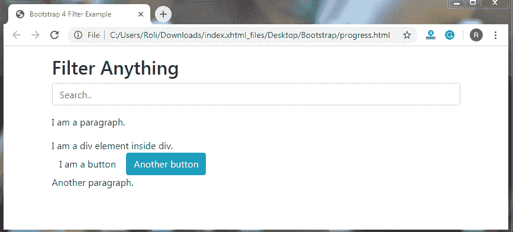

# 自举 4 滤波器

> 原文：<https://www.tutorialandexample.com/bootstrap-filters/>

**自举 4 个过滤器**

Bootstrap 4 提供了用于从列表、表格等中搜索元素的过滤器组件。Bootstrap 不包含任何有助于执行过滤的组件或实用程序。您需要添加 [jQuery](https://www.tutorialandexample.com/jquery-tutorial/) 来过滤元素。

**过滤表格—**您可以借助 [Bootstrap](https://www.tutorialandexample.com/bootstrap-tutorial/) 和 jQuery 过滤表格元素。您可以在表格中搜索项目，如姓名、电子邮件 id 等。

**例子**

```
<!DOCTYPE html>
<html lang="en">
<head>
  <title>Bootstrap 4 Filter Example</title>
  <meta charset="utf-8">
  <meta name="viewport" content="width=device-width, initial-scale=1">
  <link rel="stylesheet" href="https://maxcdn.bootstrapcdn.com/bootstrap/4.4.1/css/bootstrap.min.css">
  <script src="https://ajax.googleapis.com/ajax/libs/jquery/3.5.1/jquery.min.js"></script>
  <script src="https://cdnjs.cloudflare.com/ajax/libs/popper.js/1.16.0/umd/popper.min.js"></script>
  <script src="https://maxcdn.bootstrapcdn.com/bootstrap/4.4.1/js/bootstrap.min.js"></script>
</head>
<body>
<div class="container mt-3">
  <h2>Filterable Table</h2>
  <input class="form-control" id="myInput" type="text" placeholder="Search..">
  <br>
  <table class="table table-bordered">
    <thead>
      <tr>
        <th>Firstname</th>
        <th>Lastname</th>
        <th>Email</th>
      </tr>
    </thead>
    <tbody id="myTable">
      <tr>
        <td>Henry</td>
        <td>Smith</td>
        <td>[email protected]</td>
      </tr>
      <tr>
        <td>Gary</td>
        <td>Davis</td>
        <td>[email protected]</td>
      </tr>
      <tr>
        <td>Thomas</td>
        <td>Stewart</td>
        <td>[email protected]</td>
      </tr>
      <tr>
        <td>Ronald</td>
        <td>Wright</td>
        <td>[email protected]</td>
      </tr>
    </tbody>
  </table>
</div>
<script>
$(document).ready(function(){
  $("#myInput").on("keyup", function() {
    var value = $(this).val().toLowerCase();
    $("#myTable tr").filter(function() {
      $(this).toggle($(this).text().toLowerCase().indexOf(value) > -1)
    });
  });
});
</script>
</body>
</html>
```

**输出:**


**过滤器列表—**过滤器列表与过滤器表格相似。过滤器表和过滤器列表有一个区别。在筛选器表中，我们从表中搜索项目，但在筛选器列表中，我们从列表中搜索项目。

**例子**

```
<!DOCTYPE html>
<html lang="en">
<head>
  <title>Bootstrap 4 Filter Example</title>
  <meta charset="utf-8">
  <meta name="viewport" content="width=device-width, initial-scale=1">
  <link rel="stylesheet" href="https://maxcdn.bootstrapcdn.com/bootstrap/4.4.1/css/bootstrap.min.css">
  <script src="https://ajax.googleapis.com/ajax/libs/jquery/3.5.1/jquery.min.js"></script>
  <script src="https://cdnjs.cloudflare.com/ajax/libs/popper.js/1.16.0/umd/popper.min.js"></script>
  <script src="https://maxcdn.bootstrapcdn.com/bootstrap/4.4.1/js/bootstrap.min.js"></script>
</head>
<body>
<div class="container mt-3">
  <h2>Filterable List</h2>
  <input class="form-control" id="myInput" type="text" placeholder="Search..">
  <br>
  <ul class="list-group" id="myList">
    <li class="list-group-item">First item</li>
    <li class="list-group-item">Second item</li>
    <li class="list-group-item">Third item</li>
    <li class="list-group-item">Fourth</li>
  </ul> 
</div>
<script>
$(document).ready(function(){
  $("#myInput").on("keyup", function() {
    var value = $(this).val().toLowerCase();
    $("#myList li").filter(function() {
      $(this).toggle($(this).text().toLowerCase().indexOf(value) > -1)
    });
  });
});
</script>
</body>
</html>
```

**输出**


**过滤任何东西—**用于过滤任何地方的任何元素，无论是列表、表格、段落还是其他任何东西。

**例子**

```
<!DOCTYPE html>
<html lang="en">
<head>
  <title>Bootstrap 4 Filter Example</title>
  <meta charset="utf-8">
  <meta name="viewport" content="width=device-width, initial-scale=1">
  <link rel="stylesheet" href="https://maxcdn.bootstrapcdn.com/bootstrap/4.4.1/css/bootstrap.min.css">
  <script src="https://ajax.googleapis.com/ajax/libs/jquery/3.5.1/jquery.min.js"></script>
  <script src="https://cdnjs.cloudflare.com/ajax/libs/popper.js/1.16.0/umd/popper.min.js"></script>
  <script src="https://maxcdn.bootstrapcdn.com/bootstrap/4.4.1/js/bootstrap.min.js"></script>
</head>
<body>
<div class="container mt-3">
  <h2>Filter Anything</h2>
  <input class="form-control" id="myInput" type="text" placeholder="Search..">
  <div id="myDIV" class="mt-3">
    <p>I am a paragraph.</p>
    <div>I am a div element inside div.</div>
    <button class="btn">I am a button</button>
    <button class="btn btn-info">Another button</button>
    <p>Another paragraph.</p>
  </div>
</div>
<script>
$(document).ready(function(){
  $("#myInput").on("keyup", function() {
    var value = $(this).val().toLowerCase();
    $("#myDIV *").filter(function() {
      $(this).toggle($(this).text().toLowerCase().indexOf(value) > -1)
    });
  });
});
</script>
</body>
</html>
```

**输出**

 ****