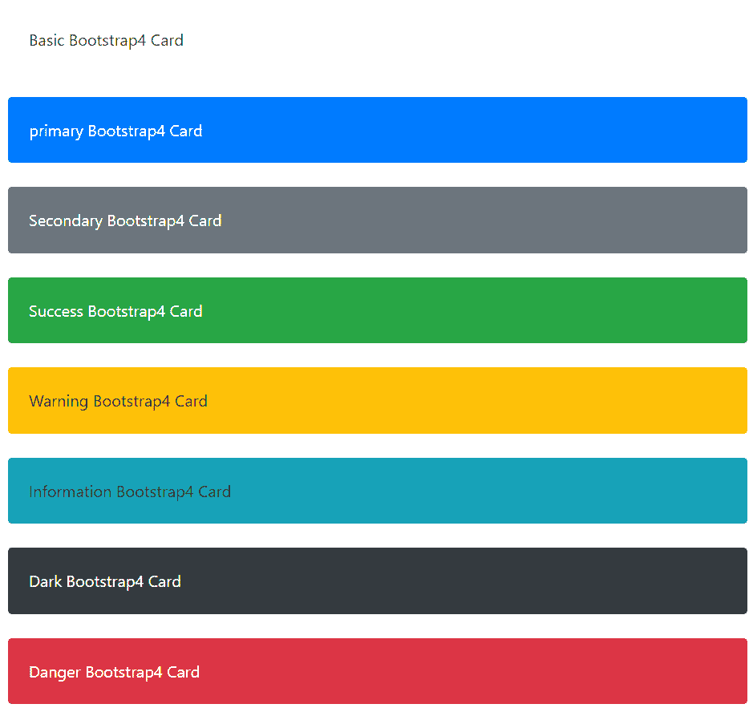
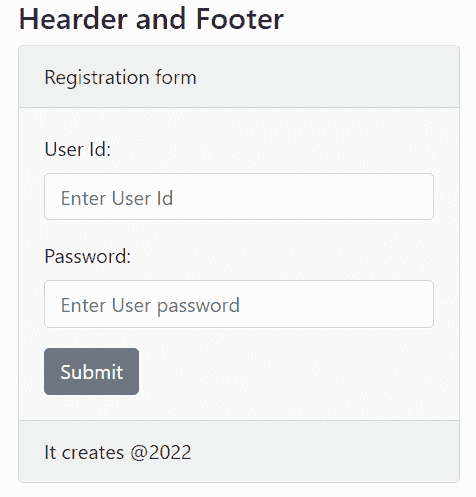
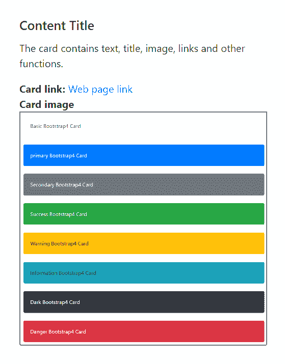
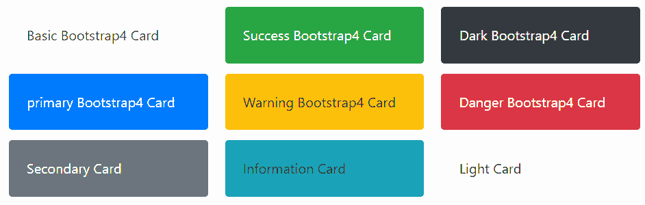

# 自举 4 卡

> 原文：<https://www.tutorialandexample.com/bootstrap-4-card>

在 Bootstrap 4 中，卡片是一个有边框的盒子，其内容周围有填充。它有页眉、页脚、颜色、内容等选项。该卡提供内容的链接、标题、图像和文本。卡片系统地展示表格、表格和复杂的内容。我们可以在一列中创建一个网格系统或一组卡片。

## 卡的类型

网页上使用的卡片有很多种。下表显示了几种 Bootstrap4 卡的语法和描述。


| **Bootstrap4 卡** | **语法** | **描述** |
| 基本卡 | 基本 Bootstrap4 卡 | 引导程序 4 在网页中显示基本卡及其主体。 |
| 主卡 | 初级 Bootstrap4 卡 | 卡片显示为蓝色。它表示页面的重要内容。 |
| 次级卡 | 次级 Bootstrap4 卡 | 卡片显示为灰色。 |
| 成功卡片 | 成功 Bootstrap4 卡 | 卡片显示为绿色。 |
| 信息卡 | 信息 Bootstrap4 卡 | 卡片显示为浅蓝色。 |
| 警告卡 | 警告 Bootstrap4 卡 | 卡片显示为黄色。 |
| 危险卡片 | 危险 Bootstrap4 卡 | 卡片显示为红色 |
| 暗卡 | 暗 Bootstrap4 卡 | 卡片显示为深灰色 |
| 光卡 | 光 Bootstrap4 卡 | 卡片显示为白色或浅灰色。 |


## 上下文引导 4 卡片

上下文卡片显示了它们的颜色、格式和纹理。基本卡需要卡类和卡体类。bootstrap4 卡使用。带有其他上下文类的卡片类。

**例子**

下面的例子展示了不同类型的卡片。

```
<!DOCTYPE html>

<html lang="en">

<head>

  <title>Bootstrap4 cards Example</title>

  <meta charset="utf-8">

  <meta name="viewport" content="width=device-width, initial-scale=1">

  <link rel="stylesheet" href="https://cdn.jsdelivr.net/npm/[email protected]/dist/css/bootstrap.min.css">

  <script src="https://cdn.jsdelivr.net/npm/[email protected]/dist/jquery.slim.min.js"></script>

  <script src="https://cdn.jsdelivr.net/npm/[email protected]/dist/umd/popper.min.js"></script>

  <script src="https://cdn.jsdelivr.net/npm/[email protected]/dist/js/bootstrap.bundle.min.js"></script>

</head>

<body>

 <div class="container" id="cards">

<br>

  <div class = "card">

<div class = "card-body text-dark"> Basic Bootstrap4 Card </div>

</div>

<br>

<div class = "card bg-primary">

<div class = "card-body text-white"> primary Bootstrap4 Card </div>

</div>

<br>

<div class = "card bg-secondary">

<div class = "card-body text-white"> Secondary  Bootstrap4 Card </div>

</div>

<br>

<div class = "card bg-success">

<div class = "card-body text-white"> Success Bootstrap4 Card </div>

</div>

<br>

<div class = "card bg-warning">

<div class = "card-body"> Warning Bootstrap4 Card </div>

</div>

<br>

<div class = "card bg-info">

<div class = "card-body"> Information Bootstrap4 Card </div>

</div>

<br>

<div class = "card bg-dark">

<div class = "card-body text-white"> Dark Bootstrap4 Card </div>

</div>

<br>

<div class = "card bg-danger">

<div class = "card-body text-white"> Danger Bootstrap4 Card </div>

</div>

<br>

</div>

</body>

</html>
```

**输出**

下图显示了给定示例的相关输出。



## 卡片页眉和页脚

**。卡头**和**。card-footer** 类分别为卡片添加了标题和页脚。


| **Bootstrap4 卡** | **语法** | **描述** |
| 页眉 | 标题内容 | 卡头提供了卡体的标题。 |
| 页脚 | 页脚内容 | 卡片页眉为卡片主体提供页脚内容。 |


**例子**

以下示例显示了卡片的页眉和页脚。这个例子在页眉和页脚中使用了 light card 类。

```
<!DOCTYPE html>

<html lang="en">

<head>

<title>Bootstrap4 cards Example</title>

<meta charset="utf-8">

<meta name="viewport" content="width=device-width, initial-scale=1">

<link rel="stylesheet" href="https://cdn.jsdelivr.net/npm/[email protected]/dist/css/bootstrap.min.css">

<script src="https://cdn.jsdelivr.net/npm/[email protected]/dist/jquery.slim.min.js"></script>

<script src="https://cdn.jsdelivr.net/npm/[email protected]/dist/umd/popper.min.js"></script>

<script src="https://cdn.jsdelivr.net/npm/[email protected]/dist/js/bootstrap.bundle.min.js"></script>

</head>

<body>

<div class="container" id="cards">

<h4> Hearder and Footer</h4>

<div class = "card bg-light">

<div class = "card-header"> Registration form </div>

<div class = "card-body">

<form>

<div class = "form-group">

<label for = "uId"> User Id:</label>

<input type = "input" class="form-control" placeholder="Enter User Id" id="uId">

</div>

<div class = "form-group">

<label for = "pass"> Password: </label>

<input type = "input" class="form-control" placeholder="Enter User password"    id="pass">

</div>

<input type = "submit" class="btn btn-secondary">

</form>

</div>

<div class="card-footer"> It creates @2022</div>

</div>

<br>

</div>

</body>

</html>
```

**输出**

下图显示了给定示例的页眉和页脚输出。



## 标题、文本、图像和链接

bootstrap4 卡包含网页的链接、标题、图像和文本。下表显示了卡功能的语法和描述。

 **

| **Bootstrap4 卡** | **语法** | **描述** |
| 标题 | 

# 内容标题

 | 卡片提供了网页内容的标题。 |
| 文本 | 内容数据 | 卡片提供了网页内容的标题。 |
| 图像 |  **或** | 该卡包含卡体顶面或底面的图像。 |
| 环 | [网页链接](javatpoint.com) | 该卡提供了到其他网页的链接。 |


**例子**

下面的例子展示了如何在卡片中创建标题、文本、链接和图像。

```
<!DOCTYPE html>

<html lang="en">

<head>

<title>Bootstrap4 cards Example</title>

<meta charset="utf-8">

<meta name="viewport" content="width=device-width, initial-scale=1">

<link rel="stylesheet" href="https://cdn.jsdelivr.net/npm/[email protected]/dist/css/bootstrap.min.css">

<script src="https://cdn.jsdelivr.net/npm/[email protected]/dist/jquery.slim.min.js"></script>

<script src="https://cdn.jsdelivr.net/npm/[email protected]/dist/umd/popper.min.js"></script>

<script src="https://cdn.jsdelivr.net/npm/[email protected]/dist/js/bootstrap.bundle.min.js"></script>

<style>

img{

border:2px solid grey;

}

.container{

width:30%;

height:30%;

}

</style>

</head>

<body>

<br>

<div class="container" id="cards">

<div class = "card">

<div class = "card-body">

<h5 class = "card-title"> Content Title </h5>

<p class = "card-text">

The card contains text, title, image, links and other functions.

</p>

<b> Card link: </b>

<a href = "https://www.javatpoint.com/" class = "card-link"> Web page link </a> <br>

<b> Card image </b> <br>


</div>

</div>

</div>

</body>

</html>
```

**输出**



## Bootstrap4 卡列

**。card-columns** 类包括多张卡来包含不同类型的数据。


| **Bootstrap4 卡** | **语法** | **描述** |
| 卡片列 | 标题内容 | 卡列包含多张卡。 |


**例子**

以下示例显示了单列中不同类型的卡片。

```
<!DOCTYPE html>

<html lang="en">

<head>

  <title>Bootstrap4 cards Example</title>

  <meta charset="utf-8">

  <meta name="viewport" content="width=device-width, initial-scale=1">

  <link rel="stylesheet" href="https://cdn.jsdelivr.net/npm/[email protected]/dist/css/bootstrap.min.css">

  <script src="https://cdn.jsdelivr.net/npm/[email protected]/dist/jquery.slim.min.js"></script>

  <script src="https://cdn.jsdelivr.net/npm/[email protected]/dist/umd/popper.min.js"></script>

  <script src="https://cdn.jsdelivr.net/npm/[email protected]/dist/js/bootstrap.bundle.min.js"></script>

</head>

<body>

 <div class="container w-50" id="cards">

<div class="card-columns">

  <div class = "card">

<div class = "card-body text-dark"> Basic Bootstrap4 Card </div>

</div>

<div class = "card bg-primary">

<div class = "card-body text-white"> primary Bootstrap4 Card </div>

</div>

<div class = "card bg-secondary">

<div class = "card-body text-white"> Secondary Card </div>

</div>

<div class = "card bg-success">

<div class = "card-body text-white"> Success Bootstrap4 Card </div>

</div>

<div class = "card bg-warning">

<div class = "card-body"> Warning Bootstrap4 Card </div>

</div>

<div class = "card bg-info">

<div class = "card-body"> Information Card </div>

</div>

<div class = "card bg-dark">

<div class = "card-body text-white"> Dark Bootstrap4 Card </div>

</div>

<div class = "card bg-danger">

<div class = "card-body text-white"> Danger Bootstrap4 Card </div>

</div>

<div class = "card bg-light">

<div class = "card-body"> Light Card </div>

</div>

</div>

</div>

</body>

</html>
```

**输出**



## 结论

Bootstrap4 卡有助于轻松显示多种内容及其功能。该卡使用几个类以简单的格式显示复杂的数据。该卡包含基本的用户交互功能，以制作一个用户友好的网页。**