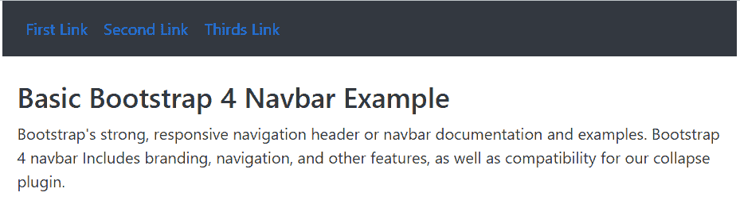

# Bootstrap 4 导航栏

> 原文：<https://www.tutorialandexample.com/bootstrap-4-navbar>

每个网站都使用导航导航条，使其更加用户友好。浏览网站更容易，用户可以立即搜索他们感兴趣的主题。对于网页来说，这是一个强大的响应功能。导航栏位于页面的顶部。

navbar(导航标题)由具有 role="navigation "属性的

<nav>元素或标记构成。要获得 Bootstrap 4 look，您需要。navbar”级。默认情况下，导航栏填充整个屏幕宽度，其功能类似于 Bootstrap 4 flex 容器。</nav>

## 它是如何工作的？

在开始使用导航栏之前，您应该了解以下内容:

*   导航条需要换行。
*   使用。navbar-expand-sm|-md|-lg|-xl 用于响应折叠和配色方案类。
*   默认情况下，导航条及其内容在流体中工作。使用可选的容器使它们的水平宽度保持最小。
*   要修改导航条的间距和其他样式，使用我们的 spacing 和 flex 实用程序类。
*   导航条在网页上是默认响应的，但是我们可以很容易地改变它。
*   折叠 JavaScript 插件负责响应行为。
*   打印时，导航条默认是隐藏的。添加”。d-打印“至”。navbar”来强制打印它们。有关更多信息，请参见 show 实用程序类。
*   使用一个

    <nav>元素来确保可访问性。</nav>

*   如果我们使用一个更通用的元素，比如一个，明确地给每个导航条添加一个 role="navigation ",那么它表示辅助技术。

## Navbar 支持内容

默认情况下，导航栏支持一些子组件。根据需要，从以下选项中进行选择:


| 导航条元素 | 描述 |
| 的”。navbar-品牌" | 用于您公司、产品或项目的名称。 |
| 的”。导航条-导航" | 用于全高和轻型导航。(包括对下拉菜单的支持)。 |
| 的”。navbar-toggler " | 该类使用我们的折叠插件和其他导航切换行为。 |
| 的”。表格内联" | 所有窗体控件和操作的用途。 |
| 的”。导航栏-文本" | 用于添加垂直居中的文本字符串。 |
| . collapse.navbar-collapse | 用于按父断点分组和隐藏导航栏内容。 |
| 的”。导航栏-expand-md&#124;sm&#124;xl " | 用于网页上的水平导航栏。 |


## 基本引导 4 导航条

基本的 bootstrap 4 navbar 包括 navbar 类、navbar 项目和带有网页内容的 navbar 链接。该导航栏水平显示简单的项目名称。我们可以为导航栏选择一个亮或暗的主题。

 ****例子**

以下示例显示了网页的基本 bootstrap 4 navbar。

```
<!DOCTYPE html>

<html lang="en">

<head>

<title> Bootstrap 4 navbar Example </title>

<meta

name = "viewport" content = "width=device-width, initial-scale = 1">

<link rel = "stylesheet" href = "https://cdn.jsdelivr.net/npm/[email protected]/dist/css/bootstrap.min.css">

<script src = "https://cdn.jsdelivr.net/npm/[email protected]/dist/jquery.slim.min.js">

</script>

<script src = "https://cdn.jsdelivr.net/npm/[email protected]/dist/umd/popper.min.js">

</script>

<script src = "https://cdn.jsdelivr.net/npm/[email protected]/dist/js/bootstrap.bundle.min.js">

</script>

</head>

<body>

<div class="container">

<nav class = "navbar navbar-expand-md bg-dark">

<ul class = "navbar-nav" id="links">

<li class = "nav-item" id="link1">

<a class = "nav-link" href="#"> First Link </a>

</li>

<li class = "nav-item" id="link2">

<a class = "nav-link" href="#"> Second Link </a>

</li>

<li class = "nav-item"  id="link3">

<a class = "nav-link" href="#"> Thirds Link </a>

</li>

</ul>

</nav>

<br>

<div class = "container-fluid">

<h3> Basic Bootstrap 4 Navbar Example </h3>

<p> Bootstrap's strong, responsive navigation header or navbar documentation and examples. Bootstrap 4 navbar Includes branding, navigation, and other features, as well as compatibility for our collapse plugin.</p>

</div>

</div>

</body>

</html>
```

**输出**

下图显示了 bootstrap 版本 4 的基本导航栏。



## 带下拉菜单的上下文导航栏

基本的 bootstrap 4 navbar 包括使用背景类的上下文 navbar。我们可以加上“bg-primary”、“bg-primary”、“bg-secondary”、“bg-dark”、“bg-success”等等。导航条使用下拉功能节省空间和用户友好的标题。

**例子**

以下示例为 navbar 使用了具有下拉功能的“bg-secondary”类。

 **```
<!DOCTYPE html>

<html lang="en">

<head>

<title> Bootstrap 4 navbar Example </title>

<meta charset = "utf-8">

<meta name = "viewport" content="width=device-width, initial-scale=1">

<link rel="stylesheet" href="https://cdn.jsdelivr.net/npm/[email protected]/dist/css/bootstrap.min.css">

<script src = "https://cdn.jsdelivr.net/npm/[email protected]/dist/jquery.slim.min.js">

</script>

<script src = "https://cdn.jsdelivr.net/npm/[email protected]/dist/umd/popper.min.js">

</script>

<script src = "https://cdn.jsdelivr.net/npm/[email protected]/dist/js/bootstrap.bundle.min.js">

</script>

<style>

</style>

</head>

<body>

<div class="container ">

<nav class = "navbar navbar-expand-md bg-secondary navbar-dark">

<ul class = "navbar-nav" id="links">

<li class = "nav-item" id="link1">

<a class = "nav-link" href="#"> First Link </a>

</li>

<li class = "nav-item" id="link2">

<a class = "nav-link" href="#"> Second Link </a>

</li>

<li class = "nav-item dropdown"  id="link3">

<a class = "nav-link dropdown-toggle" href = "#" data-toggle = "dropdown"> More Links </a>

<div class = "dropdown-menu bg-light" style = "border:1px solid black;" >

<a class = "dropdown-item" id = "items" href = "#">Item 1</a>

<a class = "dropdown-item" id="items" href = "#">Item 2</a>

<a class = "dropdown-item" id="items" href = "#">Item 3</a>

</div>

</li>

</ul>

</nav>

<br>

<div class = "container-fluid">

<h3> Bootstrap 4 Navbar Example </h3>

<p> Bootstrap's strong, responsive navigation header or navbar documentation and examples. Bootstrap 4 navbar Includes branding, navigation, and other features, as well as compatibility for our collapse plugin.</p>

</div>

</div>

</body>

</html>
```

**输出**

该图像显示了具有下拉功能的辅助导航栏的输出。


## 垂直导航条

基本的 bootstrap 4 创建了一个具有其他功能的垂直导航条。如果 navbar 删除或不使用“.”。navbar-expand-md|sm|xl "类。“navbar-item”使用“active”关键字作为默认链接。

**例子**

以下示例显示了带有激活链接的垂直导航栏。

 **```
<!DOCTYPE html>

<html lang="en">

<head>

<title> Bootstrap 4 navbar Example </title>

<meta charset = "utf-8">

<meta name = "viewport" content="width=device-width, initial-scale=1">

<link rel="stylesheet" href="https://cdn.jsdelivr.net/npm/[email protected]/dist/css/bootstrap.min.css">

<script src = "https://cdn.jsdelivr.net/npm/[email protected]/dist/jquery.slim.min.js">

</script>

<script src = "https://cdn.jsdelivr.net/npm/[email protected]/dist/umd/popper.min.js">

</script>

<script src = "https://cdn.jsdelivr.net/npm/[email protected]/dist/js/bootstrap.bundle.min.js">

</script>

<style>

#links{

color:white;

}

</style>

</head>

<body>

<div class="container w-50" style="border:1px solid black;">

<nav class = "navbar bg-secondary navbar-dark">

<ul class = "navbar-nav" id="links">

<li class = "nav-item active" id="link1">

<a class = "nav-link" href="#"> First Link </a>

</li>

<li class = "nav-item" id="link2">

<a class = "nav-link" href="#"> Second Link </a>

</li>

<li class = "nav-item dropdown"  id="link3">

<a class = "nav-link dropdown-toggle" href="#" data-toggle="dropdown"> More Links </a>

<div class="dropdown-menu" style="border:1px solid black;">

<a class="dropdown-item" id="items" href="#">Item 1</a>

<a class="dropdown-item" id="items" href="#">Item 2</a>

<a class="dropdown-item" id="items" href="#">Item 3</a>

</div>

</li>

</ul>

</nav>

<br>

<div class = "container-fluid">

<h3> Bootstrap 4 Navbar Example </h3>

<p> Bootstrap's strong, responsive navigation header or navbar documentation and examples.</p>

</div>

</div>

</body>

</html>
```

**输出**

下图显示了垂直导航栏及其链接。


下图显示了单击下拉功能后的垂直导航栏。


**带有品牌、表单和按钮的导航条**

基本的 bootstrap4 创建了一个带有其他功能的水平导航条。我们可以在可用的导航栏中添加徽标、搜索标签、表单和按钮。

**例子**

```
<!DOCTYPE html>

<html lang="en">

<head>

<title> Bootstrap 4 navbar Example </title>

<meta charset = "utf-8">

<meta name = "viewport" content="width=device-width, initial-scale=1">

<link rel="stylesheet" href="https://cdn.jsdelivr.net/npm/[email protected]/dist/css/bootstrap.min.css">

<script src = "https://cdn.jsdelivr.net/npm/[email protected]/dist/jquery.slim.min.js">

</script>

<script src = "https://cdn.jsdelivr.net/npm/[email protected]/dist/umd/popper.min.js">

</script>

<script src = "https://cdn.jsdelivr.net/npm/[email protected]/dist/js/bootstrap.bundle.min.js">

</script>

<style>

</style>

</head>

<body>

<div class="container ">

<nav class = "navbar navbar-expand-md bg-secondary navbar-dark">

<a class = "navbar-brand" id = "brand" href="#"> JTP </a>

<ul class = "navbar-nav" id="links">

<li class = "nav-item" id="link1">

<a class = "nav-link" href="#"> First Link </a>

</li>

<li class = "nav-item" id="link2">

<a class = "nav-link" href="#"> Second Link </a>

</li>

<li class = "nav-item dropdown"  id="link3">

<a class = "nav-link dropdown-toggle" href = "#" data-toggle = "dropdown"> More Links </a>

<div class = "dropdown-menu bg-light" style = "border:1px solid black;" >

<a class = "dropdown-item" id = "items" href = "#">Item 1</a>

<a class = "dropdown-item" id="items" href = "#">Item 2</a>

</li>

</ul>

<form class="form-inline" id ="forms" action="">

<input class="form-control mr-sm-2" type="text" name = "search" placeholder="User Search">

<button class="btn btn-primary" type="submit"> Search </button>

</form>

</nav>

<br>

<div class = "container-fluid">

<h3> Bootstrap 4 Navbar Example </h3>

<p> Bootstrap 4 navbar Includes branding, navigation, and other features, as well as compatibility for our collapse plugin.</p>

</div>

</div>

</body>

</html>
```

**输出**


## 结论

bootstrap 4 navbar 为网页提供了一个吸引人的、用户友好的、节省空间的标题。navbar 通过标题行简单方便地导航多个页面和信息。我们可以以适当的格式添加不同的功能和交互式用户元素。******