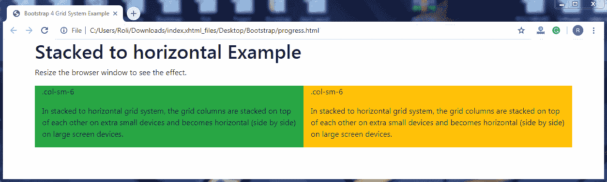
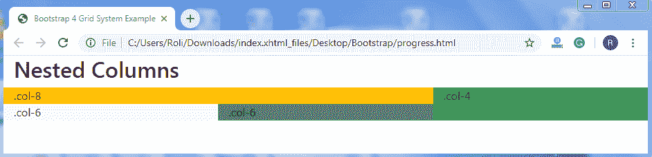
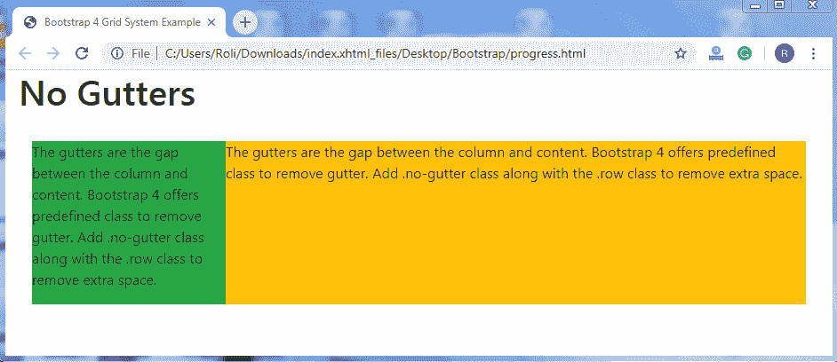
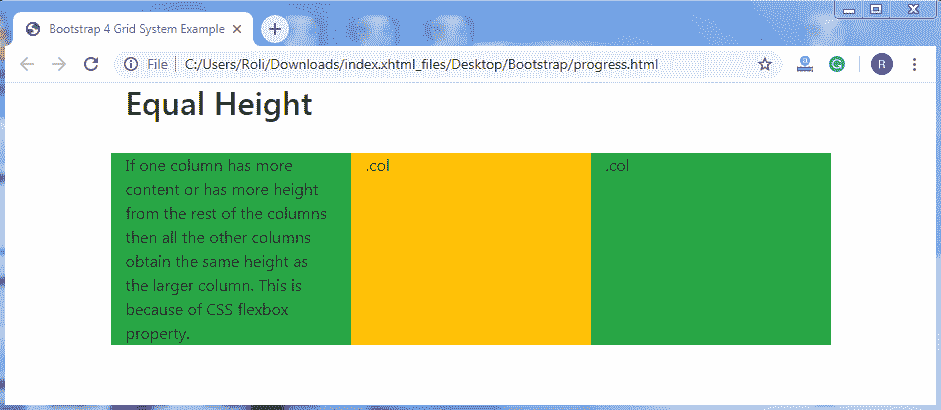
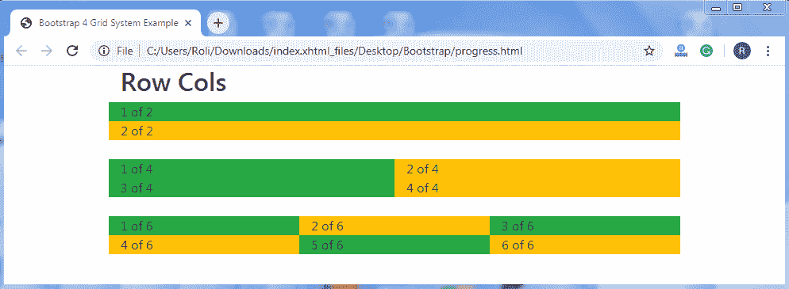

# 引导网格系统示例

> 原文：<https://www.tutorialandexample.com/bootstrap-grid-system-example/>

**自举网格系统示例**

**堆叠至水平—**在堆叠至水平网格系统中，网格列在超小型设备上相互堆叠，在大屏幕设备上变为水平(并排)。

**注意:**你跨越的列数之和不能超过 12。

**例子**

在这个例子中，[引导网格布局](https://www.tutorialandexample.com/bootstrap-grid-system/)被分成两列，这意味着每列获得屏幕宽度的 50%。但是在超小型设备中，这些列堆叠在彼此之上，并获得整个屏幕宽度。

示例:

```
<!DOCTYPE html>
<html lang="en">
<head>
  <title>Bootstrap 4 Grid System Example</title>
  <meta charset="utf-8">
  <meta name="viewport" content="width=device-width, initial-scale=1">
  <link rel="stylesheet" href="https://maxcdn.bootstrapcdn.com/bootstrap/4.4.1/css/bootstrap.min.css">
  <link rel="stylesheet" href="https://use.fontawesome.com/releases/v5.6.3/css/all.css" integrity="sha384-UHRtZLI+pbxtHCWp1t77Bi1L4ZtiqrqD80Kn4Z8NTSRyMA2Fd33n5dQ8lWUE00s/" crossorigin="anonymous">
  <script src="https://ajax.googleapis.com/ajax/libs/jquery/3.5.1/jquery.min.js"></script>
  <script src="https://cdnjs.cloudflare.com/ajax/libs/popper.js/1.16.0/umd/popper.min.js"></script>
  <script src="https://maxcdn.bootstrapcdn.com/bootstrap/4.4.1/js/bootstrap.min.js"></script>
  </head>
<body>
  <div class="container">
  <h1>Stacked to horizontal Example</h1>
  <p>Resize the browser window to see the effect.</p>
  <div class="container">    
    <div class="row">
      <div class="col-sm-6 bg-success">
        <p>.col-sm-6</p>
        <p>In stacked to horizontal grid system, the grid columns are stacked on top of each other on extra small devices and becomes horizontal (side by side) on large screen devices.</p>
      </div>
      <div class="col-sm-6 bg-warning">
        <p>.col-sm-6</p>
        <p>In stacked to horizontal grid system, the grid columns are stacked on top of each other on extra small devices and becomes horizontal (side by side) on large screen devices.</p>   
      </div>
    </div>
  </div>
</div>
</body>
</html>
```

**输出**



**嵌套列–**您还可以创建嵌套列，这意味着列中的列。

**例子**

```
<!DOCTYPE html>
<html lang="en">
<head>
  <title>Bootstrap 4 Grid System Example</title>
  <meta charset="utf-8">
  <meta name="viewport" content="width=device-width, initial-scale=1">
  <link rel="stylesheet" href="https://maxcdn.bootstrapcdn.com/bootstrap/4.4.1/css/bootstrap.min.css">
  <script src="https://ajax.googleapis.com/ajax/libs/jquery/3.5.1/jquery.min.js"></script>
  <script src="https://cdnjs.cloudflare.com/ajax/libs/popper.js/1.16.0/umd/popper.min.js"></script>
  <script src="https://maxcdn.bootstrapcdn.com/bootstrap/4.4.1/js/bootstrap.min.js"></script>
  </head>
<body>
<div class="container-fluid">
  <h2>Nested Columns</h2>
</div>
<div class="container-fluid">
  <div class="row">
    <div class="col-8 bg-warning">
      .col-8
      <div class="row">
        <div class="col-6 bg-light">.col-6</div>
        <div class="col-6 bg-secondary">.col-6</div>
      </div>
    </div>
    <div class="col-4 bg-success">.col-4</div>
  </div>
</div>
</body>
</html>
```

**输出**



**无装订线–**装订线是列和内容之间的间隙。Bootstrap 4 提供了一个预定义的类来删除 gutter。添加**。无地沟**级连同**。row** 类删除多余的空间。

**例子**

```
<!DOCTYPE html>
<html lang="en">
<head>
  <title>Bootstrap 4 Grid System Example</title>
  <meta charset="utf-8">
  <meta name="viewport" content="width=device-width, initial-scale=1">
  <link rel="stylesheet" href="https://maxcdn.bootstrapcdn.com/bootstrap/4.4.1/css/bootstrap.min.css">
  <script src="https://ajax.googleapis.com/ajax/libs/jquery/3.5.1/jquery.min.js"></script>
  <script src="https://cdnjs.cloudflare.com/ajax/libs/popper.js/1.16.0/umd/popper.min.js"></script>
  <script src="https://maxcdn.bootstrapcdn.com/bootstrap/4.4.1/js/bootstrap.min.js"></script>
  </head>
<body>
<div class="container-fluid">
  <h1>No Gutters</h1><br>
  <div class="container-fluid">
    <div class="row no-gutters">
      <div class="col-3 bg-success">
        <p>The gutters are the gap between the column and content. Bootstrap 4 offers predefined class to remove gutter. Add .no-gutter class along with the .row class to remove extra space.</p>
      </div>
      <div class="col-9 bg-warning">
        <p>The gutters are the gap between the column and content. Bootstrap 4 offers predefined class to remove gutter. Add .no-gutter class along with the .row class to remove extra space.</p>
      </div>
    </div>
  </div>
</div>
</body>
</html>
```

**输出**



**等高–**如果一列的内容比其他列多，或者比其他列高，那么所有其他列的高度都与较大的列相同。这是因为 CSS flexbox 属性。

**例子**

```
<!DOCTYPE html>
<html lang="en">
<head>
  <title>Bootstrap 4 Grid System Example</title>
  <meta charset="utf-8">
  <meta name="viewport" content="width=device-width, initial-scale=1">
  <link rel="stylesheet" href="https://maxcdn.bootstrapcdn.com/bootstrap/4.4.1/css/bootstrap.min.css">
  <script src="https://ajax.googleapis.com/ajax/libs/jquery/3.5.1/jquery.min.js"></script>
  <script src="https://cdnjs.cloudflare.com/ajax/libs/popper.js/1.16.0/umd/popper.min.js"></script>
  <script src="https://maxcdn.bootstrapcdn.com/bootstrap/4.4.1/js/bootstrap.min.js"></script>
  </head>
<body>
<div class="container">
  <h2>Equal Height</h2>
</div>
<br>
<div class="container">
  <div class="row">
    <div class="col bg-success">If one column has more content or has more height from the rest of the columns then all the other columns obtain the same height as the larger column. This is because of CSS flexbox property.</div>
    <div class="col bg-warning">.col</div>
    <div class="col bg-success">.col</div>
  </div>
</div>
</body>
</html>
```

**输出**



**Row Cols–**Bootstrap 4 允许您决定一行中出现多少列，而不管一行中有多少列。为此，添加。row-cols-*类以及。向< div >元素添加行类。

**例子**

```
<!DOCTYPE html>
<html lang="en">
<head>
  <title>Bootstrap 4 Grid System Example</title>
  <meta charset="utf-8">
  <meta name="viewport" content="width=device-width, initial-scale=1">
  <link rel="stylesheet" href="https://maxcdn.bootstrapcdn.com/bootstrap/4.4.1/css/bootstrap.min.css">
  <script src="https://ajax.googleapis.com/ajax/libs/jquery/3.5.1/jquery.min.js"></script>
  <script src="https://cdnjs.cloudflare.com/ajax/libs/popper.js/1.16.0/umd/popper.min.js"></script>
  <script src="https://maxcdn.bootstrapcdn.com/bootstrap/4.4.1/js/bootstrap.min.js"></script>
  </head>
<body>
  <div class="container">
  <h2>Row Cols</h2>
  <div class="row row-cols-1">
    <div class="col bg-success">1 of 2</div>
    <div class="col bg-warning">2 of 2</div>
  </div>
  <br>
  <div class="row row-cols-2">
    <div class="col bg-success">1 of 4</div>
    <div class="col bg-warning">2 of 4</div>
    <div class="col bg-success">3 of 4</div>
    <div class="col bg-warning">4 of 4</div>
  </div>
  <br>
  <div class="row row-cols-3">
    <div class="col bg-success">1 of 6</div>
    <div class="col bg-warning">2 of 6</div>
    <div class="col bg-success">3 of 6</div>
    <div class="col bg-warning">4 of 6</div>
    <div class="col bg-success">5 of 6</div>
    <div class="col bg-warning">6 of 6</div>
  </div>
</div>
</body>
</html>
```

**输出**

 ****