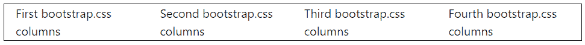

# bootstrap.css 和 bootstrap-theme.css 的区别

> 原文：<https://www.tutorialandexample.com/difference-between-bootstrap-css-and-bootstrap-theme-css>

“bootstrap.css”用于创建一个具有预先存在的设计和上下文的网站。它通过 CSS 样式工具使用基本的引导类，如行和列。通过从引导网站导入 CSS 链接来设计网站的样式。

“bootstrap.css”创建简单的网站，而“bootstrap-theme.css”创建引人注目的网站。

“bootstrap-theme.css”用于为网站提供用户界面组件，如导航栏、按钮和进度条。用户界面组件通过调用类属性来添加代码。Bootstrap-theme.css 文件也用于格式化各种样式的文本。

## Bootstrap.css

Bootstrap 是一个前端开发 CSS 框架。Bootstrap 不允许用户从头开始编写代码。相反，用户使用用 HTML、CSS 和 JavaScript 编写的特定术语和逻辑来构造用户界面组件。

Bootstrap 是一个轻量级、免费的开源框架，用于创建响应迅速、移动友好的 web 项目。Bootstrap 是一个公共内容交付网络，允许用户从其服务器远程加载 CSS、JS 和图片。

**特性**

以下功能包含在引导 CDN 中:

*   我们可以开始使用 Bootstrap，因为它很简单，只需要对 HTML 有基本的了解。
*   简单集成:Bootstrap 可以轻松地与现有和新站点上的其他几个平台和框架相连接。我们也可以将某些引导元素与您当前的 CSS 结合使用。
*   优秀的网格系统:Bootstrap 基于 12 列网格、布局和响应组件。在固定网格和响应网格之间切换只需要一些调整。

**bootstrap . CSS 的问题**

Bootstrap.css 中包含以下缺点:

*   当设计一个网站时，有许多文件被覆盖。
*   JS 文件链接到 jquery，是最常用的库之一，但是大多数插件是不活动的。如果我们不想让大多数网页看起来都一样，我们需要多花一点时间来设计一个设计。

**例子**

下面是一个直接使用 bootstrap 将网页分成三栏而不生成新方法的例子。

```
<!DOCTYPE html>

<html>

<head>

<link rel = "stylesheet" href=

"https://stackpath.bootstrapcdn.com/bootstrap/4.4.1/css/bootstrap.min.css"

Integrity =

"sha384-Vkoo8x4CGsO3+Hhxv8T/Q5PaXtkKtu6ug5TOeNV6gBiFeWPGFN9MuhOf23Q9Ifjh"

crossorigin = "anonymous">

</head>

<body>

<br>

<div class = "container" style = "border:1px solid black;">

<div class = "row">

<div class = "col-sm">

First bootstrap.css columns

</div>

<div class = "col-sm">

Second bootstrap.css columns

</div>

<div class = "col-sm">

Third bootstrap.css columns

</div>

<div class = "col-sm">

Fourth bootstrap.css columns

</div>

</div>

</div>

</body>

</html>
```

**输出**

下图显示了上述 bootstrap.css 示例的基本列。



## 引导程序-主题. css

Bootstrap-theme 是 HTML、CSS 和 JavaScript 的集合。Bootstrap-theme 主题包括 web 项目中使用的样式、页面布局和 UI 组件。navbar、按钮、面板、下拉菜单和进度条都包含在 Bootstrap 主题中。

**特性**

Bootstrap-theme 中包含以下功能:

*   bootstrap-theme 有按钮、下拉菜单、导航栏、进度条和面板。
*   类使我们能够使用类选择器访问某些 CSS 和 JS 元素。
*   按钮中的默认类节省了大量工作，并且可以定制。
*   主题用于设置网格的高度和带有各种样式格式的网页的背景颜色。
*   文本宽度和高度的网格填充很容易调整。
*   Container-fluid 用于创建流体布局，该布局使用所有设备的整个视口宽度。

**Bootstrap-theme . CSS 的问题**

Bootstrap-theme.css 中包含以下缺点:

*   写代码的时候应该记住这些短语。我们应该重读代码，以确保得到正确的输出。
*   指定网站样式的每个短语。

**例子**

下面是一个使用 bootstrap 类将网页分成三列的例子，navbar 和 footer。

```
<!DOCTYPE html>

<html lang="en">

<head>

<title> Bootstrap 4 navbar Example </title>

<meta charset = "utf-8">

<meta name = "viewport" content="width=device-width, initial-scale=1">

<link rel="stylesheet" href="https://cdn.jsdelivr.net/npm/[email protected]/dist/css/bootstrap.min.css">

<script src = "https://cdn.jsdelivr.net/npm/[email protected]/dist/jquery.slim.min.js">

</script>

<script src = "https://cdn.jsdelivr.net/npm/[email protected]/dist/umd/popper.min.js">

</script>

<script src = "https://cdn.jsdelivr.net/npm/[email protected]/dist/js/bootstrap.bundle.min.js">

</script>

<style>

</style>

</head>

<body>

<div class="container w-50">

<div class="container " style=" border-style: groove;">

<nav class = "navbar navbar-expand-md bg-secondary navbar-dark">

<a class = "navbar-brand" id = "brand" href="#"> JTP </a>

<ul class = "navbar-nav" id="links">

<li class = "nav-item" id="link1">

<a class = "nav-link" href="#"> First Link </a>

</li>

<li class = "nav-item" id="link2">

<a class = "nav-link" href="#"> Second Link </a>

</li>

<li class = "nav-item dropdown"  id="link3">

<a class = "nav-link dropdown-toggle" href = "#" data-toggle = "dropdown"> More Links </a>

<div class = "dropdown-menu bg-light" style = "border:1px solid black;" >

<a class = "dropdown-item" id = "items" href = "#">Item 1</a>

<a class = "dropdown-item" id="items" href = "#">Item 2</a>

</li>

</ul>

<form class = "form-inline" id ="forms" action="">

<input class = "form-control mr-sm-2" type="text" name = "search" placeholder="User Search">

<button class = "btn btn-primary" type="submit"> Search </button>

</form>

</nav>

<br>

<div class = "container-fluid">

<h3> Bootstrap Example </h3>

<p> Bootstrap-theme.css includes branding, navigation, and other features, as well as compatibility for our collapse plugin. </p>

</div>

</div>

<br>

<div class="container text-center" style = " border-style: groove;" >

<h4 style = "color:blue;"> Welcome To TutorialAndExample </h4>

<br>

<div class = "row">

<div class = "col-md-4" style = " border-style: groove;">

<p>First Column Project</p>

</div>

<div class = "col-md-4" style = " border-style: groove;">

<p> Second COlumn Project </p>

</div>

<div class = "col-md-4" style = " border-style: groove;">

<div class = "p1" style = " border-style: groove;">

<p> Third column part1 </p>

</div>

<div class = "p1" style = " border-style: groove;">

<p> Third column part2 </p>

</div>

</div>

</div>

</div>

<br>

<footer class = "container text-center"style = " border-style: groove;">

<p>JTP @2022</p>

</footer>

</div>

</body>

</html>
```

**输出**

## 结论

bootstrap.css 和 bootstrap-theme.css 是 bootstrap 框架的一部分，具有各自的特性。bootstrap.css 提供基本特性和功能，而 bootstrap-theme.css 提供基本特性和高级功能和类。这两个功能都用来创建用户友好的网站和网络应用程序。