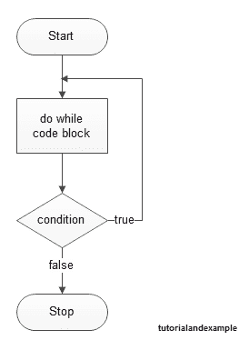

# PHP Do While 循环

> 原文：<https://tutorialandexample.com/php-do-while-loop>

PHP do while 循环用于至少执行一次代码，因为在执行代码后会检查条件。 **语法:**

```
do{
//code to be executed 
}while(condition);
```

**Output**

```
<?php
$n=1; 
do{
echo "$n<br/>"; 
$n++; 
}while($n<=5); 
?>
```

**Output** 1 2 3 4 5[← Prev](https://www.tutorialandexample.com/php-while-loop)[Next →](https://www.tutorialandexample.com/php-functions)