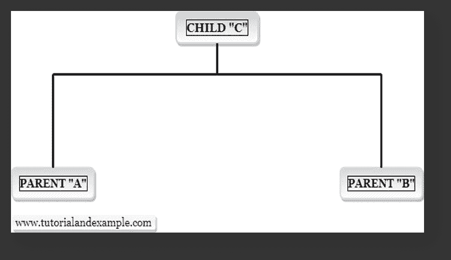

# PHP 中的多重继承

> 原文：<https://www.tutorialandexample.com/multiple-inheritance-in-php/>

PHP 中的多重继承是面向对象编程语言的资源，其中子类或子类可以继承多个父类或超类的资源。 PHP 不支持多重继承，但是使用 PHP 中的接口，我们可以实现它。**使用具有特征的类:**特征是一种支持多重继承的类。不扩展一个以上类的类、对象和特征，但它可以同时扩展多个特征。**语法:**

```
class child_class_name extends parent_class_name
{
    use trait_name;
   ------
   ------
    child_class functions
}
```

**Example:**

```
<?php
// Class Inheritance
class Inheritance
{
public function example()
{
            echo "Hi";
}
}
// Trait formultiple
trait formultiple
{
public function examplem()
{
            echo "\t Traits";
}
}
class Sample extends Inheritance
{
use formultiple;
public function MultipleInheritance()
{
            echo "\n Multiple-Inheritance";
}
}
$check = new Sample();
$check->example();
$check->examplem();
$check->MultipleInheritance();
?>
```

**Output:**

```
Hi Traits Multiple-Inheritance
```

*   在上面的例子中，“traits”与 parent class 一起使用。有一个名为“继承”的“类”，它包含函数 example()和名为“formultiple”的“trait”，它包含函数“examplem()”和一个名为“Sample”的子类，我们正在创建这个名为“check”的类的对象，我们正在调用一个类和一个 trait 的所有函数。

### 使用多种特征:

Multiple Traits can be added into a class by listing them in the use statement, which is separated by commas. **Syntax:**

```
class child_class_name 
{
use trait_name;  
----    
----    
child_class functions
}

```

**Example:**

```
<?php
// trait Multiple
trait Multiple
{
public function example()
{
            echo "Hii";
}
}  
trait formultiple
 {
public function exam()
{
            echo " Multiple";
}
}
class Test
{
use Multiple;
use formultiple;
public function MultipleInheritance()
{
            echo "\n MultipleInheritance";
}
}
$check = new Test();
$check->example();
$check->exam();
$check->MultipleInheritance();
?>
```

**Output:**

```
Hii Multiple MultipleInheritance
```

*   在上面的例子中，使用了“特征”。有两个名为“multiple”的特征，包含函数 example()和“Multiple”，包含函数 exam()，还有一个子类“Test ”,我们正在创建名为“check”的类的对象，并调用特征的所有函数。

### 使用类和接口

**Syntax:**

```
class childclass extends parentclass implements interface1, …
```

**Example:**

```
<?php
class A
{
public function insideA()
{
            echo "A";
            }
}
interface B
 {
public function insideB();
}
class Multiple extends A implements B
 function insideB()
{
                        echo "\n Interface";
            }
public function insidemultiple()
{
            echo "\n Inherited";
            }
}
$check = new multiple();
$check->insideA();
$check->insideB();
$check->insidemultiple();
?>

```

**Output:**

```
A Interface Inherited
```

*   在上面的例子中，接口“B”与类“A”一起使用来实现多个继承。重要的一点是，它不能在接口内部定义函数；应该在子类“Multiple”内部设置。我们使用名为“check”的子(多个)对象调用所有函数。

### 多重界面

**Example:**

```
<?php
interface C
{
public function interfaceC();
}
interface B
 {
public function interfaceB();
}
class Multiple implements B, C
{
// Interface B
            function interfaceB()
 {
                        echo "\n InterfaceB";
            }

// Interface C
            function interfaceC()
 {
                        echo "\n InterfaceC";
            }

            public function insidemultiple()
            {
                        echo "\n Inherited class";
            }
}
$test = new multiple();
$test->interfaceC();
$test->interfaceB();
$test->insidemultiple();
?>
```

**Output:**

```
InterfaceC InterfaceB Inherited class
```

In the above example, multiple interfaces have been used to implement multiple inheritances. There are two interfaces called “B” and “C” that are base classes with the child class that is called “Multiple” and we are calling the functions using its object "test".