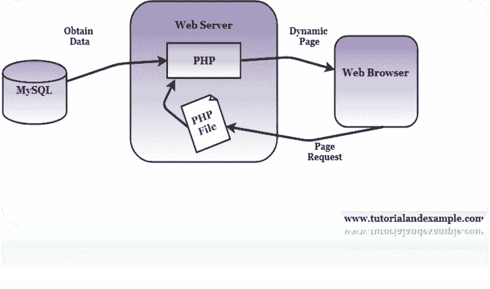

# PHP MySQL 数据库教程

> 原文：<https://www.tutorialandexample.com/php-mysql-database/>

MySQL 是 PHP 中最流行的数据库系统。我们先来了解一下 MySQL。

## 什么是 MySQL？

MySQL is open-source Relational Database Management System (RDMS). The name of MySQL is a combination of "My" which is the name of co-founder Michael Widenius's (main author of the original version of open-source MySQL)  daughter, and "SQL" is abstract from Structured Query Language. MySQL used by many popular websites like Facebook, Twitter, and YouTube. MySQL is easy to install. If we install Wamp or Xampp server, then we do not need to install the MySQL database as it is already available in the Wamp or Xampp server.

*   MySQL 是一个关系数据库管理系统(RDMS)。
*   MySQL 是由 Oracle 公司发布和开发的
*   MySQL 易于使用、快速、强大且安全。
*   MySQL 可以在多种平台上编译。
*   MySQL 是开源的，这意味着我们可以免费、轻松地下载和使用它。
*   MySQL 使用标准 SQL。
*   MySQL 运行在服务器上。

MySQL database stores data into tables like another relational database. A table is a collection of data, and it is divided into rows and columns. Databases are useful for storing information sequentially. A university may have a database with the following tables:

*   学生姓名
*   年龄
*   批量年
*   田
*   移动的

## 下载 MySQL 数据库

We can download MySQL free from this link: [http://www.mysql.com](https://www.mysql.com/)

## MySQL 和 PHP 的关系？

PHP is used to create a program and MySQL is used to interact with data sets. While developing a PHP application, we need to create a connection to a database. Then we will able to insert, delete, select, and update data. There are multiple ways to use MySQL in a PHP script. 

### PHP 连接到 MySQL

PHP 5 works with MySQL database using:

*   MySQLi(“I”代表“改进的”)。
*   PDO (PHP 数据对象)。

An earlier version of PHP used the MySQL extension. 

### 我们应该使用 MySQLi 还是 PDO？

MySQLi or PDO have their advantages:

*   MySQL 只处理 MySQL 数据库，而 PDO 处理 12 个不同的数据库系统。
*   PDO 使工作变得容易。
*   如果我们需要切换我们的项目来使用另一个数据库，在 PDO 的帮助下，我们必须改变连接字符串和一些查询。
*   对于 MySQLi，我们需要重写整个代码，包括查询**。**

## MySQLi 安装:

For installation details: [http://php.net/manual/en/mysqli.installation.php](https://php.net/manual/en/mysqli.installation.php)

### PDO 装置:

For installation details: [http://php.net/manual/en/pdo.installation.php](https://php.net/manual/en/pdo.installation.php)

### 连接到 MySQL:

**Example (MySQLi Object-Oriented)**

```
<?php
$servername = "localhost";
$username = "username";
$password = "password";
// Creating Connection
$conn = new mysqli($servername, $username, $password);
// Connection Checking
if ($conn->connect_error) {
    die("Connection failed: " . $conn->connect_error);
}
echo "Connected successfully";
?>
```

**Example (MySQLi Procedural)**

```
<?php
$servername = "localhost";
$username = "username";
$password = "password";
// Creating connection
$conn = mysqli_connect($servername, $username, $password);
// Checking connection
if (!$conn) {
    die("Connection failed: " . mysqli_connect_error());
}
echo "Connected successfully";
?>
```

**Example (PDO)**

```
<?php
$servername = "localhost";
$username = "username";
$password = "password";
try {
    $conn = new PDO("mysql:host=$servername;dbname=myDB", $username, $password);
    // set the PDO error mode to exception
    $conn->setAttribute(PDO::ATTR_ERRMODE, PDO::ERRMODE_EXCEPTION);
    echo "Connected successfully";
    }
catch(PDOException $e)
    {
    echo "Connection failed: " . $e->get Message();
    }
?>
```

### 关闭连接:

The connection can be closed automatically when the script ends. To close the connection before, we can use the following: **Example (MySQLi Object-Oriented)**

```
$conn->close();
```

**Example (MySQLi Procedural)**

```
mysqli_close($conn);
```

**Example (PDO)**

```
$conn = null;
```

### PHP 创建 MySQL 数据库

Create MySQL Database using MySQLi: The CREATE DATABASE command is used to create a database in MySQL. Create a database name with "details". **  Example (MySQLi Object-Oriented)**

```
<?php
$servername = "localhost";
$username = "username";
$password = "password";
// Create connection
$conn = new mysqli($servername, $username, $password);
// Check connection
if ($conn->connect_error) {
    die("Connection failed: " . $conn->connect_error);
}
// Create database
$sql = "CREATE DATABASE details";
if ($conn->query($sql) === TRUE)
{
    echo "Database created successfully";
}
else
 {
    echo "Error creating database: " . $conn->error;
}
$conn->close();
?>
```

**Example MySQLi Procedural**

```
<?php
$servername = "localhost";
$username = "username";
$password = "password";
// Creating connection
$conn = mysqli_connect($servername, $username, $password);
// Checking connection
if (!$conn) {
die("Connection failed: " . mysqli_connect_error());
}
// Creating database
$sql = "CREATE DATABASE details";
if (mysqli_query($conn, $sql))
{
    echo "Database created successfully";
}
else
 {
    echo "Error creating database: " . mysqli_error($conn);
}
mysqli_close($conn);
?>

```

Create a database name with "mydetails". **Example (PDO)**

```
<?php
$servername = "localhost";
$username = "username";
$password = "password";
try
{
    $conn = new PDO("mysql:host=$servername", $username, $password);
    // set the PDO error mode to exception
    $conn-> setAttribute(PDO::ATTR_ERRMODE, PDO::ERRMODE_EXCEPTION);
    $sql = "CREATE DATABASE mydetails";
    // use exec() because no results are returned
    $conn->exec($sql);
    echo "Database created successfully<br>";
    }
catch(PDOException $e)
    {
    echo $sql . "<br>" . $e->getMessage();
    }
$conn = null;
?>
```

*   PDO 有一个异常类，用于处理数据库查询中可能出现的任何问题。如果在 try { }块中引发异常，脚本将停止执行，控制权直接转移到第一个 catch () {}块。

### PHP 创建 MySQL 表:

A MySQL database table has its unique name, and it consists of rows and columns.

## 使用 MySQL 创建一个 MySQL 表:

For creating a table, we use CREATE TABLE command in the MySQL database. We will create a table with a name of "students", which consists of five columns, "id", "first_name", "last_name", "age", and "batch". The columns can hold the data which can specify the data types.

### **每列的属性:**

*   NOT NULL:每行包含一个列值。行不能为空。
*   默认值:当没有设置值时，我们可以设置任何默认值。
*   AUTOINCREMENT:每当添加一条新记录时，MySQL 自动将该字段的值增加 1。
*   主键:用于唯一标识表中的行。

The table should have a primary key column (like "id"). The value of the primary key column must be unique. **Example (MySQLi Object-oriented):**

```
<?php
$servername = "localhost";
$username = "username";
$password = "password";
$dbname = "details";
// Creating connection
$conn = new mysqli($servername, $username, $password, $dbname);
// Check connection
if ($conn->connect_error) {
    die("Connection failed: " . $conn->connect_error);
}
$sql = "CREATE TABLE students(
id INT(2) AUTO_INCREMENT PRIMARY KEY,
first_name VARCHAR(30) NOT NULL,
last_name VARCHAR(30) NOT NULL,
age INT(5),
batch VARCHAR(20)
)";
if ($conn->query($sql) === TRUE) {
    echo "Table students created successfully";
}
else {
    echo "Error creating table: " . $conn->error;
}
$conn->close();
?>
```

**Example (MySQLi Procedural):**

```
<?php
$servername = "localhost";
$username = "username";
$password = "password";
$dbname = "details";
// creating connection
$conn = mysqli_connect ($servername, $username, $password, $dbname);
// Check connection
if (!$conn) {
    die("Connection failed: " . mysqli_connect_error());
}
$sql = "CREATE TABLE students(
id INT(2) AUTO_INCREMENT PRIMARY KEY,
first_name VARCHAR(30) NOT NULL,
last_name VARCHAR(30) NOT NULL,
age INT(5),
batch VARCHAR(20)
)";
if (mysqli_query($conn, $sql)) {
    echo "Table students created successfully";
} else {
    echo "Error creating table: " . mysqli_error($conn);
}
mysqli_close($conn);
?>
```

**Example (PDO)**

```
<?php
$servername = "localhost";
$username = "username";
$password = "password";
$dbname = "mydetails";
try {
    $conn = new PDO("mysql:host=$servername;dbname=$dbname", $username, $password);
    // set the PDO error mode to exception
    $conn->setAttribute(PDO::ATTR_ERRMODE, PDO::ERRMODE_EXCEPTION);
$sql = "CREATE TABLE students(
id INT(2) AUTO_INCREMENT PRIMARY KEY,
first_name VARCHAR(30) NOT NULL,
last_name VARCHAR(30) NOT NULL,
age INT(5),
batch VARCHAR(20)
)";
    // use exec() because no results are returned
    $conn->exec($sql);
    echo "Table students created successfully";
    }
catch(PDOException $e)
    {
    echo $sql . "<br>" . $e->getMessage();
    }
$conn = null;
?>
```

### PHP 向 MySQL 插入数据:

Once the database and table created, we can start inserting data into them. **Syntax:**

```
INSERT INTO table_name (column1, column2, column3,...)
VALUES (value1, value2, value3,...)
```

**Syntax Rules:**

*   查询必须用 PHP 语言引用。
*   查询中的字符串值必须用引号括起来。
*   数字和单词值不能用引号引起来。

*   SQL 查询中不需要指定列 AUTO _ INCREMENT(“id”)。MySQL 会自动添加值。

**Example (MySQLi Object-Oriented):**

```
<?php
$servername = "localhost";
$username = "username";
$password = "password";
$dbname = "details";
// Creating connection
$conn = new mysqli($servername, $username, $password, $dbname);
// Check connection
if ($conn->connect_error)
 {
    die("Connection failed: " . $conn->connect_error);
}
$sql = "INSERT INTO students (first_name, last_name, age, batch)
VALUES ('Sonoo', 'Jaiswal', '23', '2015')";
if ($conn->query($sql) === TRUE)
{
    echo "New record created successfully";
}
 else
 {
    echo "Error: " . $sql . "<br>" . $conn->error;
}
$conn->close();
?>
```

**Example (MySQLi Procedural):**

```
<?php
$servername = "localhost";
$username = "username";
$password = "password";
$dbname = "details";
// Creating connection
$conn = mysqli_connect($servername, $username, $password, $dbname);
// Check connection
if (!$conn)
{
    die("Connection failed: " . mysqli_connect_error());
}
$sql = "INSERT INTO students (first_name, last_name, age, batch)
VALUES ('Sonoo', 'Jaiswal', '23', '2015')";
if (mysqli_query($conn, $sql))
{
    echo "New record created successfully";
}
else
{
    echo "Error: " . $sql . "<br>" . mysqli_error($conn);
}
mysqli_close($conn);
?>
```

**Example (PDO):**

```
<?php
$servername = "localhost";
$username = "username";
$password = "password";
$dbname = "mydetails";
try
{
    $conn = new PDO("mysql:host=$servername;dbname=$dbname", $username, $password);
    // set the PDO error mode to exception
    $conn->setAttribute(PDO::ATTR_ERRMODE, PDO::ERRMODE_EXCEPTION);
    $sql = "INSERT INTO students (first_name, last_name, age, batch)
VALUES ('Sonoo', 'Jaiswal', '23', '2015')";
  // use exec() because no results are returned
    $conn->exec($sql);
    echo "New record created successfully";
    }
catch(PDOException $e)
    {
    echo $sql . "<br>" . $e->getMessage();
    }
$conn = null;
?>
```

## MySQL 插入多条记录:

Multiple MySQL commands can be executed with the mysqli_multi_query(). **Example (MySQLi Object-Oriented):**

```
<?php
$servername = "localhost";
$username = "username";
$password = "password";
$dbname = "details";
// Creating connection
$conn = new mysqli($servername, $username, $password, $dbname);
// Checking connection
if ($conn->connect_error)
{
    die("Connection failed: " . $conn->connect_error);
}
$sql = "INSERT INTO students (first_name, last_name, age, batch)
VALUES ('Sonoo', 'Jaiswal', '23', '2015')";
$sql .= "INSERT INTO students (first_name, last_name, age, batch)
VALUES ('Rahul', 'Jain', '31', '2019')";
$sql .= "INSERT INTO students (first_name, last_name, age, batch)
VALUES ('Mehak', 'Malik', '26', '2014')";
if ($conn->multi_query($sql) === TRUE)
{
    echo "New records created successfully";
}
 else
 {
    echo "Error: " . $sql . "<br>" . $conn->error;
}
$conn->close();
?>
```

*   每个 MySQL 命令必须用分号(；).

**Example (MySQLi Procedural):**

```
<?php
$servername = "localhost";
$username = "username";
$password = "password";
$dbname = "details";
// Create connection
$conn = mysqli_connect($servername, $username, $password, $dbname);
// Check connection
if (!$conn) {
    die("Connection failed: " . mysqli_connect_error());
}
$sql = "INSERT INTO students (first_name, last_name, age, batch)
VALUES ('Sonoo', 'Jaiswal', '23', '2015')";
$sql .= "INSERT INTO students (first_name, last_name, age, batch)
VALUES ('Rahul', 'Jain', '31', '2019')";
$sql .= "INSERT INTO students (first_name, last_name, age, batch)
VALUES ('Mehak', 'Malik', '26', '2014')";
if (mysqli_multi_query($conn, $sql)) {
    echo "New records created successfully";
} else {

   echo "Error: " . $sql . "<br>" . mysqli_error($conn);
}
mysqli_close($conn);
?>
```

**Example (PDO):**

```
<?php
$servername = "localhost";
$username = "username";
$password = "password";
$dbname = "mydetails";
try {
    $conn = new PDO("mysql:host=$servername;dbname=$dbname", $username, $password);
    // set the PDO error mode to exception
    $conn->setAttribute(PDO::ATTR_ERRMODE, PDO::ERRMODE_EXCEPTION);
    // begin the transaction
    $conn->beginTransaction();
    // our SQL statements
    $conn->exec("INSERT INTO students (first_name, last_name, age, batch)
VALUES ('Sonoo', 'Jaiswal', '23', '2015')");
    $conn->exec("INSERT INTO students (first_name, last_name, age, batch)
VALUES ('Rahul', 'Jain', '31', '2019')");
    $conn->exec("INSERT INTO students (first_name, last_name, age, batch)
VALUES ('Mehak', 'Malik', '26', '2014')");
    // commit the transaction
    $conn->commit();
    echo "New records created successfully";
    }
catch(PDOException $e)
    {
    // roll back the transaction if something failed
    $conn->rollback();
    echo "Error: " . $e->getMessage();
    }
$conn = null;
?>
```

## PHP 从 MySQL 中选择数据:

The select command is used to select data from one or more tables. **Syntax:**

```
SELECT coloumn_name from table_name
```

The above syntax used to select data from a specified column.

```
SELECT * from table_name
```

In the above syntax, the (*****) character is used to select data from all the columns.

### 使用 MySQLi 选择数据:

**Example (MySQLi Object-Oriented):**

```
<!DOCTYPE html>
<html>
<body>
<?php
$servername = "localhost";
$username = "username";
$password = "password";
$dbname = "details";
// Creating connection
$conn = new mysqli($servername, $username, $password, $dbname);
// Check connection
if ($conn->connect_error)
 {
    die("Connection failed: " . $conn->connect_error);
}
$sql = "SELECT id, first_name, last_name FROM students";
$result = $conn->query($sql);
if ($result->num_rows > 0) {
    // output data of each row
    while($row = $result->fetch_assoc()) {
        echo "<br> id: ". $row["id"]. " - Name: ". $row["first_name"]. " " . $row"last_name"] . "<br>";
    }
} else {
    echo "0 results";
}
$conn->close();
?>
</body>
</html>
```

The above example selects the id, first_name, and last_name columns from the Students table.  In the above code, we have set a MySQL query which selects the id, first_name and last_name columns from the Students table. The next line runs the query and puts the output data into a variable which is known as a  $result. The num_row() function is used to check the more than zero rows returned or not.  If the more than zero rows returned, the fetch_assoc() function keeps all the output into an associative array by which we can loop through. The while() loops with the result set and outputs the data by id, first_name, and last_name columns. **Example(MySQLi Procedural):**

```
<?php
$servername = "localhost";
$username = "username";
$password = "password";
$dbname = "details";
// Creating connection
$conn = mysqli_connect($servername, $username, $password, $dbname);
// Check connection
if (!$conn)
 {
    die("Connection failed: " . mysqli_connect_error());
}
$sql = "SELECT id, first_name, last_name FROM students";
$result = mysqli_query($conn, $sql);
if (mysqli_num_rows($result) > 0)
{
    // output data of each row
    while($row = mysqli_fetch_assoc($result))
{
        echo "id: " . $row["id"]. " - Name: " . $row["first_name"]. " " . $row"last_name"]. "<br>";
    }
}
else
{
    echo "0 results";
}
mysqli_close($conn);
?>
```

## 使用 PDO 选择数据:

**Example (PDO):**

```
<?php
echo "<table style='border: solid 1px black;'>";
echo "<tr>
<th>Id</th>
<th>Firstname</th>
<th>Lastname</th></tr>";
class TableRows extends RecursiveIteratorIterator
 {
    function __construct($it)
{
        parent::__construct($it, self::LEAVES_ONLY);
    }
    function current()
 {
        return "<td style='width:150px;border:1px solid black;'>" . parent::current(). "</td>";
    }
    function beginChildren()
{
        echo "<tr>";
    }
    function endChildren()
{
        echo "</tr>" . "\n";
    }
}
$servername = "localhost";
$username = "username";
$password = "password";
$dbname = "mydetails";
Try
 {
    $conn = new PDO("mysql:host=$servername;dbname=$dbname", $username, $password);
    $conn->setAttribute(PDO::ATTR_ERRMODE, PDO::ERRMODE_EXCEPTION);
    $stmt = $conn->prepare("SELECT id, first_name, last_name FROM students");
    $stmt->execute();
    // set the resulting array to associative
    $result = $stmt->setFetchMode(PDO::FETCH_ASSOC);
    foreach(new TableRows(new RecursiveArrayIterator($stmt->fetchAll())) as $k=>$v)
 {
        echo $v;
    }
}
catch(PDOException $e)
{
    echo "Error: " . $e->getMessage();
}
$conn = null;
echo "</table>";
?>
```

### 从 MySQL 中删除数据:

The DELETE command is used to delete a data/record from a table. **Syntax:**

```
DELETE FROM table_name
WHERE column_name = value.
```

*   column_name:我们要从哪一列中选取一个值。
*   value:我们要从所选列中删除的值。

**"STUDENTS" Table:**

| **Id** | **名字** | **姓氏** | **年龄** | **批次** |
| One | 园子 | 贾斯瓦尔 | Twenty-three | Two thousand and fifteen |
| Two | 拉胡尔 | 耆那教教徒 | Thirty-one | Two thousand and nineteen |
| Three | Mehak | 酋长 | Twenty-six | Two thousand and fourteen |

**Example (MySQLi Object-Oriented):**

```
<?php
$servername = "localhost";
$username = "username";
$password = "password";
$dbname = "details";
// Creating connection
$conn = new mysqli($servername, $username, $password, $dbname);
// Checking connection
if ($conn->connect_error)
{
    die("Connection failed: " . $conn->connect_error);
}
//deleting a record
$sql = "DELETE FROM students WHERE id=3";
if ($conn->query($sql) === TRUE)
{
    echo "Record deleted successfully";
}
 else
{
    echo "Error deleting record: " . $conn->error;
}
$conn->close();
?>
```

**Example (MySQLi Procedural):**

```
<?php
$servername = "localhost";
$username = "username";
$password = "password";
$dbname = "details";
// Creating connection
$conn = mysqli_connect($servername, $username, $password, $dbname);
// Checking connection
if (!$conn)
{
    die("Connection failed: " . mysqli_connect_error());
}
//deleting a record
$sql = "DELETE FROM students WHERE id=3";
if (mysqli_query($conn, $sql))
{
    echo "Record deleted successfully";
}
 else
{
    echo "Error deleting record: " . mysqli_error($conn);
}
mysqli_close($conn);
?>
```

**Example(PDO):**

```
<?php
$servername = "localhost";
$username = "username";
$password = "password";
$dbname = "mydetails";
try
{
    $conn = new PDO("mysql:host=$servername;dbname=$dbname", $username, $password);
    // set the PDO error mode to exception
    $conn->setAttribute(PDO::ATTR_ERRMODE, PDO::ERRMODE_EXCEPTION);
    //deleting a record
    $sql = "DELETE FROM students WHERE id=3";
    // use exec() because no results are returned
    $conn->exec($sql);
    echo "Record deleted successfully";
    }
catch(PDOException $e)
    {
    echo $sql . "<br>" . $e->getMessage();
    }
$conn = null;
?>
```

Let`s look at the "students" table after deletion of record:

| **Id** | **名字** | **姓氏** | **年龄** | **批次** |
| One | 园子 | 贾斯瓦尔 | Twenty-three | Two thousand and fifteen |
| Two | 拉胡尔 | 耆那教教徒 | Thirty-one | Two thousand and nineteen |

### MySQL 中的 PHP 更新数据:

The UPDATE command is used to update existing records in a table. **"STUDENTS" Table:**

| **Id** | **名字** | **姓氏** | **年龄** | **批次** |
| One | 园子 | 贾斯瓦尔 | Twenty-three | Two thousand and fifteen |
| Two | 拉胡尔 | 耆那教教徒 | Thirty-one | Two thousand and nineteen |

**Example (MySQLi Object-Oriented):**

```
<?php
$servername = "localhost";
$username = "username";
$password = "password";
$dbname = "details";
// Creating connection
$conn = new mysqli($servername, $username, $password, $dbname);
// Checking connection
if ($conn->connect_error)
{
    die("Connection failed: " . $conn->connect_error);
}
$sql = "UPDATE students SET last_name='Jain' WHERE id=2";
if ($conn->query($sql) === TRUE)
{
    echo "Record updated successfully";
}
else
 {
    echo "Error updating record: " . $conn->error;
}
$conn->close();
?>
```

Example (MySQLi Procedural):

```
<?php
$servername = "localhost";
$username = "username";
$password = "password";
$dbname = "details";
// Creating connection
$conn = mysqli_connect($servername, $username, $password, $dbname);
// Checking connection
if (!$conn)
 {
    die("Connection failed: " . mysqli_connect_error());
}
$sql = "UPDATE students SET last_name='Jain' WHERE id=2";
if (mysqli_query($conn, $sql))
{
    echo "Record updated successfully";
}
 else
{
    echo "Error updating record: " . mysqli_error($conn);
}
mysqli_close($conn);
?>
```

**Example (PDO):**

```
<?php
$servername = "localhost";
$username = "username";
$password = "password";
$dbname = "mydetails";
try {
    $conn = new PDO("mysql:host=$servername;dbname=$dbname", $username, $password);
    // set the PDO error mode to exception
    $conn->setAttribute(PDO::ATTR_ERRMODE, PDO::ERRMODE_EXCEPTION);
    $sql = "UPDATE students SET last_name='Jain' WHERE id=2";
    // Preparing statement
    $stmt = $conn->prepare($sql);
    // executing the query
    $stmt->execute();
    echo $stmt->rowCount() . " records UPDATED successfully";
    }
catch(PDOException $e)
    {
    echo $sql . "<br>" . $e->getMessage();
    }
$conn = null;
?>
```

Let`s look at the "students" table after updated the record:

| **Id** | **名字** | **姓氏** | **年龄** | **批次** |
| One | 园子 | 耆那教教徒 | Twenty-three | Two thousand and fifteen |
| Two | 拉胡尔 | 耆那教教徒 | Thirty-one | Two thousand and nineteen |

### 来自 MySQL 的 PHP 限制数据:

**LIMIT** clause is used to define the number of records to return. The LIMIT clause makes the code easy for multi-page results and pagination with MySQL, which is very useful on large tables. Returning a large number of records can impact on performance.

```
$sql = "SELECT * FROM Employee LIMIT 10";
```

In the above code, we have selected all the records from 1-10 from a table called "Employee". When the above query runs, it will return the first 10 records.