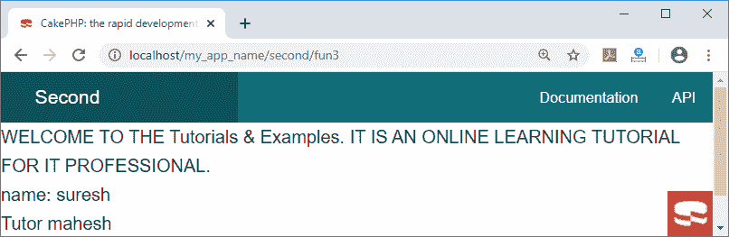
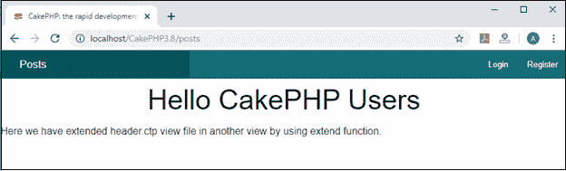

# CakePHP 视图变量

> 原文：<https://www.tutorialandexample.com/cakephp-view-variables/>

视图变量是那些从控制器获取值的变量，这些变量传递到视图模板中。通过这个 set()函数，我们可以向视图模板传递一个值，并且可以使用 set()从控制器添加任何变量。这一组变量将在视图和动作呈现的布局中可用。

**语法**:

```
Cake\View\View::set (string $var, mixed $value)
$this->set( ‘activevariableName’, ’values’);  
```

这个集合函数有一个变量名和它的值。您应该始终记住在输出之前忽略任何用户数据，因为 CakePHP 不会自动从输出中转义。您可以使用 h()函数避免用户内容:

= h($user-> bio); ?>

比如:

```
<?php
<p>My name is <?=h(name)?></p> // this is for security when we passed 
```

**示例**:在这个示例中，我们将看到如何创建变量并将值从控制器传递给视图。

在这里，我们创建了一个文件 SecondController.php，我们创建了一个函数 fun3()，其中我们已经创建了一个名称和导师变量。此外，我们已经传递了变量的值。

```
<?php
             namespace App\Controller;
             use App\Controller\AppController;
             class SecondController extends AppController
                         {
                                     public function fun3()
                                     {
                          $this->set('name','suresh'); // $name will be used as variable in view file 
                       $this->set("tutor","mahesh");    //$tutor will be used as variable in view file   
                               }
               }
  ?>                                     
```

现在我们将创建 fun3.ctp 文件

```
<p> WELCOME TO THE Tutorials & Examples . IT IS AN ONLINE LEARNING TUTORIAL 
FOR IT PROFESSIONAL.
<br/>
 name: <?php  echo $name; ?>
<br/>
 Tutor <?php  echo $tutor; ?>
</p> 
```

**输出:**



### 回声功能的交替使用

Echo，或打印一个变量，用于显示模板文件中的输出:

```
 <?php echo $name;
 ?> 
```

您也可以不用编写 PHP 和 echo 来编写这个语法。

使用短标签支持:

```
<? = $name ?>
```

编码后，在本地主机服务器上运行您的程序，如 wamp 或 xampp，您将看到这种类型的结果；

**同样，你也可以在一个数组中执行:**

例子:你必须为你的控制器的动作写一个数组

```
public function action() {
                   $online = array('name'=> 'Bala', 'teacher' => 'graphics', 'age' => '41');
              };
                  $this->set("data",$online); 
        And in your ctp file you have to write :
                                   <?php print_r($data); ?>  \\ this will show whole array.
   If you want to print only a particular element then
              <?php echo $data['age']; ?>  
```

还有另一种方法可以通过 **compact()函数**将数组数据发送到视图文件。在 php 的这个函数中，我们可以简单地传递数组的变量，而不用这个符号“ **$** ”。

```
Public function action() {
                   $online = array('name'=> 'Bala', 'teacher' => 'graphics', 'age' => '41');
              }; 
               $this->set(compact("online")); 
```

而且你还要在 **action.ctp** 文件中写:

```
<?php echo
print_r($online); ?>
```

### 替代控制结构

像 if、for、foreach、switch 和 while 这样的控制结构可以用简化的格式编写。注意终止代码不需要大括号；相反，我们可以使用 endforeach 标记来终止代码。另外，请注意，每条语句后(最后一条除外)没有使用分号，而是使用了冒号。以下是使用 foreach 的示例:

```
<ul>
 <?php foreach($item as $value): ?>
 <li> <?= value ?></li>
 <?php endforeach; ?>
</ul> 
```

**再比如，用 if/elseif/else。**

```
<?php if ($username == ‘amit’):
 ?>
 <h3>Hi amit</h3>
 <?php elseif ($username ==’sumit’):
 ?>
 <h3> Hi sumit </h3>
 <?php else: ?>
    <h3> Hi unknown user</h3>
 <?php endif;  ?> 
```

### 视图扩展

视图扩展方法允许您通过使用扩展函数调用视图名称，将一个视图的文本打包到另一个视图上。您也可以使用扩展功能创建视图块并在单个块中调用。它的工作方式类似于父子关系，在这种关系中，我们可以使用 extend 方法将一个视图调用到另一个视图中。

通过对您想要在特定页面上显示的公共视图文件使用扩展函数，然后您可以通过在扩展中定义它们的名称来使用它。它还降低了程序中代码的复杂性。

```
 <?php
 namespace App\Controller;
 use App\Controller\AppController;
 class PostsController extends AppController{
  public function index(){
 }
 }
 ?> 
```

现在我们已经在**C:\ wamp 64 \ www \ cakephp 3.8 \ src \ Template \ Posts \**文件夹中创建了 helper.ctp。

```
 <div align = "center"><h1>Hello CakePHP Users</h1></div>
 <?= $this->fetch('content') ?> 
```

同样，我们在**C:\ wamp 64 \ www \ cakephp 3.8 \ src \ Template \ Posts \**文件夹中创建了 index.ctp

```
 <?php $this->extend('header'); ?>
 Here we have used extended function in header.ctp view file for calling in another view by using extend(). 
```

现在我们将通过编写**localhost/cakephp 3.8/posts/index**在 localhost 中运行这个程序。



注意:如果你想在你的网页上显示任何内容，那么你必须在内容块中定义它。当视图调用 extend()时，从当前视图文件的底部开始执行。我们还可以在视图文件中多次调用 extend()函数，然后它将覆盖下一步要处理的父视图。

```
$this -> extend(‘view’);
$this -> extend(‘ index’); 
```