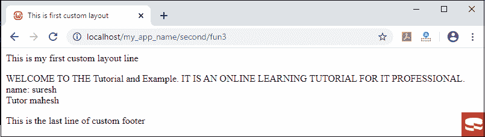
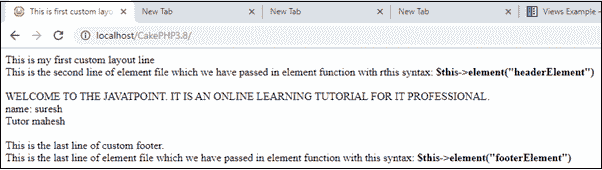

# CakePHP 布局和元素

> 原文：<https://www.tutorialandexample.com/cakephp-layouts/>

布局包括可以在视图中包装的表示代码。这意味着你想在你的视图中看到的东西应该在布局中得到很好的定位。当你创建一个布局文件时，你必须告诉 CakePHP 你可以在哪里放置你的视图代码的数据，这些数据可以由控制器来呈现，CakePHP 的默认布局位于**src/Template/Layout/default . CTP .**当你为你的应用程序创建一个布局时，你必须确保它包括这个语法**" $ this->fetch(' content ')；"**用于获取内容。

```
<?=
$this->fetch('content')?>                
//it displays the content from the current rendered //view file of .ctp 
```

或者

您也可以像这样定义 php 语法:

```
<?php echo $this->fetch('content'); ?>
```

如果你用过这个语法 **<？= ?>** “对于打印任何文本，那么你就不需要写 **php** 以及**echo；php 中默认不考虑 i** t。

**默认**文件加载了模板的动作文件中所有可以在浏览器上呈现的内容。 **dafault.ctp** 文件包含了 CakePHP 应用程序的默认页面布局，如果你想修改页面，那么你可以转到 **Layout/default.ctp** 进行修改

```
<div class="container clearfix">
         <?= $this->fetch('content') ?>
</div> 
```

上述函数存在于 **default.ctp** 文件中，用于使用 fetch('content ')函数提取【controller.php】文件中的内容。

现在我们将使用控制器文件中的布局创建一个程序。为此，我们需要三个文件。

1.  SecondController.php 文件
2.  fun3.ctp 文件
3.  以及最后一个 fun3layout.ctp 文件

这是**fun 3 layout . CTP**(默认文件)加载了 controller.php 文件的所有内容。

```
 <!DOCTYPE html>
 <html>
 <head>
    <title><?php echo $title;  ?> </title>                
    </head>
 <body>
     This is my first custom layout line 
                <div class="container clearfix">
         <?= $this->fetch('content') ?> // This is a method function which fetch all the content of layout in web.
     </div>
     <footer>This is the last line of custom footer
     </footer>
 </body>
 </html> 
```

在一个控制器中加载布局函数，我们需要创建一个构造函数，在控制器的布局函数中传递 **fun3layout.ctp** 文件，或者你可以根据自己的需要修改 default.ctp 文件，在 **layout/default.ctp** 中定义，然后在控制器中调用。

这里，我们已经在控制器文件夹中创建了**SecondController.php**文件。

```
<?php
                namespace App\Controller;
                use App\Controller\AppController;
                class SecondController extends AppController
                                { 
                         public function initialize()                              
                      {        // we have created a constructor for loading the layout in controller.
                      parent:: initialize();
                    $this-> viewBuilder()-> layout(‘fun3layout’);
                }
                                public function fun3()
                                               {
                               $this->set('name','suresh')            
                             $this->set("tutor", "mahesh" );                
                                  $this->set('title' , 'This is first custom layout');
                            }
                }
 ?> 
```

现在我们必须在模板文件夹的**第二个**文件夹中创建 **fun3.ctp** 文件，并将下面给出的程序写入你的 **fun3.ctp** 文件中。

```
<p> WELCOME TO THE Tutorial and Example. IT IS AN ONLINE LEARNING TUTORIAL 
 FOR IT PROFESSIONAL.
 <br/>
   name: <?php  echo $name; ?>
 <br/>
 Tutor <?php  echo $tutor; ?>
 </p> 
```

**输出**



### 查看元素

**元素**是布局代码的小块，通过调用 **default.ctp 或 layout.ctp** 文件可以在任何页面中重用，避免重新编写代码。

*   它就像广告框，滑块，导航等。
*   它可以被认为是迷你视图。

```
<?php
            echo $this->element('navbar');    // we can pass the view file by use of element function
?> 
```

这里，我们已经在控制器文件夹中创建了**SecondController.php**文件。

```
 <?php
                namespace App\Controller;
                use App\Controller\AppController;
                class SecondController extends AppController
                                { 
                         public function initialize()                              
                      {        // we have created a constructor for loading the layout in controller.
                      parent:: initialize();
                    $this-> viewBuilder()-> layout(‘fun3layout’);
                }
                                public function fun3()
                                               { 
                               $this->set('name','suresh')            
                             $this->set("tutor", "mahesh" );                
                                  $this->set('title' , 'This is first custom layout');
                            }
                }
 ?> 
```

这是**src \ Template \ Layout \ fun 3 Layout . CTP**文件中 **fun3layout.ctp** 的文件。

```
 <!DOCTYPE html>
 <html>
 <head>
    <title><?php echo $title; ?> </title>             
    </head>
 <body>
      <?= $this->element("headerElement") ?>   //element method which is used for passing element file to headerElement file
             <div class="container clearfix">
           <?= $this->fetch('content') ?>
          </div>
         <?= $this->element("footerElement")  ?>
 </body>
 </html> 
```

现在我们必须创建 **headerElement.ctp** 文件，用于在 web 应用程序中设置标题。

```
 This is my first custom layout line 
 <br/>This is the second line of element file which we have passed in element function with this syntax:
  <b> $this->element("headerElement") </b>
  <br/> 
```

类似地，我们创建了 **"footerElement.ctp"** 文件，用于在网页中设置页脚。

```
 <footer>This is the last line of custom footer.
  <br/> This is the last line of element file which we have passed in element function
 with this syntax:   <b> $this->element("footerElement") </b> </footer><br/> 
```

**输出**



### 查看事件

这里我们描述了几个可以在视图中使用的回调/事件。在 CakePHP 中，事件控制器有助于在一个动作之前或之后执行多个任务。CakePHP 包含一个查看事件列表，如下所示。

**事件功能及描述**

*   **Helper::before render(Events $ event，$viewFile)**

beforeRender 函数将在控制器的索引之后，但在控制器呈现视图和布局之前调用。该函数将文件作为一个参数呈现。

*   **Helper::before render file(Event $ Event，$viewFile)**

该函数将在呈现每个视图文件之前调用。该功能将包括元素、视图、父视图和布局。

*   **Helper::afterRenderFile(事件$事件，$视图文件，$内容)**

方法将在呈现每个视图文件后调用。该功能包括元素、视图、父视图和布局。回调/事件可以被修改并返回$content 用于在浏览器中表示内容。

*   **Helper::after render(Event $ Event，$viewFile)**

该方法将在视图文件呈现之后，布局呈现方法开始之前调用。

*   **Helper::before layout(Event $ Event，$layoutFile)**

该方法将在布局开始之前提供，并获取文件名作为参数。

*   **Helper::after layout(Event $ Event，$layoutFile)**

布局渲染完成后将调用 view helper 函数，并获取文件名作为参数。