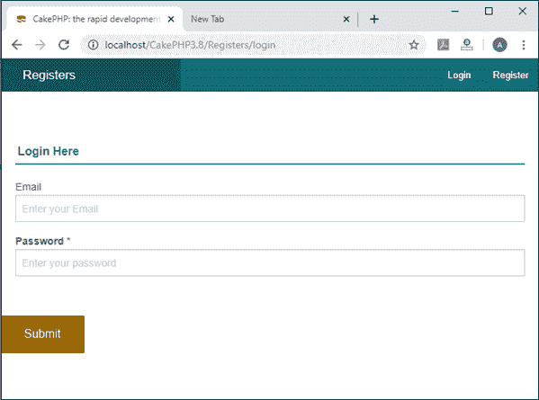
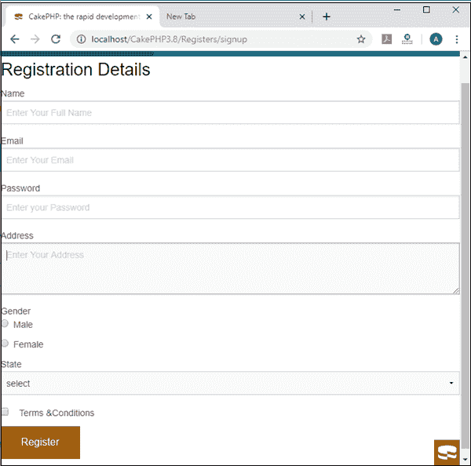

# CakePHP 表单助手

> 原文：<https://www.tutorialandexample.com/cakephp-formhelper/>

FormHelper 包含表单的支持库文件，用于在 CakePHP 中执行不同的操作。FormHelper 专注于高效地开发表单，以便简化验证、重新填充和设计。在 FormHelper 中，有各种各样的表单标签，我们将使用它们在 template 文件夹中创建表单。此外，FormHelper 是一个多才多艺的工具，这意味着它将通过使用正确的语法和方法来执行特定的结果，以您想要显示的形式做几乎所有的事情。它的一行代码比 html 代码足够了，因为我们必须编写大量的代码来创建表单，但在 FormHelper 中，我们必须为表单编写简单的语法。

这是 FormHelper 定义的源路径:-www**\ cakephp 3.8 \ vendor \ cakephp \ cakephp \ src \ View \ Helper \ form Helper**

### 各种标签的形式

**1) create():-** 创建 CakePHP 表单操作的开始阶段。或者你可以说你的 CakePHP 表单标签以这个方法开始创建表单。

语法:

```
      echo $this->Form-> create ();
```

**2)** **end()** :-这个方法定义了你 cakephp 表单标签已经被关闭。

语法；

```
    echo $this ->Form-> end () ;  
```

这里是 CakePHP 的主体，我们必须在表单的两个方法之间定义表单助手的所有操作。

```
 <?php
           echo $this-> Form-> create ();
       ----------------------------------- // it is a body of form tag for performing different                                                      
       -----------------------------------// operation in cakephp
          echo $this-> Form-> end ();
 ?>  
```

3) **文本:-** 是一个空文本框，用于在表单中输入数据。

```
      echo $this-> Form->text ("enter your name");
```

4) **control()** :-这个方法将显示一个文本框以及你想要显示的名字。

```
    echo $this-> Form-> control ("enteryour name");
```

或者你可以这样写

```
echo $this-> Form-> control ('Name',['type' => 'text','placeholder' => 'enter your name']);
```

**占位符:-** 占位符属性指定一个简短的提示，描述输入字段/文本区域的预期值。在输入值之前，字段中会显示一个小指示。

**5)input()**–显示与上述 control()方法相同的输出。

```
         echo $this-> Form-> input ('username',['type' => 'text']) ;
```

这些方法包含两个参数。在第一个参数中，它们包含您想要显示的字符串，在第二个参数中，它们定义了您想要在 **type** 中定义的方法。

*   **type** ' -允许您选择要创建的表单类型。如果没有提供类型，则会根据表单背景自动检测。类型的有效值:
*   **get** ' -将表单方法设置为 HTTP GET。
*   **文件**-将表单方法设置为 POST，并将“enctype”设置为“multipart/form-data”。
*   **post** ' -将方法设置为 post。
*   **put** '、 **delete** '、 **patch** ' -当提交表单时，将分别用 put、delete 或 patch 覆盖 HTTP 方法。

同样，您可以通过**‘type’=>‘password’，**来定义密码，或者您可以按如下形式定义密码标签

```
echo $this-> Form-> password(‘pass’);
```

**6)** **复选框:**在多个可能的互斥选项中进行选择。例如，用户可以在餐馆中选择不止一个项目。

```
echo $this-> Form-> input ( 'Terms & condition' , [ 'type'=> 'checkbox'] ) ;
```

它将为字符串“ **Terms & condition”创建一个复选框。**如果你想创建更多的复选框选项，那么你必须定义这些给定的参数。

```
        $this-> Form-> select ( 'gender', $options, [ 'multiple' => 'checkbox' ] );
                               $options = [
                                            'M' => 'Masculine',
                                            'F' => 'Feminine',
                                          'N' => 'Neuter'
                                 ]); 
```

这里$options 是一个数组，它包含键值对中的数据，如果我们在 checkbox 中定义了多个,那么它提供了选择或检查多个数据项的可访问性。

**复选框有两个选项:**

*   ' checked' -一个布尔值用来表示复选框是否被选中。默认情况下，它采用 false。
*   '禁用'-创建一个禁用的复选框输入。

如果你想禁用某些参数

```
 echo $this-> Form-> select ('gender', $options, [
     'disabled' => ['M', 'N']
 ]); 
```

**7)** **单选按钮:**单选按钮是一个图形控制元素，允许用户从多个声明的值中只选择一个选项。

```
      echo $this-> Form-> radiobutton ("gender");
```

这将为性别创建一个单选按钮，如果你想在单选按钮中添加更多的字段，这里是代码。

```
 $this-> Form-> radio (
     'favorite_color',
     [
         ['value' => 'r', 'text' => 'Red', 'style' => 'color:red;'],
         ['value' => 'u', 'text' => 'Blue', 'style' => 'color:blue;'],
         ['value' => 'g', 'text' => 'Green', 'style' => 'color:green;'],
     ]
 ); 
```

**8)** **下拉框/选择/选择框**:点击按钮或文本选择时出现的项目列表

$this-> Form-> select ("select "，['select '，' RED '，' BLUE '，' BLACK '，' GREEN '])；

**2 <sup>第二</sup>方法:**

```
 echo $this-> Form-> select ('field', [
     'Value 1' => 'Label 1',
     'Value 2' => 'Label 2',
     'Value 3' => 'Label 3'
 ]); 
```

**9)** **提交**:它定义了一个**提交按钮**，将所有**表单**的值提交给一个**表单**处理程序。

```
echo $this-> Form-> button('Submit');
```

**10)** **Email** :-它定义了将电子邮件作为用户输入。

```
echo $this-> Form-> control ('email', ['type' => 'email']);
```

**11)** **Textarea:** 一个文本区域可以容纳不限数量的字符，文本以固定宽度的字体呈现(通常是 Courier)。

可以用 cols 和 rows 属性指定 textarea 的大小。

```
echo
$this-> Form -> textarea ("enter your address", ["rows"=>3
, "cols"=>10,                                       "value"=>" Delhi"]);
```

### 为表单设置 URL

表单中使用 url 方法来传输应用程序的当前控制器或另一个控制器中的特定操作。

例如，如果您想将表单指向当前控制器的 publish()动作，您可以提供一个$options 数组，如下所示:

```
echo $this-> Form-> create ($article, ['url' => ['action' => 'publish']]);
```

**输出**:

```
 <form method="post" action="/articles/publish">
 Or you can also define the form action as follows.
 echo $this-> Form-> create (null, [
     'url' => [
         'controller' => 'Articles',
         'action' => 'publish'
     ]
 ]); 
```

输出:

```
<form method="post" action="/articles/publish">
```

### 登录和注册表单

对于登录和注册页面，我们必须创建一个名为**RegisterController.php**的控制器，在其中我们定义了一个动作文件 **login.ctp** 和 **add.ctp** ，用于创建登录页面和注册页面。这里我们创建了一个**寄存器**控制器。

**RegisterController.php**

```
 <?php
 namespace App\Controller;
 class RegistersController extends AppController
 {   public $row;
     public function initialize()
     {
         parent::initialize();
         $this->loadComponent('Flash'); 
     }
     public function login()
     {  
 }
        public function add()
         {
 }
 ?>       
```

这是我们在 RegistersController.php 调用的 login.ctp 文件。

**login.ctp 文件**

```
 <br><br>
 <div class="row">
 <?php 
 echo $this-> Form-> create();
 echo $this-> Form-> controls(
     [   
         'email'=> ['required'=>true, 'placeholder'=>'Enter your Email','type'=>'email'],
         'password'=>['required'=>true, 'placeholder'=>'Enter your password'],
     ],
     ['legend'=>'Login Here']
     );
     echo $this-> Form-> button ('Submit');
  echo $this-> Form-> end();   
     ?>
    </div> 
```

并且这也是一个动作文件名为 add.ctp 文件，用于创建 CakePHP 的注册页面。它也在控制器文件中被调用。

**Add.ctp 文件**

```
 <div class="form-conrol">
 <h3>Registration Details</h3>
 <?php
     echo $this->Form-> create ($row);
     echo $this->Form-> control ('username', ['placeholder'=>'Enter Your Full Name']);
             echo $this-> Form-> control ('email', ['type'=>'email', 'placeholder'=>'Enter Your Email']);
     echo $this->Form-> control ('password', ['placeholder'=>'Enter your Password']);
     echo $this->Form-> control ('address', ["rows"=>3, "cols"=>10, 'placeholder'=>'Enter Your Address']);
     echo '<label for="gender"> Gender</label>';
     echo $this-> Form-> radio(
         "gender",
             [
                 ['value' => 'm', 'text' => 'Male'],
                 ['value' => 'f', 'text' => 'Female'],    
             ]
         );
     echo '<label for="field">State</label>';
     echo $this-> Form-> select ("field",  
       [  [ 'Value 1' => 'select'],
         ['Value 2' => 'Uttar Pradesh'],
         ['Value 3' => 'Delhi'],
         ['value 4'=> 'Haryana'],
         ['value 5'=>'Others'],
     ]);
     echo '<div>'.$this->Form-> checkbox ('terms').
 '<label for="terms">Terms &Conditions</label></div>';
     echo $this-> Form-> button ('Register');
     echo $this-> Form-> end ();
 ?>
 </div> 
```

现在我们将在 localhost 中运行我们的代码，比如**localhost/cakephp 3.8/Registers/log in**

然后它将显示下面给定的**输出。**



现在我们将运行下一个代码，在 localhost 中显示注册页面，如**localhost/cakephp 3.8/Registers/add**

然后它将显示下面给定的**输出。**

