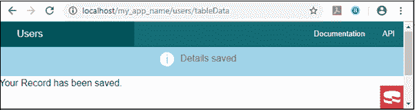
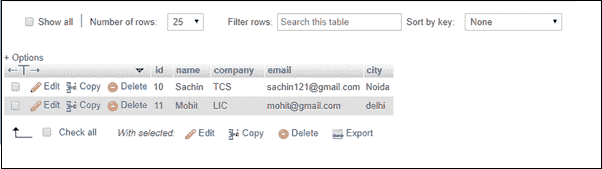
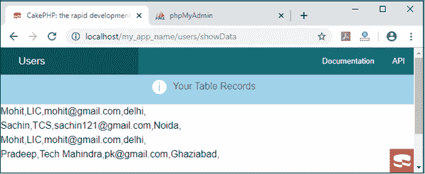
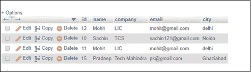
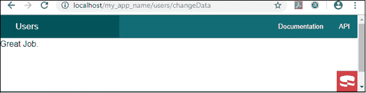
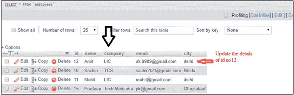
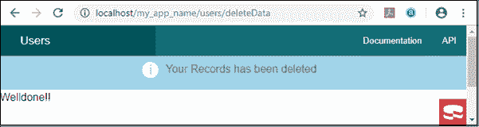
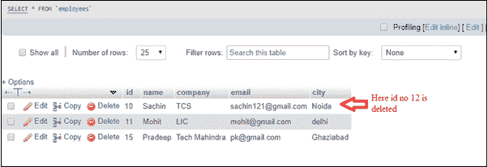

# CakePHP 表格注册表

> 原文：<https://www.tutorialandexample.com/cakephp-tableregistry/>

它类似于连接管理器，通过它我们可以在数据库表中执行 crud 操作。连接管理器和表注册表之间有一点小小的区别。

```
$this->connection = ConnectionManager::get('default');// It the default database name
$this->data = TableRegistry::get("employees"); // Here is the table name 
```

在连接管理器中，我们已经在数据库配置期间定义了默认的数据库名称。对于 TableRegistry，我们必须用数据库名定义表名，就像我们在上面的连接管理器语法中定义的那样。另外，你必须在控制器中使用下面给定的包。

```
 use Cake\ORM\TableRegistry;

```

现在我们将通过使用 **TableRegistry** 在 CakePHP 中执行 **CRUD** 操作。

### 创建数据

在这个方法中，我们将知道如何在表中插入值。所以，首先，我们必须在**src/Controller/users Controller**处创建一个**UsersController.php**文件，并编写下面给出的程序。

这是一辆**UsersController.php**

```
 <?php
  namespace App\Controller;
  use App\Controller\AppController;
 use Cake\Datasource\ConnectionManager;
 use Cake\ORM\TableRegistry;
  class UsersController extends AppController
  {
  public $connection;
  private $data;
  public function initialize()
  {
  parent::initialize();
  //$this->loadComponent->('Flash');
  $this->connection = ConnectionManager::get('default');
  $this->data = TableRegistry::get("employees"); // here we passed the table name and store the TableRegistry in the object data. 
  }
  public function tableData()
  {
   //$this->autoRender = false;
  $this->Flash->set('Details saved',
    [ 'element' => 'success']); // this will show flash message
  $tableAdd = $this->data->newEntity(); // By defining this, it creates a reserves space for inserting the data items.
  $tableAdd->name ="Sachin";
  $tableAdd->company = "TCS";
  $tableAdd->email = "[email protected]";
  $tableAdd->city = "Noida";
  $this->data->save($tableAdd); // It is the save method in which //we pass the object to save in the table.
  }
 }
 ?> 
```

您必须在**src/Template/Users/table _ data . CTP**文件中创建一个名为 **table_Data.ctp** 的动作文件，并编写以下语句。

```
  Your Record has been saved.
```

现在在本地服务器上运行你的程序，比如:**localhost/my _ app _ name/users/table data**。然后它会在你的**屏幕上显示这个输出。**



同样，您也可以向数据库表中插入更多数据。您可以在您的数据库中查看这些值。

**输出:**



### 读取或选择数据

在这个方法中，我们将知道如何使用下面给出的语法从数据库表中读取数据。

```
$datas = $this->data->find("all")->toArray("assoc");
```

示例:

现在在**src/Controller/users Controller**下创建一个**UsersController.php**文件，并编写下面给出的程序。

这是一辆**UsersController.php**

```
 <?php
 namespace App\Controller;
 use App\Controller\AppController;
 use Cake\Datasource\ConnectionManager;
 use Cake\ORM\TableRegistry;
  class UsersController extends AppController
  {
  public $connection;
  private $data;
  public function initialize()
  {
  parent::initialize();
  //$this->loadComponent->('Flash');
  $this->connection = ConnectionManager::get('default');
  $this->data = TableRegistry::get("employees"); 
  }
  public function showData()
  { 
  $datas = $this->data->find("all")->toArray("assoc");
  $this->Flash->set('Your Table Records',
  [ 'element' => 'success']);
  $this->set('collect',$datas);
  }
 }
 ?> 
```

您必须在**src/Template/Users/show _ data . CTP**文件中创建一个名为 **show_Data.ctp** 的动作文件，并编写以下语句。

```
 <?php 
 foreach($collect as $data)
   { 
  echo $data['name'].",".$data['company'].",".$data['email'].",".$data['city'].","."<br/>";
  } 
  ?> 
```

现在在本地服务器上运行你的程序，比如:**localhost/my _ app _ name/users/show data**。然后它会在你的**屏幕上显示这个输出。**



您还可以看到数据库表中的记录。

**输出:**



### 更新数据

在这个方法中，我们将知道如何修改表中的现有数据。对于此操作，我们必须定义以下术语-

1.  首先，我们必须传递记录的特定 Id。
2.  然后传递我们想要更改的表字段的值。

**举例:**

现在在**src/Controller/users Controller**下创建一个**UsersController.php**文件，并编写下面给出的程序。

这是一辆**UsersController.php**

```
 <?php
 namespace App\Controller;
 use App\Controller\AppController;
 use Cake\Datasource\ConnectionManager;
 use Cake\ORM\TableRegistry;
  class UsersController extends AppController
  {
  public $connection;
  private $data;
  public function initialize()
  {
  parent::initialize();
  //$this->loadComponent->('Flash');
  $this->connection = ConnectionManager::get('default');
  $this->data = TableRegistry::get("employees"); 
  }
  public function changeData()
  { //$this->autorender = false;
  $add = $this->data->get(12); // here we have defined the id in //which we want to change
  //print_r($add);
  $add->name = "Amit"; // now pass the parameter’s value which //you have defined in the table
  $add->email = "[email protected]";
  //echo $this->data->save($add);
  if( $this->data->save($add))
  {
  $this->Flash->set('Your Records have been updated',
   [ 'element' => 'success']);
  } else{
  $this->Flash->set('Already Updated',
   [ 'element' => 'error']);
  }
  }
 }
 ?> 
```

您必须在**src/Template/Users/change _ data . CTP**文件中创建一个名为 **change_Data.ctp** 的动作文件，并编写以下语句。

```
Great Job.
```

现在在本地服务器上运行你的程序，比如:**localhost/my _ app _ name/users/changeData**。然后它会在你的**屏幕上显示这个输出。**



您还可以在数据库表中看到更新的数据。

**输出:**



### 删除数据

此方法在 TableRegistry 中用于从表中删除数据。在这种方法中，我们必须通过给定的语法定义记录的特定 id。

```
$add = $this->data->get(12); // pass the id in which we want change
$this->data->delete($add); // use the delete method and pass the add variable 
```

**举例:**

现在在**src/Controller/users Controller**下创建一个**UsersController.php**文件，并编写下面给出的程序。

这是一辆**UsersController.php**

```
 <?php
 namespace App\Controller;
 use App\Controller\AppController;
 use Cake\Datasource\ConnectionManager;
 use Cake\ORM\TableRegistry;
  class UsersController extends AppController
  {
  public $connection;
  private $data;
  public function initialize()
  {
  parent::initialize();
  //$this->loadComponent->('Flash');
  $this->connection = ConnectionManager::get('default');
  $this->data = TableRegistry::get("employees"); 
  }
  public function deleteData()
  {
  $add = $this->data->get(12);
  $this->data->delete($add);
  $this->Flash->set('Your Records has been deleted',
   [ 'element' => 'success']);
  } 
```

您必须在**src/Template/Users/delete _ data . CTP**文件中创建一个名为 **delete_Data.ctp** 的动作文件，并编写下面给出的消息。

```
 Welldone!!
```

现在在本地服务器上运行你的程序，比如:**localhost/my _ app _ name/users/deleteData**。然后它会在你的**屏幕上显示这个输出。**



您还可以在数据库表中看到删除的数据。

**输出:**

