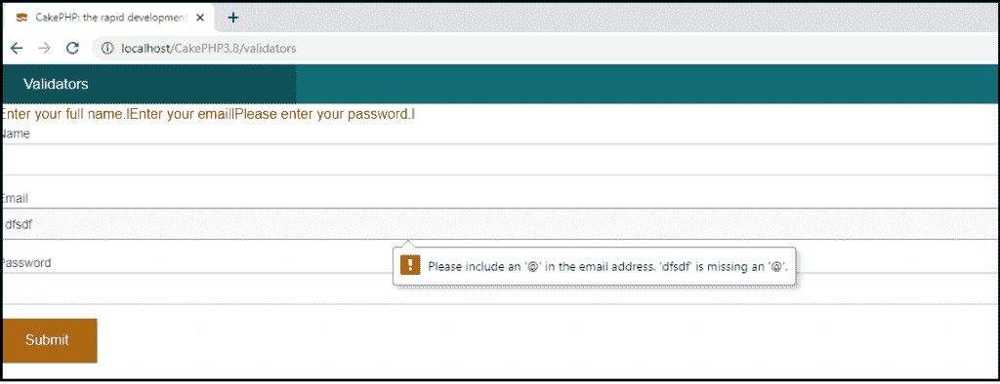

# CakePHP 验证

> 原文：<https://www.tutorialandexample.com/cakephp-validation/>

验证是指我们以表格形式定义的一组规则，用于与用户输入进行交叉验证。如果用户没有根据我们为表单中的每个字段设置的规则提供正确的输入数据，它将显示一个错误，或者它不会向数据库提交任何用户数据。

这里我们创建了一个验证器对象来分配验证器类。

```
 use Cake\Validation\Validator; // Validation is a package of Cake in which we have called //validator 
 $validator = new Validator(); // 
```

现在，当用户没有在表单中提供值时，我们必须定义 validator 对象中的所有参数来验证数据。这里我们已经在表单的字段中定义了验证器对象:

```
 >?php
 namespace App\Model\Table;
 use Cake\Validation\Validator;
 use Cake\ORM\Table;
 class RegistersTable extends Table
 {
  public function initialize(array $config)
  { //$this->addBehavior('Timestamp'); // You can pass here addition things like as date
  }
 }
 ?> 
```

通过使用$validator 对象，它将调用 notEmpty()方法，该方法包含字段名和当用户没有填写任何字段时要显示的消息。如果你想在你的字段中添加更多的验证功能，那么你可以在 validator like 中使用 add()方法。

```
 $validator
  ->requirePresence('email')
  ->add('email', 'validFormat', [
    'rule' => 'email',
    'message' => 'E-mail must be valid'
  ])
  ->requirePresence('name')
  ->notEmpty('name', 'We need your name.')
  ->requirePresence('comment')
  ->notEmpty('message', 'You need to give feedback.');
 $errors = $validator->errors($this->request->getData());
 if (empty($errors)) {
  // Send an email.
 } 
```

### 显示表单中验证的示例

在**src/Controller/validatorscontroler . PHP**下创建一个**ValidatorsController.php**文件。现在，在您的控制器文件中编写以下代码。

```
 $validator
  ->requirePresence('email')
  ->add('email', 'validFormat', [
    'rule' => 'email',
    'message' => 'E-mail must be valid'
  ])
  ->requirePresence('name')
  ->notEmpty('name', 'We need your name.')
  ->requirePresence('comment')
  ->notEmpty('message', 'You need to give feedback.');
 $errors = $validator->errors($this->request->getData());
 if (empty($errors)) {
  // Send an email.
 } 
```

在 **src/Template，**处创建一个文件夹 **Validators** ，这个文件夹创建一个 **index.ctp** 文件。现在，在该文件中编写以下代码。

**src/Template/Validators/index . CTP**

```
 <?php
 if($errors){
 foreach($errors as $error)
 foreach($error as $msg)
 echo '<font color = "red">'.$msg .'</font>l';
 }
 echo $this->Form->create("logins",array('url'=>'/validators'));
 echo $this->Form->input('name');
 echo $this->Form->input('email');
 echo $this->Form->input('password');
 echo $this->Form->button('Submit');
 echo $this->Form->end();
 ?> 
```

现在通过键入 localhost 运行给定的代码，比如:**localhost/cakephp 3.8/validators**

**输出:**

点击提交按钮，无需在表单中输入内容。您将收到以下输出。

或者，如果有任何字段已离开，那么它也将显示消息。



**验证中要求现场在场的使用**

requiring fields 方法要求数组中的所有字段都应该存在，以便进行验证。如果字段不存在，那么它将显示一个错误。requirePresence()方法有 4 种模式:

*   **True** 字段应该总是存在。
*   **False** 字段不应出现。
*   验证创建操作时，这些字段应该是必需的。
*   **更新**验证更新操作时，这些字段应该是必需的。

```
$validator->requirePresence(['emp_id’, ‘title’], ‘create’);
```

上面语法定义了验证器函数将在执行表单中的创建操作时验证您的数据。

```
 $validator->requirePresence([
  'emp_id' =>[
  'mode' =>'create',
  'message' =>'An employee is required.',
  ],
 ->requirePresence('title')
  ->notEmptyString('title', 'Please fill this field')
  ->add('title', [
  'length' =>[
  'rule' =>['minLength', 15],
  'message' =>'Titles need to be at least 15 characters long',
  ]
  ]),
  'Feedback' =>[
  'mode' =>'update',
  'message' =>'The feedback state is required.',
  ]
 ]); 
```

在上面的代码中，我们使用了多种模式的 requirePresence 来验证数据。