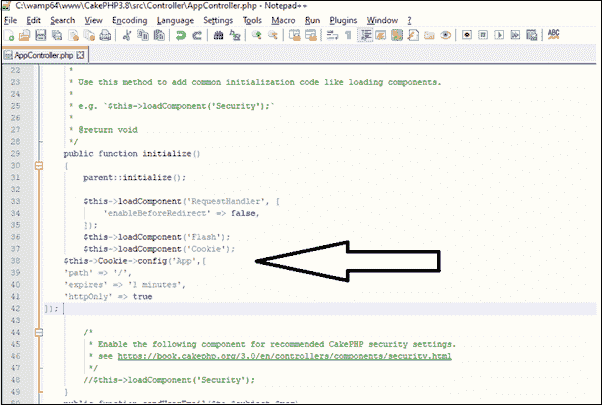

# CakePHP Cookies

> 原文：<https://www.tutorialandexample.com/cakephp-cookies>

Cookies 是网站发送的小文件，当用户浏览网站时，它将文件存储在用户系统中。所以，通过这种方式，它包含了用户的所有信息，以记住用户的活动或跟踪网站状态。

用 CakePHP 处理 Cookie 既简单又安全。一个 **CookieComponent** 是一个用于在 web 应用程序中管理 Cookies 的类。

### Cookie 的配置

我们必须在**www \ cakephp 3.8 \ src \ Controller \ app Controller . PHP**中配置 Cookie，以便全局访问文件。全局配置的数据将与顶级配置相结合，因此它将覆盖那些不同的部分。要设置 cookies 的全局设置，请使用 **config()** 方法:



在上图中，我们已经加载了 Cookie 组件，然后像这样使用 config 方法。

```
 $this->Cookie->config('path', '/');
 $this->Cookie->;config([
 'expires' => '+10 days',
 'httpOnly' => false
 ]); 
```

要配置特定的密钥，请使用 configKey()方法:

```
 $this->Cookie->configKey('Data', 'path', '/');
 $this->Cookie->configKey('User', [
  'expires' => '+1 days’,
  'httpOnly' => true
 ]); 
```

我们可以很容易地用 **CookieComponent** 类创建一个 cookie 来管理 CakePHP 中的 cookie。通过使用这个类，我们可以在 CakePHP 中执行 cookie 的几种方法。

**写 Cookie**

我们可以通过使用 **write()** 方法来编写一个 cookie。下面是 write 方法的语法。

```
Cake\Controller\Component\CookieComponent::write(mixed $key, mixed $value = null)
```

在这个方法中，我们传递了两个参数，Cookie 变量($key)和变量 **($value)的值。**

**例子**

```
$this ->cookie -> write( ‘name’ ,’Amitabh’);
```

这里 name 是一个键，Amitabh 是变量' name '的值。

如果我们想要传递多个键及其值，那么我们可以在 Cookies 中使用一个数组，如下所示:

```
 $this->Cookie->write('App', [ ‘name' => 'sachin',
  'age' => (int) 20,
  'tutorials' => 'CakePHP' ]); 
```

在上面的语法中，App 是一个数组，它保存了一个数组索引，其中包含诸如姓名、年龄和教程之类的关键字。此外，我们已经在 cookie 中声明了键值。

### 读取 Cookie

我们可以使用 read()方法读取 cookie。下面是 read()方法的语法。

```
Cake\Controller\Component\CookieComponent::read(mixed
$key = null)
```

read 方法包含一个参数，我们可以传递一个变量名或一个数组。

**例子**

```
 echo $this->Cookie->read (‘name’); // a single variable
 echo $this->Cookie->read (‘App); // here we passed app as an array 
```

### 检查 Cookie

这个 cookie 方法用于检查 Cookie 键/路径是否存在，并且它在 Cookie 中有一个空值。我们定义了 Cookie 的检查方法:

```
Cake\Controller\Component\CookieComponent::check($key)
```

**例子**

```
echo
$this->Cookie ->check( ‘age’);
```

### **删除 Cookie**

delete 方法用于从系统中删除 cookies。我们在这里定义了删除方法:

**Cake \ Controller \ Component \ CookieComponent::delete(mixed $ key)**

delete 方法包含一个参数，我们可以传递一个变量或一个数组来删除 cookie。

**$this- > Cookie- >删除(' App ')；**

**举例:**

在项目的 **src/Controller/** 文件夹下创建一个控制器名**CookiesController.php**文件。现在，在控制器文件中编写以下代码。

```
>?php
 namespaceApp\Controller;
 useApp\Controller\AppController;
 //useCake\Controller\Component\CookieComponent; // We have load cookie in //AppController
 classCookiesControllerextendsAppController{
 publicfunctionwriteCookie() {
 $this->Cookie->write('App',['name'=>'sachin',
 'age'=>(int)20,
 'tutorials'=>'CakePHP']);
 }
 publicfunctionreadCookie(){
 //$cookie_val=$this->Cookie->read('name');// for particular items
 $cookie_val=$this->Cookie->read('App'); // for array items
 $this->set( 'cookie_val ', $cookie_val);
 }
 publicfunctioncheckCookie(){
 $show=$this->Cookie->check ( 'App' );
 $this->set('show', $show);
 }
 publicfunctiondeleteCookie(){
 $this->Cookie->delete( 'App' );
 }
 }
 ?> 
```

在 **src/Template** 下创建一个文件夹 **Cookies** 而那个文件夹你要创建一个 **write_cookie.ctp** 文件。现在，在您的文件中编写以下代码。

```
Cookiehas been saved.
```

在 **src/Template** 中创建一个文件夹 **Cookies** ，并在该文件夹中创建一个 **check_cookie.ctp** 文件。现在，在您的文件中编写以下代码。

```
 >?php
 if($show):
 ?>
 Thecookieispresent.
 >?php
 else:
 ?>
 Thecookieisn'tpresent.
 >?php
 endif;
 ?> 
```

在 **src/Template** 下创建一个文件夹 **Cookies** ，并在该文件夹下创建一个 **read_cookie.ctp** 文件。现在，在您的文件中编写以下代码。

```
Thevalueofthecookieis:>?phpprint_r($cookie_val);?>
```

在 **src/Template** 中创建一个文件夹 **Cookies** ，并在该文件夹中创建一个 **delete_cookie.ctp** 文件。现在，在您的文件中编写以下代码。

```
Cookiehasbeendeleted.
```

现在在本地主机中运行你的代码，比如**localhost/cakephp 3.8/Cookies/write _ cookie . CTP**

然后它会产生这个**输出:**


同样，您可以访问下面给出的 url 来获得输出。

**localhost/cakephp 3.8/cookies/read _ cookie . CTP**

然后它会产生这个输出


类似地，您可以访问下面给出的 url 来获得**输出。**

**localhost/cakephp 3.8/cookies/check _ cookie . CTP**

然后它将产生这个**输出**


类似地，您可以访问下面给出的 url 来获得**输出。**

**localhost/cakephp 3.8/cookies/delete _ cookie . CTP**

然后它将产生这个**输出**

