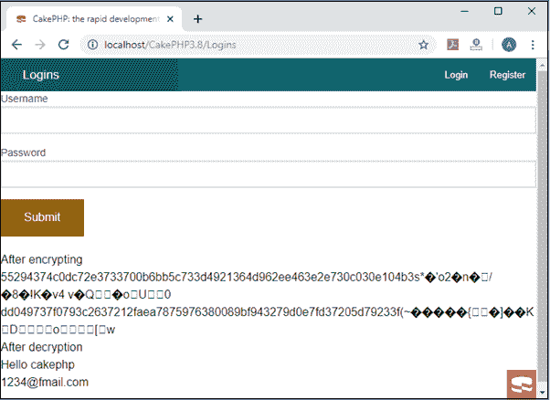
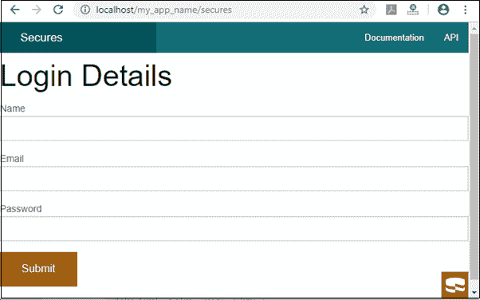

# CakePHP 安全性

> 原文：<https://www.tutorialandexample.com/cakephp-security/>

安全性是创建任何 web 应用程序的基本特性。它向网站用户保证他们的数据不会被非法访问。因此，CakePHP 在 web 应用程序中使用了一些安全工具。

可以通过三种方式在 cakephp 分配中处理安全性

1.  安全实用程序
2.  CSRF
3.  安全组件

我们将使用这个包来提供 CakePHP 应用程序的安全性。

**用蛋糕\实用\安全；**

现在我们将学习 CakePHP 应用程序中文本的加密和解密。

**加密和解密**

CakePHP 提供了一些安全库，通过这些库我们可以很容易地加密和解密文本。这是应用程序中用于安全性的两种方法。

```
 static Cake\Utility\Security::encrypt ($text, $key, $hmacSalt = null )
 static Cake\Utility\Security::decrypt ($cipher, $key, $hmacSalt = null ) 
```

在这个方法中，我们将传递两个参数**文本**和**密钥**来加密数据，它将使用 HMAC 校验和返回一个加密形式的值。

类似地，我们也可以传递一个双参数**密文**和**密钥**，其中密钥值将与我们在加密文本中使用的相同，密文值将用于解密文本。因此，加密方法的输出将用作解码数据的输入。

一个 **hash** ()方法被用于散列像密码这样可以改变文本格式的数据。下面是语法

```
static Cake\Utility\Security::hash($string, $type = NULL, $salt = false)
```

现在我们将创建一个程序，通过使用加密和解密方法来显示我们的数据是安全的。

在**src/Controller/logins Controller . PHP**下创建一个文件**LoginsController.php**。现在在**的 LoginsController** 文件中编写以下代码。

```
 request->is( 'post' )) {
   $mname = $this->request->getData( 'username' );
   $nemail = $this->request->getData( 'password' );
   //use of encryption method
   $key = 'wt1U5MACWJFTXGenFoZoiLwQGrLgdbHA';
   $output1 = Security::encrypt( $mname, $key );
   $output2 = Security::encrypt( $nemail, $key );
   $this->set( 'result1', $output1 );
   $this->set( 'result2', $output2 );
 // use of decryption method
   $name1 = Security::decrypt( $output1, $key );
   $this->set('name1', $name1 );
   $name2 = Security::decrypt( $output2, $key );
   $this->set('name2', $name2 );
  }
  }
  }
 ?> 
```

在 **src/Template** 创建一个文件夹**登录**在该文件夹内创建一个 **index.ctp** 文件。现在在 **index.ctp** 文件中编写以下代码。

```
 Form->create("Logins", array( 'url' =>'/Logins' ));
 echo $this->Form->input ('username', [ 'class'=>'fare-control', 'required', 'value' => '' ]);
 echo $this->Form->input( 'password', [ 'class'=>'fare-control', 'required' ,'value'=> '' ]);
 echo $this->Form->button('Submit');
 echo $this->Form->end();
  ?>

  "; ?>

  "; ?>

 "; ?>

 "; ?>

 "; ?>

```

现在，通过编写以下 URL 来执行上述代码

http://localhost/CakePHP/logins

当您在 localhost 上运行这段代码时，将会显示以下输出


提交表格后，你会得到你的用户名和密码的加密以及解密形式，就像这样。



### CSRF

CSRF 代表跨站点请求伪造。通过在应用程序中加载 csrf，可以防止攻击。CSRF 是一种常见的易受攻击的工具，它允许攻击者捕获并重新发送 web 应用程序中以前的请求。有时，它使用图像标签或其他域上的资源发送请求。CSRF 可以通过使用控制器的 **CsrfComponent** 来启用，如下所示。

```
 public function initialize() {
  parent::initialize();
  $this-> loadComponent('Csrf');
 }  
```

CsrfComponent 与 Formhelper 结合，每次创建表单都使用 CakePHP 中的 FormHelper。它包含三个配置功能，防止您的数据在 web 应用程序中被非法访问。

1.  **cookieName**–它包括您想要在 csrf 函数中传递的 cookie 的名称。默认情况下，它需要 **csrfToken** 。
2.  **Expiry**–它定义了 csrf 令牌在您的应用程序中可用的时间。默认情况下，它使会话时间过期 csrf 令牌。
3.  **安全**–它确定您的 cookie 是否设置了安全标志。在 csrf 函数中，cookie 将在 HTTPs 连接上设置，如果您试图在普通 HTTP 中设置 cookie，那么它将无法设置 cookie。
4.  **字段**–您可以通过在表单字段中定义 csrf 函数来阻止您的数据表单。表单中的默认设置是 _csrfToken。

当您启用 csrf 令牌时，您可以在应用程序中处理基于请求的对象。

```
$id = $this -> request ->getParam(‘_csrfToken’); 
```

您还可以通过定义控制器的事件调度器 beforeFilter()方法，为控制器中的某些操作禁用 csrf 组件:

```
 public function beforeFilter ( Event $event )
 { 
$this- >getEventManager () ->off ($this->Csrf);
 } 
```

### 安全性

CakePHP 安全组件用于在 web 应用程序中提供严密的安全性。有一些方法可以提供安全性

**到 HTTP，这限制接受您的应用程序**–您应该总是在浏览器中检查 http url，然后在网站上执行任何操作。您还可以使用 Cake \ Network \ Request::allow method()来检查 HTTP 方法，以确定 web 应用程序中的正确 HTTP。

**表单篡改保护**–CakePHP 提供安全组件来保存表单，防止未经授权的用户使用。安全组件防止表单出现这些情况——

1.  您不能在表单中添加不必要的字段。
2.  字段不能留空。
3.  您不能更改表单中的字段名称。
4.  用户不能更新隐藏值。
5.  使用 SSL–所有操作都应使用 SSL。
6.  限制跨控制器通信–您可以在控制器中设置限制，以便从另一个控制器发送请求。此外，您还可以在控制器的操作中限制操作。

这里我们创建了一个**安全组件**的例子。

在**src/Controller/secure Controller . PHP**下创建一个文件**SecuresController.php**。现在把给定的代码写在 SecuresController.php 文件的**中。**

```
 loadComponent('Security');
  }
  public function index()
  {
  $row = $this->Secures->newEntity();
  if ($this->request->is('post')) {
  $row = $this->Secures->patchEntity ($row, $this->request->getData());
  if ($this->Secures->save($row)) {
  $this->Security->requireSecure ();
  $this->Flash->success (__('successfully login'));
  return $this->redirect (['action' => 'index']);
  }
  $this->Flash->error (__('Technical issues'));
  }
  $this->set('row', $row);
  }
  }
 ?> 
```

创建一个文件夹**在 **src/Template** 处保护**在那个文件夹内创建一个 **index.ctp** 文件。现在把给定的代码写入 **index.ctp** 文件。

```
 登录详细信息
 Form->create("Secures",array('url'=>'/secures'));
  echo $this->Form->input ('name');
  echo $this->Form->input ('email');
  echo $this->Form->input ('password');
  echo $this->Form->button ('Submit');
  echo $this->Form->end();
 ?> 
```

现在，通过编写以下 URL 来执行上述代码

http://localhost/CakePHP/Secures

然后它会显示这个**输出。**

