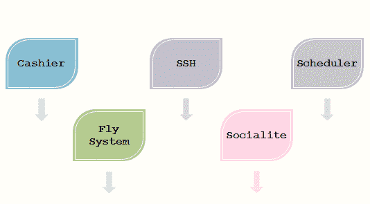
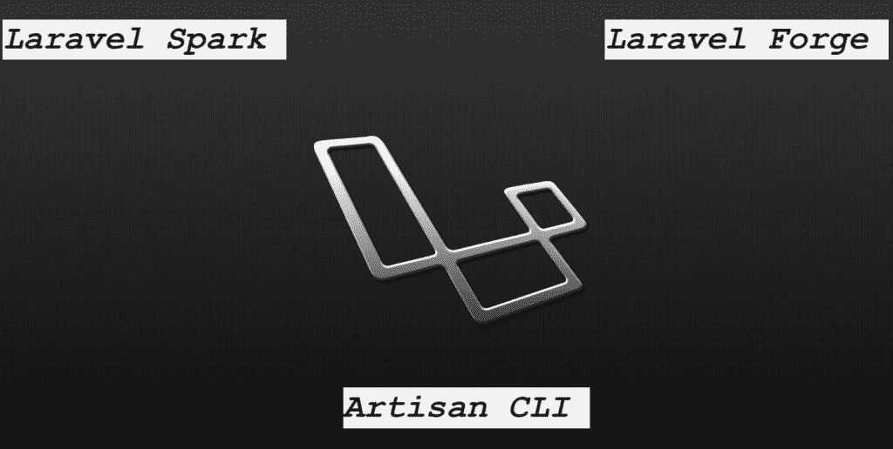

# Laravel 第一包

> 原文：<https://www.tutorialandexample.com/first-packages/>

**第一包**

Laravel 提供以下现成的软件包:

*   **收银员:**

它是在 Laravel 4.2 版本中引入的，它提供了一个管理订阅计费服务的接口，如处理优惠券和生成发票。

*   **宋承宪:**

它是在 Laravel 4.1 版本中引入的，它允许使用安全外壳(SSH)作为加密协议在远程服务器上编程执行 CLI 命令。

*   **调度程序:**

它是在 Laravel 5.0 版本中引入的，是 Artisan 命令行实用程序的一个补充，允许对执行的任务进行编程调度。

*   **飞行系统:**

它是在 Laravel 5.0 版本中引入的，它是一个文件系统抽象层，允许透明地使用基于云的存储服务。

*   **名媛:**

它是在 Laravel 5.0 版本中引入的，是一个可选的包，为不同的提供商提供简化的认证机制，包括脸书、Twitter 和 Google。

**附加工具**

Laravel 提供的一些工具是付费的，如下所示:

**拉勒维尔火花:**

泰勒·奥特威尔开发了拉腊维尔火花。它为在线 SAAS 业务提供了额外的工具，用于集成服务、生成发票、Bootstrap 4.0 和团队认证。2019 年 2 月，套餐版本为 8.0。

拉勒维尔锻造厂:

Laravel 提供 Laravel Forge，用于在 DigitalOcean、ASW 等网站上提供和无限制的 PHP 应用程序。它的特性包括 SSL 证书、队列、负载基准等等。

**工匠 CLI:**

Laravel 的命令行界面被称为 artisan。它是在 Laravel 3 中引入的，功能有限。Laravel 迁移到基于 Composer 架构允许 Artisan 从 Symfony 框架中合并不同的组件，这导致了 Laravel 4 中附加 Artisan 特性的可用性。Artisan 功能分为 Artisan 命令行实用程序的不同子命令，该实用程序提供有助于管理和构建应用程序的功能。

Artisan 用于管理数据库，发布新控制器和迁移的包。Artisan 的功能和能力可以通过实现新的自定义命令来扩展。