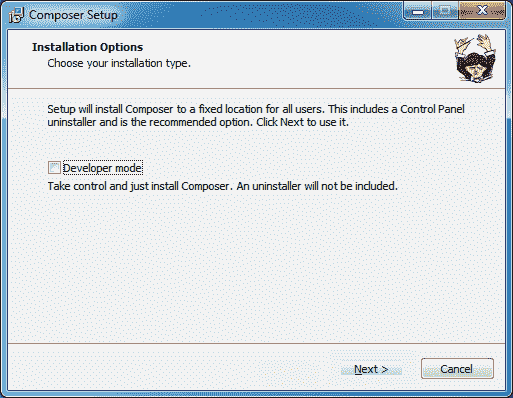
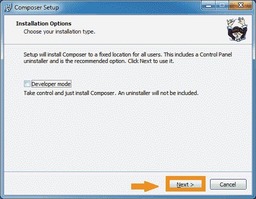
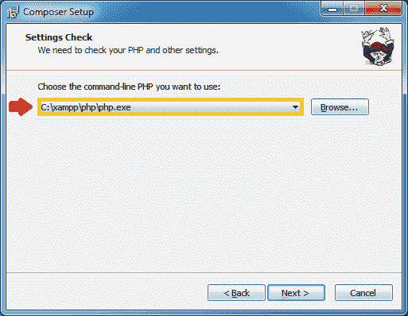
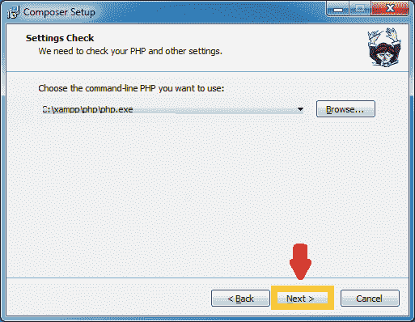
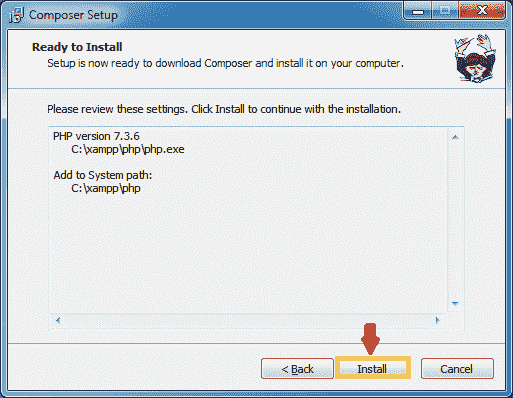
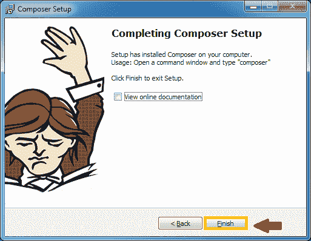

# Composer 安装

> 原文：<https://www.tutorialandexample.com/composer-installation/>

Composer 是 PHP 编程语言的应用程序级包管理器。开发始于 2011 年 4 月，并于 2012 年 3 月 1 日首次发布。

**命令:**

*要求*

*安装*

*更新*

*移除*

**安装:**

*   通过访问 Composer 官方网站[https://getcomposer.org/download/](https://getcomposer.org/download/)下载安装程序

*   访问 Composer 网站后，单击 Composer 设置的给定链接，将 Composer 设置下载到我们的计算机上。

*   一旦下载了 Composer 安装程序，安装程序下载将自动打开。

*   单击设置窗口底部的下一步按钮。

*   在下一步中，如果我们想要更改命令行位置，请选择位置。

命令行文件通常位于 PHP 目录中。

*   单击下一步继续。

*   在下一步中，单击 Install 按钮开始安装过程。

*   单击安装按钮后，安装程序将下载 Composer。

*   下载完成后，单击“下一步”按钮继续

*   安装过程已经完成，单击“完成”按钮关闭安装窗口。

