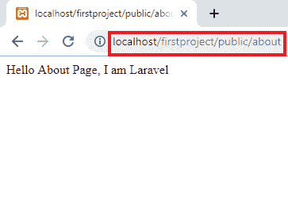

# Laravel 路线参数

> 原文：<https://www.tutorialandexample.com/laravel-route-parameters/>


**必需参数:**

我们需要在我们的路线上捕捉 URI 的片段。

我们将看到如何在闭包函数中通过两个或多个视图传递参数。

```
Route::*get*('/home', function () {
    return "Hello Home Page,
Welcome to Laravel Project";
});

Route::*get*('/about', function () {
    return "Hello About Page, I am
Laravel";
});

Route::*get*('/contact', function () {
    return "Hello Contact Page, Call
Me";
});
```

**输出:**





我们需要从 URL 中捕获一个用户的 id。

我们通过定义路线参数来做到这一点。

```
Route::get(‘/user/{id}’,function($id)
{ 
Return ‘user ‘ , $id;
}); 
```

**例如:**

```
Route::*get*('/video/{id}', function($id) {
return "Here We Can Find
Video No. ". $id;
});
```

**输出:**


在上面的例子中，我们可以看到如何将变量传递给闭包函数。

我们根据路线需要定义尽可能多的路线参数:

```
Route::get(‘posts/{post}/comment}’,function( $postId, $commentId)
{
//
});
```

**例如:**

```
Route::*get*('/image/{id}/{name}', function($id, $name) {
return "Hii This Is Image No. ". $id . " " . $name;
});
```

**输出:**


在上面的例子中，50 表示为一个(id)，Rafia 描述为一个(name)。

路由参数始终包含在 **{ }** 大括号内，并且应该由任何字母字符组成。它不能包含**–**字符。我们不使用**–**字符，而是使用下划线( **_** )。路由参数根据顺序放入路由回调 **/** 控制器中**–**回调 **/** 控制器参数的名称无关紧要。

### 可选参数

我们偶尔需要指定路由参数，但是我们让路由参数 route 的存在。我们可以放置一个(**？**)标记在参数名之后。

我们确保给路由的相应变量一个默认值。

```
Route::get(‘user/{name?},’function ($name = null)
{
Return $name;
});
Route::get(‘user/{name?},’ function ($name = ‘John’)
{
Return $name;
}) 
```

### 正则表达式约束

我们可以使用 **where** 方法来约束路线参数的格式。

```
Route::get(‘user/{name}’,function ($name)
{
//
}) -> where(‘name’, ‘[A-Za-z]+’);

Route::get(‘user/{id}’, function ($id)
{
//
}) -> where(‘id’, ‘[0-9]+’);

Route::get(‘user/{id}/{name}’,  ($id, $name)
{
//
}) -> where([‘id’ => ‘[0-9]+’, ‘name’ => ‘[a-z]’]); 
```

**其中**方法获取参数的名称和定义应该约束的参数的正则表达式:

### 全局约束

我们希望路由参数总是受到给定正则表达式的约束，我们可以使用**模式**方法。我们可以在我们的 **RouteServiceMethod 的 **boot** 方法中定义这些模式。**

```
public function boot()
{
Route::pattern(‘id’,  ‘[0-9]+’); 
Parent::both(); 
}
```

一旦定义了模式，它将自动应用于所有使用参数名称的外部:

```
Route::get(‘user/{id},’  function($id)
{
//
});
```

### 编码正斜杠

Laravel 路由组件允许除 **/** 之外的所有字符。我们必须使用一个 **where** 条件正则表达式显式允许 **/** 成为占位符的一部分。

```
Route::get(‘search/{search}’,  function ($search)
{
Return $search;
}) -> where(‘search’,  ‘.*’);  
```