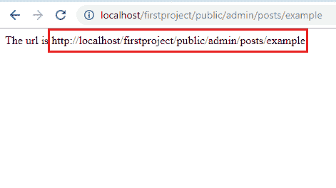
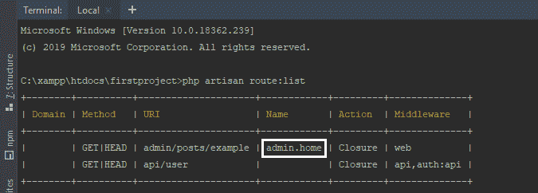

# Laravel 命名路线

> 原文：<https://www.tutorialandexample.com/laravel-named-routes/>

***命名航线***

命名路由允许适当地生成 URL 或重定向到特定路由。
我们通过将 **name** 方法更改到路由定义上来指定路由的名称:

**语法:**

```
 Route::get(‘user/profile’, function ()
 { 
 // 
 }) -> name(‘profile’); 
```

我们还为控制器操作指定了一个路由名称:

**语法:**

```
Route::get(‘user/profile’, ‘[email protected]’) -> name(‘profile’);
```

**生成指定路由的 URL**

一旦我们为给定的路由指定了名称，我们就可以在通过全局 **route** 函数生成 URL 或重定向时使用该路由的名称:

**语法:**

```
//Generating URLs
$url = route(‘profile’);
//Generating Redirect
return redirect() -> route(‘profile’); 
```

如果命名的路由定义了参数，我们将参数作为第二个参数传递给 **route** 函数。

**例如:**

```
Route::*get*('admin/posts/example', array('as' => 'admin.home' ,function() {
$url = route('admin.home');
return "The url is " . $url;
}));
```

**输出:**



我们可以借助***PHP artisan route:list***命令轻松检查我们生成的 URL:



给定的参数将自动添加到 URL 的适当位置:

**语法:**

```
Route::get(‘user/{id}/profile’, function($id)
{
//
}) -> name(‘profile’); 
$url = route(‘profile’, [‘id’ => 1]); 
```

**检查当前路线:**

如果我们想确定当前请求是否被路由到给定的命名路由，我们在路由实例上使用命名方法。

我们从路由中间件检查当前路由名称:

**语法:**

```
public function handle($request, Closure $next)
{ 
If($request->route()->named(‘profile’))
{ 
// 
return $next($request); 
} 
```