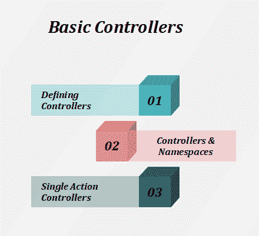

# Laravel 基本控制器

> 原文：<https://www.tutorialandexample.com/laravel-basic-controllers/>

控制器将相关的请求处理逻辑分组到一个类中。它们存储在 app/Http/Controllers 目录中。

**基本控制器**



***定义控制器:***

控制器扩展了 Laravel 中包含的基本控制器类。

基类提供了一些获取方法的用法，例如**中间件**方法，我们用它将中间件附加到控制器动作上:

```
<?php
 namespace App\Http\Controllers;
 use App\User;
 use App\Http\Controllers\Controller; 
 class UserController extends Controller
 {
     /**
      * Show the profile for the given user.
      * 
      * @param  int  $id
      * @return View
      */
     public function show($id)
     { 
         return view('user.profile', ['user' => User::findOrFail($id)]);
     }
 } 
```

我们可以很容易地定义到该控制器的路由:

```
Route::get(‘user/{id},’ ‘[email protected]’);
```

现在，当一个请求匹配指定的路由 URI 时，将执行 **UserController** 类上的 **show** 方法。

路由参数也将通过此方法传递。

*   控制器不需要**来扩展基类。另一方面，我们将无法使用便利的特性，如**中间件**、**验证**和**分派**方法。**

### 控制器和名称空间:

在定义控制器路由时，我们不需要指定完整的控制器名称空间。

**RouteServiceProvider** 在包含名称空间的路由组中加载我们的路由文件，我们可以指定在名称空间的 **App\Http\Controllers** 部分之后的类名部分。

如果我们选择将控制器划分到 **App\Http\Controllers** 目录中，它将使用与 **App\Http\Controllers** 根名称空间相关的特定类名。

如果我们的完整控制器类是**App \ Http \ Controllers \ Photos \ admin controller**，我们应该像这样向控制器注册路由:

```
Route::get(‘foo’, ‘Phots\[email protected]’);
```

***单动作控制器:***

如果我们想定义一个只处理单一动作的控制器，我们在控制器上放置一个单一的 **_invoke** 方法:

 *```
<?php
 namespace App\Http\Controllers;
 use App\User;
 use App\Http\Controllers\Controller;
 class ShowProfile extends Controller 
 {
 /**
 * Show the profile for the given user. 
 *
 * @param  int  $id
 * @return View
 */ 
 public function __invoke($id)
 {
 return view('user.profile', ['user' => User::findOrFail($id)]); 
 }
 } 
```

当我们为单个动作控制器注册路线时，我们不需要指定方法:

```
Route::get('user/{id}', 'ShowProfile');
```

我们可以通过使用**make:controller**artisan 命令的 **- invokable** 选项来生成一个可调用的控制器；

php artisian make:控制器 ShowProfile -可调用*