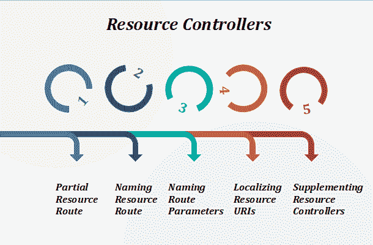

# Laravel 资源控制器

> 原文：<https://www.tutorialandexample.com/laravel-resource-controllers/>

Laravel 资源路由在单线代码的帮助下将“**CRUD”**路由分配给控制器。

**例如，**

如果我们希望使用 **make:controller** Artisan 命令创建一个控制器来处理应用程序存储的所有 HTTP 请求“照片”。我们可以快速创建一个控制器。

```
php artisan make:controller PhotoController --resource
```

上面的命令将在生成一个控制器

```
app/Http/Controllers/PhotoController.php.
```

对于每个可用的资源操作，控制器将包含一个方法。

在下一步中，我们将向控制器注册一个原始路由:

```
Route::resource(‘photos’,‘PhotoController’);
```

单个路由声明创建了许多路由来处理资源上不同类型的操作。生成的控制器已经有了这些动作的方法，包括通知我们它们处理的 HTTP 动词和 URIs 的注释。

我们通过向**资源**方法传递一个数组来一次注册许多资源控制器:

```
Route::resource([
‘photos’ => ‘PhotoController’, 
‘posts’ => ‘PostController’
 ]); 
```

***资源控制者*处理的动作**

| **动词** | ***URI*** | ***动作*** | ***路线名称*** |
| **获取** | */照片* | *索引* | *photos.index* |
| **获取** | */照片/创作* | *创建* | *photos.create* |
| **发帖** | */照片* | *商店* | *photos.store* |
| **获取** | */照片/{照片}* | *显示* | *photos.show* |
| **获取** | */照片/{照片}/编辑* | *编辑* | *photos.edit* |
| **上传/打补丁** | */照片/{照片}* | *更新* | *photos.update* |
| **删除** | */照片/{照片}* | *摧毁* | *photos.destory* |

**指定资源模型:**

如果我们使用路由模型绑定，并且希望资源控制器的方法对模型实例进行类型提示，那么我们在生成控制器时使用- model 选项:

```
php artisan make:controller PhotoController   --resource --model=Photo 
```

**欺骗表单方法:**

由于 HTML 表单不能发出 PUT、PATCH 或 DELETE 请求，我们需要添加一个 hidden _method 字段来欺骗这些 HTTP 动词。@method Blade 指令可以为我们创建这个字段:

```
<form action=”/foo/bar” method=”POST”>
 @method(‘PUT’) 
 </form> 
```



资源控制器分为 5 种不同类型:

### 部分资源路线

当声明资源路由时，我们指定动作的子集。

控制器应该处理而不是面对默认动作集:

```
Route::resource( ‘photos’,‘PhotoController’) ->only
([ 
‘index’, ‘show’ 
]); 
Route::resource( ‘photos’, ‘PhotoController’)-> except  
([
‘create’, ‘store’, ‘update’, ‘destroy’  
]); 
```

**API 资源路径:**

当声明将由 API 使用的资源路由时，我们通常会希望排除呈现 HTML 模板(如 create 和 edit)的路由。

我们使用 apiResource 方法自动排除这两条路由:

```
Route::apiResource('photos','PhotoController');
```

我们通过向 apiResources 方法传递一个数组来一次注册许多 API 资源控制器:

```
Route::apiResources([
'photos' => 'PhotoController', 
'posts' => 'PostController'
 ]); 
```

为了快速生成不包含创建或编辑方法的 API 资源控制器，我们使用- api 开关来执行 make:controller 命令:

```
phpartisan make:controller API/PhotoController --api
```

### 命名资源路由

默认情况下，所有类型的资源控制器操作都有一个路由名称。我们可以通过传递带有选项的名称数组来覆盖这些名称:

```
Route::resource(‘photos’,‘PhotoController’)->names
([
‘create’ => ‘photos.build’
]); 
```

### 命名资源路由参数

Route::resource 将根据资源名称的“单一化”版本为我们的资源路由创建路由参数。

通过使用参数方法，我们可以很容易地在资源基础上覆盖它。

传入参数方法的数组应该是资源名称和参数路由的关联数组:

```
Route::resource(‘users’,‘AdminUserController’)->parameters
([ 
‘users’ => ‘admin_user’ 
 ]); 
```

以上示例为资源的显示路线生成了以下 URIs:

```
/users/{admin_user}
```

### 本地化资源 URIs

默认情况下使用 Route::资源；它将使用英语动词创建一个资源 URIs。

如果我们需要本地化创建和编辑动作动词，我们可以使用 Route::resourceVerbs 方法。

它可能在我们的 AppServiceProvider 的 boot 方法中完成。

```
use Illuminate\Support\Facades\Route;

 /**
  * Bootstrap any application services.
  *
  * @return void
  */
 public function boot()
 {
     Route::resourceVerbs([
         'create' => 'crear',
         'edit' => 'editar',
     ]);
 } 
```

一旦动词被定制，像 Route::resource('fotos '，' PhotoController ')这样的资源路由注册将产生以下 URIs:

```
/fotos/crear
/fotos/{foto}/editar 
```

### 补充资源控制器

如果我们需要在默认的资源路由集上向资源控制器添加额外的路由，我们应该在调用 Route::resource 之前定义这些路由。

否则，资源方法定义的路线将优先于我们的补充路线:

```
Route::get(‘photos/popular’,‘[email protected]’);
Route::resource(‘photos’; ‘PhotoController’); 
```