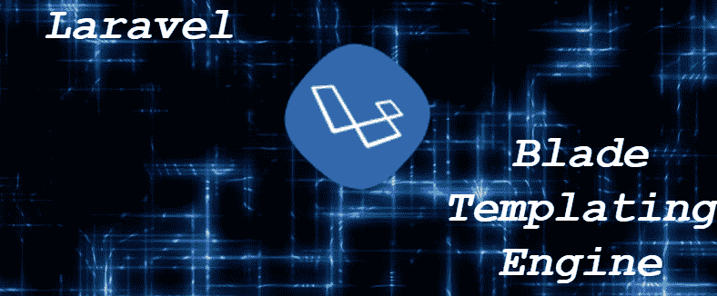
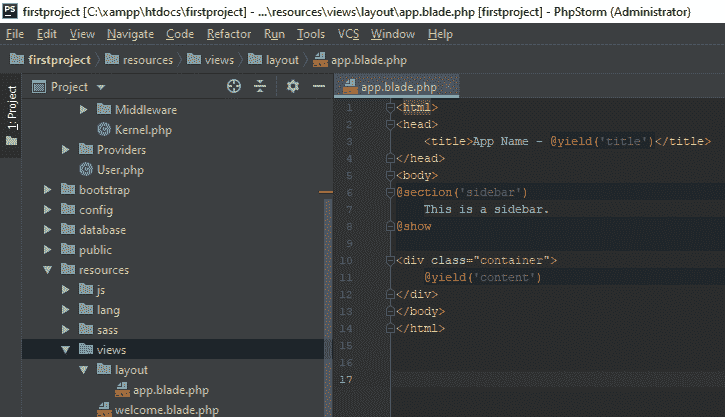
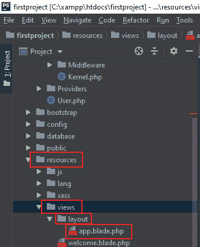
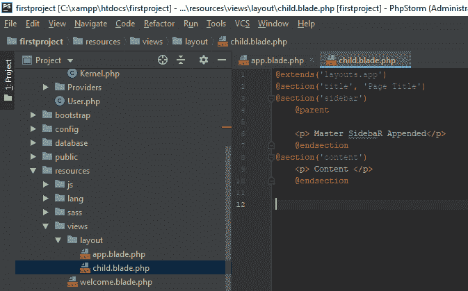
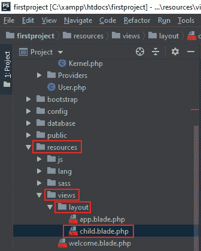
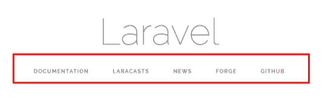
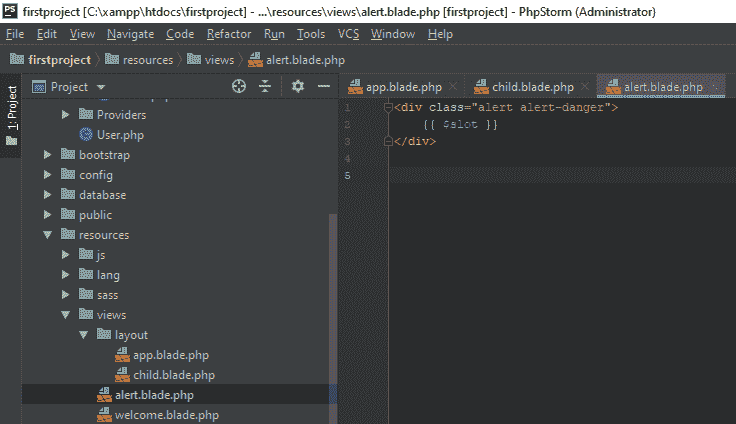
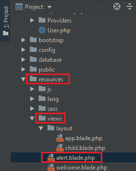
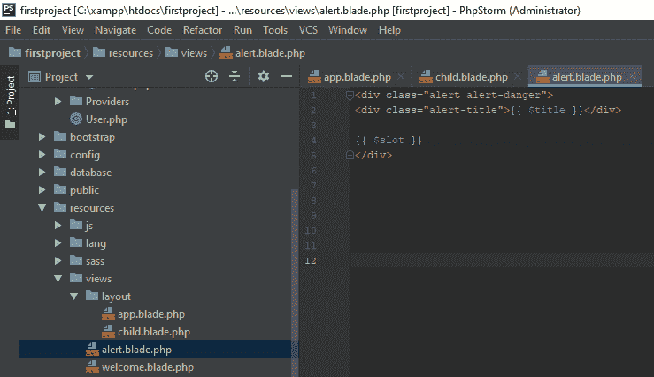

# Laravel 模板化继承

> 原文：<https://www.tutorialandexample.com/laravel-templating-inheritance/>

### 简介:



Blade 是一个 PHP 模板引擎。它抓取 PHP 代码，使我们很容易用 HTML 实现。

Blade 是 Laravel 提供的一个简单而强大的模板引擎。

像任何其他流行的 PHP 模板引擎一样，Blade 不限制用户在视图中使用普通的 PHP 代码。

所有的刀片视图都编译成普通的 PHP 代码；Blade 为我们的应用添加了基本零。刀片视图文件使用. blade.php 文件扩展名，这些文件存储在 resources/views 目录中。

***优点***

*   在 Blade 的帮助下，我们可以创建宏和查看作曲家。
*   它不是一个缓慢的引擎，因为 Laravel 缓存编译视图。
*   有了 Blade，我们可以扩展和包含视图。
*   刀片式服务器可以使用{{{$var}自动转义我们的数据:

***指令***

*   检查用户是否经过身份验证。
*   它由第一个视图组成(如果存在),或者包含第二个视图(如果不存在)。
*   它包括基于条件的视图。
*   它包括一个视图(如果存在的话)。
*   它检查用户是否是客人。

### 模板化继承

***定义一个布局***

刀片式服务器的两个主要优势如下:

1.  遗产
2.  部分

大多数 web 应用程序在不同的页面上保持相同的布局。将布局定义为刀片视图更方便。

**例如:**

在这个例子中，我们将检查一个“主”页面布局。

```
<html>
<head>
<title>App Name - @yield('title')</title>
</head>
<body>
@section('sidebar')
This is a sidebar.
@show
<div class="container">
@yield('content')
</div>
</body>
</html>
```



在上面的例子中，代码包含了 **HTML 标记**，以及 **@section** 和 **@yield** 指令。顾名思义， **@section** 指令定义了一段内容，而 **@yield** 指令显示了给定段的内容。

上述文件存储在**resources/views/layouts/app . blade . PHP .**



因此，为我们的应用程序定义了一个布局，现在让我们解释一个子视图或继承该布局的另一个页面。

### 扩展布局

Blade @extends 指令用于定义“子视图应该**继承哪个布局”？**

扩展刀片布局的视图将通过使用 **@section** 指令将内容插入布局的节中。

正如我们在第一个例子中看到的，这些部分的内容将通过使用 **@yield** 显示在布局上:

```
@extends('layouts.app')
@section('title', 'Page Title')
@section('sidebar')
    @parent
<p> Master Sidebar Appended</p>
    @endsection
@section('content')
<p> Content </p>
    @endsection
```



在上面的例子中， **@parent** 指令将内容添加到布局的侧边栏。

当提供视图时， **@parent** 将被内容替换。

上述文件存储在**resources/views/layouts/child . blade . PHP .**



**@yield** 指令接受默认值作为第二个参数。如果要生成的部分未定义，将提供该值:

```
@yield (‘content’,view::make(‘view.name’))
```

使用全局**视图**助手从路线返回的刀片视图:

```
Route::get('blade', function () {
 return view('child');
 }); 
```



在上图中，我们可以发现提到的每一个链接都是超链接。我们也可以按照下面给出的步骤，在 blade 模板的帮助下将它们创建为子元素，即“要在视图中实现子元素，我们应该按照需要的方式定义布局。”

### 组件和插槽

组件和插槽为剖面和布局提供了好处。一些心智模型发现组件和插槽很容易理解。一个可重用的“alert”组件希望在我们的应用程序中重用:



```
<div class=”alert alert-danger”>
 {{$slot}}
 </div) 
```

以上内容存储在**resources/views/layouts/alert . blade . PHP .**



{{$slot}}变量将包含内容。我们使用@component Blade 指令来构建这个组件:

```
@component(‘alert’)
 <h3> Whooops!! </h3>Something went wrong!!
 @endcomponent 
```

在 componentFirst 指令中使用了从组件的可能视图的给定数组中退出的第一个视图:

```
@componentFirst(['custom.alert','alert'])
 <sh3>Whoops!</h3> Something went wrong!
 @endcomponent 
```

为一个组件定义多个插槽很方便。我们将为警报组件的修改添加“标题”。

命名插槽显示与其名称匹配的“回显”变量:



```
<div class="alert alert-danger">
<div class="alert-title">{{ $title }}</div>
{{ $slot }}
</div>
```

我们通过使用 **@slot** 指令将内容插入到指定的槽中。

任何不在 **@slot** 指令中的内容都将被传递给 **@slot** 变量中的组件。

```
@component('alert')
     @slot('title')
         Forbidden
     @endslot
 You are not allowed to access this resource!
 @endcomponent 
```

### 将附加数据传递给组件

如果我们需要向组件传递额外的数据，我们将数据的数组作为第二个参数传递给指令 **@component** 。

```
@component ('alert', ['foo' => 'bar'])
          //
@endcomponent
```

```
Use Illuminate\Support\Facades\Blade;
 Blade::component(‘components.alert’, ‘alert’); 
```

一旦组件有了别名，我们就使用一个指令来提供它:

```
 @alert([‘type’ => ‘danger’])
 We are not allowed to access 
 @endalert 
```

如果它不包含额外的插槽，我们将忽略组件参数:

```
@alert
 We are not allowed to access
@endalert 
```