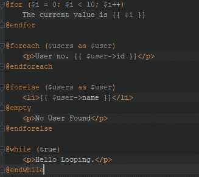

# Laravel 控制语句

> 原文：<https://www.tutorialandexample.com/laravel-control-statements/>

Blade 还为 PHP 中常见的控制结构提供了便捷的快捷方式，比如条件语句和循环。

这些快捷方式为 PHP 结构提供了一个非常简洁的工作方式，同时也为它的 PHP 对手所熟悉。

### If 语句

我们使用@if、@elseif、@else 和@endif 指令构造 if 语句。

这些指令函数与其 PHP 对应函数完全相同:

```
@if (count($records) === 1)
 One record;
 @elseif (count($records) > 1)
 Multiple records;
 @else
 No records;
 @endif 
```

Blade 还提供了一个**@除非**指令:

```
 @unless (Auth::check())
 Not signed in.
 @endunless 
```

@isset 和@empty 指令被用作 PHP 函数的便捷快捷方式:

```
 @isset($records)
     // $records is defined and is not null...
 @endisset

 @empty($records)
     // $records is "empty"...
 @endempty 
```

### 认证指令

@auth 和@guest 指令用于确定 guest 虚拟机的当前用户身份验证:

**语法:**

```
@auth 
 // The user is authenticated
 @endauth
 @guest
 // The user is not authenticated
 @endguest 
```

我们定义了在使用@auth 和@guest 指令时应该检查的身份验证保护:

```
 @auth(‘admin’)
 // The user is authenticated
 @endauth
 @guest(‘admin’)
 // The user is authenticated
 @endguest 
```

### 部分指令

我们需要使用@hasSection 指令检查一个部分是否有内容:

```
 @hasSection('navigation')
 <div class="pull-right">
 @yield('navigation')
 </div>
 <div class="clearfix"></div>
 @endif 
```

### Switch 语句

使用 **@Switch** 、 **@case** 、 **@break** 、 **@default** 和 **@endswitch** 指令构造 switch 语句:

```
 @switch($i)
 @case(1)
 First case…
 @break
 @case(2)
 Second case…
 @break
 @default
 Default case…
 @endswitch 
```


***循环***

刀片为使用循环结构提供了简单的指令。

这些指令函数中的每一个都与其 PHP 对应函数相同。

```
@for ($i = 0; $i < 10; $i++)
    The current value is {{ $i }}
@endfor
@foreach ($users as $user)
<p>User no. {{ $user->id }}</p>
@endforeach

@forelse ($users as $user)
<li>{{ $user->name }}</li>
@empty
<p>No User Found</p>
@endforelse

@while (true)
<p>Hello
Looping.</p>
@endwhile
```



*   使用循环变量获得关于循环的信息，比如我们是在循环的最后一次迭代还是第一次迭代。

我们将条件与指令声明包含在一行中:

```
 @foreach ($users as $user)
 @continue($user->type == 1)
 <li>{{ $user->name }}</li>
 @break($user->number == 5)
 @endforeach 
```


### 循环变量

在我们的循环中有一个 **$loop** 变量。变量提供对有用信息的访问，如当前循环索引，以及它是循环中的第一次还是最后一次迭代。

```
 @foreach ($users as $user)
     @if ($loop->first)
         First iteration.
     @endif

     @if ($loop->last)
         Last iteration.
     @endif

 <p> User no. {{ $user->id }}</p>
 @endforeach 
```


如果是嵌套循环，我们用**父**属性访问父循环的 **$loop** 变量:

```
 @foreach ($users as $user)
     @foreach ($user->posts as $post)
         @if ($loop->parent->first)
          First iteration of the Parent Loop.
         @endif
     @endforeach
 @endforeach 
```


**$loop** 变量还包含不同类型的其他有用属性:

| ***属性*** | ***描述*** |
| $loop->index | 索引的当前循环迭代。(从 0 开始)。 |
| $loop->迭代 | 当前循环迭代从 1 开始。 |
| $loop->剩余 | 迭代保持在循环中。 |
| $循环->计数 | 由项目总数迭代的数组。 |
| $loop->first | 是否是循环中的第一次迭代。 |
| $loop->最后一个 | 是否是循环中的最后一次迭代。 |
| $loop->even | 是否是循环中的均匀迭代。 |
| $loop->odd | 它是否是循环中的一次奇数迭代。 |
| $loop->深度 | 当前循环的嵌套级别。 |
| $loop->parent | 父循环变量，当它是嵌套循环时。 |

Blade 还允许我们在视图中定义注释。我们的应用程序返回的 HTML 中不包含刀片注释。

```
{{-- This comment will not be present in the rendered HTML --}}
```


将 PHP 代码嵌入到我们的视图中是很有用的。我们可以使用 Blade **@php** 指令在我们的模板中执行一段普通的 php 代码。

```
@php
//
@endphp
```

Blade 提供了这一功能。频繁地使用它可能会告诉我们，我们在模板中嵌入了很多逻辑。