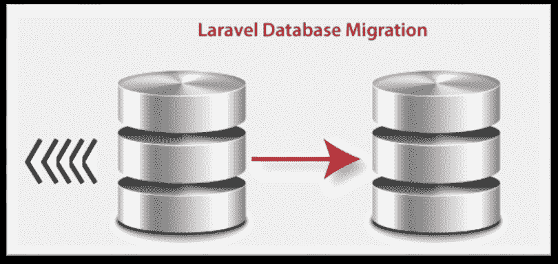
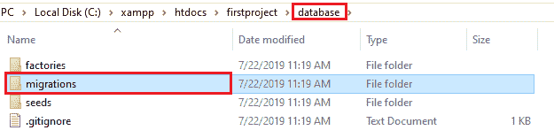
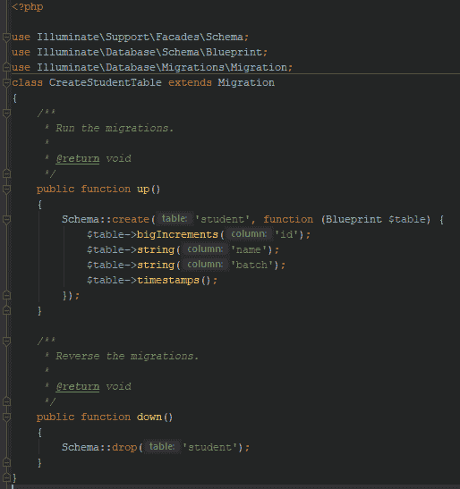
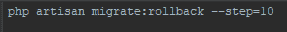
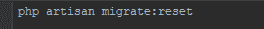
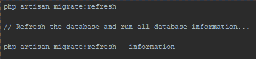
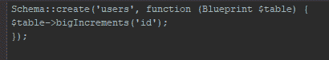
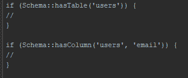
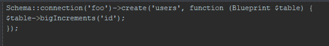

# 数据库迁移

> 原文：<https://www.tutorialandexample.com/database-migrations/>

**Laravel 中的数据库迁移**

**简介**

迁移是我们数据库的版本控制。它允许我们的团队修改和共享应用程序的数据库。

迁移与 schema builder 配合使用，可以快速构建应用程序的数据库模式。

Laravel**Schema**facade 为所有 Laravel 支持的数据库系统创建和操作表提供了数据库不可知的支持。



### 生成迁移

我们使用 **make:migration** Artisan 命令来创建迁移。

```
php artisan make:migration create_users_table
```



新的迁移将放在我们的数据库/迁移目录中。

每个迁移文件名都包含一个时间戳，用于确定迁移的顺序。

**- -table** 和 **- -create** 选项也可以用来显示表的名称，迁移将会创建一个新的表。

生成的迁移用指定的表预先填充了存根文件的这些选项。

**语法:**

```
php artisan make:migration create_users_table --create=users
php artisan make:migration add_numbers_to_users_table --table=users 
```

为了定义生成的迁移的定制输出路径，我们在执行 **make:migration** 命令时使用了**–path**选项。

**make:migration** 路径应该相对于我们的应用程序的基本路径。

### 迁移结构

迁移类包含两种不同类型的方法:第一种是 **up** 方法，第二种是 **down 方法。**

**up** 方法将新的列、新的表或索引添加到我们的数据库中。

**下降**方法应该与**上升**方法执行的操作相反。

在这两种方法中，我们使用 Laravel 模式构建器来创建和修改表。

例如:-

```



运行迁移

 **migrate** Artisan 命令用于运行所有未完成的迁移。

 **php 工匠迁移**

**在生产中运行的迁移**

迁移操作是破坏性的，这意味着它可能会导致我们丢失数据。

我们使用 **- flag** force 来强制那些运行时没有提示的命令。

```
php artisan migrate --force
```

**回滚迁移**

我们使用 **rollback** 命令来回滚最近的迁移操作。

该命令回滚包括多个迁移文件的最后一批迁移:

```
php artisan migrate:rollback 
```

通过向**回滚**命令提供**步骤**选项，可以回滚有限数量的迁移。

例如:

```
php artisan migrate:rollback --step=10
```



上述命令将回滚最近 10 次迁移。

 **migrate:reset** 命令将支持我们应用程序的所有迁移。



 **php artisan 迁移:重置**

在单个命令中回滚和迁移

 **migrate:fresh** 命令用于回滚我们所有的迁移，它由 **migrate** 命令执行。

```
php artisan migrate:refresh

// Refresh the database and run all database information...

php artisan migrate:refresh --information
```



上面的代码重新创建了我们的整个数据库。

我们回滚$ re-migrate，这是为**刷新**命令提供**步骤**选项的有限数量的迁移。

以下命令将用于回滚和重新迁移最近 15 次迁移:

```
php artisan migrate:rollback --step=15
```

**删除所有表&迁移**

 **migrate:fresh** 命令将从数据库中删除所有的表，然后 **migrate** 命令将执行它:

```
php artisan migrate:fresh
php artisan migrate:fresh --information 
```

桌子

**创建表格**

 **create** 方法用于在**模式**外观上创建一个新的数据库表。

该方法接受两种类型的参数。

表的名称是第一个参数。第二个是**闭包**，它接收一个用于定义新表的**蓝图**对象。

```
Schema::create('users', function (Blueprint $table) {
     $table->bigIncrements('id');
 }); 
```



我们使用模式构建器中定义表列的任何列方法来创建表。

**列存在**

为了检查列或表的存在，我们可以使用 **hasTable** 和 **hasColumn** 方法

**语法:**

```
if (Schema::hasTable('users')) {
     //
 }
 if (Schema::hasColumn('users', 'email')) {8
     //
 } 
```



**数据库连接**

**连接**方法用于在数据库连接上执行模式操作。

**语法:**

```
Schema::connection('foo')->create('users', function (Blueprint $table) {
     $table->bigIncrements('id');
 }); 
```



```

| ***命令*** | ***描述*** |
| **$ table->engine = ' InnoDB '；** | 它指定了表存储引擎(MySQL)。 |
| **$ table->charset = ' utf8 '；** | 它为表指定了一个默认的字符集(MySQL)。 |
| **$ table->collation = ' utf8 _ unicode _ ci '；** | 它指定了表的默认排序规则(MySQL)。 |
| **$表- >临时()；** | 它创建一个临时表(SQL Server 除外)。 |

上述命令在模式构建器上用于指定表的选项。

**重命名表格**

**rename** 方法重命名现有的数据库表。

**语法:**

 **```
Schema::rename($from, $to);
```

**举例:**

```
Schema::rename($students, $employees);
```

**丢弃表格**

**drop** 或 **dropIfExists** 方法用于删除现有的数据库表。

**语法:**

```
Schema::drop(‘users’);
Schema::dropIfExists(‘users’); 
```

### 使用外键重命名表

在重命名一个表之前，我们应该验证表上的外键约束在我们的迁移文件中有一个明确的名称。

否则，外键约束名将引用旧表名。

**列**

**创建列**

**表**方法用于更新现有的表。

这个方法有类似于 **create** 方法的参数。

用于创建列的两个参数是表的名称和**闭包**，它接收一个**蓝图**实例，我们用它向表中添加列。

**语法:**

```
Schema::table('users', function (Blueprint $table) {
     $table->string('email');
 }); 
```

**列类型:**

模式构建器包含各种列类型，它定义了表的构建:

| **命令** | **描述** |
| $ table-> big increments(' id ')； | 自动递增的无符号 BIGINT(主键)等效列。 |
| $ table-> big integer(' votes ')； | 它的 BIGINT 等价列。 |
| $ table-> binary(' data ')； | 它是 BLOB 等效列。 |
| $table->布尔值(' confirmed ')； | 布尔等价列。 |
| $table->char('name '，50)； | 具有可选长度的 CHAR 命令等效列。 |
| $ table-> date(' created _ at ')； | 日期等价列。 |
| $ table-> dateTime(' created _ at ')； | DATETIME 等效列。 |
| $ table-> datetime tz(' created _ at ')； | DATETIME(带时区)等效列。 |
| $table->decimal('金额'，15，12)； | 具有(总位数)和小数位数(小数位数)组合的小数等价列。 |
| $table->double('amount '，15，12)； | 具有(总位数)和小数位数(小数位数)组合的双等效列。 |
| $table->enum('level '，['easy '，' hard '])； | 枚举等效列。 |
| $table->float('amount '，18，12)； | 具有(总位数)和小数位数(小数位数)组合的 FLOAT 等价列。 |
| $table->几何(' positions ')； | 几何等效列。 |
| $ table-> geometry collection(' positions ')； | GEOMETRYCOLLECTION 等效列。 |
| $table->增量(' id ')； | 自动递增无符号整数(主键)等效列。 |
| $table->integer('票数')； | 整数等价列。 |
| $ table-> IP address(' visitor ')； | IP 地址等价列。 |
| $ table-> JSON(' options ')； | JSON 等价列。 |
| $ table-> jsonb(' options ')； | JSONB 等价列。 |
| $ table-> lineString(' positions ')； | 线串等价列。 |
| $ table-> long text(' description ')； | LONGTEXT 等效列。 |
| $ table-> MAC address(' device ')； | MAC 地址等价列。 |
| $ table-> mediumIncrements(' id ')； | 自动递增无符号中间值(主键)等效列。 |
| $ table-> medium integer(' votes ')； | 中等当量柱。 |
| $ table-> medium text(' description ')； | MEDIUMTEXT 等效列。 |
| $ table-> morphs(' taggable ')； | 添加 taggable_id 无符号 BIGINT 和 taggable_typeVARCHAR 等效列。 |
| $ table-> uuidMorphs(' taggable ')； | 添加 taggable_id CHAR(36)和 taggable_type VARCHAR(255) UUID 等效列。 |
| $table->多行字符串(' positions ')； | 多线性等效列。 |
| $table->多点(' positions ')； | 多点等效柱。 |
| $table->多多边形(' positions ')； | 多多边形等效柱。 |
| $ table-> NullableMorphs(‘可标记’)； | 添加 morphs()列的可空版本。 |
| $ table-> nullableUuidMorphs(' taggable ')； | 添加 uuidMorphs()列的可空版本。 |
| $ table-> nullable timestamps()； | timestamps()方法的别名。 |
| $ table-> point(' position ')； | 点等效列。 |
| $table->多边形(' positions ')； | 多边形等价列。 |
| $ table-> remember token()； | 添加一个可空的 remember_tokenVARCHAR(100)等效列。 |
| $table->set('flavors '，['草莓'，'香草'])； | 设置等效列。 |
| $ table-> small increments(' id ')； | 自动递增无符号 SMALLINT(主键)等效列。 |
| $ table-> small integer(' votes ')； | SMALLINT 等效列。 |
| $ table-> soft deletes()； | 为软删除添加可为 null 的 deleted_atTIMESTAMP 等效列。 |
| $ table-> softDeletesTz()； | 为软删除添加可空的 deleted_atTIMESTAMP(带时区)等效列。 |
| $table->string('name '，100)； | 长度可选的 VARCHAR 等效列。 |
| $table->text('描述')； | 文本等效列。 |
| $ table-> time(' sunrise ')； | 时间等效列。 |
| $ table-> timeTz(' sunrise ')； | 时间(含时区)等效列。 |
| $ table-> timestamp(' added _ on ')； | 时间戳等价列。 |
| $ table-> timestampTz(' added _ on ')； | 时间戳(带时区)等效列。 |
| $ table-> timestamps()； | 添加可空的 created_at 和 updated_at 时间戳等效列。 |
| $ table-> timestamp STZ()； | 添加可空的 created_at 和 updated_at 时间戳(带时区)等效列。 |
| $ table-> tiny increments(' id ')； | 自动递增无符号 TINYINT(主键)等效列。 |
| $ table-> tinyInteger(' votes ')； | TINYINT 等价列。 |
| $ table-> unsigned biginteger(' votes ')： | 无符号 BIGINT 等效列。 |
| $ table-> unsigned decimal(' amount '，16，12)； | 带(总位数)和小数位数(小数位数)组合的无符号小数等效列。 |
| $ table-> unsignedInteger(' votes ')； | 等效无符号整数列。 |
| $ table-> signeedmedilumieteger(' votes ')； | 无符号中等等效列。 |
| $ table-> unsigned mallinteger(" votes ")； | 等效无符号 SMALLINT 列。 |
| $ table-> signeedtinyinteger(' votes ')； | 无符号 TINYINT 等效列。 |
| $ table-> uuid(' id ')； | UUID 等效柱。 |
| $table->year('出生 _ 年份')； | 年等价列。 |

### 修改列

在修改一个列之前，我们必须将**教条/dbal** 依赖项添加到我们的 **composer.json** 中。

DBAL 库用于确定列的当前状态，它将创建对列进行指定调整所需的 SQL 查询。

```
composer require doctrine/dbal
```

### 更新列属性

change 方法允许我们将现有的列类型修改为新的类型，或者修改列的属性。

运行中的 **change** 方法将 **name** 列的大小从 **25** 增加到 **50** 。

**语法:**

```
Schema::table('users', function (Blueprint $table) 
 {
     $table->string('name', value)->change();
 }); 
```

**举例:**

```
Schema::table('users1', function (Blueprint $table) 
 {
     $table->string('employee', 20)->change();
 }); 
```

我们还将一个列修改为可空:

**语法:**

```
Schema::table('users', function (Blueprint $table)
  {
     $table->string('name', value)->nullable()->change();
 }); 
```

**举例:**

```
Schema::table('users', function (Blueprint $table)
  {
     $table->string('employee', 20)->nullable()->change();
 }); 
```

**重命名列**

**renameColumn** 方法用于在模式构建器上重命名列。

在将一列重命名为 **composer.json** 文件之前，添加 **doctrine/dbal** 依赖项。

语法:

```
Schema::table('users', function (Blueprint $table) {
     $table->renameColumn('from', 'to');
 }); 
```

**举例:**

```
Schema::table('users', function (Blueprint $table) {
     $table->renameColumn('roll-on', 'batch');
 }); 
```

*   当前不支持重命名也具有列类型**枚举**的列。

### 删除列

**dropColumn** 方法用于删除一列。

我们需要将 **doctrine/dbal** 依赖项添加到我们的 **composer.json** 文件中，它将在我们的终端中运行 **composer update** 命令来安装库。

```
Schema::table('users', function (Blueprint $table) {
     $table->dropColumn('votes');
 }); 
```

为了从一个表中删除多个列，我们使用了 **dropColumn** 方法，传递一个列名数组。

```
Schema::table('users',function(Blueprint $table){
 $table->dropColumn(['votes','avatar','location']);
 }); 
```

**可用命令**

| **命令** | **描述** |
| **$ table->drop morphs(' morphable ')；** | 它删除了 morphable_id 和 morphable_type 列。 |
| **$ table->droplemembertoken()；** | 它删除了 remember_token 列。 |
| **$ table->dropSoftDeletes()；** | 它删除了 deleted_at 列。 |
| **$ table->dropSoftDeletesTz()；** | dropSoftDeletes()方法的别名。 |
| **$ table->drop timestamps()；** | 它删除 created_at 和 updated_at 列。 |
| **$ table->dropTimestampsTz()；** | dropTimestamps()方法的别名。 |

**索引**

**创建索引**

为了创建索引，我们在列定义上使用了 unique 方法

**语法:**

```
$table->string(‘name’)->unique();
```

否则，我们在定义列之后创建索引

**示例:-**

$ table-> unique(' name ')；

我们可以为 index 方法创建一个列数组来创建复合索引:

```
$table->index([‘employee_id’, ‘created_at’]);
```

Laravel 将根据它们的名称自动生成索引名称，但是我们可以通过指定名称来传递第二个参数

```
$table->unique('name', 'unique_name');
```

**可用的索引类型**

每个 index 方法都接受第二个参数来定义索引的名称。

如果省略，该名称将取自表和列的名称。

| **命令** | **描述** |
| --- | --- |
| $table->主(' id ')； | 添加主键。 |
| $table->primary(['id '，' parent _ id '])； | 添加组合键。 |
| $ table-> unique(' email ')； | 添加唯一索引。 |
| $ table-> index(' state ')； | 添加普通索引。 |
| $ table-> spatial index(' location ')； | 添加空间索引。(SQLite 除外) |

### 索引长度& MySQL/Maria DB

默认情况下，Laravel 使用 utf8mb4 字符集，该字符集支持在数据库中存储“表情符号”。

如果我们想运行 MySQL 或 Maria DB 的旧版本，我们需要手动配置迁移生成的默认字符串长度。这是为了 MySQL，以便为他们创建一个索引。

我们通过调用 AppServiceProvider 中的**Schema::defaultStringLength**方法来进行配置:

```
use Illuminate\Support\Facades\Schema;
 /**
  * Bootstrap any application services.
  *
  * @return void
  */
 public function boot() 
 {
     Schema::defaultStringLength(191);
 } 
```

我们为数据库启用了 innodb_large_prefix 选项。

### 重命名和删除索引

**renameIndex** 方法用于重命名索引。renameIndex 方法接受当前索引名称作为其第一个参数，所需名称作为其第二个参数:

```
$table->renameIndex(‘from’, ‘to)
```

要删除索引，我们必须指定索引的名称。

默认情况下，Laravel 会自动为索引分配一个合理的名称。

| ***命令*** | ***描述*** |
| --- | --- |
| $ table-> drop primary(' users _ id _ primary ')； | 它从“users”表中删除了一个主键。 |
| $ table-> drop unique(' users _ email _ unique ')； | 它从“users”表中删除了一个惟一的索引。 |
| $ table-> drop index(' geo _ state _ index ')； | 它从“geo”表中删除了一个基本索引。 |
| $ table-> drop space index(' geo _ location _ space index ')； | 它从“geo”表中删除了一个空间索引(SQLite 除外)。 |

我们将一个列数组传递给方法，该方法删除索引。相似的索引名称将根据表名、列和键类型生成:

```
Schema::table(‘posts’, function (Blueprint $table)
 {
 $table->unsignedBigInteger(‘user_id’);
 $table->foreign(‘user_id’)->references(‘id’)->on(‘users’);
 }); 
```

我们还为约束的“删除时”和“更新时”属性指定了所需的操作:

```
Schema::table('geo', function (Blueprint $table) 
 {
     $table->dropIndex(['state']); 
 // Drops index 'geo_state_index'
 }); 
```

### 外键约束

Laravel 支持创建外键约束，这些约束用于在数据库级别强制引用完整性。

**例如:**

**帖子**表的**用户 id** 列，指的是**用户**表的 **id** 列:

```
Schema::table('posts', function (Blueprint $table) {
     $table->unsignedBigInteger('user_id');
  $table->foreign('user_id')->references('id')->on('users');
 }); 
```

我们还为约束的**“删除时”**和**“更新时”**属性定义了所需的动作:

```
$table->foreign('user_id')
       ->references('id')->on('users')
       ->onDelete('cascade'); 
```

dropForeign 方法用于删除外键。

外键约束使用与其索引相同的命名。

在“—foreign”的帮助下，表名和列将在约束名称中连接起来:

```
$table->dropForeign(‘posts_user_id_foreign’);
```

或者，我们传递一个数组值，该值将在删除时自动使用传统的约束名称:

```
$table->dropForeign([‘user_id’]);
```

我们使用以下方法在迁移中启用或禁用外键约束:

```
Schema::enableForeignKeyConstraints();
Schema::disableForeignKeyConstraints(); 
```

*   默认情况下，SQLite 禁用外键约束。在使用 SQLite 时，确保在我们的数据库配置中启用外键支持，然后再尝试在我们的迁移中创建它们。**