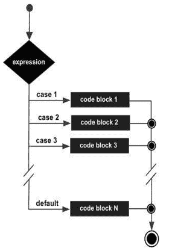

# Javascript Switch 语句

> 原文：<https://www.tutorialandexample.com/javascript-switch-statement>

JavaScript 中使用 switch 语句在多种情况下执行一段代码。它与 else if 语句相同，但比重复 **if 更方便..其他..if** 语句。 **语法**

```
switch (expression)  
{  
case 1: statement(s)  
break;  
case 2: statement(s)  
break;  
…..  
case n: statement(s)  
break;  
default: statements(s)  
}
```

**注:** Break 语句在 switch-case 语句中起主导作用。

### 例子

```
<!DOCTYPE html>  
<html>  
<body>  
<script>  
var grade='B';  
var result;  
switch(grade){  
case 'A':  
result="A Grade";  
break;  
case 'B':  
result="B Grade";  
break;  
case 'C':  
result="C Grade";  
break;  
default:  
result="No Grade";  
}  
document.write(result);  
</script>  
</body>  
</html>
```

**[Try Now](https://editor.tutorialandexample.com/web/test.jsp?filename=javascriptswitchstatement1)** **Output**

```
B Grade
```

[← Prev](https://www.tutorialandexample.com/javascript-if-else)[Next →](https://www.tutorialandexample.com/javascript-loop)