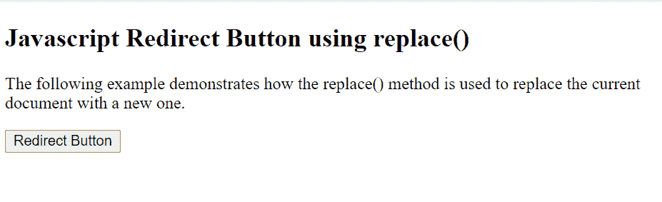
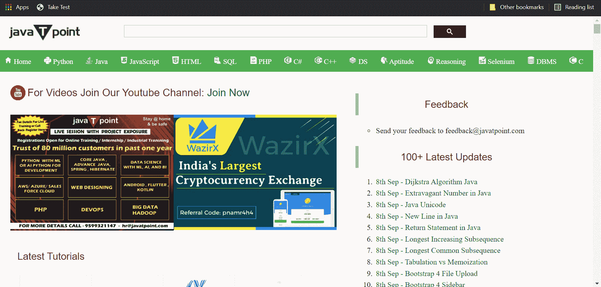
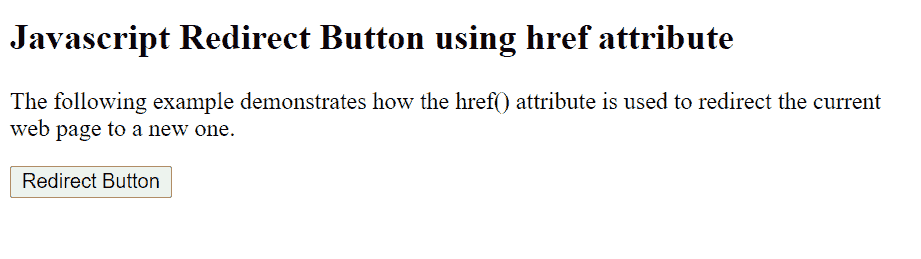

# Javascript 重定向按钮

> 原文：<https://www.tutorialandexample.com/javascript-redirect-button>

## 什么是重定向按钮？

当按钮充当超链接时，它被称为重定向按钮。点击按钮后，它会将用户转到另一个页面。

## 如何用 JavaScript 制作重定向按钮？

在 JavaScript 中创建重定向链接有多种方法，最常见的方法是使用以下属性:

*   **replace()属性**

它刺激了一个 HTTP Direct。

**语法:**

```
window.location.replace("url of the website/document");
```

**举例:**

```
<!DOCTYPE html>
<html>
<head>
    <title>
         Javascript redirect buttons
    </title>
</head>

<body>

<h2>Javascript Redirect Button using replace() </h2>
<p>The following example demonstrates how the replace() method is used to replace the current document with a new one.</p>

<button onclick="myFunctiondemo()">Redirect Button</button>

<script>
function myFunctiondemo() {
  location.replace("https://www.javatpoint.com/")
}
</script>

</body>
</html> 
```

上述代码也可以用稍微不同的方式编写:

```
<!DOCTYPE html>
<html>
<head>
    <title>
         Javascript redirect buttons
    </title>
</head>

<body>
<h2>Javascript Redirect Button using replace() </h2>
<p>The following example demonstrates how the replace() method is used to redirect the current web page to a new one.</p>

<button id="redirect">Redirect Button</button>

<script type="text/javascript">

 document.getElementById("redirect").onclick = function () {
    location.replace("https://www.javatpoint.com/")
};
</script>

</body>
</html> 
```

**输出:**



单击按钮后，网页现在被重定向到 Javatpoint 网站，



*   **href 属性:**

它会在鼠标点击时产生刺激。

**语法:**

```
window.location.href  = "url of the website/document";
```

**举例:**

```
<!DOCTYPE html>
<html>
<head>
    <title>
         Javascript redirect buttons
    </title>
</head>

<body>
<h2>Javascript Redirect Button using href attribute</h2>
<p>The following example demonstrates how the href() attribute is used to redirect the current web page to a new one.</p>

<button onclick="myFunctiondemo()">Redirect Button</button>

<script>
function myFunctiondemo() {
  location.href = ("https://www.javatpoint.com/";
}
</script>

</body>
</html> 
```

上述代码也可以用稍微不同的方式编写:

```
<!DOCTYPE html>
<html>
<head>
    <title>
         Javascript redirect buttons
    </title>
</head>

<body>
<h2>Javascript Redirect Button using href attribute</h2>
<p>The following example demonstrates how the href() attribute is used to redirect the current web page to a new one.</p>

<button id="redirect">Redirect Button</button>

<script type="text/javascript">

 document.getElementById("redirect").onclick = function () {
  location.href = ("https://www.javatpoint.com/");
};
</script>

</body>
</html> 
```

**输出:**

最初，屏幕看起来像这样:



单击按钮后，网页现在被重定向到 Javatpoint 网站，


## replace()和 href 有什么区别？

href 和 replace 的主要区别在于,`replace() can`从历史中删除当前文档或当前网站的 URL。这意味着不可能使用“后退”按钮导航回原始文档。

> **注意:**标签像锚标签< a >也可以用来创建重定向按钮。然而，它不需要 JavaScript。