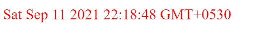

# JavaScript 时刻日期差异

> 原文：<https://www.tutorialandexample.com/javascript-moment-date-difference>

出于各种原因，web 平台上经常需要日期差异。它们可以是:

*   要找到持续时间，当然有人在追求
*   为了从用户的出生日期找到他的年龄
*   日期定制等。

然而，使用 JavaScript 进行这些日期和时间的计算会变得非常具有挑战性，尤其是当数据库非常大的时候。所以，这里 **moment.js** 进入画面。

## moment.js 是什么？

Moment.js 是一个 JavaScript 库。它有助于以简单的方式在 JavaScript 中验证、操作、解析和显示日期/时间。这个库允许按照本地化和人类可读的格式显示日期。Moment.js 可以在任何浏览器中直接使用。

只要用户希望使用这个库，就应该在脚本标记中包含以下代码:

```
<script type = "text/JavaScript" src = "https://MomentJS.com/downloads/moment.js"></script>
```

**举例:**

要显示当前日期:

```
<html>
   <head>
      <title>MomentJS Example</title>
      <script type = "text/JavaScript" src = "https://MomentJS.com/downloads/moment.js"></script>

   </head>
   <body>
      <div style = "font-size:20px; color: red; " id = "currentdate"></div>
      <script type = "text/JavaScript">
         var val = moment().toString();
         document.getElementById("currentdate").innerHTML = val;
      </script>
   </body>
</html> 
```

**输出:**



## JavaScript 中日期差异/持续时间是如何计算的？

以下函数用于查找日期差异:

*   **moment.duration()。asmillseconds()；**
    它用于返回日期的差值或以毫秒为单位的值。
*   **moment.duration()。ass seconds()；**
    用于返回日期或秒数值的差值。
*   **moment.duration()。as minutes()；**
    用于返回日期的差值或分钟值。
*   **moment.duration()。asHours()；**
    用于返回日期的差值或小时值。
*   **moment.duration()。asDays()；**
    用于返回日期的差值或天数的值。
*   **moment.duration()。as weeks()；**
    用于返回日期或周数值的差值。
*   **moment.duration()。asYears()；**
    用于返回日期或年份的差值。

**语法:**

```
var duration = moment.duration(x.diff(y))
```

**举例:**

```
<!DOCTYPE html>
<html>
     <head>
      <title>MomentJS Example</title>
      <script type = "text/JavaScript" src = "https://MomentJS.com/downloads/moment.js"></script>

   </head>

  <body>
    <h2>The following is an example to demonstrate the working of moment.js</h2>
    <br>
    <p>Getting Difference between two dates in days</p>
    <br>
    <p id="tcontent"></p>
  </body>
  <script>
    console.clear();
var a = moment("2013-11-4"); //first date
var b = moment("2015-12-1"); // second date
var duration = moment.duration(b.diff(a)); // b-a
var days = duration.asDays();

  document.getElementById("tcontent").innerHTML = "The difference between the dates is: " + days+ " days";

    </script>

</html> 
```

**输出:**

**下面的例子演示了 moment.js** 的工作原理

获取两个日期之间的天数差

日期之间的差异是:757 天

*   **查找当前日期和给定日期的差值:**
    *   **以秒为单位的日期差异**

**举例:**

```
<!DOCTYPE html>
<html>
     <head>
      <title>MomentJS Example</title>
      <script type = "text/JavaScript" src = "https://MomentJS.com/downloads/moment.js"></script>

   </head>

  <body>
    <h2>The following is an example to demonstrate the working of moment.js</h2>
    <br>
    <p>Getting Difference between two dates in seconds</p>
    <br>
    <p id="tcontent"></p>
  </body>
  <script>
    console.clear();
var now = moment(new Date()); //todays date(2021-9-11)
var end = moment("2021-2-6"); // another date
var duration = moment.duration(now.diff(end));
var val = duration.asSeconds();

  document.getElementById("tcontent").innerHTML = "The difference between the dates is: " + val+ " seconds";

    </script>

</html> 
```

**输出:**

**下面的例子演示了 moment.js** 的工作原理

以秒为单位获取两个日期之间的差异

日期之间的差异是:18831774.866 秒

*   **日期差异天数**

**举例:**

```
<!DOCTYPE html>
<html>
     <head>
      <title>MomentJS Example</title>
      <script type = "text/JavaScript" src = "https://MomentJS.com/downloads/moment.js"></script>

   </head>

  <body>
    <h2>The following is an example to demonstrate the working of moment.js</h2>
    <br>
    <p>Getting Difference between two dates in days</p>
    <br>
    <p id="tcontent"></p>
  </body>
  <script>
    console.clear();
var now = moment(new Date()); //todays date(2021-9-11)
var end = moment("2021-2-6"); // another date
var duration = moment.duration(now.diff(end));
var val = duration.asDays();

  document.getElementById("tcontent").innerHTML = "The difference between the dates is: " + val+ " days";

    </script>

</html> 
```

**输出:**

**下面的例子演示了 moment.js** 的工作原理

获取两个日期之间的天数差

这两个日期之间的差别是:100 天。10360.688686888616

*   **月份日期差异**

**举例:**

```
<!DOCTYPE html>
<html>
     <head>
      <title>MomentJS Example</title>
      <script type = "text/JavaScript" src = "https://MomentJS.com/downloads/moment.js"></script>

   </head>

  <body>
    <h2>The following is an example to demonstrate the working of moment.js</h2>
    <br>
    <p>Getting Difference between two dates in months</p>
    <br>
    <p id="tcontent"></p>
  </body>
  <script>
    console.clear();
var now = moment(new Date()); //todays date(2021-9-11)
var end = moment("2021-2-6"); // another date
var duration = moment.duration(now.diff(end));
var val = duration.asMonths();

  document.getElementById("tcontent").innerHTML = "The difference between the dates is: " + val+ " months";

    </script>

</html> 
```

**输出:**

**下面的例子演示了 moment.js** 的工作原理

获取月份中两个日期之间的差异

这两个日期之间的差别是:7.18 个月。36866.88868688686

*   **日期年差**

**举例:**

```
<!DOCTYPE html>
<html>
     <head>
      <title>MomentJS Example</title>
      <script type = "text/JavaScript" src = "https://MomentJS.com/downloads/moment.js"></script>

   </head>

  <body>
    <h2>The following is an example to demonstrate the working of moment.js</h2>
    <br>
    <p>Getting Difference between two dates in years</p>
    <br>
    <p id="tcontent"></p>
  </body>
  <script>
    console.clear();
var now = moment(new Date()); //todays date(2021-9-11)
var end = moment("2018-12-16"); // another date
var duration = moment.duration(now.diff(end));
var val = duration.asYears();

  document.getElementById("tcontent").innerHTML = "The difference between the dates is: " + val+ " years";

    </script>

</html> 
```

**输出:**

**下面的例子演示了 moment.js** 的工作原理

获取年份中两个日期之间的差异

这两个日期之间的差别是:2 年。36860 . 66866868666

*   **找出两个给定日期之间的差异:**
    *   **以秒为单位的日期差异**

**举例:**

```
<!DOCTYPE html>
<html>
     <head>
      <title>MomentJS Example</title>
      <script type = "text/JavaScript" src = "https://MomentJS.com/downloads/moment.js"></script>

   </head>

  <body>
    <h2>The following is an example to demonstrate the working of moment.js</h2>
    <br>
    <p>Getting Difference between two dates in seconds</p>
    <br>
    <p id="tcontent"></p>
  </body>
  <script>
    console.clear();
var a = moment("2013-11-4"); //first date
var b = moment("2015-12-1"); // second date
var duration = moment.duration(b.diff(a)); // b-a
var val = duration.asSeconds();

  document.getElementById("tcontent").innerHTML = "The difference between the dates is: " + val+ " seconds";

    </script>

</html> 
```

**输出:**

**下面的例子演示了 moment.js** 的工作原理

以秒为单位获取两个日期之间的差异

日期之间的差异是:65404800 秒

*   **周日期差**

**举例:**

```
<!DOCTYPE html>
<html>
     <head>
      <title>MomentJS Example</title>
      <script type = "text/JavaScript" src = "https://MomentJS.com/downloads/moment.js"></script>

   </head>

  <body>
    <h2>The following is an example to demonstrate the working of moment.js</h2>
    <br>
    <p>Getting Difference between two dates in days</p>
    <br>
    <p id="tcontent"></p>
  </body>
  <script>
    console.clear();
var a = moment("2013-11-4"); //first date
var b = moment("2015-12-1"); // second date
var duration = moment.duration(b.diff(a)); // b-a
var val = duration.asWeeks();

  document.getElementById("tcontent").innerHTML = "The difference between the dates is: " + val+ " weeks";

    </script>

</html> 
```

**输出:**

**下面的例子演示了 moment.js** 的工作原理

获取两个日期之间的天数差

这两个日期之间的差别是:100 周。10360.688686888617

*   **月份日期差异**

**举例:**

```
<!DOCTYPE html>
<html>
     <head>
      <title>MomentJS Example</title>
      <script type = "text/JavaScript" src = "https://MomentJS.com/downloads/moment.js"></script>

   </head>

  <body>
    <h2>The following is an example to demonstrate the working of moment.js</h2>
    <br>
    <p>Getting Difference between two dates in months</p>
    <br>
    <p id="tcontent"></p>
  </body>
  <script>
    console.clear();
var a = moment("2013-11-4"); //first date
var b = moment("2015-12-1"); // second date
var duration = moment.duration(b.diff(a)); // b-a
var val = duration.asMonths();

  document.getElementById("tcontent").innerHTML = "The difference between the dates is: " + val+ " months";

    </script>

</html> 
```

**输出:**

**下面的例子演示了 moment.js** 的工作原理

获取月份中两个日期之间的差异

这两个日期之间的差别是:24 个月。36860 . 68686868686

*   **日期年差**

**举例:**

```
<!DOCTYPE html>
<html>
     <head>
      <title>MomentJS Example</title>
      <script type = "text/JavaScript" src = "https://MomentJS.com/downloads/moment.js"></script>

   </head>

  <body>
    <h2>The following is an example to demonstrate the working of moment.js</h2>
    <br>
    <p>Getting Difference between two dates in years</p>
    <br>
    <p id="tcontent"></p>
  </body>
  <script>
    console.clear();
var a = moment("2013-11-4"); //first date
var b = moment("2015-12-1"); // second date
var duration = moment.duration(b.diff(a)); // b-a
var val = duration.asYears();

  document.getElementById("tcontent").innerHTML = "The difference between the dates is: " + val+ " years";

    </script>

</html> 
```

**输出:**

**下面的例子演示了 moment.js** 的工作原理

获取年份中两个日期之间的差异

这两个日期之间的差别是:2.00000000001