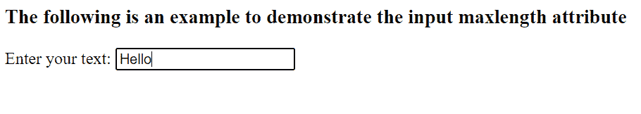
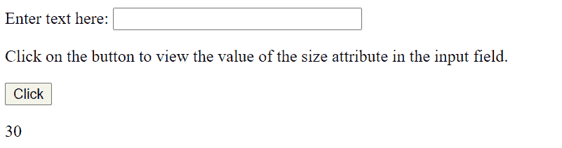

# Javascript 输入 maxlength

> 原文：<https://www.tutorialandexample.com/javascript-input-maxlength>

在 HTML 中，各种属性通常伴随着输入标签来改变输入字段的属性。Maxlength()就是这样一个属性。

maxLength 属性定义输入字段中允许的最大字符数。

> **注意:**如果没有定义 maxlength()属性的值，那么默认取默认值为 524288。

几乎所有的浏览器都支持这种方法，比如 Google chrome、safari、Microsoft Edge/Internet Explorer、Oracle、Firefox 等。

**语法:**

```
<input maxlength="number">
```

这里，数字必须是 0 或更大。它可以取负值。

**举例:**

```
<!DOCTYPE html>
<html>
<body>

<h3>The following is an example to demonstrate the input maxlength attribute</h3>

<form>
  <label for="tcontent">Enter your text:</label>
  <input type="text" id="tcontent" name="tcontent" maxlength="25">
  <br>

</form>

</body>
</html>
```

**输出:**

输入栏不允许输入超过 25 个字符:



**一些要点:**

*   maxlength 中指定的长度应该为 0 或大于 0。
*   可以定义 minlength 属性来为输入字段指定输入字段中允许的最小字符数。因此，maxlength 的值应该总是大于或等于 **minlength** 的值(如果存在的话)。
*   如果字段的文本长度或值大于 maxlength UTF-16 代码单位长度，约束验证将在输入中失败。当用户更改值时，约束验证就派上了用场。

## 什么是约束验证？

浏览器通常会阻止用户输入超过 maxlength 属性指定的文本。如果用户输入的文本长度偶然超过了 maxlength 允许的长度，那么 ValidityState 对象的只读 tooLong 属性将变为 true。

> **注意:**如果用户想要找到输入字段的宽度，**使用 size()属性**。

## 如何使用 size()属性？

它采用默认值 20。

**语法:**

要返回字段的大小:

```
*textObject*.size
```

要设置字段的大小:

```
*textObject*.size = “number”
```

**举例:**

这里，示例显示了 size()属性的两种功能。

```
<!DOCTYPE html>
<html>
<body>

Enter text here: <input type="text" id="tcontent" size="30">

<p> Select the button to view the value of the size attribute in the input field.</p>

<button onclick="myFunctiondemo()">Click</button>

<p id="displaysize"></p>

<script>
function myFunctiondemo() {
  var x = document.getElementById("tcontent").size;
  document.getElementById("displaysize").innerHTML = x;
}
</script>

</body>
</html> 
```

**输出:**



## HTML 中 size 和 maxlength 有什么区别？

max-length 属性用于定义可以在输入字段中输入的字符数，而不管屏幕上显示的字段有多宽。但是，大小属性决定了字段在屏幕上显示的大小。