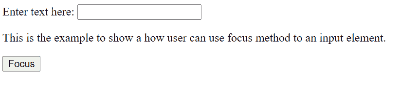
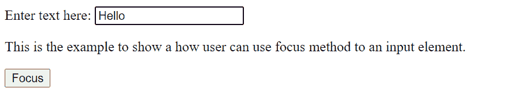
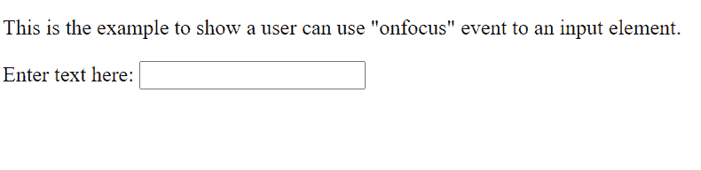
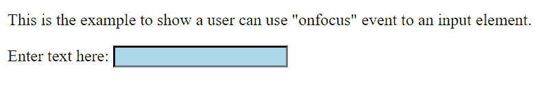
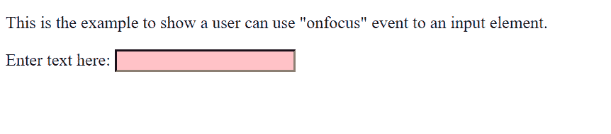
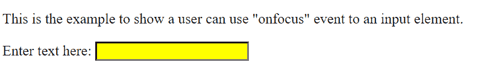
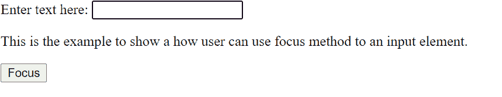
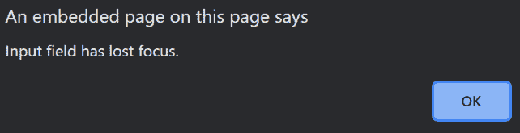

# JavaScript 关注输入

> 原文：<https://www.tutorialandexample.com/javascript-focus-on-input>

在 JavaScript 中，可以使用 focus()方法或 onfocus()事件来聚焦元素。

## 什么是 focus()方法？

当我们想要聚焦一个元素(如果可以聚焦的话)或者基本上高亮显示它的时候，使用 focus()方法。

几乎所有的浏览器都支持这种方法，比如 Google chrome、safari、Microsoft Edge/Internet Explorer、Oracle、Firefox 等。

> **注意:**这个方法没有参数，也没有返回值。

**语法:**

```
*element*.focus()
```

**举例:**

```
<!DOCTYPE html>
<html>
<body>

Enter text here: <input type="text" id="tcontent">

<p>This is the example to show a how user can use focus method to an input element.</p>

<button type="button" onclick="myFunctiondemo()">Focus</button>

<script>
function myFunctiondemo() {
  document.getElementById("tcontent").focus();
}
</script>
</body>
</html> 
```

**输出:**

最初，



选择按钮后，文本框会高亮显示



## 什么是 onfocus()事件？

每当元素获得焦点时，就会发生 onfocus()事件。
<输入>、<选择>和< a >一般使用 onfocus()事件。
onfocus()事件可以与所有 HTML 标签一起使用，除了:< br >，< head >，< html >，< iframe >，< meta >，< param >，< script >，< style >和< title >标签。
与 focus()方法类似，onfocus 事件也受到几乎所有浏览器的支持，如 Google chrome、safari、Microsoft Edge/Internet Explorer、Oracle、Firefox 等。

## 输入元素和 onfocus 事件

输入字段由**输入标签**定义，用户可以在其中输入数据。input tag 元素可用于显示多种类型的属性，如单选按钮、文本字段、复选框、日期、电子邮件 id、密码等。

因此，onfocus()事件或 focus 方法有助于在指定的输入元素上设置焦点。聚焦的元素有助于确定默认情况下哪个元素将接收键盘输入和类似事件。

## onfocus 事件通常有三种用法:

*   在 HTML 中，

**语法:**

```
<element onfocus= functionname>

<script>
function functionname(){
	//definition of the function
}
</script> 
```

**举例:**

```
<!DOCTYPE html>
<html>
<body>

<p>This is the example to show a user can use "onfocus" event to an input element.</p>

Enter text here: <input type="text" id="tcontent" onfocus="myFunctiondemo()">

<script>
function myFunctiondemo() {
  document.getElementById("tcontent").style.backgroundColor = "lightblue";
}
</script>

</body>
</html> 
```

**输出:**

最初，输入元素看起来像这样，



聚焦时(选择输入文本框):



*   Javascript 中的

 ****语法:**

```
<script>
object.onfocus = function(){functionname};

function functionname(){
	//definition of the function
}
</script> 
```

**举例:**

```
<!DOCTYPE html>
<html>
<body>

<p>This is the example to show a user can use "onfocus" event to an input element.</p>

Enter text here: <input type="text" id="tcontent">

<script>
document.getElementById("tcontent").onfocus = function() {myFunctiondemo()};

function myFunctiondemo() {
  document.getElementById("tcontent").style.backgroundColor = "pink";
}
</script>

</body>
</html> 
```

**输出:**

在输入元素被聚焦(文本框被选择)后，



*   **在 JavaScript 中使用 addEventListener()方法**

**语法:**

```
<script>
object.addEventListener("focus", functionname);
function functionname(){
	//definition of the function
}
</script> 
```

**举例:**

```
<!DOCTYPE html>
<html>
<body>

<p>This is the example to show a user can use "onfocus" event to an input element.</p>

Enter text here: <input type="text" id="tcontent">

<script>
document.getElementById("tcontent").addEventListener("focus", myFunctiondemo);

function myFunctiondemo() {
  document.getElementById("tcontent").style.backgroundColor = "yellow";
}
</script>

</body>
</html> 
```

**输出:**

在输入元素被聚焦(文本框被选择)后，



> **注意:**Internet explorer 和旧版本不支持 addEventListener()的方法。

如何从元素中移除焦点？

 ***   **通过使用 blur()方法**

**语法:**

```
*element*.blur()
```

**举例:**

```
<!DOCTYPE html>
<html>
<body>

Enter text here: <input type="text" id="tcontent">

<p>This is the example to show how a user can use blur method to an input element.</p>

<button type="button" onclick="myFunctiondemo()">Lose focus</button>

<script>

function myFunctiondemo() {
  document.getElementById("tcontent").blur();
}
</script>

</body>
</html> 
```

**输出:**

当文本框最初被突出显示时，



选择按钮后，文本框失去焦点


*   **通过使用 onblur()事件**

**语法:**

```
<element onblur= “functionname()”>
```

**举例:**

```
<!DOCTYPE html>
<html>
<body>

<p>This is the example to show a user can use "onblur" event to an input element.</p>

Enter text here: <input type="text" id="tcontent" onblur="myFunctiondemo()">

<script>
function myFunctiondemo() {
  alert("Input field has lost focus.");
}
</script>

</body>
</html> 
```

**输出:**

在 input 元素中输入数据后，如果用户单击域外的任何地方，就会失去焦点并出现警告，

****