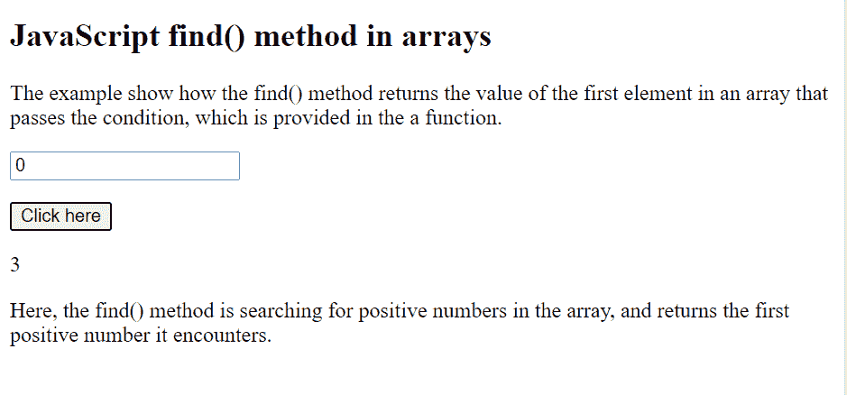

# Javascript 在数组中查找对象

> 原文：<https://www.tutorialandexample.com/javascript-find-object-in-array>

## 什么是 find()方法？

它返回给定数组中满足给定测试函数的第一个元素的值。但是，如果数组中没有值能够满足测试函数，那么 find()方法将返回“ [`undefined`](https://developer.mozilla.org/en-US/docs/Web/JavaScript/Reference/Global_Objects/undefined) ”。
find()方法不在空数组上执行函数，即没有元素的数组。
这个方法的执行不会修改原来的数组。
几乎所有浏览器都支持这种方法，如谷歌 chrome 45、safari 7.1、微软 Edge 12、Opera 32、Firefox 25 等。但是，它不支持 Internet Explorer。

find()方法可以接受各种参数，例如:

*   **回调函数**

它指的是执行数组中每个值的函数。它通常需要三个参数，即:

*   **元素**

它表示数组的当前元素。这是一个强制性的论点。

*   **索引**

它是指数组中当前元素的位置(索引)。这是一个可选参数。

*   **数组**

它指的是调用 find()方法的数组。这是一个可选参数。

*   **该值**

它是指可以传递给函数用作其“this”值的值。
然而，如果该参数为空，则值“未定义”作为其“此”值传递。这是一个可选参数。

## Find()方法和回调函数

对于数组的每个索引，find 方法至少执行一次“回调函数”，直到“回调函数”返回“真”值。

*   如果发生这种情况，find()方法会立即返回该元素的值，并跳过对其余值的检查。
*   否则，如果返回“false”，find()方法将返回 undefined。

**语法:**

```
array.find(*function(currentValue, index, arr),thisValue*)
```

**例 1:**

```
<!DOCTYPE html>
<html>
<head>
    <title>
         Javascript Find object in array
    </title>
</head>

<body>

<h2>JavaScript find() method in arrays</h2>

<p>The example show how the find() method returns the value of the first element in an array that passes the condition, which is provided in the a function.</p>

<p id="tcontent"></p>

<script>
const values = [3, -10, 18, -6,-9,20];

document.getElementById("tcontent").innerHTML = values.find(checkPos);

function checkPos(values) {
  return values > 0;
}
</script>

<p>Here, the find() method is searching for positive numbers in the array, and returns the first positive number it encounters.</p>

</body>
</html> 
```

**输出:**


**例 2:**

```
<!DOCTYPE html>
<html>
<head>
    <title>
         Javascript Find object in array
    </title>
</head>
<body>

<h2>JavaScript find() method in arrays</h2>

<p>The example show how the find() method returns the value of the first element in an array that passes the condition, which is provided in the a function.</p>

<p><input type="number" id="CheckPosNum" value="0"></p>

<button onclick="myFunctiondemo()">Click here</button>

<p id="tcontent"></p>

<script>
const values = [3, -10, 18, -6,-9,20];

function checkPos(values) {
  return values > document.getElementById("CheckPosNum").value;
}

function myFunctiondemo() {
  document.getElementById("tcontent").innerHTML = values.find(checkPos);
}
</script>

<p>Here, the find() method is searching for positive numbers in the array, and returns the first positive number it encounters.</p>
</body>
</html> 
```

**输出:**


点击按钮后，该函数使用输入标签中提供的“value ”(由用户指定)检查数组中元素的值，并显示满足条件的第一个元素。



> **注意:**<输入>标签中的值可以由用户通过箭头按钮相应地增加或减少，如下所示:

