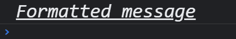

# JavaScript 控制台记录多个变量

> 原文：<https://www.tutorialandexample.com/javascript-console-log-multiple-variables>

## console.log()在 JavaScript 中是做什么的？

console.log()是 JavaScript 语言中的一个函数。它用于:

*   打印控制台中用户可见的任何消息
*   打印定义的变量值

**console . log()的优势**

*   多个浏览器支持该功能，例如，谷歌 Chrome、Safari、微软 Edge/Internet Explorer、Firefox、Opera 等。
*   该函数主要用于测试目的。

> **注意:**在网站上按 F12 键时，控制台视图可见。

**语法:**

```
console.log(“message”)
```

在这里，“消息”是任何字符串。

或者

```
console.log(var)
```

这里，“var”表示其中存储有值的任何变量。

该函数可以将任何数组、对象或值作为**参数**。然后，它根据参数返回值。

**举例:**

```
<script>
var name = "Javatpoint";
console.log(name);
</script> 
```

**输出:**

```
Javatpoint
```

**举例:**

```
<script>
console.log(“Hello”);
</script> 
```

**输出:**

```
Hello
```

**console . log()中的多个变量**

我们知道，当我们将单个变量传递给 console.log()时，会生成以下输出:

**举例:**

```
<script>
    let x = 2;
    console.log(x);
</script> 
```

**输出:**

```
2
```

但是假设，如果我们有多个变量，而不是多次编写 console.log()的函数，我们可以在一行中包含所有的变量。

**举例:**

```
<script>
    let x = 2;
    let y = 3;
    let z = 6;
    console.log(x,y,z);
</script> 
```

**输出:**

```
2 3 6
```

## 在 console.log()中使用多个变量时的提示

1.**通过名称引用多个变量**

当在 console.log()中传递多个变量时，有时很难识别哪个变量对应于控制台中的一个日志。

**举例:**

```
<script>
    		let x = 2;
    		let y = 3;
    		let z = 6;
   	 	console.log(x,y,z);
</script> 
```

**输出:**

```
2 3 6
```

 **在这里，很难确定哪些值对应于哪些变量。

要解决这个问题，请在变量中使用花括号{ }，在变量和值之间建立关联。

**举例:**

```
<script>
    		let x = 2;
    		let y = 3;
    		let z = 6;
    		console.log( {x, y, z} );
</script> 
```

**输出:**

```
{x: 2, y: 3, z: 6}
```

类似地，花括号也可以用于对象。

**举例:**

```
<script>
   		let obj1 = {
  		name: 'Javatpoint',
 		 age: 18
                       }
                       console.log(obj1)
                       console.log({obj1})
</script> 
```

**输出:**

```
{name: "Javatpoint", age: 18}	
{obj1: {…}} 
```

2.**格式化**

当我们想要打印包含多个变量的消息时，我们可以通过以下方式相应地格式化 console.log()。

*   使用说明符，如%s，%i，%f 等。

**举例:**

```
<script>
   let user = 'Rahul';
   let age = 25;
   console.log('%s is %i years old', user, age);
  </script> 
```

**输出:**

```
Rahul is 25 years old
```

这里，我们格式化一个包含一个字符串和一个整数的消息，因此%s 用于表示“用户”,%i 用于表示“年龄”。

下面是也可以使用的其他说明符的列表:


| **说明符** | **描述** |
| %s | 用于字符串元素 |
| %d 或%i | 用于整数元素 |
| %f | 用于浮动类型的元素 |
| %o | 用于元素中最有用的格式 |
| %O | 用于元素中的一般 JavaScript 对象格式 |
| %c | 用于添加附加的 CSS 格式 |


*   串联变量

当我们想要一起打印两个或更多的字符串时，也可以使用“+”操作符将它们组合在一起。

**举例:**

```
<script>
let x = 'Java';
let y = 't';
let z = 'point';
let year = 2021;
console.log(x+y+z);
console.log(x+y+z+year);
</script> 
```

**输出:**

```
Javatpoint
Javatpoint2021
```

**注意:**如果所有的变量都包含整数，那么“+”运算符不会将变量串联起来，它只会简单地将整数相加，并显示总和。

3.**添加 CSS 样式**

通过在 console.log()中使用%c 说明符，可以添加相应的 CSS 样式和说明符。各种浏览器都支持 CSS 格式。

**举例:**

如果我们想改变字体大小，字体风格和下划线的文本。

```
<script>
console.log('%cFormatted message', 'font-size: 25px; font-style: italic; text-decoration: underline;');
</script> 
```

**输出:**



这里，说明符%c 应用 CSS 样式，“font-size:25px；字体样式:斜体；文本装饰:下划线；'.

4.**随消息添加交互日志**

%o 说明符(用于元素中最有用的格式)可以将对象、DOM 元素和普通文本插入到文本消息中。

**举例:**

```
<script>
const obj = {
name: 'Rahul',
	surname: 'Gupta'
};
console.log('Hello, new user %o', obj);
</script> 
```

**输出:**

```
Hello, new user {name: "Rahul", surname: "Gupta"}
```**