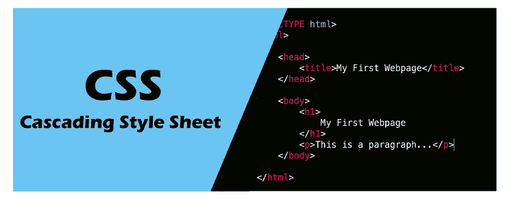
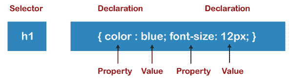
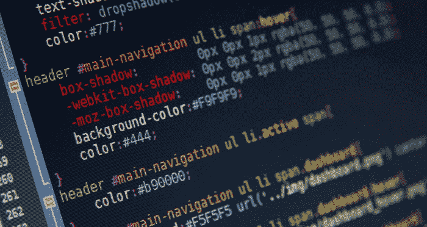

# CSS 教程

> 原文：<https://www.tutorialandexample.com/css-tutorial/>

CSS 指的是**层叠样式表。CSS 是 T2 编程语言 T3 的一种形式。换句话说，CSS 是一种样式表语言，用于描述用 HTML 编写的文档。CSS 是一种样式表语言，用于形成 HTML 元素，这些元素将以网页的形式呈现在浏览器中。**

*   如果没有 CSS，使用 HTML 创建的网站将会显得枯燥乏味。所以 CSS 的主要作用是给 HTML 元素一个外壳。如果 HTML 是骨架，那么 CSS 就是骨架的皮肤。
*   CSS 是万维网的基石技术，就像 HTML 和 JavaScript 一样。CSS 有助于在文档的呈现中实现区分，如分离布局、颜色和字体。对于网页设计者来说，它是一个非常强大的工具，具有修改或改变设计的能力和潜力，对网页的表现有着巨大的影响。所以它的主要目的是**将内容从文档**的表现中分离出来。

*   级联样式表是由万维网联盟或 W3C 在 1996 年开发的。值得一提的是，CSS 中的级联是指在单个或单个网页中应用多个工作表。用来保存这些文件的扩展名称为“**”。css"**
*   CSS 的互联网媒体类型(MIME 类型)是 **text/CSS** 。有多种方法可以将 CSS 应用于 HTML 文档。格式和内容的分离使得以各种风格呈现标记页面变得容易和**无缝**，以各种呈现方法，如 n-screen、语音等。如果内容是从移动设备获取的，CSS 也有替代格式的规则。
*   除了 HTML，其他用于支持 CSS 的标记语言还有 **XHTML** 、**纯 XML、SVG、**和 **XUL** 。

### CSS 框架

CSS 框架是预定义的库。其中包括蓝图、级联框架、基础和引导。

这些**允许简单和标准化的网页设计**。大多数 CSS 框架包括**一个网格**。一些功能框架包括额外的基于 Javascript 的功能。

CSS 框架包括各种模块和工具；

*   **重置样式表**；网络排版；一组图标或图标字体；网格-用于响应性网页设计等等。
*   而更大的框架通常使用 CSS 解释器，比如 Sass。

### CSS 的特性

CSS 可以使用全局样式表。这是有益的，因为它可以帮助您在不花费太多精力、困难或时间的情况下改变样式或演示。

*   CSS 也方便了一个外部样式表的使用，它可以在以后用于设计几个网页的样式。
*   CSS 或级联样式表还简化了只需更改一行就可以将不同的样式表附加到网页上的功能。
*   CSS**超级容易维护**，单个地方的改变会直接暗示或影响到整个网站的全局。没有必要在每个特定的地方换车。
*   人们可以很容易地在几个地方使用一个 CSS 脚本。
*   所有浏览器和搜索引擎都支持 CSS。
*   CSS 甚至可以通过离线缓存存储 web 应用程序，因此即使您不在线，也可以看到网站。
*   CSS 有一个独特的属性和函数列表，有助于设计 HTML 页面。
*   在 CSS 中，有**多个选择器**有助于执行某些任务；这些选择器包括 ID 选择器、类选择器等。

### CSS 语法

CSS 有一个简单易用的语法。它有**个英文关键字，用于指定几个样式属性的名称**。每个样式表由规则列表组成。每个规则集或列表由一个或多个选择器、声明块组成。

其中一个例子如下:

**h1 {颜色:蓝色；字体大小:12px}**

h1 是**选择器**；而字体和颜色是**属性**，蓝色和 12px 是**值**。

**声明块**由属性和值组成。

### 级联样式表的优点

**CSS** 有各种好处。其中一些包括:

*   CSS 有助于节省时间。你可以写 CSS，然后同一个表单可以在不同的 HTML 页面中使用。只需为每个 HTML 元素定义一个样式，并根据需要将其应用于其他网页。
*   CSS 帮助**更快的页面加载和下载**。CSS 不需要每次都写 HTML 标签属性；只有标签的一个 CSS 规则就足够了，并且可以应用于所有事件。因此编码更少，更少的编码意味着页面加载更容易和更快。
*   CSS **比 HTML** 拥有更广或更广的属性。所以它们可以让你的 HTML 页面看起来远比 HTML 属性好看。所以 CSS 比 HTML 有更优越的属性。
*   CSS 的优势在于，**风格可以很容易地应用于所有的站点，**并且只有一条指令可以控制和管理几个区域。它将样式应用到其他区域。
*   CSS 不仅使网站开发变得容易、轻松，而且使网站的维护变得非常容易，因为对整个网站来说，改变或修改一行代码就足够了；这也**节省了维护时间**。
*   CSS 不太复杂，所以它需要最少的努力，并有助于当场快速做出决定**。**
*   CSS 的另一个优势是**设备友好**，CSS 拥有响应式的网页设计，这是当今人们喜欢使用智能设备访问网站的一个重要优势。
*   CSS 还具有**重新定位的能力，**也就是说，帮助确定网站上出现的 web 元素的变化或位置。
*   CSS 使得网页的定制变得非常容易使用。它还最小化了文件的传输大小。

### CSS 的缺点

除了优点之外，级联样式表也有一些缺点。其中包括:

*   CSS 最常见的缺点之一是**CSS 有不同的级别，即 CSS1- CSS3。这经常导致开发者、浏览器和用户等的困惑。因此，使用哪一级就成了一个缺点。**
*   CSS 的另一个缺点是它只能在一个浏览器上运行，并且不一定能在另一个浏览器上运行。所以它需要一个兼容性测试，所以开发者经常在网站上线之前运行一个测试来确保它能在不同的浏览器上正常运行。
*   CSS **没有那么多的安全性**因为 CSS 是一个**开放的基于文本的系统**，几乎没有任何安全性可以保护 CSS 不被否决；任何有权限的人都可以更改或修改 CSS 文件或链接，甚至格式。这是一个相当大的缺点。
*   CSS **在所有浏览器**上的工作方式不同——Internet Explorer 和 Opera 支持 CSS 作为独特的逻辑。此外，使用 CSS 时可能会出现浏览器问题。
*   多层次的 CSS 会给用户和非开发人员造成混乱，缺乏清晰度。

### 级联样式表的历史

CSS 由哈肯·维姆·莱于 1994 年首次引入。他在欧洲粒子物理研究所和 HTML 之父蒂姆·伯纳斯·李一起工作。除此之外，当时还引入了许多其他编程语言。

另外， **CSS2 是在 1998 年推出的**，它也具有更高级的特性，如绝对、相对、媒体类型概念、定位、新字体等等。

同年，在 1998 年底，CSS3 的开发开始了，但是那一年并没有完成。它于 1999 年在**发布，但在 2001 年才正式开始使用。**

### CSS 的使用方法

有三种使用 CSS 的方法。

这些是；

1.  **外部 CSS**
2.  **内部 CSS**
3.  **内联 CSS**

**外部 CSS** -只需在外部 CSS 中的一个文件中进行更改，即可在 CSS 的多个文件中进行更改。样式在外部文件中提到，该文件通过语法链接到 HTML 文件。重要的是，外部文件的扩展名为。钢性铸铁

而在**内部 CSS** 中，这可以用来为一个单独的 HTML 页面勾勒出不同的或独特的 CSS。与外部 CSS 的情况不同，这里没有外部文件。在这种情况下，CSS 只写在 HTML 文件中。在这种情况下，style 标记被放在 head 标记之间。

最后，来到**内联 CSS** 。在这个独特的 CSS 是概述了一个元素在 HTML 页面。在这种情况下，样式被添加到元素中。

与外部或内部 CSS 相比，内联 CSS 具有更高的优先级。

### 结论

总之，级联样式表是 web 开发中必不可少的一部分。没有 CSS 就不可能有 web 开发。CSS 在开始时可能看起来复杂、困难，但是在学习、尝试和掌握概念之后。你会意识到 CSS 是容易的，简单的，使用起来毫不费力。

CSS **允许开发者添加效果，动画，独特，多样的字体，颜色。**它甚至允许开发者通过各种按钮、加载器或微调器显示动画，有时甚至是网站的动画背景。它**描述了已经显示在网站上的 HTML 元素**。可以肯定的是，没有 CSS 的网站不会看起来有吸引力或像样。它增加了网站的价值和生命力。

**CSS 属性**

这个 CSS
教程将为你提供 CSS 的每个属性的整体细节，比如
**边框、背景、浮动、字体、
显示、边距、填充、不透明度、垂直对齐、文本对齐、颜色、位置**、
等。

**CSS3 教程**

还有，这个
教程会帮你学习 CSS3 这么多的属性，比如**半径**、**不透明度**、**设计框
模型**。

**先决条件**

在开始学习 CSS 概念之前，你应该有一些关于 HTML 的基础知识。

**观众**

这个 CSS 教程对初学者和专业人士都很有用。

**问题**

我们向您保证，您在学习我们的 CSS 教程时不会遇到任何困难或问题；您也可以向我们报告您的疑问。

## CSS 教程索引

*   [CSS 教程](/css-tutorial/)
*   [什么是 CSS](/what-is-css/)
*   [CSS 语法](/css-syntax/)
*   [CSS 选择器](/css-selector/)
*   [如何包含 CSS](/how-to-include-css/)
*   内嵌 CSS
*   内部 CSS
*   外部 CSS
*   [CSS 评论](/css-comment/)

## CSS 属性

*   [CSS 背景](https://www.tutorialandexample.com/css-background/)
*   [CSS 边框](https://www.tutorialandexample.com/css-border/)
*   [CSS 显示](https://www.tutorialandexample.com/css-display/)
*   [CSS 浮动](https://www.tutorialandexample.com/css-float/)
*   [CSS 字体](https://www.tutorialandexample.com/css-font/)
*   CSS 字体大小
*   [CSS 颜色](https://www.tutorialandexample.com/css-color/)
*   [CSS 悬停](https://www.tutorialandexample.com/css-hover/)
*   [CSS 重要](https://www.tutorialandexample.com/css-important/)
*   CSS 背景色
*   [CSS 行高](https://www.tutorialandexample.com/css-line-height/)
*   [CSS 边距](https://www.tutorialandexample.com/css-margin/)
*   [CSS 不透明度](https://www.tutorialandexample.com/css-opacity/)
*   [CSS 过滤器](https://www.tutorialandexample.com/css-filter/)
*   [CSS 图片](https://www.tutorialandexample.com/css-images/)
*   [CSS 溢出](https://www.tutorialandexample.com/css-overflow/)
*   [CSS 填充](https://www.tutorialandexample.com/css-padding/)
*   [CSS 位置](https://www.tutorialandexample.com/css-position/)
*   [CSS 垂直对齐](https://www.tutorialandexample.com/css-vertical-align/)
*   [CSS 空白](https://www.tutorialandexample.com/css-white-space/)
*   [CSS 宽度](https://www.tutorialandexample.com/css-width/)
*   [CSS 中的自动换行](https://www.tutorialandexample.com/css-word-wrap/)
*   [CSS 中的方框阴影](https://www.tutorialandexample.com/css-box-shadow/)
*   CSS 中的文本阴影
*   [CSS 中的文本转换](https://www.tutorialandexample.com/css-text-transform/)
*   [CSS 大纲](https://www.tutorialandexample.com/css-outline/)
*   [CSS 可见性](https://www.tutorialandexample.com/css-visibility/)
*   [CSS 计数器](https://www.tutorialandexample.com/css-counters/)
*   [CSS 清除修复](https://www.tutorialandexample.com/css-clearfix/)
*   [CSS 图标](https://www.tutorialandexample.com/css-icons/)
*   [CSS 调整内容](https://www.tutorialandexample.com/justify-content/)
*   [CSS 中的文本装饰](https://www.tutorialandexample.com/css-text-decoration/)
*   [CSS 列表](https://www.tutorialandexample.com/css-lists/)
*   [CSS 第 n 选择器](https://www.tutorialandexample.com/css-nth-selector/)
*   [CSS 粘性](https://www.tutorialandexample.com/css-sticky/)
*   [CSS 背景剪辑](https://www.tutorialandexample.com/css-background-clip/)
*   [CSS 复选框样式](https://www.tutorialandexample.com/css-checkbox-style/)
*   [CSS 字母间距](https://www.tutorialandexample.com/css-letter-spacing/)
*   [CSS 导航栏](https://www.tutorialandexample.com/css-navigation-bar/)
*   [CSS 覆盖图](https://www.tutorialandexample.com/css-overlay/)
*   [CSS 根](https://www.tutorialandexample.com/css-root-selector/)
*   [CSS 特异性](https://www.tutorialandexample.com/css-specificity/)
*   [CSS 文本缩进](https://www.tutorialandexample.com/css-text-indent/)
*   [CSS 文本笔划](https://www.tutorialandexample.com/text-stroke/)
*   [CSS 缩放](https://www.tutorialandexample.com/css-zoom/)
*   [CSS 顺序](https://www.tutorialandexample.com/css-order/)
*   [CSS 后代选择器](https://www.tutorialandexample.com/css-descendant-selector/)
*   [CSS 剪辑](https://www.tutorialandexample.com/css-clip/)
*   [CSS calc()](https://www.tutorialandexample.com/css-calc/)
*   [CSS 背景混合模式](https://www.tutorialandexample.com/css-background-blend-mode/)
*   [CSS 单选按钮](https://www.tutorialandexample.com/css-radio-button/)
*   [CSS 上标和下标](https://www.tutorialandexample.com/css-superscript-and-subscript/)
*   [CSS 文本效果](https://www.tutorialandexample.com/css-text-effects/)
*   [CSS Text-align](https://www.tutorialandexample.com/css-text-align/)
*   [CSS 变量](https://www.tutorialandexample.com/css-variables/)
*   [CSS 分页之前](https://www.tutorialandexample.com/css-page-break-before-attribute/)
*   [CSS 内部分页符](https://www.tutorialandexample.com/css-page-break-inside-attribute/)
*   [CSS 分页后](https://www.tutorialandexample.com/css-page-break-after-attribute/)
*   [CSS 内容属性](https://www.tutorialandexample.com/css-content-property/)
*   [CSS 字间距](https://www.tutorialandexample.com/css-word-spacing/)
*   [CSS 动画](https://www.tutorialandexample.com/css-animation/)
*   [CSS @keyframes 规则](https://www.tutorialandexample.com/css-keyframes-rule/)
*   [CSS 伪类](https://www.tutorialandexample.com/css-pseudo-class/)
*   [CSS 伪元素](https://www.tutorialandexample.com/css-pseudo-elements/)
*   [CSS 径向渐变](https://www.tutorialandexample.com/radial-gradient-css-function/)
*   [CSS 翻译](https://www.tutorialandexample.com/css-translate-function/)
*   [CSS 渐变](https://www.tutorialandexample.com/css-gradient/)
*   [CSS z 索引](https://www.tutorialandexample.com/css-z-index-property/)
*   [CSS 加载器](https://www.tutorialandexample.com/css-loader/)
*   [CSS 单位](https://www.tutorialandexample.com/css-units/)
*   [CSS 转换](https://www.tutorialandexample.com/css-transition/)
*   [CSS 屏蔽](https://www.tutorialandexample.com/css-masking/)
*   CSS 箭
*   [CSS 分页](https://www.tutorialandexample.com/css-pagination/)

## 混杂的

*   [什么是引导 CSS](/what-is-bootstrap-css)
*   [CSS 用来做什么](/what-is-css-used-for)
*   【HTML 和 CSS 的区别
*   [如何在 CSS 中居中表格](/how-to-center-a-table-in-css)
*   [什么是 CSS 文件](/what-is-a-css-file)
*   [如何在 CSS 中居中按钮](/how-to-center-a-button-in-css)
*   [如何在 CSS 中改变背景颜色](/how-to-change-background-color-in-css)
*   [如何改变 CSS 中的字体](/how-to-change-the-font-in-css)
*   [如何在 CSS 中改变字体大小](/how-to-change-font-size-in-css)
*   [如何在 CSS 中调整图像大小](/how-to-resize-an-image-in-css)
*   [如何去除 CSS 中的项目符号](/how-to-get-rid-of-bullet-pioints-in-css)
*   [CSS 是编程语言吗](/is-css-a-programming-language)
*   [CSS 中的网格 Vs Flexbox](/grid-vs-flexbox-in-css)
*   [如何在 WordPress 中编辑 CSS](/how-to-edit-css-in-wordpress)
*   [如何在 CSS 中使用谷歌字体](/how-to-use-google-fonts-in-css)
*   [使用 HTML 和 CSS 创建 3D 文本效果](/create-a-3d-text-effect-using-html-and-css)
*   [如何使用 CSS 创建闪烁文本](/how-to-create-blinking-text-using-css)
*   [CSS 中 a:before 和 a:after 的悬停条件](/hover-condition-for-a-before-and-a-after-in-css)
*   [CSS 网格和 CSS Flexbox 的区别](/difference-between-css-grid-and-css-flexbox)