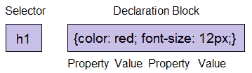
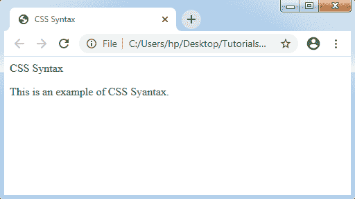

# CSS 语法

> 原文：<https://www.tutorialandexample.com/css-syntax/>

CSS 语法包含选择器和声明块，下面的示例将使其更加清晰:



选择器:一个 CSS 选择器指定我们想要样式化的 HTML 标签。选择器可以是任何元素，如< **标题** >和< **h1** >。

**声明块:**这个块可以包含多个声明，用分号隔开。这里，对于上面提到的例子，有两种类型的声明:

*   颜色:红色；
*   字体大小:12px

所有的声明都包括属性名和值，用冒号隔开。

**属性:**它是 HTML 元素属性的一部分。属性可以是任何颜色或边框。

**值:** CSS 属性需要通过一些值来赋值。因此，值被提供给 CSS 的属性。如上所述，示例中的颜色属性的值为“red”。

```
Selector{Property1: value1; Property1: value1;   ………;}
```

**举例:**

```
<!DOCTYPE>
<html>
<head>
<title> CSS Syntax</title>
<style>
p {
color: green;
text-align: left;
}
</style>
</head>

<body>
<p> CSS Syntax </p>
<p> This is an example of CSS Syntax. </p>
</body>
</html>
```



**上述例子的解释:**

*   p 是选择器。
*   颜色是属性。
*   该属性的值为绿色。
*   另一个属性是文本对齐。
*   属性的值为左。