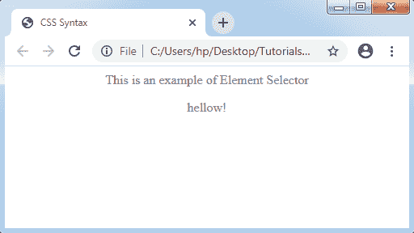
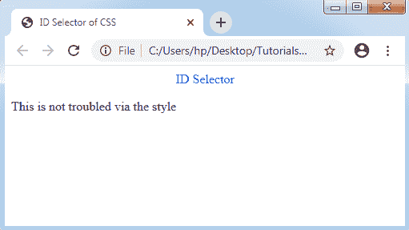
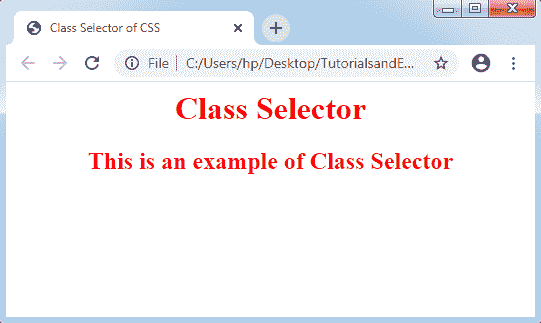
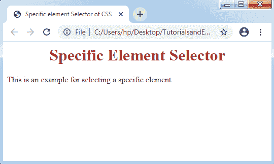
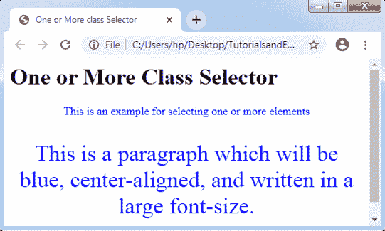
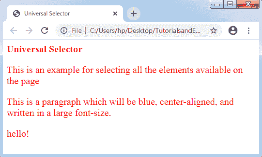
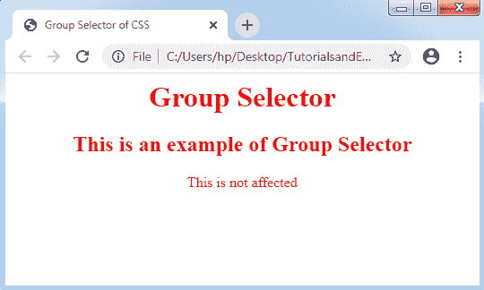

# CSS 选择器

> 原文：<https://www.tutorialandexample.com/css-selector/>

CSS 选择器:CSS 中使用了一些选择器，允许我们选择想要样式的内容。各种选择器被认为是 CSS 规则集的分离。他们根据 HTML 的**类、类型、id 和属性**来选择元素。

下面是 CSS 中的一些选择器类型:

*   元素选择器
*   Id 选择器
*   类别选择器
*   通用选择器
*   组选择器

**元素选择器**

CSS 的元素选择器用于根据名称选择 HTML 的元素。元素选择器的示例如下:

```
<!DOCTYPE>
 <html>
 <head>
 <title> Element Selector of CSS </title>
 <style>
 p {
 color: grey;
 text-align: center; 
 }
 </style>
 </head>
 <body>
 <p> This is an example of Element Selector </p>
 <p> hellow! </p> 
 </body>
 </html> 
```

**输出:**



### Id 选择器

CSS 的这个选择器选择 HTML 元素的属性 **id** 来选择特定的元素。id 在页面中总是被认为是特殊的。因此，选择一个唯一的单个元素。id 用一个散列字符(#)定义，由元素的 id 跟随。

id 选择器的示例如下，它是用 id“p”定义的:

```
<!DOCTYPE>
 <html>
 <head>
 <title> ID Selector of CSS </title>
 <style>
 #p { 
 color: blue;
 text-align: center;
 }
 </style>
 </head>
 <body>
 <p id="p"> ID Selector </p> 
 <p> This is not troubled via the style </p>
 </body>
 </html> 
```

**输出:**



### 类别选择器

这些选择器选择 HTML 的元素以及 class 的特定属性。类选择器可以与句点字符(句号)一起使用。它是以类的名字来追求的。通常，一个类不能以数字开头。

类选择器的示例如下所示:

在这种情况下，类别由“类别 1”表示:

```
<!DOCTYPE>
 <html>
 <head>
 <title> Class Selector of CSS </title>
 <style>
 .class1 { 
 color: red;
 text-align: center;
 }
 </style>
 </head>
 <body> 
 <h1 class="class1"> Class Selector </h1>
 <h2 class="class1"> This is an example of Class Selector </h2>
 </body>
 </html> 
```

**输出:**



**特定元素选择器:**要定义一个有问题的 HTML 的特定元素，我们可以通过类选择器使用元素的名称。

以下是选择特定元素的示例:

```
<!DOCTYPE>
 <html>
 <head>
 <title> Specific element Selector of CSS </title>
 <style>        
 h1.class1 {  
 color: brown; 
 text-align: center;
 }
 </style>
 </head>
 <body> 
 <h1 class="class1"> Specific Element Selector </h1>
 <p class="class1"> This is an example for selecting a specific element </p>
 </body>
 </html> 
```

**输出:**



*   HTML 的各种元素也可以被称为一个或多个类。

**举例:**

在下面的示例中，元素

是根据 class="class1 "和 class="large "编写的:

```
<!DOCTYPE>
 <html>
 <head>
 <title> One or More class Selector</title>
 <style>            
 p.class1 { 
 color: blue;
 text-align: center;
 }
 p.large {
 font-size: 200%;
 }
 </style> 
 </head>
 <body>
 <h1 class="class1"> One or More Class Selector </h1>
 <p class="class1"> This is an example for selecting one or more elements </p>
 <p class="class1 large">This is a paragraph which will be blue, center-aligned, and written in a large font-size. </p> 
 </body>
 </html> 
```

**输出:**



### 通用选择器

CSS 有一种独特的选择器，即**通用选择器**。它作为通配符应用于元素。这些选择器选择页面上显示的每个元素。

通用选择器的示例如下所示:

```
<!DOCTYPE>
 <html>
 <head>
 <title> Universal Selector</title>
 <style>             
 * {
 color: red; 
 font-size: 20px;
 }
 </style>
 </head>
 <body>
 <h1> Universal Selector </h1>
 <p> This is an example for selecting all the elements available on the page </p> 
 <p id="class1">This is a paragraph which will be blue, center-aligned, and written in a large font-size. </p>
 <p>hello!</p>
 </body>
 </html> 
```

**输出:**



### 组选择器

CSS 的各种组选择器被用来选择每个元素，包括相似的样式定义。使用组选择器可以减少冗长的代码。逗号可以用来隔离分组中的所有选择器。

看看下面的代码，即没有使用组选择器编写的代码:

```
h1 {
 color: red;
 text-align: center;
 }          
 h2 {
 color: red; 
 text-align: center;
 }
 p {
 color: red;
 text-align: center;
 } 
```

我们需要描述 CSS 的每个元素的属性。这些属性按以下方式分组:

```
h1,h2,p {
 color: red;
 text-align: center;
 }                  
 Let’s take a complete example of group selector which is as follows:
 <!DOCTYPE>
 <html>
 <head> 
 <title> Group Selector of CSS </title>
 <style>            
 h1,h2,p {
 color: red; 
 text-align: center;
 }
 </style> 
 </head>
 <body>
 <h1> Group Selector </h1>
 <h2> This is an example of Group Selector </h2>
 <p>This is not affected</p> 
 </body>
 </html> 
```

**输出:**

